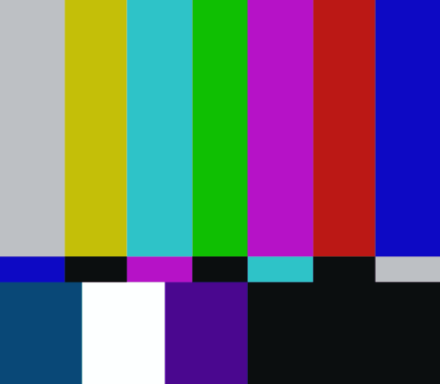
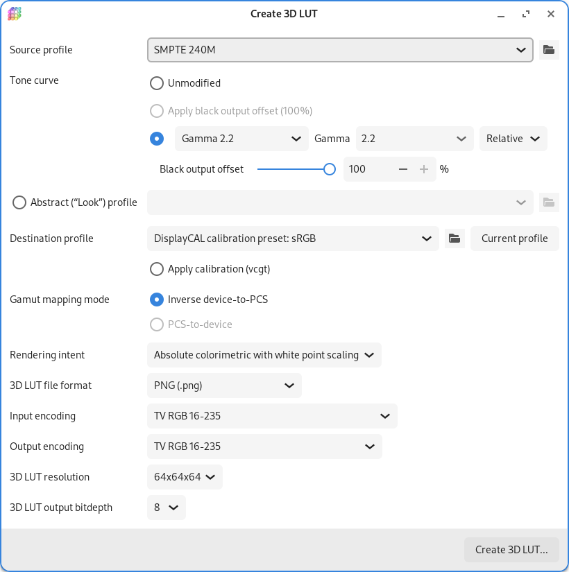
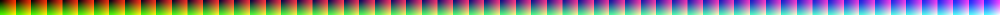

.. raw:: latex

	\clearpage

.. _advanced-lut:

Criando e usando um LUT 3D no MAME
==================================

.. contents:: :local:

Introdução
----------

O *LUT* é um acrônimo de *"Look Up Table"*, é um arquivo que contém
informações usadas para aplicar correções de cores (LUT técnico [#LT]_)
ou para fazer uma gradação de cores (alterar as cores) de uma maneira a
aplicar certos efeitos ou para alterar o tom da imagem (LUT criativo)
visando criar uma aparência diferente da original.

É muito comum a utilização de LUTs nas produções de vídeo e foto seja
para dar uma certa aparência *quente/fria/neutra* a uma determinada cena
ou para criar perfis personalizados para câmeras e para as lentes. Estes
perfis servem para corrigir eventuais desvios ou até mesmo para fazer
ajustes finos. Independentemente da marca ou do modelo do equipamento,
é comum que eles apresentem desvios nas cores em determinadas condições
de iluminação ou situações específicas, seja por causa do tipo da luz
utilizada (natural ou artificial) ou por causa de fatores externos como
a posição do sol em diferentes horários do dia, cenas com o tempo
nublado, ambiente iluminado por velas e assim por diante.

Neste contexto, o LUT é utilizado para compensar ou para corrigir estas
variações, garantindo que as cores de um determinado objeto, ou de uma
pessoa, estejam consistentes em diferentes condições de luz. Por
exemplo, um LUT pode ser criado para garantir que uma blusa com um tom
específico de vermelho, apareça com a mesma tonalidade em diferentes
condições de iluminação, proporcionando uma aparência visual uniforme
durante todo o processo de produção.

Para aprender mais sobre LUT, consulte os links ao lado.
[#LUT1]_ [#LUT2]_ [#LUT3]_

A capacidade de aplicar LUT foi inserida no MAME em `Outubro de 2018`_,
porém, mesmo após o seu lançamento no MAME `0.203`_, não houve nenhum
grande anúncio ou qualquer manifestação conhecida da comunidade.
Talvez porque a grande maioria das pessoas sequer sabem para que serve
ou como se usa um LUT.

Neste capítulo vamos aprender a criar e aplicar LUTs de correção de
cores no sistema *Nintendo Entertainment System* ou *NES* emulado pelo
MAME.

.. raw:: latex

	\clearpage

.. _advanced-clut:

Criando um HaldCLUT
-------------------

.. Se não fizer assim, a imagem sai correta no HTML mas errada no PDF.

.. Se não fizer assim, a imagem sai correta no HTML mas errada no PDF.

Para criar um CLUT que contenha todas as informações necessárias para
corrigir as cores, é preciso seguir um processo que envolve o uso de uma
imagem criada pelo MAME, que nos servirá como uma base e de uma outra
imagem de referência, esta será usada como correção. Basicamente você
está informando ao programa que o nosso alvo é corrigir as cores do
MAME com as características da imagem de referência.

Se vamos criar um CLUT de correção de cores, antes de mais nada, nós
precisamos ter uma referência que possamos confiar, assim sendo, eu
criei uma tela com `barras de cores SMPTE`_ gerado no padrão `BT.601`_
com `luminância`_ no intervalo ``16,235`` (`nível de TV`_). Este é um
padrão de teste utilizado até os dias de hoje pela indústria e pelos
profissionais na produção de vídeo, cinema, televisão e fotografia para
aferir a precisão das cores em uma ampla variedade de equipamentos
utilizados na indústria audiovisual. Ele foi escolhido pois era o padrão
da época, logo, eu sei de onde estou partindo quanto ao tom e a
intensidade das cores, contudo, isso **não garante** que a correção das
cores será fidedigna em todos os jogos, pois o MAME usa uma paleta
dinâmica `matematicamente calculada`_.

Para gerar a nossa imagem de referência, nós usamos o `AviSynth+`_ e
criamos um arquivo ``Colorbars.avs`` com o seguinte conteúdo::

	# Color bars SD
	ColorBars (550,480)
	ConvertToRGB32(matrix="Rec601")

Arrastando o arquivo ``Colorbars.avs`` no `Virtualdub2`_ nós obtemos a
seguinte imagem:

|barra|

Ela servirá como a referência de correção que será aplicada na imagem do
MAME.

.. note::
   Para usuários de Linux e macOS, é possível obter tela semelhante
   usando o `ffmpeg`_, depois de instalar o ffmpeg abra o terminal e
   rode o comando:
   ``ffmpeg -hide_banner -f lavfi -i smptebars=duration=10:size=550x480:rate=30 smptebars.mp4``

.. raw:: latex

	\clearpage

Baixe o `240p-test-mini`_ e salve na mesma pasta do MAME, ele será usado
para gerar a tela com barras coloridas, usando o terminal ou prompt de
comando faça::

	mame nes -cart 240pee.nes -resolution 552x481 -noka -window -nofilter -video opengl

Pressione o botão "B" e selecione a opção **SMPTE color bars**,
pressione :kbd:`Alt` + :kbd:`PrtScn` (*Print Screen*) para fazer uma
captura da tela (no Windows ou Linux, para macOS use
`estas instruções`_), este é o resultado (já recortado):

.. _advanced-lut-mame-screen:

|barra_m|

.. note::
   Caso tenha alguma dificuldade, aproveite as imagens acima que já
   estão recortadas no tamanho apropriado.

O que faremos agora é transferir as cores da imagem do MAME para a nossa
imagem de referência. Isso é necessário pois, para criar um CLUT válido,
ambas as imagens precisam ter o mesmo tamanho e as mesmas
características, a única coisa que deve variar na imagem são as cores e
mais nada (observe que a barra verde tem um tamanho diferente por
exemplo), caso contrário, o resultado será diferente do esperado. Se não
estiver interessado em aprender como criar um CLUT ou queira evitar todo
este procedimento, baixe o arquivo ``NES_SMPTE.cube`` `deste link`_ e
:ref:`pule para a próxima etapa <advanced-lut-create>`.

Para esta tarefa usaremos o `Gimp`_ com o plug-in `G'MIC`_, abra a
nossa imagem de referência no Gimp e duplique-a, nomeie esta primeira
camada como "**MAME**" e a segunda como "**REFERÊNCIA**", é na camada
"**MAME**" onde clonaremos as cores do MAME.

* Abra o imagem do MAME (será criado uma nova aba), com o
  "Color Picker" ( :kbd:`O` ) clique na primeira barra à esquerda
  para capturar a sua cor.
* Volte para a primeira aba, selecione a ferramenta "Fuzzy Select Tool"
  ( :kbd:`U` ), clique na camada "**MAME**" para selecioná-la, clique na
  primeira barra à esquerda para criar uma seleção ao redor da cor.
* Em seguida escolha a ferramenta "Bucket Fill Tool" ( :kbd:`Shift` +
  :kbd:`B` ) e clique em cima da barra selecionada para preencher esta
  barra com as cores do MAME.
* Repita este procedimento com todas as outras barras.
* Selecione a camada "REFERÊNCIA", logo abaixo, clique na seta para cima
  para mover a camada para o topo. Assim você terá a primeira camada
  "**REFERÊNCIA**" e abaixo "**MAME**".
* Vá em :guilabel:`Filters` > :guilabel:`G'MIC-Qt...`, depois em
  :guilabel:`Available Filters`, clique duas vezes em :guilabel:`Color`
  e clique em :guilabel:`CLUT from After - Before Layers`.
* Em :guilabel:`Output Mode` selecione
  ``Save CLUT as .cube or .png File``.
* Em :guilabel:`Output CLUT Resolution` deixe em ``64``.
* Em :guilabel:`Output Folder` defina uma pasta de destino para salvar o
  arquivo ``.cube``.
* Em :guilabel:`Output Filename` defina o nome do arquivo com a extensão
  ``.cube``, aqui usaremos ``NES_SMPTE.cube``.
* Logo abaixo em **Input / Output** defina :guilabel:`Input Layers` como
  ``Active and below``.
* Em :guilabel:`Output mode` selecione ``In place (default)``.
* Clique em OK para criar o arquivo ``NES_SMPTE.cube``.

A imagem abaixo mostra todas as configurações, clique nela para ampliar
(HTML) ou aproxime a página (PDF).

|gmic|

Agora todas as informações necessárias para aplicar as correções de
cores estão armazenadas no arquivo ``NES_SMPTE.cube``. Acredite, o
processo é muito mais fácil quando trabalhamos com fotos.

.. raw:: latex

	\clearpage

.. _advanced-lut-create:

Criando um LUT 3D para usar no MAME
-----------------------------------

O tipo de LUT compatível com o MAME é o 3D no formato ``64x64x64`` com
**8-bit** e **PNG** [#M3DLUT1]_ [#M3DLUT2]_. Ele é criado usando o **3D
Lut Maker** que acompanha o `DisplayCAL`, ele é gratuito e está
disponível para todos os sistemas operacionais, no **Debian** instale
com o comando::

	sudo apt install displaycal dispcalgui

Aqui eu utilizei as seguintes configurações:

|3dlut22|

.. raw:: latex

	\clearpage

Ao clicar em :guilabel:`Create 3D LUT` o programa cria diversos arquivos
diferentes, porém, o que nos interessa é esta imagem aqui:

.. _advanced-lut-base:

|3dlutmame|

Esse é o nosso **LUT 3D base**, é nele que aplicaremos as correções de
cores, e depois a partir dele, que exportaremos um novo LUT 3D com as
correções que desejamos. As opções escolhidas foram as que me pareceram
mais corretas, apesar de querer ter usado o padrão SMPTE-170M, mas como
não tem, usamos o que tinha disponível. Faça você mesmo os seus próprios
testes com outros parâmetros e veja como fica.

.. _advanced-lut-different-colors:

Diferenças nas cores
--------------------

De todos os diferentes emuladores existentes que emulam o NES apresentam
uma paleta de cores diferente entre si (incluindo o MAME) e não existe
(até onde eu saiba) um consenso sobre qual deveria ser a paleta de cores
"*mais correta*" para o NES pois a sua PPU `não gera sinais de vídeo em
RGB`_ ficando a cargo do circuito interno da TV da pessoa interpretar as
cores que chegavam nela, a partir daí começa toda essa confusão, pois os
circuitos internos das TVs eram diferentes, assim sendo, as cores
variavam de uma TV para outra. No MAME por exemplo, a paleta de cores é
`matematicamente calculada`_, já outros emuladores utilizam outros
algoritmos ou paletas para apresentar as cores na tela.

Veja como fica ao colocarmos a nossa imagem de referência ao lado da
imagem gerada pelo MAME, repare na diferença do tom e na intensidade das
cores:

..  csv-table:: Comparando a imagem de referência com o padrão gerado pelo MAME.
   :header: "|bdcs|", "MAME 0.252"
   :widths: 50, 50

   "|barra|", "|barra_m|"

Com o nosso CLUT e o nosso LUT 3D base criados, nós já temos o nosso
ponto de partida para dar início a criação do nosso LUT 3D de correção,
o procedimento é o seguinte:

* Abra a imagem do **LUT 3D base** que criamos acima com o Gimp.
* Vá em :guilabel:`Filters` > :guilabel:`G'MIC-Qt...`, depois em
  :guilabel:`Available Filters`, clique duas vezes em :guilabel:`Color`
  e escolha :guilabel:`Apply Extrenal CLUT`.
* Em :guilabel:`Specify HaldCLUT As` escolha ``Filename``.
* Em :guilabel:`HaldCLUT Filename` procure pelo arquivo
  ``NES_SMPTE.cube``.
* Em :guilabel:`Normalize Colors` selecione ``Both``.
* Em :guilabel:`Preview Type` selecione ``Full``.
* Em :guilabel:`Input layers` deixe em ``Active (default)``.
* Em :guilabel:`Output mode` deixe em ``In place (default)``.
* Clique em :guilabel:`Ok` para aplicar as correções.

Veja na imagem abaixo como ficou as nossas opções:

|gmic_apply_clut|

Observe que não é necessário alterar qualquer outra configuração (brilho
e contraste por exemplo), pois tudo o que precisamos já está no arquivo
``NES_SMPTE.cube``. Mesmo quando trabalhamos com fotos ou geramos LUT
para diferentes finalidades, todos os ajustes finos que precisamos fazer
na imagem é feito antes de se criar o arquivo ``*.cube`` e não depois.

.. note::
   Geralmente quando baixamos um LUT externo (geralmente um LUT criatvo)
   criado por outra pessoa é que estes controles se tornam úteis, servem
   como um ajuste fino no efeito que desejamos aplicar.

Vá em :guilabel:`File` > :guilabel:`Export As...`
( :kbd:`Shift` + :kbd:`Ctrl` + :kbd:`E` ) e salve o arquivo com um nome
bacana como **NES_SMPTE.png** dentro da pasta **Artwork** do MAME.

Este é o LUT 3D **NES_SMPTE.png** que acabamos de criar:

|nes_smpte|

Para ver se funcionou ou não, crie o arquivo ``ini\source\nes.ini`` com
o seguinte conteúdo::

	video bgfx
	bgfx_backend d3d11
	bgfx_screen_chains lut
	bgfx_lut NES_SMPTE.png

Para quem usa HLSL no Windows::

	video d3d
	hlsl_enable 1
	filter 0
	lut_enable 1
	lut_texture NES_SMPTE.png

.. note::
   Caso tenha problemas com o ``d3d`` (o efeito não funciona ou o LUT
   não é aplicado por exemplo), consulte o capítulo
   :ref:`advanced-tricks-dx9`.

Para Linux/macOS tente::

	video bgfx
	bgfx_backend vulkan # (tente opengl ou auto caso não funcione)
	bgfx_screen_chains lut
	bgfx_lut NES_SMPTE.png

Rode o comando abaixo no teminal ou no prompt de comando e veja o
resultado::

	mame nes -cart 240pee.nes -noka

Pressione o botão "B" e selecione a opção **SMPTE color bars**, veja
na imagem abaixo como o próprio MAME é capaz de aplicar as devidas
correções em tempo real:

..  csv-table:: O próprio MAME usando um LUT 3D para aplicar as correções de cores.
   :header: "|bdcs|", "MAME 0.252 com um LUT de correção"
   :widths: 50, 50

   "|barra|", "|barra_smpte|"

.. _advanced-lut-palette:

As paletas de cores
-------------------

.. |ntsc| image:: images/Palette_NTSC.png
   :scale: 100%
   :align: middle
   :alt: Paleta do ROM Detectives

.. note::
   Até a presente data em que escrevo este capítulo, não há suporte para
   o uso de paleta de cores de qualquer tipo na versão mais recente do
   MAME (0.252).

Se pesquisar na internet, é possível encontrar diferentes sites
(`como este`_) que disponibilizam uma grande variedade de paletas de
cores (elas vem com a extensão ``.pal``) que são utilizadas por outros
emuladores como o `nestopia`_, `Mesen2`_, `FCEUX`_, dentre vários
outros, para que estes emuladores consigam gerar cores na tela com um
determinado padrão, ou obedece certos parâmetros de cores determinada
pelos seus criadores. Para obter mais informações, consulte os links ao
lado (todos em Inglês). [#A]_ [#B]_ [#C]_

Para compreender como funciona a geração dos gráficos no NES, consulte o
link ao lado (em Inglês). [#D]_

Dada a grande variedade de paletas e como não existe (até o presente
momento) uma paleta definitiva para o NES, eu escolhi a paleta do
`ROM Detectives`_ por uma simples questão de gosto, geralmente é assim
que acontece, das várias disponíveis você usa aquelas que mais gosta.

.. _advanced-lut-rom-detectives-palette:

..  csv-table:: Paleta do ROM Detectives
   :header: "ROM Detectives NES Palette"
   :widths: 100

   "|ntsc|"

Aqui a mesma paleta convertida num arquivo chamado `NES_NTSC.pal`_.

.. Listagem obtida com o comando hexdump 'NES_NTSC.pal' no Linux.

.. code-block:: hexdump

	00000000  7c 7c 7c 00 00 fc 00 00  bc 44 28 bc 90 00 84 a8  ||||......D(.....|
	00000010  00 20 a8 10 00 88 14 00  50 30 00 00 78 00 00 68  |. ......P0..x..h|
	00000020  00 00 58 00 00 40 58 00  00 00 00 00 00 00 00 00  |..X..@X.........|
	00000030  bc bc bc 00 78 f8 00 58  f8 68 44 fc d8 00 cc e4  |....x..X.hD.....|
	00000040  00 58 f8 38 00 e4 5c 10  ac 7c 00 00 b8 00 00 a8  |.X.8..\..|......|
	00000050  00 00 a8 44 00 88 88 00  00 00 00 00 00 00 00 00  |...D............|
	00000060  f8 f8 f8 3c bc fc 68 88  fc 98 78 f8 f8 78 f8 f8  |...<..h...x..x..|
	00000070  58 98 f8 78 58 fc a0 44  f8 b8 00 b8 f8 18 58 d8  |X..xX..D......X.|
	00000080  54 58 f8 98 00 e8 d8 78  78 78 00 00 00 00 00 00  |TX.....xxx......|
	00000090  fc fc fc a4 e4 fc b8 b8  f8 d8 b8 f8 f8 b8 f8 f8  |................|
	000000a0  a4 c0 f0 d0 b0 fc e0 a8  f8 d8 78 d8 f8 78 b8 f8  |..........x..x..|
	000000b0  b8 b8 f8 d8 00 fc fc f8  d8 f8 00 00 00 00 00 00  |................|

Novamente, até o momento, o MAME não é compatível com paletas externas,
assim sendo, precisamos converter a paleta em LUT 3D.

.. note::
   O nosso **LUT 3D base** deve estar limpo e sem nenhum efeito ao
   aplicar uma nova correção. Então, caso a correção do processo
   anterior já esteja aplicado, faça um :kbd:`Ctrl` + :kbd:`Z` para
   desfazer a correção e só então, aplique uma nova. Na dúvida e sem
   salvar nada, feche a aba com o **LUT 3D base**, abra-a novamente,
   aplique as novas correções e só então exporte como **NES_NTSC.png**.
   Se não fizer isso, haverá duas correções diferentes no mesmo arquivo
   e o resultado final será muito diferente do desejado.

* Carregue a ROM `240p-test-mini`_ no `nestopia`_, `Mesen2`_, `FCEUX`_
  ou qualquer outro emulador que aceite paleta de cores.
* Configure o vídeo para que ele tenha o dobro de tamanho do original.
* Pressione o botão "B" e selecione a opção **SMPTE color bars**.
* Carregue e aplique a paleta ``NES_NTSC.pal``.
* Pressione :kbd:`Alt` + :kbd:`PrtScn` (*Print Screen*) para fazer uma
  captura da tela (no Windows ou Linux, para o macOS use `estas
  instruções`_), encerre o emulador.
* Abra o `Gimp`_ e cole a imagem, dê o nome de "**CORREÇÃO**".
* Use a :ref:`captura anterior <advanced-lut-mame-screen>`) e cole no
  Gimp, dê o nome de "**MAME**".
* Faça os ajustes necessários para que ambas as imagens fiquem
  alinhadas.
* Faça um recorte (*crop*) para que ambas tenham exatamente o mesmo
  tamanho.
* Mova a camada "**MAME**" para baixo, deixando a camada "**CORREÇÃO**"
  em primeiro.
* Vá em :guilabel:`Filters` > :guilabel:`G'MIC-Qt...`, depois em
  :guilabel:`Available Filters`, clique duas vezes em :guilabel:`Color`,
  clique em :guilabel:`CLUT from After - Before Layers`.
* Em :guilabel:`Output Mode` selecione
  ``Save CLUT as .cube or .png File``.
* Em :guilabel:`Output CLUT Resolution` deixe em ``64``.
* Em :guilabel:`Output Folder` defina uma pasta de destino para salvar o
  arquivo ``.cube``.
* Em :guilabel:`Output Filename` defina o nome do arquivo com a extensão
  ``.cube``, aqui usaremos ``NES_NTSC.cube``.
* Logo abaixo em **Input / Output** defina :guilabel:`Input Layers` como
  ``Active and below``.
* Em :guilabel:`Output mode` selecione ``In place (default)``.
* Clique em OK para criar o arquivo ``NES_NTSC.cube``.
* Faça o procedimento descrito em :ref:`advanced-lut-different-colors`
  para aplicar o CLUT ``NES_NTSC.cube``
  :ref:`no LUT 3D base que criamos <advanced-lut-base>`.
* Vá em :guilabel:`File` > :guilabel:`Export As...`
  ( :kbd:`Shift` + :kbd:`Ctrl` + :kbd:`E` ) e salve o arquivo como
  **NES_NTSC.png** dentro da pasta **Artwork** do MAME.

Ao concluir estas etapas, agora nós temos o LUT 3D **NES_NTSC.png**:

|nes_ntsc|

Para testar, edite o arquivo ``ini\source\nes.ini`` e substitua a opção
``NES_SMPTE.png`` por ``NES_NTSC.png`` e salve. Agora teste um
jogo qualquer do NES e veja como fica, tente o *Batman* por exemplo::

	mame nes batmanu

.. _advanced-testar-luts:

Usando a própria interface do MAME, é possível alternar entre os dois
LUTs 3D que criamos (``NES_NTSC`` e o ``NES_SMPTE``):

* Pressione :kbd:`Tab`.
* Selecione :guilabel:`Controles deslizantes`.
* Mova o cursor até :guilabel:`Window 0, Screen 0 LUT Texture`.
* Selecione esquerda ou direita para alternar entre os LUTs.

Para quem tiver interesse, aqui está a paleta `NES_SMPTE.pal`_.

..  csv-table:: Paleta Mamedoc SMPTE
   :header: "Mamedoc NES SMPTE Palette"
   :widths: 100

   "|smpte|"

.. raw:: latex

	\clearpage

.. Listagem obtida com o comando hexdump 'NES_SMPTE.pal' no Linux.

.. code-block:: hexdump

	00000000  85 7a 7d 07 03 de 09 04  c0 3b 0e 9a a7 03 83 bc  |.z}......;......|
	00000010  02 15 bc 0c 01 9f 11 03  5b 37 03 02 9a 05 02 88  |........[7......|
	00000020  07 02 74 07 06 3e 69 00  00 00 00 00 00 00 00 00  |..t..>i.........|
	00000030  c8 c9 c9 03 73 e4 03 4b  e0 70 2e d4 d2 01 ce da  |....s..K.p......|
	00000040  01 4a e6 28 00 d7 4c 0c  bb 7a 03 01 c6 01 01 bf  |.J.(..L..z......|
	00000050  01 04 af 3b 05 7f 8f 00  00 00 00 00 00 00 00 00  |...;............|
	00000060  ff ff ff 1e ba d6 51 81  d8 a4 72 de e1 7b e4 de  |......Q...r..{..|
	00000070  4a a2 dc 72 44 d6 a3 24  e3 c1 01 c0 dc 0d 4f cf  |J..rD..$......O.|
	00000080  49 3a d6 93 06 de d5 80  74 77 00 00 00 00 00 00  |I:......tw......|
	00000090  ff ff ff 91 e4 ea c4 c8  e0 dd c7 e8 ea c4 eb dc  |................|
	000000a0  b3 ca e2 d8 bd e8 e0 b1  e1 d6 6d d6 e1 6d c5 e0  |..........m..m..|
	000000b0  c7 b9 eb e0 06 e8 e8 f3  e4 f3 00 00 00 00 00 00  |................|

O processo de criação desta paleta é semelhante ao que já foi explicado:

* Abra a imagem da paleta do
  :ref:`ROM Detectives <advanced-lut-rom-detectives-palette>` no Gimp.
* Vá em :guilabel:`Filters` > :guilabel:`G'MIC-Qt...`, depois em
  :guilabel:`Available Filters`, clique duas vezes em :guilabel:`Color`
  e escolha :guilabel:`Apply Extrenal CLUT`.
* Em :guilabel:`Specify HaldCLUT As` escolha ``Filename``.
* Em :guilabel:`HaldCLUT Filename` procure pelo arquivo
  ``NES_SMPTE.cube``. 
* Em :guilabel:`Normalize Colors` selecione ``Both``.
* Em :guilabel:`Preview Type` selecione ``Full``.
* Em :guilabel:`Input layers` deixe em ``Active (default)``.
* Em :guilabel:`Output mode` deixe em ``In place (default)``.
* Clique em :guilabel:`Ok` para aplicar as correções.

Extraia os valores em hex ("html notation" no Gimp) das cores e cole num
editor hexadecimal e salve como ``nome_da_paleta.pal``.

Eu compilei um conjunto de **37 LUTS**, incluindo os que criamos aqui
neste documento, quem tiver interesse de baixar e experimentar,
`baixe aqui`_, descompacte os arquivos ``.png`` dentro da pasta
**artwork**. Você pode ou configurar uma paleta específica em
``ini\source\nes.ini`` ou usar a própria interface do MAME para alternar
entre elas como já foi explicado
:ref:`anteriormente <advanced-testar-luts>`.

.. |bdcs| replace:: Barras de cores SMPTE (NTSC) BT.601
.. [#LT] https://www.avmakers.com.br/blog/l-u-t-o-que-e-e-como-utilizar
.. _espaço de cores: https://pt.wikipedia.org/wiki/Espa%C3%A7o_de_cores
.. [#LUT1] https://docs.darktable.org/usermanual/3.8/pt_br/module-reference/processing-modules/lut-3d/
.. [#LUT2] https://blog.emania.com.br/o-que-e-lut-look-up-table/
.. [#LUT3] https://www.layerlemonade.com/colorizacao/as-diferencas-entre-1d-lut-e-3d-lut
.. [#M3DLUT1] https://www.reddit.com/r/MAME/comments/9tp2l1/using_3d_luts_with_mame/
.. [#M3DLUT2] https://github.com/mamedev/mame/pull/4043/commits/372982391d04c24473ba6babc1b87a0f50066ddd
.. _DisplayCAL: https://displaycal.net/#download
.. _Outubro de 2018: https://github.com/mamedev/mame/pull/4043
.. _0.203: https://github.com/mamedev/mame/releases/tag/mame0203
.. _Gimp: https://www.gimp.org/
.. _240p-test-mini: https://github.com/pinobatch/240p-test-mini
.. _deste link: https://www.mediafire.com/file/60hsdmkssh9g1b9/NES_SMPTE_CUBE.zip
.. _G'MIC: https://gmic.eu/download.html
.. _estas instruções: https://support.apple.com/pt-br/HT201361
.. _não gera sinais de vídeo em RGB: https://www.nesdev.org/wiki/PPU_palettes#2C02
.. _matematicamente calculada: https://www.reddit.com/r/MAME/comments/5xeh0x/comment/dekrxkp/?utm_source=share&utm_medium=web2x&context=3
.. [#A] https://www.nesdev.org/wiki/NTSC_video
.. [#B] http://www.firebrandx.com/nespalette.html
.. [#C] https://forums.nesdev.org/viewtopic.php?t=9027
.. [#D] https://www.youtube.com/watch?v=7Co_8dC2zb8
.. _ROM Detectives: http://www.romdetectives.com/Wiki/index.php?title=NES_Palette
.. _barras de cores SMPTE: https://en.wikipedia.org/wiki/SMPTE_color_bars
.. _luminância: https://www.teleco.com.br/tutoriais/tutorialsisedtv/pagina_2.asp
.. _nível de TV: https://www.hisour.com/pt/yuv-color-system-25916/
.. _BT.601: https://en.wikipedia.org/wiki/Rec._601
.. _AviSynth+: https://github.com/AviSynth/AviSynthPlus
.. _VirtualDub2: https://www.videohelp.com/software/VirtualDub2
.. _ffmpeg: https://ffmpeg.org/
.. _3D LUT Creator: https://3dlutcreator.com/
.. _como este: https://emulation.gametechwiki.com/index.php/Famicom_color_palette
.. _Mesen2: https://github.com/SourMesen/Mesen2
.. _FCEUX: https://github.com/TASEmulators/fceux
.. _nestopia: https://github.com/0ldsk00l/nestopia
.. _NES_NTSC.pal: https://www.mediafire.com/file/o331z62b17sdmk7/NES_NTSC.zip
.. _NES_SMPTE.pal: https://www.mediafire.com/file/zcvhkzafsfsngu5/NES_SMPTE.zip
.. _baixe aqui: https://www.mediafire.com/file/mxo1yj0alevfwtx/nes_mame_luts.zip
