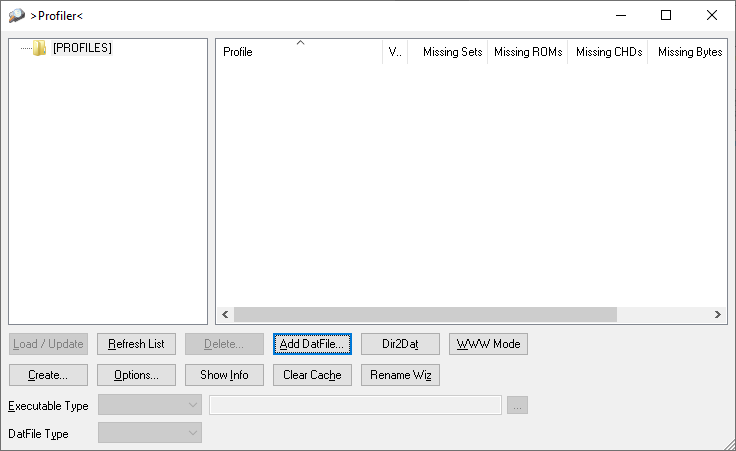
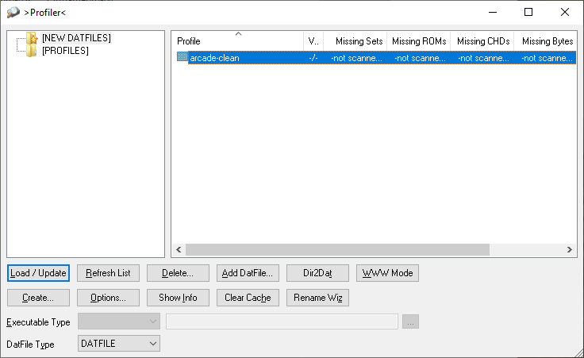
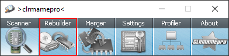
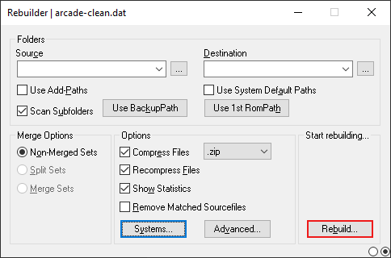
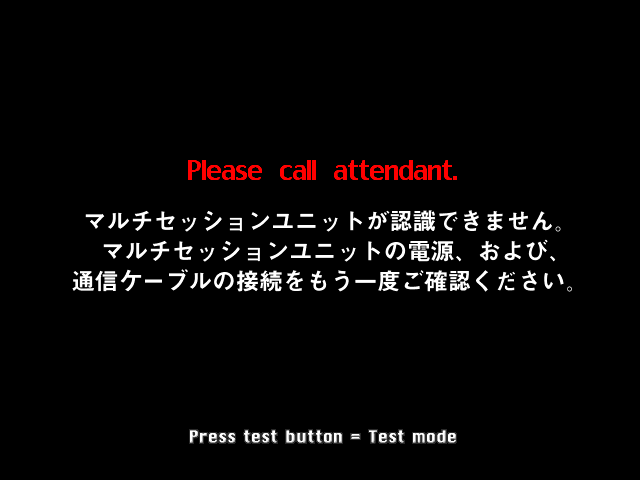
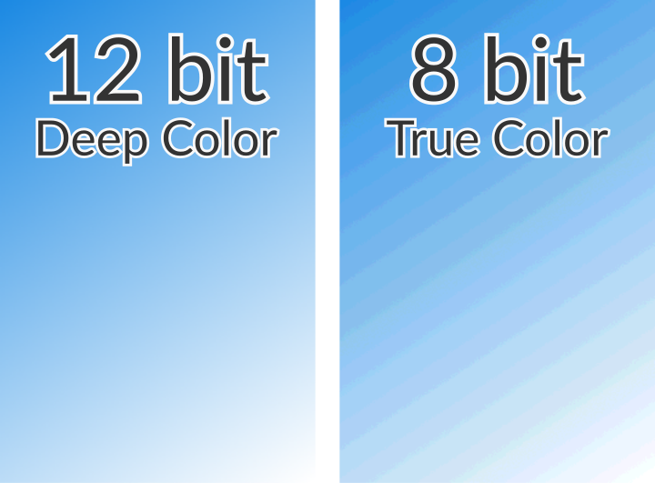
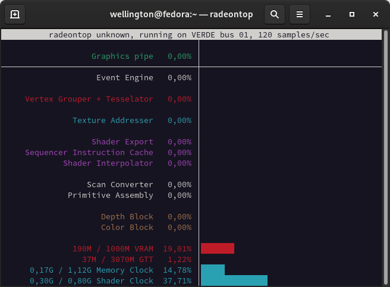
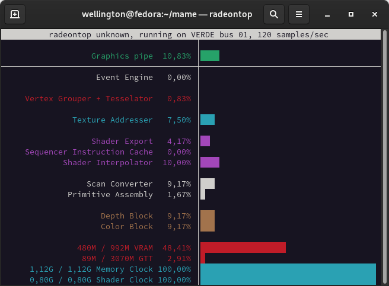

.. raw:: latex

	\clearpage

.. _advanced-tricks:

Truques para tornar a vida mais fácil
=====================================

.. contents:: :local:

.. raw:: latex

	\clearpage

.. _advanced-tricks-botões-ordem:

Configurando a ordem dos botões
~~~~~~~~~~~~~~~~~~~~~~~~~~~~~~~

O MAME por predefinição já assume uma ordem para os botões de um
controle, porém nem sempre essa ordem estará na ordem dos botões
originais de um determinado sistema, sendo necessário a configuração
manual, os exemplos a seguir mostram como alterar essa ordem.

Veja :ref:`Alterando os valores <mamemenu-alt-valores>` antes de
prosseguir.

O processo é muito simples, inicie um sistema qualquer como
``mame galaxian``, depois que o sistema iniciar pressione :kbd:`Tab` e
selecione :guilabel:`Atribuições da entrada (este sistema)`, no campo
:guilabel:`P1 BUTTON 1` (primeiro botão de disparo/tiro do jogador 1) e
defina o botão de tiro, pressione :kbd:`Tab` novamente para fechar a
interface.

Depois de confirmar o funcionamento do botão, pressione :kbd:`Esc` para
encerrar a emulação e criar um arquivo ``galaxian.cfg`` no diretório
**cfg**.

.. raw:: latex

	\clearpage

.. _advanced-tricks-mais-de-um-botão:

Configurando mais de um botão
~~~~~~~~~~~~~~~~~~~~~~~~~~~~~

Usando um controle de **Playstation 2** (ou qualquer outro tipo de
controle) ligado no PC com um adaptador USB como exemplo, faremos uma
configuração dos botões para os sistemas **Neo-Geo** executando o
comando ``mame kof2000``, pressione :kbd:`Tab`, depois selecione
:guilabel:`Atribuições da entrada (este sistema)` e configure os botões com a ordem da
sua preferência.

Dentro do diretório **cfg** será criado um arquivo chamado
``kof2000.cfg``, abra ele num editor de texto qualquer, no topo do
arquivo modifique o ``<system name=kof2000>`` para
``<system name=default>`` e salve este arquivo no diretório **ctrlr**
como ``neogeo.cfg``. No nosso exemplo a ordem dos botões ficou assim, o
**quadrado** é **soco fraco**, o **triângulo** é **soco forte**, o
**xis** é **chute fraco** e o **círculo** é **chute forte**:

Baixe uma cópia deste arquivo no link ao lado
https://pastebin.com/9Xp97xcd

.. code-block:: xml

	
    <?xml version="1.0"?>
    <!-- This file is autogenerated; comments and unknown tags will be stripped -->
    <mameconfig version="10">
    <system name="default">
        <input>
            <port tag=":edge:joy:JOY1" type="P1_BUTTON1" mask="16" defvalue="16">
                <newseq type="standard">
                    JOYCODE_1_BUTTON4
                </newseq>
            </port>
            <port tag=":edge:joy:JOY1" type="P1_BUTTON2" mask="32" defvalue="32">
                <newseq type="standard">
                    JOYCODE_1_BUTTON3
                </newseq>
            </port>
            <port tag=":edge:joy:JOY1" type="P1_BUTTON3" mask="64" defvalue="64">
                <newseq type="standard">
                    JOYCODE_1_BUTTON1
                </newseq>
            </port>
            <port tag=":edge:joy:JOY1" type="P1_BUTTON4" mask="128" defvalue="128">
                <newseq type="standard">
                    JOYCODE_1_BUTTON2
                </newseq>
            </port>
        </input>
      </system>
    </mameconfig>

Agora sempre que quiser usar essa configuração para os botões, basta
usar a opção :ref:`-ctrlr <mame-commandline-ctrlrpath>`, exemplo
``mame kof2003 -ctrlr neogeo``, você pode também adicionar esta opção
ao seu ``mame.ini`` porém note que esta configuração será aplicada em
todos os sistemas!

.. _advanced-tricks-botões-combinação:

Combinando os botões
~~~~~~~~~~~~~~~~~~~~

O personagem Zangief do **Street Fighter II** possui um golpe chamado
`Double Lariat <https://streetfighter.fandom.com/wiki/Double_Lariat>`_
que é ativado ao se pressionar os três botões de soco ao
**mesmo tempo**, é possível criar um arquivo de configuração para que
essa ação aconteça ao toque de um botão apenas.

Inicie o MAME com qualquer jogo da série ``mame sf2``, pressione
:kbd:`Tab`, depois selecione
:guilabel:`Atribuições da entrada (este sistema)`, ao configurar os
botões para os três socos, pressione :kbd:`Del` para apagar o valor,
logo depois escolha o botão que deseja ser soco fraco, pressione
:kbd:`Enter` e escolha quase será o seu botão de **três socos**. Caso
tenha feito tudo certo, deverá aparecer algo como
**Joy 1 button 0 or Joy 1 button 1**, é muito importante aparecer o
**OR** entre os botões.

Usando o mesmo controle de **Playstation 2** a ordem dos botões ficou
dessa forma, o **quadrado** é **soco fraco**, o **triângulo** é **soco
forte**, o **Xis** é **chute médio**, o **círculo** é **chute forte**, o
**L1** é **soco médio**, o **R1** é **chute fraco** e o botão **L2**
identificado como **JOYCODE_1_BUTTON5** faz o papel dos **três botões de
soco**:

Baixe uma cópia deste arquivo no link ao lado
https://pastebin.com/p6dB9DMy

.. code-block:: xml

	
    <?xml version="1.0"?>
    <mameconfig version="10">
    <system name="default">
        <input>
            <port tag=":IN1" type="P1_BUTTON1" mask="16" defvalue="16">
                <newseq type="standard">
                    JOYCODE_1_BUTTON4 OR JOYCODE_1_BUTTON5
                </newseq>
            </port>
            <port tag=":IN1" type="P1_BUTTON2" mask="32" defvalue="32">
                <newseq type="standard">
                    JOYCODE_1_BUTTON7 OR JOYCODE_1_BUTTON5
                </newseq>
            </port>
            <port tag=":IN1" type="P1_BUTTON3" mask="64" defvalue="64">
                <newseq type="standard">
                    JOYCODE_1_BUTTON1 OR JOYCODE_1_BUTTON5
                </newseq>
            </port>
            <port tag=":IN2" type="P1_BUTTON4" mask="1" defvalue="1">
                <newseq type="standard">
                    JOYCODE_1_BUTTON8
                </newseq>
            </port>
            <port tag=":IN2" type="P1_BUTTON5" mask="2" defvalue="2">
                <newseq type="standard">
                    JOYCODE_1_BUTTON3
                </newseq>
            </port>
            <port tag=":IN2" type="P1_BUTTON6" mask="4" defvalue="4">
                <newseq type="standard">
                    JOYCODE_1_BUTTON2
                </newseq>
            </port>
        </input>
    </system>
    </mameconfig>

Uma nota quanto a configuração acima, ela foi feita no Linux (SDL) e
pode ser que no Windows a definição para o botão **L1** seja alternada
para o botão **L2**, porém basta redefini-lo no Windows ou alterná-lo
para um outro botão qualquer depois.

O mesmo tipo de configuração também se aplica para qualquer sistema,
cito por exemplo os sistema rítmicos da série **Guitar Freaks**,
**Dance Dance Revolution**, **Beatmania** e tantas outros onde em alguns
momentos, necessitam que mais de um botão seja acionado ao mesmo tempo.

Baixe um exemplo de configuração de controle para `Guitar Freaks
<https://pastebin.com/g1iXAB1E>`_ e `Dance Dance Revolution
<https://pastebin.com/rSc4kd5u>`_.

.. _advanced-tricks-controle1-qualquer-jogador:

Usando o controle 1 para controlar qualquer outro jogador
~~~~~~~~~~~~~~~~~~~~~~~~~~~~~~~~~~~~~~~~~~~~~~~~~~~~~~~~~

Nos sistemas onde a posição do jogador é fixo como em **Sunset Riders**,
a série **Muscle Bomber**, **Teenage Mutant Ninja Turtles**, **Teenage
Mutant Ninja Turtles - Turtles in Time** e tantas outros sistemas, é
possível utilizar o controle do jogador 1 em qualquer uma das posições
com sistemas que aceitem 2 ou mais jogadores.

Inicie o sistema que deseja configurar e siga as instruções descritas no
capítulo :ref:`advanced-tricks-mais-de-um-botão` para gerar o seu
arquivo com a configuração personalizada para o seu controle. Abra o
arquivo num editor de textos e logo no começo haverá algo do tipo
(pode variar dependendo do seu controle):

.. code-block:: xml

	
    <port tag=":P1" type="P1_JOYSTICK_LEFT" mask="1" defvalue="1">

O que nos interessa são todas as partes que definem os comando para
**P1**, no seu editor de texto pressione :kbd:`CTRL` + :kbd:`H` ou o
comando usado para substituir texto e substitua **P1** por **P2**
ficando assim:

.. code-block:: xml

	
    <port tag=":P2" type="P2_JOYSTICK_LEFT" mask="1" defvalue="1">

Salve este arquivo como ``2P.cfg`` para ser usado como jogador 2, faça o
mesmo para o jogador 3 e 4. Não foi disponibilizado aqui todas as linhas
que foram substituídas, porém, veja como fica a configuração completa
para `2P.cfg <https://pastebin.com/tSkGwMgi>`_,
`3P.cfg <https://pastebin.com/WzfRW3Zm>`_ e
`4P.cfg <https://pastebin.com/BbdTyQ3L>`_. Não custa lembrar que todos
estes arquivos devem ficar armazenados dentro do diretório **ctrlr**.

Em sistemas Linux por exemplo a diferença entre maiúsculas e minúsculas
são levadas em consideração, caso salve estes arquivos com **P**
maiúsculo, faça o mesmo ao informar o nome da configuração, caso
contrário o MAME acusará um erro dizendo que os arquivos não foram
encontrados.

Para jogar com o **Donatello** (jogador 3) no sistema **Teenage
Mutant Ninja Turtles - Turtles in Time** faça o comando::

	mame tmnt2 -ctrlr 3P

Para inserir o crédito para o jogador 3 (Coin 3) pressione
:kbd:`7`, a partida deve iniciar com o **Donatello** ao clicar em
qualquer um dos botões do controle, abaixo tem uma colinha para
facilitar, para ver a listagem completa consulte o capítulo
:ref:`mamemenu`.

.. tabularcolumns:: |l|c|c|c|c|

.. list-table:: Colinha básica.
   :header-rows: 1

   * - Descrição
     - Jogador 1
     - Jogador 2
     - Jogador 3
     - Jogador 4
   * - **Crédito**
     - 5
     - 6
     - 7
     - 8
   * - **Início da Partida**
     - 1
     - 2
     - 3
     - 4

Repare que há sistemas como as da série **Muscle Bomber** por exemplo, é
preciso pressionar os botões relacionados ao inicio da partida de cada
jogador e não apenas pressionar os botões do controle para iniciar a
partida.

.. _advanced-tricks-configuração-controle-por-maquina:

Criando uma configuração de controle por sistema
~~~~~~~~~~~~~~~~~~~~~~~~~~~~~~~~~~~~~~~~~~~~~~~~

No exemplo de :ref:`configuração de botões
<advanced-tricks-mais-de-um-botão>` aprendemos como mapear os botões
de um controle para um determinado sistema, no entanto, um sistema pode
ter sistemas com diferentes configurações de botões, se pegarmos o
driver CPS1 por exemplo, o jogo **Street Fighter II** utiliza 6 botões
já o jogo **Final Fight** utiliza apenas 2 e ambos compartilham o mesmo
driver **CPS1**. Apesar da dica ter facilitado bastante a configuração
do controle para os sistemas que usam 6 botões, ela não irá funcionar
com todos os outros.

Para criar um mapa customizado para **Final Fight** por exemplo, siga as
instruções descritas em :ref:`advanced-tricks-mais-de-um-botão`, porém
usando o sistema **Final Fight** (``mame ffight``), uma vez que os
botões forem definidos e você sair do MAME, encontre o arquivo
``ffight.cfg`` no diretório **cfg** e faça as alterações necessárias.
Copie-o para o diretório **ctrlr** como ``ffight.cfg``. Entre no
diretório **ini** e crie um arquivo chamado ``ffight.ini``, abra-o num
editor de texto e adicione::

	ctrlr ffight

Salve e saia do editor, agora sempre que o sistema **Final Fight** for
iniciado, ele usará o novo mapa de configuração dos botões que foi
criado só para ele.

Repare que não é necessário que o arquivo de configuração tenha o mesmo
nome da sistema, é possível renomear estes arquivos como por exemplo,
``2-botoes.cfg``, ``3-botoes.cfg``, ``4-botoes.cfg`` e compartilhar
estas configurações conforme necessário.

.. _advanced-tricks-dat-sistema:

Gerando arquivos DAT para diferentes gerenciadores de ROMs
~~~~~~~~~~~~~~~~~~~~~~~~~~~~~~~~~~~~~~~~~~~~~~~~~~~~~~~~~~

Arquivos DAT são usados por gerenciadores de ROMs como
`RomCenter (Windows) <http://romcenter.com/>`_,
`RomVault (Linux e Windows) <http://www.romvault.com/>`_,
`Romulus (Windows) <https://romulus.cc>`_,
`Clrmamepro (Windows) <http://mamedev.emulab.it/clrmamepro/>`_,
`Clrmamepro (Mac) <http://www.emulab.it/>`_ dentre outros que aferem a
validade de cada arquivo existente dentro de um arquivo ROM
identificando o CRC e SHA1 de cada um, dentre outras funções.

Execute o MAME com o comando::

	mame -listxml >mame.xml

Baixe o `DatUtil <http://www.logiqx.com/Tools/DatUtil/>`_, extraia-o no
mesmo diretório do MAME e execute o comando::

	datutil mame.xml

Será criado o arquivo ``datutil.dat``.

Criando arquivos DAT separados por sistema
~~~~~~~~~~~~~~~~~~~~~~~~~~~~~~~~~~~~~~~~~~

Para criar um DAT para o sistema CPS1 (**cps1.dat**) compatível com o
**Clrmamepro** faça o comando::

	datutil.exe -G cps1.cpp -o cps1.dat -f cmp datutil.dat

Para o sistema CPS2::

	datutil.exe -G cps2.cpp -o cps2.dat -f cmp datutil.dat

Para o sistema Neo-Geo::

	datutil.exe -G neogeo.cpp -o neogeo.dat -f cmp datutil.dat

Para uma lista de Neo-Geo sem clones::

	datutil.exe -G neogeo.cpp -o neogeo.dat -r -f cmp datutil.dat

.. note::

	A estrutura interna do MAME para a criação de projetos foi
	modificada depois `desta alteração <https://github.com/mamedev/mame/commit/cf11b3330261aea407a36911048f3835b7a48f31>`_.
	Assim, em vez de usar ``-G neogeo.cpp`` (por exemplo), é preciso
	usar ``neogeo/neogeo.cpp`` para que o ``datutil`` consiga
	identificar e criar o respectivo arquivo dat, caso contrário, ele
	aponta um erro na criação do arquivo. Para identificar a
	nomenclatura correta do driver, utilize a opção
	:ref:`-ls <mame-commandline-listsource>` seguido do nome do sistema,
	para o **Street Fighter II** (``mame -ls sf2``), por exemplo, a
	opção retorna ``capcom/cps1.cpp``. Esta deve ser a opção usada com o
	``datutil`` nas versões mais novas do MAME a partir da versão
	**0.246**.

E assim por diante, para criar um DAT em formato **RomCenter** troque o
``cmp`` por ``rc``, para **RomCenter 2** use ``rc2`` e para criar um
arquivo XML genérico aceito pelos outros gerenciadores use ``gx`` ou
``generic``. Para mais informações sobre outros formatos leia o arquivo
**Readme.txt** que acompanha o DatUtil, para ver alguns outros exemplos
práticos do programa, acesse `este link
<https://forum.recalbox.com/topic/4537/tutorial-datutil>`_.

Estes mesmos arquivos ``neogeo.dat``, ``cps2.dat`` e qualquer outro que
for criado poderá ser utilizado pelos gerenciadores de ROMs para
construir um ROM SET para cada um destes sistemas. É uma maneira muito
mais fácil de se separar as ROMs do que ter que fazer e
:ref:`usar scripts <arma-separando-roms>`. No entanto, apesar de ser
mais fácil utilizar um gerenciador, repare que é bem genérico. O uso de
scripts permitem que a separação seja bem mais específica caso seja
necessário.

.. raw:: latex

	\clearpage

.. _advanced-tricks-criando-romset:

Criando um ROMSET apenas com sistemas tipo Arcade
~~~~~~~~~~~~~~~~~~~~~~~~~~~~~~~~~~~~~~~~~~~~~~~~~

Umas das maneiras de se criar tal ROMSET é baixando o código-fonte e
compilando o MAME com a opção ``SUBTARGET=arcade``, isso fará com que o
MAME funcione e exiba apenas uma lista com sistemas classificados
internamente como "*arcade*", simples assim. Para mais informações leia
o capítulo :ref:`compiling-MAME`.

.. _advanced-tricks-using-mame-interface:

Usando a interface
------------------

Para aqueles que não estão familiarizados(as) com o processo de
compilação, só utilizam a versão oficial do MAME e que também não
tenham interesse em montar todo um ambiente de desenvolvimento só para
isso, é possível criar essa lista através da interface do MAME, o que
facilita muito a nossa vida.

* Faça o download da última versão do arquivo ``category.ini`` no site
  `Progetto-Snaps <http://www.progettosnaps.net/renameset/>`_ e extraia
  o diretório **folders** dentro do diretório do MAME.
* Inicie o MAME, no lado esquerdo da interface selecione
  :guilabel:`Categoria`, em :guilabel:`Arquivo` escolha
  :guilabel:`Working Arcade Clean.ini`, em :guilabel:`Incluir Clones`
  escolha :guilabel:`Não` e clique em :guilabel:`Retorna ao menu
  anterior`.
* No topo da interface, clique com o mouse no ícone do disquete para
  exportar a lista e escolha :guilabel:`Exporta a lista em formato XML
  (igual -listxml)`, depois de alguns segundos será gerado um arquivo
  **exported.xml** dentro do diretório **ui**.
* Assim como foi explicado no
  :ref:`capítulo anterior <advanced-tricks-dat-sistema>`, é possível usar
  o *DatUtil* para transformar o arquivo XML num arquivo DAT compatível
  com um dos gerenciadores listados no capítulo anterior ou utilizar
  diretamente o arquivo XML nos gerenciadores que não dependam de um
  arquivo DAT (como o Clrmamepro).
* Convertendo ou não o arquivo XML em DAT, use o seu gerenciador
  preferido para **reconstruir (Rebuild)** as ROMs, usando o diretório
  onde as suas ROMs se encontram e com o destino o diretório onde deseja
  ter somente as ROMs de arcade.

.. raw:: latex

	\clearpage

.. _advanced-tricks-using-clrmamepro:

Usando o Clrmamepro
-------------------

O **Clrmamepro** é apenas um dos diversos programas disponíveis para
gerenciar as suas ROMs, o exemplo abaixo mostra como usar o arquivo XML
gerado no passo anterior para **reconstruir (Rebuild)** o seu ROMSET
apenas com ROMs arcade.

* Baixe e instale o `Clrmamepro <https://mamedev.emulab.it/clrmamepro/>`_
  é importante saber em qual diretório ele foi instalado!
* Renomeie o arquivo **exported.xml** que está dentro do diretório
  **ui** para **arcade-clean.xml** assim é possível ter um controle do
  arquivo que está sendo carregado.
* Localize o diretório onde o *Clrmamepro* foi instalado e copie o
  arquivo **arcade-clean.xml** para dentro do diretório **datfiles**.
* Rode o *Clrmamepro* no campo direito onde diz **Profile** deve estar
  vazio.

* Clique em :guilabel:`Add DatFile...` e selecione o arquivo
  ``arcade-clean.xml``, na próxima tela apenas clique em :guilabel:`OK`.
* Clique em :guilabel:`Load / Update`, na próxima tela selecione
  :guilabel:`Default`.

* Durante a leitura deve aparecer alguns erros do tipo
  :guilabel:`DatFile Problem`, apenas clique em :guilabel:`OK TO ALL`.
* Ao concluir clique no ícone :guilabel:`Rebuilder`.

.. raw:: latex

	\clearpage

* Sem alterar nenhuma das opções, vá em :guilabel:`Source` e selecione o
  diretório onde se encontram todas as suas ROMs. Em
  :guilabel:`Destination` selecione o diretório de destino onde será
  criada a sua nova *ROMSET*.

* **ATENÇÃO! Não escolha o mesmo diretório de origem**, escolha um
  diretório completamente diferente e se possível que seja em outro HDD,
  cartão de memória, pen-drive, etc!
* Clique em :guilabel:`Rebuild...` para iniciar e aguarde pois
  dependendo da quantidade de arquivos todo o processo será demorado.

Ao final do processo você terá um *ROMSET* apenas com as ROMs dos
sistemas arcades, o mesmo pode ser feito para qualquer outro sistema,
Mega Drive/Genesis, SNES, o céu é o limite!

.. _advanced-tricks-using-scripts:

Usando Scripts
--------------

Uma outra maneira para obter o mesmo resultado é através da utilização
de pequenos *scripts* usando a linha de comandos, apesar de ser um
processo mais manual e um pouco trabalhoso, o processo acaba sendo mais
poderoso pois permite que a filtragem e a seleção dos arquivos possa ser
mais refinada e podendo ser utilizada em qualquer sistema operacional e
não algo exclusivo do Windows apenas.

* Faça o download da última versão do arquivo ``category.ini`` no site
  `Progetto-Snaps <http://www.progettosnaps.net/renameset/>`_.
* Abra e extraia apenas o arquivo ``Working Arcade.ini``.
* Apague tudo e deixe apenas o que estiver depois de ``[ROOT_FOLDER]``.
* Salve este arquivo modificado como ``arcade.txt``.

.. _advanced-tricks-command-windows:

Usando a linha de comando no Windows
------------------------------------

Abra o prompt de comando no mesmo diretório onde se encontra o arquivo
``arcade.txt`` defina o caminho completo para onde deseja copiar os
arquivos::

	set DST=H:\arcade-roms

Seguido do comando abaixo::

	for /F %f in ('type arcade.txt') do @echo G:\roms\%f.zip >> caminho-roms.txt

O comando acima vai ler todos os nomes dos sistemas em ``arcade.txt``,
incluir o caminho completo onde estão armazenadas as suas ROMs,
adicionar o nome do sistema + a extensão .zip e por fim redirecionar a
saída para o arquivo ``caminho-roms.txt``.

.. raw:: latex

	\clearpage

Execute o comando abaixo para realizar a cópia dos arquivos com base na
lista que acabamos de criar::

	for /F %f in ('type caminho-roms.txt') do copy %f %DST%

Assim como no comando acima, o arquivo ``caminho-roms.txt`` será lido e
posteriormente irá alimentar o comando ``copy`` com o devido caminho e
o destino ``H:\arcade-roms``.

.. _advanced-tricks-others:

Usando o terminal no Linux, macOS e \*NIX em geral
--------------------------------------------------

Como descrito acima, abra o terminal no mesmo diretório onde se encontra
o arquivo ``arcade.txt`` e defina o diretório de destino::

	export DST=/mnt/usb/arcade-roms

É necessário converter o formato do arquivo de Windows (quebra de linha
**CRLF**) para um formato compatível com \*nix (quebra de linha
**LF**), caso contrário a lista ficará toda bagunçada::

	sed -i 's/\r//g' arcade.txt

Execute o comando abaixo para gerar o arquivo ``caminho-roms.txt`` onde
**/home/mame/roms** é o caminho completo onde as ROMs estão
armazenadas::

	for f in $(< arcade.txt); do echo /home/mame/roms/"$f".zip; done > caminho-roms.txt

Execute o comando abaixo para fazer a cópia dos arquivos::

	for f in $(< caminho-roms.txt); do cp "$f" "$DST"; done

Para separar um *ROMSET* com todas as *ROMs* para **Neo Geo** usando
apenas o terminal, crie o ``mame.xml`` com o comando::

	mame -lx > mame.xml

Faça o comando abaixo para criar uma lista destas ROMs nas versões
anteriores do **MAME 0.246**::

	cat mame.xml | grep 'sourcefile="neogeo.cpp"' | sed -rn 's/.* name="([a-z0-9]+)" .*/\1/p' | awk '!seen[$0]++' | sort -d > maquinas

Para novas versões após a versão **0.246**::

	cat mame.xml | grep 'sourcefile="neogeo/neogeo.cpp"' | sed -rn 's/.* name="([a-z0-9]+)" .*/\1/p' | awk '!seen[$0]++' | sort -d > maquinas

O primeiro comando ``cat mame.xml`` lista o arquivo ``mame.xml``, o
segundo comando filtra as linhas que contém
``sourcefile="neogeo/neogeo.cpp"``, o terceiro
``sed -rn 's/.* name="([a-z0-9]+)" .*/\1/p'`` seleciona os nomes, o
quarto comando ``awk '!seen[$0]++'`` remove os itens repetidos, o último
``sort -d`` organiza a lista em ordem alfabética e por último
``> maquinas`` redireciona todo o processamento para o arquivo
``maquinas``.

Dentro do arquivo ``maquinas`` nós teremos uma lista que inclui os
clones e a BIOS::

	2020bb
	2020bba
	2020bbh
	3countb
	...

Usando o mesmo exemplo, porém, criando uma lista **sem clones** e
**sem BIOS**, use o comando abaixo::

	cat mame.xml | grep 'romof="neogeo"' | sed -rn 's/.* name="([a-z0-9]+)" .*/\1/p' | awk '!seen[$0]++' | sort -d > maquinas

Assim teremos a seguinte lista::

	2020bb
	3countb
	alpham2
	androdun
	...

Agora com ou sem clones, geramos o arquivo com o caminho completo para
as *ROMs* que nós queremos::

	while read maquinas; do echo /media/mame/roms/"$maquinas".zip ; done < maquinas > lista-roms

O arquivo ``maquinas`` alimenta ``maquinas`` do ``while read`` que vai
substituindo os valores da lista em ``"$maquinas"`` assim que eles vão
sendo concluídos e no final redireciona a nossa lista pronta para
``lista-roms``. Isso gera a seguinte lista::

	/media/mame/roms/2020bb.zip
	/media/mame/roms/3countb.zip
	/media/mame/roms/alpham2.zip
	/media/mame/roms/androdun.zip
	...

Com a lista em mãos, supondo que eu queira criar uma pasta exclusiva
para *ROMs* de *Neo Geo* como por exemplo **/home/mame/roms/neogeo**,
primeiro eu crio o diretório com ``mkdir /home/mame/roms/neogeo`` e em
seguida, posso usar o comando abaixo para copiar todas as *ROMs* para
dentro desta pasta::

	while read copy ; do cp "$copy" /home/mame/roms/neogeo ; done < lista-roms

Assim como no exemplo anterior, ``copy`` de ``while read`` é alimentado
por ``lista-roms`` que vai substituindo os valores da lista em
``"$copy"`` assim que eles vão sendo concluídos e copiando os arquivos
da lista para ``/home/mame/roms/neogeo``.

Ao final, nós teremos todas as *ROMs* de *Neo Geo* dentro da pasta
escolhida. Note porém que o processo não é 100% perfeito para todos os
sistemas e talvez seja necessário verificar as *ROMs* com o seu
:ref:`gerenciador de ROM <advanced-tricks-dat-sistema>` preferido. Com
o Windows, é preferível gerar um arquivo DAT (neogeo.dat) como explicado
em :ref:`Criando arquivos DAT separados por sistema <advanced-tricks-dat-sistema>`
e depois usar o Clrmamepro para verificar se todas as ROMs foram mesmo
corretamente copiadas.

.. _advanced-tricks-powershell-redirect:

Resolvendo o redirecionamento do MAME com PowerShell da Microsoft #5694
~~~~~~~~~~~~~~~~~~~~~~~~~~~~~~~~~~~~~~~~~~~~~~~~~~~~~~~~~~~~~~~~~~~~~~~

Ao redirecionar a saída do MAME com o comando :ref:`-listxml / -lx
<mame-commandline-listxml>` usando o PowerShell da Microsoft, a saída
tem o dobro de tamanho se comparado com a saída do mesmo comando ao se
utilizar o terminal do Linux, macOS ou o comando prompt do Windows. [#]_

Segundo mostra `este artigo
<https://devblogs.microsoft.com/powershell/outputencoding-to-the-rescue/>`_
hospedado num blog de desenvolvimento da Microsoft, a codificação
predefinida do PowerShell não é UTF-8, originalmente ele vem
como `us-ascii <https://en.wikipedia.org/wiki/Code_page_20127>`_:

.. code-block:: kconfig

	$OutputEncoding
	
	IsSingleByte      : True
	BodyName          : us-ascii
	EncodingName      : US-ASCII
	HeaderName        : us-ascii
	WebName           : us-ascii
	WindowsCodePage   : 1252
	IsBrowserDisplay  : False
	IsBrowserSave     : False
	IsMailNewsDisplay : True
	IsMailNewsSave    : True
	EncoderFallback   : System.Text.EncoderReplacementFallback
	DecoderFallback   : System.Text.DecoderReplacementFallback
	IsReadOnly        : True
	CodePage          : 20127

Ao fazer o redirecionamento, a saída é codificada para
`iso-10646-ucs-2 BOM <https://en.wikipedia.org/wiki/ISO_10646>`_, isso
faz com que cada caractere comum seja armazenado com 2 bytes. Geralmente
o UTF-8 por exemplo utiliza de 1 a 4 bytes para caracteres
`diacríticos <https://pt.wikipedia.org/wiki/Diacrítico>`_, assim como
caracteres Cirílico, Grego, etc.

Para arrumar apenas o redirecionamento ``>`` ou ``>>`` faça o comando no
terminal do PowerShell:

.. code-block:: kconfig

	$PSDefaultParameterValues['Out-File:Encoding'] = 'utf8'

Para mudar a codificação de todo o terminal, faça o comando:

.. code-block:: kconfig

	$OutputEncoding = [Console]::OutputEncoding = [Text.UTF8Encoding]::UTF8

Um exemplo de como agora fica a codificação do terminal:

.. code-block:: kconfig

	$OutputEncoding
	
	BodyName          : utf-8
	EncodingName      : Unicode (UTF-8)
	HeaderName        : utf-8
	WebName           : utf-8
	WindowsCodePage   : 1200
	IsBrowserDisplay  : True
	IsBrowserSave     : True
	IsMailNewsDisplay : True
	IsMailNewsSave    : True
	IsSingleByte      : False
	EncoderFallback   : System.Text.EncoderReplacementFallback
	DecoderFallback   : System.Text.DecoderReplacementFallback
	IsReadOnly        : True
	CodePage          : 65001

Qualquer uma das opções funcionam, não é necessário usar as duas. Para
mais informações `veja este post
<https://devblogs.microsoft.com/scripting/understanding-the-six-powershell-profiles/>`_
para saber localizar os perfis do PowerShell no Windows e alternar estes
valores para que fiquem permanentes ou que sejam executados sempre que
uma seção do PowerShell seja iniciada.

.. raw:: latex

	\clearpage

.. _advanced-tricks-drummania:

Resolvendo o problema "please call attendant" dos sistemas DrumMania
~~~~~~~~~~~~~~~~~~~~~~~~~~~~~~~~~~~~~~~~~~~~~~~~~~~~~~~~~~~~~~~~~~~~

Os sistemas **DruMania 4th Mix** em diante não iniciam e param numa
tela de erro como mostra a imagem abaixo:

Existem duas maneiras de resolver o problema, aplicando um patch na
imagem o que altera a sua integridade ou usando um **cheat**. Crie os
arquivos abaixo dentro do diretório **cheat**, estes arquivos não são de
minha autoria e desconheço o autor original, caso alguém conheça, entre
em contato que o devido crédito será dado.

**drmn4m.xml**

.. code-block:: xml

	<mamecheat version="1">
		<cheat desc="Please Call Attendant Fix">
			
		</cheat>
	</mamecheat>

https://pastebin.com/JyaTSr4c

**drmn5m.xml**

.. code-block:: xml

	<mamecheat version="1">
		<cheat desc="Please Call Attendant Fix">
			
		</cheat>
	</mamecheat>

https://pastebin.com/dTQMeJB1

.. raw:: latex

	\clearpage

**drmn6m.xml**

.. code-block:: xml

	<mamecheat version="1">
		<cheat desc="Please Call Attendant Fix">
			
		</cheat>
	</mamecheat>

https://pastebin.com/tRAFhfaS

**drmn7m.xml**

.. code-block:: xml

	<mamecheat version="1">
		<cheat desc="Please Call Attendant Fix">
			
		</cheat>
	</mamecheat>

https://pastebin.com/LtMyNZ7i

**drmn7ma.xml**

.. code-block:: xml

	<mamecheat version="1">
		<cheat desc="Please Call Attendant Fix">
			
		</cheat>
	</mamecheat>

https://pastebin.com/MyX6scPk

**drmn8m.xml**

.. code-block:: xml

	<mamecheat version="1">
		<cheat desc="Please Call Attendant Fix">
			
		</cheat>
	</mamecheat>

https://pastebin.com/LGTnUd4Y

.. raw:: latex

	\clearpage

**drmn9m.xml**

.. code-block:: xml

	<mamecheat version="1">
		<cheat desc="Please Call Attendant Fix">
			
		</cheat>
	</mamecheat>

https://pastebin.com/at99MLqz

**drmn10m.xml**

.. code-block:: xml

	<mamecheat version="1">
		<cheat desc="Please Call Attendant Fix">
			
		</cheat>
	</mamecheat>

https://pastebin.com/EaJes6Eh

.. raw:: latex

	\clearpage

.. _advanced-tricks-imagem-fundo:

Usando uma imagem de fundo no MAME
~~~~~~~~~~~~~~~~~~~~~~~~~~~~~~~~~~

É possível utilizar uma imagem de fundo no MAME que é exibida na
interface como um papel de parede, somado com a opção de customização, é
possível alterar a aparência da sua interface. Escolha a imagem que
deseja usar em formato ``.jpg`` ou ``.png`` e renomeie o arquivo para
``background.jpg`` ou ``background.png``, cuidado para não usar imagens
muito pesadas, prefira o formato ``.jpg``.

Ao iniciar o MAME vá em :guilabel:`Definições gerais`,
:guilabel:`Opções diversas` e ative a opção
:guilabel:`Usa uma imagem como plano de fundo`.

Para ter uma interface com cores diferentes ao do padrão do MAME,
experimente a configuração abaixo, ela usa uma paleta de cores do filme
Tron::

	# UI OPTIONS
	#
	infos_text_size           0.700000
	font_rows                 37
	hide_main_panel           0
	ui_border_color           ffb7e7eb
	ui_bg_color               c8022f35
	ui_clone_color            ff808080
	ui_dipsw_color            ff03d2d8
	ui_gfxviewer_color        ef101030
	ui_mousedown_bg_color     9470b3d0
	ui_mousedown_color        fffa26ec
	ui_mouseover_bg_color     70276e84
	ui_mouseover_color        ff25b9a9
	ui_selected_bg_color      ef047289
	ui_selected_color         ff03d2d8
	ui_slider_color           ffffffff
	ui_subitem_color          ffffffff
	ui_text_bg_color          ef000000
	ui_text_color             ffffffff
	ui_unavail_color          ff404040

Salve estas opções no arquivo ``ui.ini`` no Windows e no Linux fica em
``~/.mame/ui.ini``.

Caso queira brincar com as cores, eu gosto do site
`Hex Colors Tools <https://www.hexcolortool.com/>`_.
No site é possível você entrar com o valor de cores em hex (#000000) e
ela oferece a possibilidade de variar a cor para mais claro ou mais
escuro em intervalos de 10% ou um outro valor qualquer.

Já para a combinação das cores é necessário saber sobre cores primárias,
cores frias, quentes, monocromáticas, análogas, saber como utilizar o
círculo cromático (dentre outras ferramentas) etc. Um tópico desta
natureza daria um livro (ou mais de um livro) só sobre o assunto, logo
este tópico não é coberto por este documento, no entanto, deixo algumas
sugestões de leitura como `combinando cores 1
<https://www.treinaweb.com.br/blog/voce-sabe-como-combinar-cores>`_,
`combinando cores 2 <https://www.publicitarioscriativos.com/descubra-de-
uma-vez-por-todas-como-utilizar-o-circulo-cromatico/>`_,
`combinando cores 3 <https://www.canva.com/colors/color-wheel/>`_, isso
sem falar nas centenas de milhares de vídeos no YouTube sobre o assunto.

Já em termos de ferramentas eu gosto bastante da `Paletton
<https://paletton.com>`_ e a `Adobe
<https://color.adobe.com/pt/create/color-wheel>`_.

Infelizmente a customização das cores da interface do MAME é muito
limitada pois alguma cores são fixas como o verde que fica no título das
janelas ou o texto verde das opções que estão ligadas, aquele azul da
seleção das ROMs, etc.

.. raw:: latex

	\clearpage

.. _advanced-tricks-performance:

Melhorando o desempenho em sistemas Linux
~~~~~~~~~~~~~~~~~~~~~~~~~~~~~~~~~~~~~~~~~

Os sistemas como **Dance Dance Revolution**, **Guitar Freaks**,
**DrumMania** dentre outros no Windows, eles funcionam sem qualquer
problema,  porém sofrem com diversos problemas no Linux, um dos motivos
é a configuração "padrão" que "vem de fábrica". Geralmente o seu sistema
Linux vem configurado em modo de economia de energia, drivers genéricos
e configurações básicas para o seu hardware, claro que não podemos nos
esquecer que o MAME é um ávido consumidor de recursos de hardware,
logo, quanto melhor, bem configurado e mais recente for o seu hardware
melhor será a sua experiência com o MAME. A melhoria no desempenho
contudo não será absoluta, extrairemos o melhor possível porém este
desempenho se limita ao desenvolvimento do MAME, se os drivers
responsáveis pelo sistema em questão já foram concluídos ou não, se o
desenvolvimento da emulação como um todo já foi concluído ou não, etc.

Os testes foram realizados com o **Debian 11.5** (Buster) e o
**Fedora 33** usando uma **AMD Radeon HD 7750** porém as configurações
descritas aqui devem ser compatíveis com outras distribuições Linux ou
talvez sirva como um guia para outros modelos de placas de vídeo. Não
entraremos nas questões de instalação de pacotes dada a complexidade de
cobrir todas as sua dependências e sim apenas na configuração.

.. note::

	Tenha certeza de utilizar uma versão mais recente do Linux e do
	MAME!

.. note::

	Considere o site `pkg.org <https://pkgs.org>`_ para pesquisar os
	pacotes para a sua distribuição.

.. warning::

	Antes de prosseguir saiba que dependendo da versão do driver amdgpu
	que você estiver usando ele pode **não ter áudio HDMI**, será
	preciso usar a sua placa de som ou fones de ouvidos.

.. _advanced-tricks-performance-cpu:

Ajustando a frequência da CPU
-----------------------------

O modo de economia de energia do processador pode atrapalhar bastante o
desempenho do MAME, incluindo a lentidão de alguns jogos quando rodados
no Linux que rodam sem lentidão no Windows, assim como, jogos que ficam
com o áudio falhando ou picotando.

Para ver em que modo o seu processador está rodando, execute o comando
abaixo no seu terminal::

	cat /sys/devices/system/cpu/cpu*/cpufreq/scaling_governor

O padrão para a maioria dos casos é ``conservative``, isso faz com que a
frequência do seu processador `seja mantida no mínimo <https://www.kernel.org/doc/html/v6.0/admin-guide/pm/cpufreq.html#conservative>`_,
conservando energia, porém, atrapalhando o desempenho geral da emulação.

Para alterar isso, no Debian instale o pacote ``linux-cpupower``::

	sudo apt install linux-cpupower

No Fedora, instale o ``kernel-tools``::

	sudo dnf install kernel-tools

Acesse o site `pkgs.org <https://pkgs.org/>`_ para identificar em qual
pacote vem o ``cpupower`` para a sua distro. 

Um vez instalado, rode o comando abaixo para identificar quais os modos
o seu processador suporta::

    sudo cpupower frequency-info
    analisando o CPU 0:
      driver: acpi-cpufreq
      CPUs que rodam na mesma frequência de hardware: 0
      CPUs que precisam ter suas frequências coordenadas por software: 0
      maior latência de transição: 4.0 us
      limites do hardware: 1.40 GHz - 4.00 GHz
      available frequency steps:  4.00 GHz, 3.40 GHz, 2.80 GHz, 2.10 GHz, 1.40 GHz
      reguladores do cpufreq disponíveis: performance schedutil
      política de frequência atual deve estar entre 1.40 GHz e 4.00 GHz.
                      O regulador "performance" deve decidir qual velocidade usar
                      dentro desse limite.
      current CPU frequency: 4.00 GHz (asserted by call to hardware)
      boost state support:
        Supported: yes
        Active: yes
        Boost States: 2
        Total States: 7
        Pstate-Pb0: 4200MHz (boost state)
        Pstate-Pb1: 4100MHz (boost state)
        Pstate-P0:  4000MHz
        Pstate-P1:  3400MHz
        Pstate-P2:  2800MHz
        Pstate-P3:  2100MHz
        Pstate-P4:  1400MHz

No nosso caso podemos utilizar ``performance`` e ``schedutil``, o modo
``performance`` faz com que o processador rode com a sua frequência
máxima, no nosso caso, **4000MHz**. Já o modo ``schedutil`` faz com que
a frequência do processador varie conforme a demanda.

Para alterar o modo, execute o comando abaixo::

	sudo cpupower -c all frequency-set -g schedutil

É possível deixar como ``performance`` porém lembre-se, neste modo o
processador sempre vai trabalhar com a frequência máxima, ainda que
nada esteja sendo feito no seu computador, causando um aquecimento e um
consumo extra de energia sem qualquer necessidade. O modo ``schedutil``
é o melhor dos dois mundos pois acelera a frequência do processador
quando for preciso e reduz ao mínimo quando nada estiver sendo feito.

Em sistemas com KDE e Gnome, é possível ir nas configurações de
**energia** do sistema e escolher a opção :guilabel:`balanceado`, que
também define o modo de operação do processador como ``schedutil``.

Acesse a `documentação do kernel <https://www.kernel.org/doc/html/v6.0/admin-guide/pm/cpufreq.html>`_
para obter mais informações estas e outras opções do o gerenciamento de
energia do kernel.

.. _advanced-tricks-performance-gpu:

Identificando o modelo da sua placa de vídeo
--------------------------------------------

No terminal execute o comando::

	lspci |grep VGA
	01:00.0 VGA compatible controller: Advanced Micro Devices, Inc.
	[AMD/ATI] Cape Verde PRO [Radeon HD 7750/8740 / R7 250E]

O que nos interessa é o nome do *chipset* da placa **Cape Verde**, ela é
da família **Southern Islands** ou **SI**. Consulte `a lista completa
<https://en.wikipedia.org/wiki/List_of_AMD_graphics_processing_units#Fea
tures_Overview>`_.

Confira qual o driver que está sendo utilizado no momento::

	lspci -vs 01:00.0|grep driver
	Kernel driver in use: radeon

.. raw:: latex

	\clearpage

.. _advanced-tricks-performance-vulkan-fedora:

Ativando o Vulkan no Fedora
---------------------------

Nem todos os pacotes e as suas respectivas dependências estão listadas,
rode o comando abaixo para instalar os pacotes necessários::

	sudo dnf install linux-firmware xorg-x11-drv-amdgpu vulkan-tools vulkaninfo radeontop mesa-vulkan-drivers mesa-dri-drivers tuned glx-utils

É preciso passar alguns parâmetros para o kernel no arquivo
``/etc/default/grub``, na opção ``GRUB_CMDLINE_LINUX`` deve haver algo
do tipo::

	GRUB_CMDLINE_LINUX="rhgb quiet"

Adicione as opções para a sua placa de vídeo, para o nosso exemplo eles
seriam::

	GRUB_CMDLINE_LINUX="rhgb quiet pcie_aspm.policy=performance radeon.si_support=0 amdgpu.si_support=1 modprobe.blacklist=radeon amdgpu.gpu_recovery=1 amdgpu.pcie_gen2=1 amdgpu.dpm=1"

.. warning::

	Observe que independente de como a linha acima apareça aqui neste
	documento, ela é direta e contínua!

* **pcie_aspm.policy**

    Desliga o gerenciamento de energia dos slots PCIe e permite que os
    dispositivos conectados a ele trabalhem com o máximo desempenho. Os
    valores válidos são ``default``, ``powersave`` e ``performance``,
    por predefinição o sistema usa economia de energia.

* **radeon.si_support**

    Ativa (1) ou desativa (0) o suporte ao driver **radeon**.

* **amdgpu.si_support**

    Ativa (1) ou desativa (0) o suporte ao driver **amdgpu**.

* **modprobe.blacklist**

    Evita que o kernel carregue o driver **radeon**.

* **amdgpu.gpu_recovery**

    Caso a sua placa de vídeo trave por algum motivo qualquer deixando a
    sua tela parada, o mecanismo de recuperação entra em ação.

* **amdgpu.pcie_gen2**

    Impõem o uso da geração da PCIe mais recente, não use se a sua
    placa-mãe e a placa de vídeo não forem compatíveis.

* **amdgpu.dpm**

    Gerenciamento dinâmico de energia, faz com que a sua GPU economize
    energia e trabalhe fria quando não estiver em uso e ofereça o máximo
    desempenho apenas quando for preciso.

.. raw:: latex

	\clearpage

Execute o comando abaixo caso o seu PC use EFI::

	sudo grub2-mkconfig -o /boot/efi/EFI/fedora/grub.cfg

Ou sem EFI::

	sudo grub2-mkconfig -o /boot/grub2/grub.cfg

Caso não queira lidar com o grub ou se a sua distribuição não usar o
grub, crie um arquivo ``amdgpu.conf`` dentro do diretório **/etc/modprobe.d**
com as mesmas opções::

	options radeon si_support=0
	options amdgpu si_support=1
	options amdgpu pcie_gen2=1
	options amdgpu gpu_recovery=1
	options amdgpu dpm=1
	options pcie_aspm policy=performance
	blacklist radeon

Regenere o **initramfs** no Fedora com o comando ``sudo dracut -fv`` e
**reinicie o seu computador**. Para aqueles que tem a opção de usar
ambos, escolha um ou o outro, **não utilizem os dois juntos!**
Particularmente prefiro usar o **modprobe** em vez do **grub** pois
qualquer erro que seja feito na configuração do arquivo do grub o seu
sistema não inicia mais e dá um baita trabalho arrumar depois, já pelo
modprobe a única coisa que acontece são alguns erros no seu registro de
logs. Em termos de desempenho ambos são iguais.

É possível listar todos os parâmetros disponíveis do módulo **amdgpu**
(ou qualquer outro módulo) com o comando ``modinfo amdgpu|grep parm``,
quase todos eles estão disponíveis no diretório
``/sys/class/drm/card0/device/driver/module/parameters/``, apesar de
estarem disponíveis não significa que todos eles sejam compatíveis com a
sua placa de vídeo.

Isso nada tem a ver com o MAME e o MAME tão pouco tira proveito desta
configuração específica, no entanto como já estamos turbinando as
configurações, caso o seu monitor e a sua placa de vídeo sejam
compatíveis com "Deep Color" ela pode ser ativada com a opção::

	options amdgpu deep_color=1

Regenere o **initramfs** e reinicie.

.. raw:: latex

	\clearpage

.. note::

	Antes das telas "Full HD" os monitores trabalhavam com VGA e usavam
	**8 bit** para cada canal de cor RGB (Vermelho, Verde e Azul) ou 256
	(2^8) variações de cores para cada componente RGB dando um total de
	**16.777.216** (256^3) ou 16.7 milhões de cores, nos PC's do final
	dos anos 90 o Windows exibia esta configuração como **True Color**.
	Com o **Deep Color** nós temos **12 bit** por canal, ou seja, 4096
	(2^12) variações de cores para cada componente, estamos falando de
	um total de **68.719.476.736** (4096^3) ou cerca de **68.7 bilhões
	de cores**.

.. tabularcolumns:: |c|

.. list-table:: Um exemplo **exagerado** das diferenças.

   * - |cor|

Verifique se o driver **amdgpu** está em uso::

	lspci -vs 01:00.0|grep driver
	Kernel driver in use: amdgpu

Verifique se tudo está em ordem::

	glxinfo -B|grep "OpenGL renderer" && glxinfo -B |grep "OpenGL version"
	
	OpenGL renderer string: AMD Radeon HD 7700 Series
	(VERDE, DRM 3.39.0, 5.9.13-200.fc33.x86_64, LLVM 11.0.0)
	OpenGL version string: 4.6 (Compatibility Profile) Mesa 20.2.4

Execute o comando ``vulkaninfo`` e verifique se ele não acusa qualquer
erro, se tudo estiver certo aparecerá uma lista detalhada com as
informações da sua placa de vídeo e das extensões que estão ativas para
ela, a lista abaixo é um **resumo** com informações da placa apenas::

	Layers: count = 1
	=================
	VK_LAYER_MESA_device_select (Linux device selection layer) Vulkan version 1.1.73, layer version 1:
	Layer Extensions: count = 0
	Devices: count = 2
		GPU id = 0 (AMD RADV VERDE (ACO))
		Layer-Device Extensions: count = 0
	
		GPU id = 1 (AMD Radeon HD 7700 Series)
		Layer-Device Extensions: count = 0
	
	GPU0:
	VkPhysicalDeviceProperties:
	---------------------------
	apiVersion     = 4202627 (1.2.131)
	driverVersion  = 83894276 (0x5002004)
	vendorID       = 0x1002
	deviceID       = 0x683f
	deviceType     = PHYSICAL_DEVICE_TYPE_DISCRETE_GPU
	deviceName     = AMD RADV VERDE (ACO)
	
	GPU1:
	VkPhysicalDeviceProperties:
	---------------------------
	apiVersion     = 4202655 (1.2.159)
	driverVersion  = 8388775 (0x8000a7)
	vendorID       = 0x1002
	deviceID       = 0x683f
	deviceType     = PHYSICAL_DEVICE_TYPE_DISCRETE_GPU
	deviceName     = AMD Radeon HD 7700 Series

	VkPhysicalDeviceDriverProperties:
	---------------------------------
	driverID           = DRIVER_ID_MESA_RADV
	driverName         = radv
	driverInfo         = Mesa 20.2.4 (ACO)
	conformanceVersion = 1.2.3.0

.. note::

	Ignore o aviso **WARNING: radv is not a conformant vulkan
	implementation, testing use only.**

.. _advanced-tricks-performance-vulkan-debian:

Ativando o Vulkan no Debian 10/11
---------------------------------

O Debian exige um tratamento todo especial, por ser uma distro bem
conservadora e que visa a extrema estabilidade a versão dos seus pacotes
são antigos se comparados com a versão da atualidade, portanto é
necessário fazer alterações significativas para que seja possível usar o
driver amdgpu compatível com o vulkan.

Os procedimentos a seguir foram feitos a partir de uma instalação nova
do Debian 10 (Buster), não recomendamos o procedimento no seu computador
de uso diário pois você pode perder totalmente o acesso a interface
gráfica, inclusive do terminal local.

Depois de terminada a instalação adicione um usuário comum e adicione-o
ao grupo sudo com o comando ``usermod -aG sudo nome_do_usuário`` para
que ele possa usar o comando ``sudo``, encerre a sessão caso esteja
logado na interface gráfica.

Pressione **CTRL+ALT+F1** e se logue como **root**, faça um backup do
arquivo ``/etc/apt/source.list``::

	cp /etc/apt/source.list /etc/apt/source.list~

Faça ``echo "" > /etc/apt/source.list`` para limpar o arquivo e
adicione o seguinte conteúdo::

	deb http://ftp.br.debian.org/debian/ testing main contrib non-free
	deb http://ftp.br.debian.org/debian/ testing-updates main contrib non-free
	deb http://security.debian.org/ testing-security main

Faça o comando ``apt-get update && apt-get upgrade`` e aguarde a
atualização de todos os pacotes do sistema, isso pode levar um pouco
mais de meia hora. Quando todo o processo terminar faça o comando
``apt dist-upgrade``, este comando vai atualizar o restante dos pacotes
que não foram atualizados no processo anterior e também vai atualizar o
kernel.

Agora instale os seguintes pacotes, independente de como apareça, a
linha abaixo é uma linha inteira e sem quebras::

	sudo apt-get install firmware-amd-graphics xserver-xorg-video-amdgpu
	libgl1-mesa-dri libdrm-amdgpu1 firmware-linux-nonfree libgl1-mesa-dri
	vulkan-tools radeontop mesa-vulkan-drivers mesa-utils libglvnd0
	tuned vulkan-validationlayers mesa-opencl-icd lm-sensors

Crie o arquivo ``/etc/modprobe.d/amdgpu.conf`` com o seguinte conteúdo::

	options radeon si_support=0
	options amdgpu si_support=1
	options amdgpu dpm=0
	options amdgpu deep_color=1
	options amdgpu dc=1

.. note::

	Dependendo da versão da sua *VGA/GPU* você precisa usar
	``amdgpu dc=1``, caso contrário a tela fica preta no próximo reboot,
	`consulte este link <https://wiki.gentoo.org/wiki/Talk:AMDGPU>`_
	para mais informações.

Crie o arquivo ``/etc/modprobe.d/pcie-perf.conf`` com o seguinte
conteúdo::

	options pcie_aspm policy=performance

Crie o arquivo ``/etc/modprobe.d/blacklist.conf`` com o seguinte
conteúdo::

	blacklist radeon

Quando terminar faça o comando ``sudo update-grub && sudo
update-initramfs -u`` para atualizar o grub e criar um novo initramfs
seguido de ``systemctl reboot`` para reiniciar. Rode o comando abaixo e
verifique se o driver **amdgpu** está em uso::

	lspci -vs 01:00.0|grep driver
	Kernel driver in use: amdgpu
	
	glxinfo -B|grep "OpenGL renderer" && glxinfo -B |grep "OpenGL version"
	OpenGL renderer string: AMD Radeon HD 7700 Series (VERDE, DRM 3.40.0, 5.10.0-1-amd64, LLVM 11.0.1)
	OpenGL version string: 4.6 (Compatibility Profile) Mesa 20.3.2

Execute o comando ``vulkaninfo`` e verifique se ele não acusa qualquer
erro, se tudo estiver certo aparecerá uma lista detalhada com as
informações da sua placa de vídeo e das extensões que estão ativas para
ela, a lista abaixo é um **resumo** com informações da placa apenas::

	vulkaninfo |grep GPU
	WARNING: radv is not a conformant vulkan implementation, testing use only.
	WARNING: lavapipe is not a conformant vulkan implementation, testing use only.
		GPU id = 0 (AMD RADV VERDE (ACO))
		GPU id = 1 (llvmpipe (LLVM 11.0.1, 256 bits))
		GPU id = 0 (AMD RADV VERDE (ACO))
		GPU id = 1 (llvmpipe (LLVM 11.0.1, 256 bits))
		GPU id = 0 (AMD RADV VERDE (ACO))
		GPU id = 1 (llvmpipe (LLVM 11.0.1, 256 bits))
	GPU id : 0 (AMD RADV VERDE (ACO)):
	GPU id : 1 (llvmpipe (LLVM 11.0.1, 256 bits)):

Se chegou até aqui não é preciso definir a variável **VK_ICD_FILENAMES**.

.. raw:: latex

	\clearpage

.. _advanced-tricks-performance-erro:

Ops, alguma coisa deu errado!
-----------------------------

Caso a sua distribuição não configure a variável **VK_ICD_FILENAMES**,
o ``vulkaninfo`` e toda a configuração feita até aqui não vai
funcionar fazendo com que o teste falhe. Se for o caso, ao rodar o
comando ``vulkaninfo`` deve aparecer o erro logo no início::

	ERROR: Failed to find Vulkan Driver JSON

Ou pior::

	Cannot create Vulkan instance.
	This problem is often caused by a faulty installation of the Vulkan
	driver or attempting to use a GPU that does not support Vulkan.
	ERROR at ../vulkaninfo/vulkaninfo.h:641:vkCreateInstance failed with
	ERROR_INCOMPATIBLE_DRIVER

Tanto no Fedora quanto no Debian os arquivos \*.json devem estar
instalados no diretório ``/usr/share/vulkan/icd.d``, caso não estejam
tenha certeza de ter instalado o pacote ``mesa-vulkan-drivers``, o nome
do pacote é o mesmo tanto para Fedora quanto para o Debian. Verifique a
existência dos arquivos com o comando::

	sudo find /usr/share -name *_icd.*
	/usr/share/vulkan/icd.d/intel_icd.x86_64.json
	/usr/share/vulkan/icd.d/amd_icd.x86_64.json
	/usr/share/vulkan/icd.d/radeon_icd.x86_64.json

Edite o arquivo ``/etc/profile`` e no final do arquivo coloque::

	export XDG_RUNTIME_DIR=/run/user/$UID
	export VK_ICD_FILENAMES=/usr/share/vulkan/icd.d/amd_icd.x86_64.json:/usr/share/vulkan/icd.d/radeon_icd.x86_64.json:/usr/share/vulkan/icd.d/intel_icd.x86_64.json

A linha acima deve ser contínua, encerre a sua sessão e faça login
novamente. No terminal rode o comando ``journalctl -b -p err`` e tenha
**CERTEZA** que não há qualquer erro relacionado com o vulkan.

.. note::

	Se mesmo depois de adicionar as entradas no ``/etc/profile``,
	reiniciar o computador e ainda aparecer exatamente o mesmo erro,
	adicione as duas linhas acima no final do seu perfil em
	``~/.profile``, encerre a sua sessão e faça login novamente.

Tente rodar novamente o ``vulkaninfo`` e dessa vez ele deve rodar sem
problemas exibindo todas as informações da sua placa de vídeo.

.. raw:: latex

	\clearpage

No caso do Linux acusar a falta de algum firmware para o **amdgpu**::

	update-initramfs: Generating /boot/initrd.img-5.10.0-7-amd64
	W: Possible missing firmware /lib/firmware/amdgpu/arcturus_gpu_info.bin for module amdgpu
	W: Possible missing firmware /lib/firmware/amdgpu/navy_flounder_ta.bin for module amdgpu
	W: Possible missing firmware /lib/firmware/amdgpu/navy_flounder_sos.bin for module amdgpu
	W: Possible missing firmware /lib/firmware/amdgpu/arcturus_ta.bin for module amdgpu
	W: Possible missing firmware /lib/firmware/amdgpu/arcturus_asd.bin for module amdgpu
	W: Possible missing firmware /lib/firmware/amdgpu/arcturus_sos.bin for module amdgpu
	W: Possible missing firmware /lib/firmware/amdgpu/arcturus_rlc.bin for module amdgpu
	W: Possible missing firmware /lib/firmware/amdgpu/arcturus_mec2.bin for module amdgpu
	W: Possible missing firmware /lib/firmware/amdgpu/arcturus_mec.bin for module amdgpu
	W: Possible missing firmware /lib/firmware/amdgpu/navy_flounder_rlc.bin for module amdgpu
	W: Possible missing firmware /lib/firmware/amdgpu/navy_flounder_mec2.bin for module amdgpu
	W: Possible missing firmware /lib/firmware/amdgpu/navy_flounder_mec.bin for module amdgpu
	W: Possible missing firmware /lib/firmware/amdgpu/navy_flounder_me.bin for module amdgpu
	W: Possible missing firmware /lib/firmware/amdgpu/navy_flounder_pfp.bin for module amdgpu
	W: Possible missing firmware /lib/firmware/amdgpu/navy_flounder_ce.bin for module amdgpu
	W: Possible missing firmware /lib/firmware/amdgpu/arcturus_sdma.bin for module amdgpu
	W: Possible missing firmware /lib/firmware/amdgpu/navy_flounder_sdma.bin for module amdgpu
	W: Possible missing firmware /lib/firmware/amdgpu/sienna_cichlid_mes.bin for module amdgpu
	W: Possible missing firmware /lib/firmware/amdgpu/navi10_mes.bin for module amdgpu
	W: Possible missing firmware /lib/firmware/amdgpu/navy_flounder_vcn.bin for module amdgpu
	W: Possible missing firmware /lib/firmware/amdgpu/arcturus_vcn.bin for module amdgpu
	W: Possible missing firmware /lib/firmware/amdgpu/navy_flounder_smc.bin for module amdgpu
	W: Possible missing firmware /lib/firmware/amdgpu/arcturus_smc.bin for module amdgpu
	W: Possible missing firmware /lib/firmware/amdgpu/navy_flounder_dmcub.bin for module amdgpu

É possível procurar por eles no site `PKGS <https://pkgs.org>`_,
geralmente será preciso baixar arquivos de outra distro, descompactar e
copiar para o local apropriado ou usar o site do
`Umio-Yasuno <https://github.com/Umio-Yasuno/unofficial-amdgpu-firmware-repo>`_
que mantém uma lista atualizada dos novos *firmwares* sempre que eles
forem aparecendo.

Para evitar ficar copiando manualmente estes arquivos um a um, crie uma
lista deles, salve a lista acima num arquivo qualquer (``bin.txt``) e
execute o comando::

	cat bin.txt | awk '{print $5}' | awk -F "/lib/firmware/amdgpu/" '{print $2}' > missing.txt

Para gerar a lista abaixo::

	arcturus_gpu_info.bin
	navy_flounder_ta.bin
	navy_flounder_sos.bin
	arcturus_ta.bin
	arcturus_asd.bin
	arcturus_sos.bin
	arcturus_rlc.bin
	arcturus_mec2.bin
	arcturus_mec.bin
	navy_flounder_rlc.bin
	navy_flounder_mec2.bin
	navy_flounder_mec.bin
	navy_flounder_me.bin
	navy_flounder_pfp.bin
	navy_flounder_ce.bin
	arcturus_sdma.bin
	navy_flounder_sdma.bin
	sienna_cichlid_mes.bin
	navi10_mes.bin
	navy_flounder_vcn.bin
	arcturus_vcn.bin
	navy_flounder_smc.bin
	arcturus_smc.bin
	navy_flounder_dmcub.bin

Clone o repositório do site do **Umio-Yasuno** em algum lugar do seu
computador com o comando::

	git clone https://github.com/Umio-Yasuno/unofficial-amdgpu-firmware-repo.git

Salve a lista como ``missing.txt``, copie este arquivo para dentro da
pasta **amdgpu**, abra o terminal dentro desta pasta e faça o comando::

	for firmware in $(<missing.txt); do sudo cp "$firmware" /lib/firmware/amdgpu; done

Ou para os mais puritanos::

	while read -r firmware; do sudo cp $firmware /lib/firmware/amdgpu; done < missing.txt

Agora atualize o seu initramfs com ``sudo update-initramfs -u`` no
**Debian** ou ``sudo dracut -fv`` no **Fedora**.

**Para casos onde o amdgpu trava.**

Adicione estas linhas extras ao seu ``/etc/modprobe.d/amdgpu.conf``::

	options amdgpu gpu_recovery=1
	options amdgpu lockup_timeout=6000
	options amdgpu noretry=0

A primeira opção ativa a recuperação do amdgpu, isso resolve a questão
das mensagens de erros "*amdgpu: GPU recovery disabled*" no registro de
eventos. A segunda opção determina o tempo limite para que a recuperação
aconteça, o padrão é ``10s``, o valor foi alterado para ``6s``. A
terceira opção é necessária para o processo de recuperação.

Para mais informações consulte
`amdgpu <https://www.kernel.org/doc/html/v4.20/gpu/amdgpu.html>`_.

.. _advanced-tricks-performance-ancora:

Removendo a âncora
------------------

Em geral as distros linux vem com o modo mais agressivo de economia de
energia ativo, seria colocar uma âncora num carro de corrida. Isso
sacrifica o desempenho do seu computador visando a economia exagerada
de energia, 

Instale o ``tuned`` com ``sudo dnf install tuned`` no Fedora ou ``sudo
apt-get install tuned`` no Debian. Inicie o tuned com o comando::

	systemctl start tuned

Faça com que ele seja sempre inicializado no boot::

	systemctl enable tuned

Definimos o perfil ``desktop`` com o comando::

	tuned-adm profile desktop

O perfil **desktop** fica no meio termo, salva energia quando estiver
tudo calmo e acelera quando precisar. Para ver a lista dos outros perfis
execute o comando ``tuned-adm profile``, há o perfil
``latency-performance`` que elimina o gerenciamento de energia e deixa
tudo no máximo ao custo de um alto consumo de energia.

Para conferir qual o perfil ativo faça::

	tuned-adm active
	Current active profile: desktop

Os perfis com cada configuração ficam no diretório ``/usr/lib/tuned``.

Para deixar o gerenciamento de energia em modo **performance** crie o
arquivo ``10-amdgpu.rules`` em ``/etc/udev/rules.d`` com o comando
``sudo touch /etc/udev/rules.d/10-amdgpu.rules`` e adicione estas
configurações::

	KERNEL=="card0", SUBSYSTEM=="drm", DRIVERS=="amdgpu", ATTR{device/power_dpm_force_performance_level}="high"

Note porém que ``high`` pode ser incompatível com o modelo da sua placa
de vídeo, nestes casos tente ``auto`` ou experimente com as outras
opções `disponíveis <https://dri.freedesktop.org/docs/drm/gpu/amdgpu.html#power-dpm-force-performance-level>`_.
Na dúvida ou incerteza, não faça esta configuração.

Salve o arquivo e execute o comando
``sudo udevadm control --reload-rules`` para atualizar o udev, em
seguida rode o comando ``journalctl -b -p err`` e tenha certeza que não
há **qualquer** erro em vermelho relacionado ao amdgpu, se houver
verifique o arquivo ``10-amdgpu.rules`` e o seu conteúdo, repita o
comando ``udevadm control --reload-rules``. Caso o erro persista, apague
o arquivo ``10-amdgpu.rules`` e repita o comando
``udevadm control --reload-rules`` novamente para eliminar as
configurações, talvez haja algum problema com a versão do driver ou da
compatibilidade com a sua placa de vídeo.

Há situações onde pode ocorrer o corrompimento dos gráficos na sua tela
como um todo ou em partes dela, se for o seu caso troque a opção
``performance`` por ``high`` seguido do comando
``udevadm control --reload-rules``, novamente, verifique com o comando
``journalctl -b -p err`` se não há erros do **amdgpu** em vermelho.

Execute o comando para verificar a temperatura da sua placa de vídeo::

	sensors
	
	amdgpu-pci-0100
	Adapter:      PCI adapter
	fan1:         N/A
	edge:         +43.0°C  (crit = +120.0°C, hyst = +90.0°C)

Para encerrar a configuração com chave de ouro, ative a renderização
direta da placa de vídeo, edite o arquivo
``/usr/share/X11/xorg.conf.d/10-amdgpu.conf`` e adicione a opção
``Option  "DRI" "3"`` como mostra o exemplo abaixo::

	Section "OutputClass"
		Identifier "AMDgpu"
		MatchDriver "amdgpu"
		Driver "amdgpu"
		Option  "DRI" "3"
	EndSection

Rode um vídeo qualquer, pode ser do Youtube, em seguida execute o
comando ``radeontop`` e veja se está havendo atividade enquanto o vídeo
está sendo executado, tecle **c** para ativar o modo colorido. Se não
houver qualquer atividade é porque há algum erro na sua configuração.

.. _advanced-tricks-performance-mame:

Configurando o MAME com o vulkan
--------------------------------

Antes de prosseguir leia com atenção:

* **AS CONFIGURAÇÕES SÓ FUNCIONAM COM A VERSÃO MAIS RECENTE DO MAME!**
  
  Elas foram testadas com a versão **0.226**, portanto as configurações
  valem desta versão ou versões mais recentes.

É importante que não haja conflitos de configuração, portanto, faça o
backup dos seus arquivos ``mame.ini``, ``ui.ini`` e ``plugins.ini``.
Crie novos arquivos com o comando ``mame -cc``.

Vá até onde o seu MAME está instalado, dentro do diretório **ini** crie
um arquivo ``arcade.ini`` e edite-o com as seguintes configurações::

	rompath                   roms;outro_caminho_completo_das_suas_roms
	# Video
	video                     bgfx
	bgfx_backend              vulkan
	bgfx_screen_chains        crt-geom
	window                    1

.. note::

	A mesma configuração serve para o **Windows**, tenha certeza de
	estar usando a última versão dos drivers da sua placa de vídeo.

.. raw:: latex

	\clearpage

No terminal rode o comando ``radeontop``, ele deve exibir algumas
estatísticas.

Em outro terminal rode o sistema ``ddrmax2`` por exemplo (ou qualquer
outro listado no driver **ksys573**) com o comando ``mame ddrmax2 -v``,
além da mensagem **"WARNING: radv is not a conformant...** não deve
haver nada fora do normal, repare porém no terminal rodando o
**radeontop** que as estatísticas passam a se alterar e em especial a
frequência do **Memory Clock** e do **Shader Clock** que sobem para
100%, repare que também haverá um aumento do consumo da memória de vídeo
**VRAM**.

Na janela do MAME pressione :kbd:`Esc` para encerrar a emulação, se tudo
estiver corretamente configurado como demonstramos aqui, a frequência do
**Memory Clock** e do **Shader Clock** devem recuar logo após o
encerramento do MAME, caso não recue aguarde aproximadamente uns 10
minutos e se ainda assim continuarem em 100% significa que você está
utilizando algum perfil de alto desempenho que desativou o
gerenciamento de energia, não há problema deixar a sua placa de vídeo
rodando no máximo desde que você saiba **EXATAMENTE** o que está
fazendo.

.. raw:: latex

	\clearpage

.. _advanced-tricks-nvram:

Excluindo arquivos NVRAM (script)
~~~~~~~~~~~~~~~~~~~~~~~~~~~~~~~~~

Algumas vezes é preciso excluir o diretório **NVRAM** de um determinado
sistema durante a depuração ou até mesmo antes de
um :ref:`-record <mame-commandline-record>` e antes de iniciar um
:ref:`-playback <mame-commandline-playback>` por motivos já
explicados nestes capítulos. Contudo, caso a exclusão destes diretórios
seja constante, eu crie dois scripts que me ajudam na tarefa de eliminar
estes diretórios. No **Windows**, crie o arquivo ``limpa.bat`` dentro
da pasta principal do MAME (ou onde a pasta **nvram** se encontra) com
o conteúdo abaixo::

    @echo off
    
    rem Verifica se o nome da ROM foi informada junto com o comando
    if "%1" == "" (
      echo use limpa nome_da_rom
      exit /b 1
    )
    
    set rom_name=%1
    
    rem Excluí os diretórios que batem com o nome da ROM.
    if exist "nvram\%rom_name%" (
      rmdir /s /q "nvram\%rom_name%"
    )
    
    for /L %%i in (0,1,16) do (
      rem Verifica a existência de outros diretórios seguido de número antes de tentar excluí-los.
      if exist "nvram\%rom_name%_%%i" (
        rmdir /s /q "nvram\%rom_name%_%%i"
      )
    )

.. raw:: latex

	\clearpage

Para o **Linux** e **macOS** crie o arquivo ``limpa`` dentro da pasta
principal do MAME (ou onde a pasta **nvram** se encontra) com o conteúdo
abaixo::

    #!/bin/bash
    
    # Verifica se o nome da ROM foi informada junto com o comando
    if [ "$1" == "" ]; then
      echo "use ./limpa nome_da_rom"
      exit 1
    fi
    
    rom_name="$1"
    
    # Excluí os diretórios que batem com o nome da ROM
    if [ -d "nvram/$rom_name" ]; then
      rm -rf "nvram/$rom_name"
    fi
    
    for i in {0..16}; do
      # Verifica a existência de outros diretórios seguido de número antes de tentar excluí-los.
      if [ -d "nvram/${rom_name}_$i" ]; then
        rm -rf "nvram/${rom_name}_$i"
      fi
    done

Ambos precisam rodar através do prompt de comando ou do terminal, no
caso do *shell script* para Linux/macOS, antes que ele possa ser
executado; também é preciso fazer ``chmod +x limpa``. O uso é simples,
no Windows, basta executar o script seguido do nome da ROM, por
exemplo::

	limpa sf2

No Linux/macOS faça::

	./limpa sf2

Isso excluirá a pasta **sf2** dentro de **nvram**, limpando todas as
definições, pontuações, configurações e tudo mais que o respectivo
sistema registrar em sua memória nvram. Note que em alguns casos como os
sistemas **Neo Geo** por exemplo, segundo a lista de BIOS compatíveis
listadas no
`código-fonte do MAME <https://github.com/mamedev/mame/blob/master/src/mame/neogeo/neogeo.cpp#L2250>`_,
dependendo da BIOS selecionada, o nome da pasta será seguida por um
número, então se usarmos a BIOS *"Unibios"*, o nome da pasta termina com
**_16**, ou seja, ``kof94_16`` e assim por diante, neste caso, o script
os excluirá também.

.. raw:: latex

	\clearpage

Removendo a suavização dos efeitos crt-geom/crt-geom-deluxe
~~~~~~~~~~~~~~~~~~~~~~~~~~~~~~~~~~~~~~~~~~~~~~~~~~~~~~~~~~~

A ideia destes efeitos é simular uma tela CRT com todas as suas
qualidade e defeitos, no que tange a questão de defeito, a tela é
suavizada de tal maneira que parece um embaçamento na tela inteira
deixando uma imagem mais "soft", porém, é uma questão de gosto
individual. Algumas pessoas que sofrem com miopia por exemplo,
utilizam óculos para justamente corrigir a visão embaçada, estes
efeitos borram a tela toda causando desconforto nas pessoas que já
sofrem deste problema.

Para aqueles que não sabem do que estamos falando, inicie o MAME com o
comando abaixo::

	mame sf2ce -video bgfx -bgfx_backend opengl -bgfx_screen_chains crt-geom

Repare que a imagem aparece num formato de tela CRT (com curvatura e
linhas de escaneamento) levemente embaçada, usaremos como referência o
recorte abaixo:

O primeiro efeito a ser desligado é a máscara [#GRILL]_, feche/encerre o
MAME, dentro da pasta do MAME encontre a pasta chamada **bgfx** e edite
o arquivo ``chains\crt-geom.json``, no final dele, altere a linha::

	"sampler": "mask_texture", "texture": "bgfx/chains/crt-geom/aperture_1_2_bgr.png"

Para::

	"sampler": "mask_texture", "texture": "bgfx/chains/crt-geom/none.png"

Salve o arquivo como ``crt-geom-edit.json`` ou qualquer outro nome,
assim ao atualizar o MAME você não perde as suas alterações, ao iniciar
o MAME novamente com os parâmetros abaixo::

	mame sf2ce -video bgfx -bgfx_backend opengl -bgfx_screen_chains crt-geom-edit

Repare que agora a imagem mantém a curvatura e as linhas de
escaneamento, um pouco mais clara e sem o efeito da máscara da tela.

O último passo agora é remover esse efeito de embaçamento da tela, ainda
com o arquivo ``chains\crt-geom.json`` aberto, altere a linha::

	"text": "Horizontal interpolation",
	  "default":  2,

Para::

	"text": "Horizontal interpolation",
	  "default":  0,

.. raw:: latex

	\clearpage

Note que mantivemos o efeito da tela CRT com as linhas de escaneamento,
sem os efeitos de embaçamento.

.. image:: images/crt-geom-sample-03.png
   :align: center

Com a tela com uma aparência mais limpa e sem os "defeitos" da tela CRT,
você pode alterar os outros valores do ``chains\crt-geom-edit.json``
para fazer um ajuste fino do efeito ou experimentar os outros
disponíveis dentro da pasta ``bgfx\chains``. Para quem achar a tela um
pouco escura demais, altere o valor abaixo::

	"text": "Gamma of simulated CRT",
	  "default":  2.4,

Para::

	"text": "Gamma of simulated CRT",
	  "default":  2.0,

.. note::

	Em alguns `documentos técnicos <https://www.tomshardware.com/reviews/-glossary-gamma-definition,5884.html>`_,
	o valor indicado do gamma para monitores é **2.2** no Windows e
	**1.8** no macOS.

Os arquivos da máscara como o ``aperture_1_2_bgr.png`` estão dentro da
pasta ``artwork\bgfx\chains\crt-geom``. Apesar de particularmente
preferir o efeito ``none``, há efeitos mais sutis como os efeitos
``delta_``, eles dão uma aparência bacana (para quem gosta) sem borrar a
tela toda.

.. raw:: latex

	\clearpage

Listando as diferentes BIOS do Neo Geo
~~~~~~~~~~~~~~~~~~~~~~~~~~~~~~~~~~~~~~

Pode ser que por diferentes motivos, você queira usar uma BIOS diferente
do padrão. Estas BIOS estão listadas no
`código-fonte do MAME <https://github.com/mamedev/mame/blob/master/src/mame/neogeo/neogeo.cpp#L2250>`_,
caso esteja usando um Linux e tenha o código-fonte do MAME no
computador, entre na pasta onde o código-fonte está e faça o comando::

	find . -name neogeo.cpp
	./src/mame/neogeo/neogeo.cpp

Agora faça o comando abaixo para extrair apenas a lista das BIOS e vamos
redirecionar esta saída para o arquivo ``bios.txt``::

	cat src/mame/neogeo/neogeo.cpp|grep -i --color=auto rom_system_bios > bios.txt

No arquivo nós teremos a lista abaixo::

	ROM_SYSTEM_BIOS( x+ 0, "unibios40", "Universe BIOS (Hack, Ver. 4.0)" ) \
	ROM_SYSTEM_BIOS( x+ 1, "unibios33", "Universe BIOS (Hack, Ver. 3.3)" ) \
	ROM_SYSTEM_BIOS( x+ 2, "unibios32", "Universe BIOS (Hack, Ver. 3.2)" ) \
	ROM_SYSTEM_BIOS( x+ 3, "unibios31", "Universe BIOS (Hack, Ver. 3.1)" ) \
	ROM_SYSTEM_BIOS( x+ 4, "unibios30", "Universe BIOS (Hack, Ver. 3.0)" ) \
	ROM_SYSTEM_BIOS( x+ 5, "unibios23", "Universe BIOS (Hack, Ver. 2.3)" ) \
	ROM_SYSTEM_BIOS( x+ 6, "unibios23o", "Universe BIOS (Hack, Ver. 2.3, older?)" ) \
	ROM_SYSTEM_BIOS( x+ 7, "unibios22", "Universe BIOS (Hack, Ver. 2.2)" ) \
	ROM_SYSTEM_BIOS( x+ 8, "unibios21", "Universe BIOS (Hack, Ver. 2.1)" ) \
	ROM_SYSTEM_BIOS( x+ 9, "unibios20", "Universe BIOS (Hack, Ver. 2.0)" ) \
	ROM_SYSTEM_BIOS( x+10, "unibios13", "Universe BIOS (Hack, Ver. 1.3)" ) \
	ROM_SYSTEM_BIOS( x+11, "unibios12", "Universe BIOS (Hack, Ver. 1.2)" ) \
	ROM_SYSTEM_BIOS( x+12, "unibios12o", "Universe BIOS (Hack, Ver. 1.2, older)" ) \
	ROM_SYSTEM_BIOS( x+13, "unibios11", "Universe BIOS (Hack, Ver. 1.1)" ) \
	ROM_SYSTEM_BIOS( x+14, "unibios10", "Universe BIOS (Hack, Ver. 1.0)" ) \
	ROM_SYSTEM_BIOS( 0, "euro", "Europe MVS (Ver. 2)" ) \
	ROM_SYSTEM_BIOS( 1, "euro-s1", "Europe MVS (Ver. 1)" ) \
	ROM_SYSTEM_BIOS( 2, "asia-mv1c", "Asia NEO-MVH MV1C" ) \
	ROM_SYSTEM_BIOS( 3, "asia-mv1b", "Asia MV1B" ) \
	ROM_SYSTEM_BIOS( 4, "us", "US MVS (Ver. 2?)" ) \
	ROM_SYSTEM_BIOS( 5, "us-e", "US MVS (Ver. 1)" ) \
	ROM_SYSTEM_BIOS( 6, "us-v2", "US MVS (4 slot, Ver 2)" ) \
	ROM_SYSTEM_BIOS( 7, "us-u4", "US MVS (U4)" ) \
	ROM_SYSTEM_BIOS( 8, "us-u3", "US MVS (U3)" ) \
	ROM_SYSTEM_BIOS( 9, "japan", "Japan MVS (Ver. 3)" ) \
	ROM_SYSTEM_BIOS( 10, "japan-s2", "Japan MVS (Ver. 2)" ) \
	ROM_SYSTEM_BIOS( 11, "japan-s1", "Japan MVS (Ver. 1)" ) \
	ROM_SYSTEM_BIOS( 12, "japan-mv1b", "Japan MV1B" ) \
	ROM_SYSTEM_BIOS( 13, "japan-j3a", "Japan MVS (J3, alt)" ) \
	ROM_SYSTEM_BIOS( 14, "japan-mv1c", "Japan NEO-MVH MV1C" ) \
	ROM_SYSTEM_BIOS( 15, "japan-hotel", "Custom Japanese Hotel" ) \
	ROM_SYSTEM_BIOS( 0, "asia", "Asia AES" )
	ROM_SYSTEM_BIOS( 1, "japan", "Japan AES" )
	ROM_SYSTEM_BIOS( 2, "devel", "Development System ROM" )
	ROM_SYSTEM_BIOS( 0, "asia", "NEO-MVH MV1C" )
	ROM_SYSTEM_BIOS( 1, "japan", "Japan MVS (J3)" )
	ROM_SYSTEM_BIOS( 0, "asia-sp1", "Asia MV1B 263" )

.. raw:: latex

	\clearpage

Agora podemos por exemplo, listar apenas os nomes das BIOS com o
comando::

	cat bios.txt | awk -F ', "' '{print $2}' |  awk -F '"' '{print $1}'
	unibios40
	unibios33
	unibios32
	unibios31
	...

Podemos listar apenas as descrições::

	cat bios.txt | awk -F ', "' '{print $3}' | awk -F '" )' '{print $1}'
	Universe BIOS (Hack, Ver. 4.0)
	Universe BIOS (Hack, Ver. 3.3)
	Universe BIOS (Hack, Ver. 3.2)
	Universe BIOS (Hack, Ver. 3.1)
	...

Usando o script abaixo:

.. code-block:: shell

    #!/bin/bash
    
    # Define o nosso arquivo de entrada e o que nos interessa
    input_file='bios.txt'
    regex='^ROM_SYSTEM_BIOS[^"]*"([^"]*)".*"([^"]*)"'
    
    # Usamos o grep para extrair o que desejamos e as organizamos lado a lado
    while read -r line; do
      if [[ $line =~ $regex ]]; then
        value1="${BASH_REMATCH[1]}"
        value2="${BASH_REMATCH[2]}"
        echo "$value1 - $value2"
      fi
    done < "$input_file"

Nós podemos gerar uma lista com o nome da BIOS e a sua respectiva
descrição lado a lado, salve o script como ``filtra_bios``, torne-o
executável com ``chmod +x filtra_bios`` e rode-o com ``./filtra_bios``
para obter o resultado::

	unibios40 - Universe BIOS (Hack, Ver. 4.0)
	unibios33 - Universe BIOS (Hack, Ver. 3.3)
	unibios32 - Universe BIOS (Hack, Ver. 3.2)
	unibios31 - Universe BIOS (Hack, Ver. 3.1)
	...

Caso queira a lista em ordem alfabética rode como
``./filtra_bios | sort -d``::

	asia - Asia AES
	asia-mv1b - Asia MV1B
	asia-mv1c - Asia NEO-MVH MV1C
	asia - NEO-MVH MV1C
	asia-sp1 - Asia MV1B 263
	devel - Development System ROM
	euro - Europe MVS (Ver. 2)
	euro-s1 - Europe MVS (Ver. 1)
	japan-hotel - Custom Japanese Hotel
	japan-j3a - Japan MVS (J3, alt)
	japan - Japan AES
	japan - Japan MVS (J3)
	japan - Japan MVS (Ver. 3)
	japan-mv1b - Japan MV1B
	japan-mv1c - Japan NEO-MVH MV1C
	japan-s1 - Japan MVS (Ver. 1)
	japan-s2 - Japan MVS (Ver. 2)
	unibios10 - Universe BIOS (Hack, Ver. 1.0)
	unibios11 - Universe BIOS (Hack, Ver. 1.1)
	unibios12o - Universe BIOS (Hack, Ver. 1.2, older)
	unibios12 - Universe BIOS (Hack, Ver. 1.2)
	unibios13 - Universe BIOS (Hack, Ver. 1.3)
	unibios20 - Universe BIOS (Hack, Ver. 2.0)
	unibios21 - Universe BIOS (Hack, Ver. 2.1)
	unibios22 - Universe BIOS (Hack, Ver. 2.2)
	unibios23o - Universe BIOS (Hack, Ver. 2.3, older?)
	unibios23 - Universe BIOS (Hack, Ver. 2.3)
	unibios30 - Universe BIOS (Hack, Ver. 3.0)
	unibios31 - Universe BIOS (Hack, Ver. 3.1)
	unibios32 - Universe BIOS (Hack, Ver. 3.2)
	unibios33 - Universe BIOS (Hack, Ver. 3.3)
	unibios40 - Universe BIOS (Hack, Ver. 4.0)
	us-e - US MVS (Ver. 1)
	us-u3 - US MVS (U3)
	us-u4 - US MVS (U4)
	us - US MVS (Ver. 2?)
	us-v2 - US MVS (4 slot, Ver 2)

Uma outra maneira de listar apenas os nomes dessas BIOS com o MAME, é
rodar o comando abaixo no terminal ou no prompt de comando::

	mame kof94 -lx | grep -i "bios=" | awk '{print $4}' | awk -F '"' '{print $2}' | sort -d
	asia-mv1b
	asia-mv1c
	euro
	euro-s1
	...

No Windows também é possível fazer o mesmo com o comando abaixo::

	mame -lx kof94|findstr bios="
	euro
	euro-s1
	asia-mv1c
	asia-mv1b
	...

Listando e iniciando diferentes sistemas MSX
~~~~~~~~~~~~~~~~~~~~~~~~~~~~~~~~~~~~~~~~~~~~

Dentro da pasta com o código-fonte do MAME os principais sistemas MSX
podem ser encontrados dentro do diretório ``src/mame/msx``, mais
especificamente o meu foco está dentro dos arquivos
``src/mame/msx/msx1.cpp`` e ``src/mame/msx/msx2.cpp``. Todo o diretório
``src/mame/msx`` também se encontra no
`repositório oficial do MAME <https://github.com/mamedev/mame/tree/master/src/mame/msx>`_

Para listar todos os sistemas **MSX 1** do arquivo-fonte
``src/mame/msx/msx1.cpp`` nós fazemos assim::

	cat src/mame/msx/msx1.cpp | grep -i rom_start | sed 's/ROM_START(\(.*\))/\1/' | sort -d
	ax150
	canonv10
	canonv20
	canonv20e
	...

Para o **MSX 2** é a mesma coisa, apenas alteramos a versão::

	cat src/mame/msx/msx2.cpp | grep -i rom_start | sed 's/ROM_START(\(.*\))/\1/' | sort -d
	ax350
	ax350ii
	ax350iif
	ax370
	...

Outra maneira de fazer o mesmo usando o próprio MAME é fazer o comando::

	mame ax150 -lb
	Source file:         Name:            Parent:
	msx/msx1.cpp         ax150
	msx/msx1.cpp         ax170
	msx/msx1.cpp         ax230
	msx/msx1.cpp         canonv10         canonv20
	...

Para MSX 2::

	mame ax350 -lb
	Source file:         Name:            Parent:
	msx/msx2.cpp         ax350            ax350ii
	msx/msx2.cpp         ax350ii
	msx/msx2.cpp         ax350iif         ax350ii
	msx/msx2.cpp         ax370
	...

Essas dicas também podem ser utilizadas com outros sistemas.

.. raw:: latex

	\clearpage

Filtrando o nome das ROMs a partir do arquivo XML
~~~~~~~~~~~~~~~~~~~~~~~~~~~~~~~~~~~~~~~~~~~~~~~~~

No Linux/macOS ou no Windows com ferramentas
`MinGW/MSYS2 <https://www.mamedev.org/tools/>`_ já disponibilizada pelo
MAMEDEV, faça o comando abaixo para gerar o arquivo ``mame.xml``::

	mame -lx > mame.xml

Para listar as ROMs do Neo Geo por exemplo::

	grep 'romof="neogeo"' mame.xml | sed -rn 's/.* name="([a-z0-9]+)" .*/\1/p'
	2020bb
	3countb
	alpham2
	androdun
	aodk
	...

Para as ROMs do CPS2::

	grep 'sourcefile="capcom/cps2.cpp"' mame.xml | sed -rn 's/.* name="([a-z0-9]+)" .*/\1/p'
	1944
	1944d
	1944j
	1944u
	...

É possível fazer o mesmo usando o código-fonte, exemplo::

	cat src/mame/capcom/cps2.cpp|grep "GAME( "| awk '{print $3}'|sed 's/,$//'| sort -d 
	1944
	1944d
	1944j
	1944u
	...

Criando uma lista de jogos
~~~~~~~~~~~~~~~~~~~~~~~~~~

Para criar uma lista de jogos com o nome da ROM e a sua respectiva
descrição, faça o comando::

	mame -ll > gamelist

Com a lista em mãos, nós pegamos essas informações, separamos elas com
vírgulas e depois salvamos como ``gamelist.csv``::

	cat gamelist | awk '{$1=$1}1' OFS="," > gamelist.csv

Abra o arquivo ``gamelist.csv`` no
`LibreOffice <https://pt-br.libreoffice.org/>`_, no
`Office da Microsoft <https://www.microsoft.com/pt-br/microsoft-365>`_
ou mesmo no `Google Docs <https://docs.google.com/spreadsheets/u/0/>`_ e
aceite o padrão, você deverá ter as ROMs do lado esquerdo e a sua
descrição do lado direito.

Fonte: `u/cd4053b <https://www.reddit.com/r/MAME/comments/yc271k/rom_list/itpbrl2/?context=3>`_.

.. [#]	#5694 https://github.com/mamedev/mame/issues/5694
.. [#GRILL]	Para mais detalhes, acesse http://www.fazendovideo.com.br/infotec/crt.html
