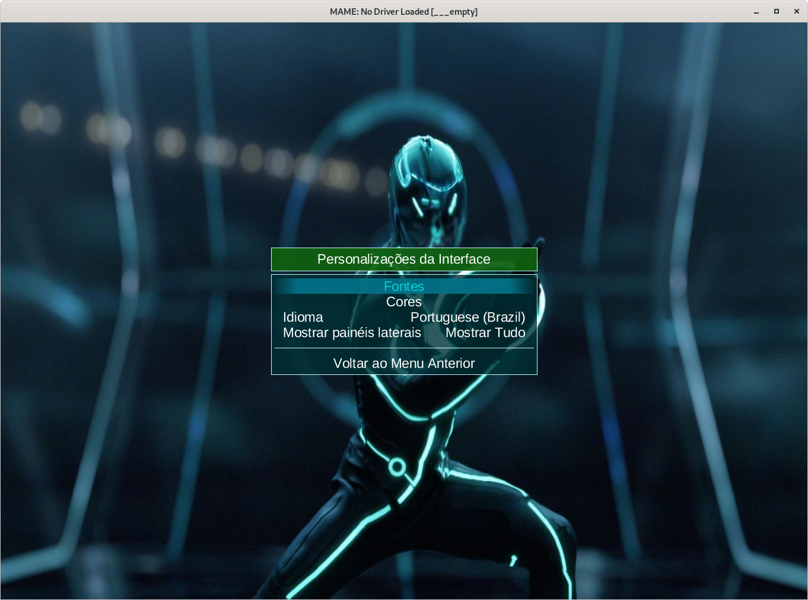
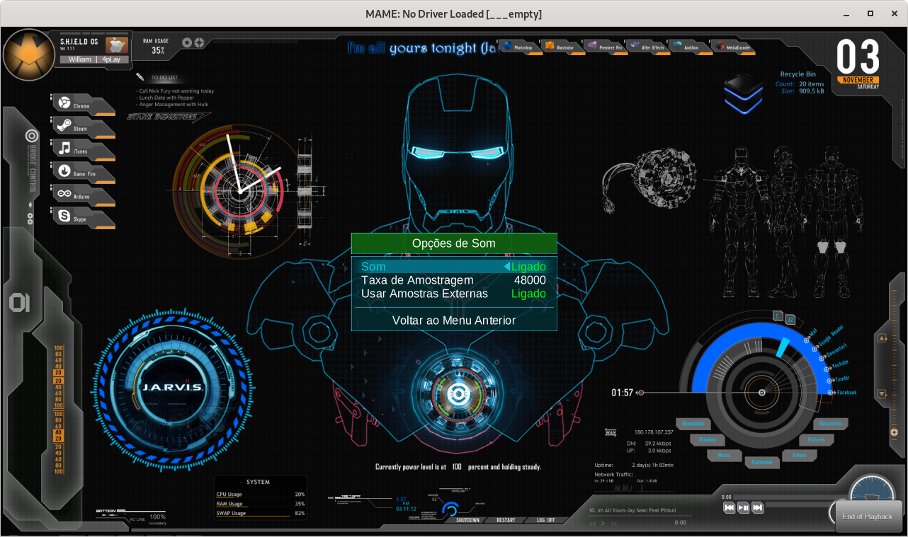

.. raw:: latex

	\clearpage

.. _advanced-tricks:

Truques para tornar a vida mais fácil
=====================================

.. contents:: :local:

.. _advanced-tricks-botões-ordem:

Configurando a ordem dos botões
~~~~~~~~~~~~~~~~~~~~~~~~~~~~~~~

O MAME por predefinição já assume uma ordem para os botões de um
controle, porém nem sempre essa ordem estará na ordem dos botões
originais de um determinado sistema, sendo necessário a configuração
manual, os exemplos a seguir mostram como alterar essa ordem.

Veja :ref:`Alterando os valores <mamemenu-alt-valores>` antes de
prosseguir.

O processo é muito simples, inicie uma máquina qualquer como
``mame64 galaxian``, depois que a máquina iniciar pressione **TAB** e
selecione **Entrada (esta máquina)**, no campo **P1 BUTTON 1**
(primeiro botão de disparo/tiro do jogador 1) e defina o botão de tiro,
pressione **TAB** novamente para fechar a interface.

Depois de confirmar o funcionamento do botão, pressione **ESQ** para
encerrar a emulação e criar um arquivo ``galaxian.cfg`` no diretório
**cfg**.

.. raw:: latex

	\clearpage

.. _advanced-tricks-mais-de-um-botão:

Configurando mais de um botão
~~~~~~~~~~~~~~~~~~~~~~~~~~~~~

Usando um controle de **Playstation 2** (ou qualquer outro tipo de
controle) ligado no PC com um adaptador USB como exemplo, faremos uma
configuração de botões para máquinas **Neo-Geo** executando o comando
``mame64 kof2000``, pressione **TAB**, depois selecione **Entrada (esta
máquina)** e configure os botões com a ordem de sua preferência.

Dentro do diretório **cfg** será criado um arquivo chamado
``kof2000.cfg``, abra ele em um editor de texto qualquer, no topo do
arquivo modifique o ``<system name=kof2000>`` para
``<system name=default>`` e salve este arquivo no diretório **ctrlr**
como ``neogeo.cfg``. No nosso exemplo a ordem dos botões ficou assim, o
**quadrado** é **soco fraco**, o **triângulo** é **soco forte**, o
**xis** é **chute fraco** e o **círculo** é **chute forte**:

Baixe uma cópia deste arquivo no link ao lado https://pastebin.com/9Xp97xcd

.. code-block:: xml

	
    <?xml version="1.0"?>
    <!-- This file is autogenerated; comments and unknown tags will be stripped -->
    <mameconfig version="10">
    <system name="default">
        <input>
            <port tag=":edge:joy:JOY1" type="P1_BUTTON1" mask="16" defvalue="16">
                <newseq type="standard">
                    JOYCODE_1_BUTTON4
                </newseq>
            </port>
            <port tag=":edge:joy:JOY1" type="P1_BUTTON2" mask="32" defvalue="32">
                <newseq type="standard">
                    JOYCODE_1_BUTTON3
                </newseq>
            </port>
            <port tag=":edge:joy:JOY1" type="P1_BUTTON3" mask="64" defvalue="64">
                <newseq type="standard">
                    JOYCODE_1_BUTTON1
                </newseq>
            </port>
            <port tag=":edge:joy:JOY1" type="P1_BUTTON4" mask="128" defvalue="128">
                <newseq type="standard">
                    JOYCODE_1_BUTTON2
                </newseq>
            </port>
        </input>
      </system>
    </mameconfig>

Agora sempre que quiser usar essa configuração para os botões, basta
usar a opção :ref:`-ctrlr <mame-commandline-ctrlrpath>`, exemplo
``mame64 kof200 -ctrlr neogeo``, você pode também adicionar essa opção
ao seu **mame.ini** porém note que, essa configuração será aplicada em
todas as máquinas!

Para aplicar essa configuração apenas nas máquinas **Neo-Geo**, veja o
capítulo de :ref:`Configuração individual por sistema
<advanced-tricks-configuração-individual>`.

.. _advanced-tricks-botões-combinação:

Combinação dos botões
~~~~~~~~~~~~~~~~~~~~~

O personagem Zangief do **Street Fighter II** possui um golpe chamado
`Double Lariat <https://streetfighter.fandom.com/wiki/Double_Lariat>`_
que é ativado ao se pressionar os três botões de soco ao
**mesmo tempo**, é possível criar um arquivo de configuração para que
essa ação aconteça ao toque de um botão apenas.

Inicie o MAME com qualquer jogo da série ``mame64 sf2``, pressione
**TAB**, depois selecione **Entrada (esta máquina)**, ao configurar os
botões para os três socos, pressione **Delete** para apagar o valor,
logo depois escolha o botão que deseja ser soco fraco, pressione
**Enter** e escolha quase será o seu botão de **três socos**. Caso
tenha feito tudo certo, deverá aparecer algo como **Joy 1 button 0 or
Joy 1 button 1**, é muito importante aparecer o **OR** entre os botões.

Usando o mesmo controle de **Playstation 2** a ordem dos botões ficou
dessa forma, o **quadrado** é **soco fraco**, o **triângulo** é **soco
forte**, o **Xis** é **chute médio**, o **círculo** é **chute forte**, o
**L1** é **soco médio**, o **R1** é **chute fraco** e o botão **L2**
identificado como **JOYCODE_1_BUTTON5** faz o papel dos **três botões de
soco**:

Baixe uma cópia deste arquivo no link ao lado https://pastebin.com/p6dB9DMy

.. code-block:: xml

	
    <?xml version="1.0"?>
    <mameconfig version="10">
    <system name="default">
        <input>
            <port tag=":IN1" type="P1_BUTTON1" mask="16" defvalue="16">
                <newseq type="standard">
                    JOYCODE_1_BUTTON4 OR JOYCODE_1_BUTTON5
                </newseq>
            </port>
            <port tag=":IN1" type="P1_BUTTON2" mask="32" defvalue="32">
                <newseq type="standard">
                    JOYCODE_1_BUTTON7 OR JOYCODE_1_BUTTON5
                </newseq>
            </port>
            <port tag=":IN1" type="P1_BUTTON3" mask="64" defvalue="64">
                <newseq type="standard">
                    JOYCODE_1_BUTTON1 OR JOYCODE_1_BUTTON5
                </newseq>
            </port>
            <port tag=":IN2" type="P1_BUTTON4" mask="1" defvalue="1">
                <newseq type="standard">
                    JOYCODE_1_BUTTON8
                </newseq>
            </port>
            <port tag=":IN2" type="P1_BUTTON5" mask="2" defvalue="2">
                <newseq type="standard">
                    JOYCODE_1_BUTTON3
                </newseq>
            </port>
            <port tag=":IN2" type="P1_BUTTON6" mask="4" defvalue="4">
                <newseq type="standard">
                    JOYCODE_1_BUTTON2
                </newseq>
            </port>
        </input>
    </system>
    </mameconfig>

Uma nota quanto a configuração acima, ela foi feita no Linux (SDL) e
pode ser que no Windows a definição para o botão **L1** seja alternada
para o botão **L2**, porém basta redefini-lo no Windows ou alterná-lo
para um outro botão qualquer depois.

O mesmo tipo de configuração também se aplica para qualquer máquina,
cito por exemplo as máquinas rítmicas da série **Guitar Freaks**,
**Dance Dance Revolution**, **Beatmania** e tantas outras que em alguns
momentos, necessitam que mais de um botão seja acionado ao mesmo tempo.

Baixe um exemplo de configuração de controle para `Guitar Freaks
<https://pastebin.com/g1iXAB1E>`_ e `Dance Dance Revolution
<https://pastebin.com/rSc4kd5u>`_.

.. _advanced-tricks-controle1-qualquer-jogador:

Usando o controle 1 para controlar qualquer outro jogador
~~~~~~~~~~~~~~~~~~~~~~~~~~~~~~~~~~~~~~~~~~~~~~~~~~~~~~~~~

Em máquinas onde a posição do jogador é fixa como em **Sunset Riders**,
a série **Muscle Bomber**, **Teenage Mutant Ninja Turtles**, **Teenage
Mutant Ninja Turtles - Turtles in Time** e tantas outras máquinas, é
possível utilizar o controle do jogador 1 em qualquer uma das posições
com máquinas que aceitem 2 ou mais jogadores.

Inicie a máquina que deseja configurar e siga as instruções descritas no
capítulo :ref:`advanced-tricks-mais-de-um-botão` para gerar o seu
arquivo com a configuração personalizada para o seu controle. Abra o
arquivo em um editor de textos e logo no começo haverá algo do tipo
(pode variar dependendo do seu controle):

.. code-block:: xml

	
    <port tag=":P1" type="P1_JOYSTICK_LEFT" mask="1" defvalue="1">

O que nos interessa são todas as partes que definem os comando para
**P1**, no seu editor de texto pressione **CTRL+H** ou o comando usado
para substituir texto e substitua **P1** por **P2** ficando assim:

.. code-block:: xml

	
    <port tag=":P2" type="P2_JOYSTICK_LEFT" mask="1" defvalue="1">

Salve este arquivo como `2P.cfg` para ser usado como jogador 2, faça o
mesmo para o jogador 3 e 4. Não foi disponibilizado aqui todas as linhas
que foram substituídas, porém, veja como fica a configuração completa
para `2P.cfg <https://pastebin.com/tSkGwMgi>`_,
`3P.cfg <https://pastebin.com/WzfRW3Zm>`_ e
`4P.cfg <https://pastebin.com/BbdTyQ3L>`_. Não custa lembrar que todos
estes arquivos devem ficar armazenados dentro do diretório **ctrlr**.

Em sistemas Linux por exemplo a diferença entre maiúsculas e minúsculas
são levadas em consideração, caso salve estes arquivos com **P**
maiúsculo, faça o mesmo ao informar o nome da configuração, caso
contrário o MAME acusará um erro dizendo que os arquivos não foram
encontrados.

Para jogar com o **Donatello** (jogador 3) na máquina **Teenage
Mutant Ninja Turtles - Turtles in Time** faça o comando: ::

	mame64 tmnt2 -ctrlr 3P

Para inserir o crédito para o jogador 3 (Coin 3) pressione **7**, a
partida deve iniciar com o **Donatello** ao clicar em qualquer um dos
botões do controle, abaixo tem uma colinha para facilitar, para ver a
listagem completa consulte o capítulo :ref:`mamemenu`.

.. tabularcolumns:: |l|c|c|c|c|

.. list-table:: Colinha básica.
   :header-rows: 1

   * - Descrição
     - Jogador 1
     - Jogador 2
     - Jogador 3
     - Jogador 4
   * - **Crédito**
     - 5
     - 6
     - 7
     - 8
   * - **Início da Partida**
     - 1
     - 2
     - 3
     - 4

Repare que há máquinas como as da série **Muscle Bomber** por exemplo, é
necessário pressionar os botões relacionados ao inicio da partida de
cada jogador e não apenas pressionar os botões do controle para iniciar
a partida.

.. raw:: latex

	\clearpage

.. _advanced-tricks-configuração-individual:

Criando uma configuração customizada para cada sistema
~~~~~~~~~~~~~~~~~~~~~~~~~~~~~~~~~~~~~~~~~~~~~~~~~~~~~~

No diretório **ini** crie um diretório chamado **source** e dentro dele
crie um arquivo chamado ``neogeo.ini``. Neste arquivo nós configuraremos
os seguintes parâmetros:

*	Que a Bios seja a **UniBios v 3.3**
*	Que a minha configuração de controle chamada **neogeo**.
	seja sempre carregada.
*	Que o áudio tenha uma taxa de amostragem com **32000 Hz** [#]_
*	O filtro esteja ativo.
*	O prescale seja maior que **1**.
*	Que a proporção de tela seja mantida.

Assim temos as seguintes opções para o nosso ``neogeo.ini``:

.. code-block:: kconfig

	bios                      unibios33
	ctrlr                     neogeo
	samplerate                32000
	filter                    1
	prescale                  2
	keepaspect                1

Agora sempre que qualquer máquina **Neo-Geo** for iniciada ela sempre
usará estas configurações, todas as outras máquinas não relacionadas
com **Neo-Geo** usarão as configurações predefinidas pelo MAME sem haver
conflitos de configuração, assim como, não será mais necessário
especificar todas essas opções na linha de comando.

.. _advanced-tricks-configuração-controle-por-maquina:

Criando uma configuração de controle por máquina
~~~~~~~~~~~~~~~~~~~~~~~~~~~~~~~~~~~~~~~~~~~~~~~~

No exemplo de :ref:`configuração de botões
<advanced-tricks-mais-de-um-botão>` aprendemos como mapear os botões
de um controle para um determinado sistema, no entanto, um sistema pode
ter máquinas com diferentes configurações de botões, se pegarmos o
sistema CPS1 por exemplo, o jogo **Street Fighter II** utiliza 6 botões
já o jogo **Final Fight** utiliza apenas 2 e ambos compartilham o mesmo
sistema CPS1. Apesar da dica ter facilitado bastante a configuração do
controle para máquinas que usam 6 botões, ela não irá funcionar com
todas as outras.

Para criar um mapa customizado para **Final Fight** por exemplo, siga as
instruções descritas em :ref:`advanced-tricks-mais-de-um-botão`, porém
usando a máquina **Final Fight** (``mame64 ffight``), uma vez que os
botões forem definidos e você sair do MAME, encontre o arquivo
**ffight.cfg** no diretório **cfg** e faça as alterações necessárias.
Copie-o para o diretório **ctrlr** como **ffight.cfg**. Entre no
diretório **ini** e crie um arquivo chamado **ffight.ini**, abra-o em um
editor de texto e adicione: ::

	ctrlr ffight

Salve e saia do editor, agora sempre que a máquina **Final Fight** for
iniciada ela usará o novo mapa de botões que foi criado só para ela.

Repare que não é necessário que o arquivo de configuração tenha o mesmo
nome da máquina, é possível renomear estes arquivos como por exemplo,
**2-botoes.cfg**, **3-botoes.cfg**, **4-botoes.cfg** e compartilhar
estas configurações conforme necessário.

.. _advanced-tricks-dat-sistema:

Gerando arquivos DAT para diferentes gerenciadores de ROMs
~~~~~~~~~~~~~~~~~~~~~~~~~~~~~~~~~~~~~~~~~~~~~~~~~~~~~~~~~~

Arquivos DAT são usados por gerenciadores de ROMs como
`RomCenter (Windows) <http://romcenter.com/>`_,
`RomVault (Linux e Windows) <http://www.romvault.com/>`_,
`Romulus (Windows) <https://romulus.cc>`_,
`Clrmamepro (Windows) <http://mamedev.emulab.it/clrmamepro/>`_,
`Clrmamepro (Mac) <http://www.emulab.it/>`_ dentre outros que aferem a
validade de cada arquivo existente dentro de um arquivo ROM
identificando o CRC e SHA1 de cada um, dentre outras funções.

Execute o MAME com o comando: ::

	mame64 -listxml >mame.xml

Baixe o `DatUtil <http://www.logiqx.com/Tools/DatUtil/>`_, extraia-o no
mesmo diretório do MAME e execute o comando: ::

	datutil mame.xml

Será criado o arquivo ``datutil.dat``.

Criando arquivos DAT separados por sistema
~~~~~~~~~~~~~~~~~~~~~~~~~~~~~~~~~~~~~~~~~~

Para criar um DAT para o sistema CPS1 (**cps1.dat**) compatível com o
**Clrmamepro** faça o comando: ::

	datutil.exe -G cps1.cpp -o cps1.dat -f cmp datutil.dat

Para o sistema CPS2: ::

	datutil.exe -G cps2.cpp -o cps2.dat -f cmp datutil.dat

Para o sistema Neo-Geo: ::

	datutil.exe -G neogeo.cpp -o neogeo.dat -f cmp datutil.dat

Para uma lista de Neo-Geo sem clones: ::

	datutil.exe -G neogeo.cpp -o neogeo.dat -r -f cmp datutil.dat

E assim por diante, para criar um DAT em formato **RomCenter** troque o
``cmp`` por ``rc``, para **RomCenter 2** use ``rc2`` e para criar um
arquivo XML genérico aceito pelos outros gerenciadores use ``gx`` ou
``generic``. Para mais informações sobre outros formatos leia o arquivo
**Readme.txt** que acompanha o DatUtil, para ver alguns outros exemplos
práticos do uso do DatUtil acesse `este link
<https://forum.recalbox.com/topic/4537/tutorial-datutil>`_.

Estes mesmos arquivos ``neogeo.dat``, ``cps2.dat`` e qualquer outro que
for criado poderá ser utilizado pelos gerenciadores de ROMs para
construir um ROM SET para cada um destes sistemas. É uma maneira muito
mais fácil de se separar as ROMs do que ter que fazer e
:ref:`usar scripts <arma-separando-roms>`. No entanto, apesar de ser
mais fácil utilizar um gerenciador, repare que é bem genérico. O uso de
scripts permitem que a separação seja bem mais específica caso seja
necessário.

.. raw:: latex

	\clearpage

.. _advanced-tricks-criando-romset:

Criando um ROMSET apenas com máquinas tipo Arcade
~~~~~~~~~~~~~~~~~~~~~~~~~~~~~~~~~~~~~~~~~~~~~~~~~

Umas das maneiras de se criar tal ROMSET é baixando o código fonte e
compilando o MAME com a opção ``SUBTARGET=arcade``, isso fará com que o
MAME funcione e exiba apenas uma lista com máquinas classificadas
internamente como arcade, simples assim. Para mais informações leia o
capítulo :ref:`compiling-MAME`.

.. _advanced-tricks-using-mame-interface:

Usando a interface
------------------

Para aqueles que não estão familiarizados(as) com o processo de
compilação, só utilizam a versão oficial do MAME e que também não
tenham interesse em montar todo um ambiente de desenvolvimento só para
isso, é possível criar essa lista através da interface do MAME, o que
facilita muito a nossa vida.

* Faça o download da última versão do arquivo category.ini no site
  `Progetto-Snaps <http://www.progettosnaps.net/renameset/>`_ e extraia
  o diretório **folders** dentro do diretório do MAME.
* Inicie o MAME, no lado esquerdo da interface selecione **Categoria**,
  em **Arquivo** escolha **Working Arcade Clean.ini**, em **Incluir
  Clones** escolha **Não** e clique em **Voltar ao Menu Anterior**.
* No topo da interface, clique com o mouse no ícone do disquete para
  exportar a lista e escolha **Exportar lista em formato XML
  (igual -listxml)**, depois de alguns segundos será gerado um arquivo
  **exported.xml** dentro do diretório **ui**.
* Assim como foi explicado no :ref:`capítulo anterior <advanced-tricks-dat-sistema>`,
  é possível usar o DatUtil para transformar o arquivo XML em um arquivo
  DAT compatível com um dos gerenciadores listados no capítulo anterior
  ou utilizar diretamente o arquivo XML nos gerenciadores que
  não dependam de um arquivo DAT.
* Convertendo ou não o arquivo XML em DAT, use o seu gerenciador
  preferido para **reconstruir (Rebuild)** as ROMs, usando o diretório
  onde as suas ROMs se encontram e com o destino o diretório onde deseja
  ter somente as ROMs de arcade.

.. raw:: latex

	\clearpage

.. _advanced-tricks-using-clrmamepro:

Usando o Clrmamepro
-------------------

O **Clrmamepro** é apenas um dos diversos programas disponíveis para
gerenciar as suas ROMs, o exemplo abaixo mostra como usar o arquivo XML
gerado no passo anterior para **reconstruir (Rebuild)** o seu ROMSET
apenas com ROMs arcade.

* Baixe e instale o `Clrmamepro <https://mamedev.emulab.it/clrmamepro/>`_
  é importante saber em qual diretório ele foi instalado!
* Renomeie o arquivo **exported.xml** que está dentro do diretório
  **ui** para **arcade-clean.xml** assim é possível ter um controle do
  arquivo que está sendo carregado.
* Localize o diretório onde o Clrmamepro foi instalado e copie o arquivo
  **arcade-clean.xml** para dentro do diretório **datfiles**.
* Rode o Clrmamepro no campo direito onde diz **Profile** deve estar
  vazio.

.. figure:: images/Clrmamepro-add-dat.png
	:width: 300
	:align: center
	:figclass: align-center
	:alt: Add DatFile

* Clique em **Add DatFile...** e selecione o arquivo
  **arcade-clean.xml**, na próxima tela apenas clique em OK.
* Clique em **Load / Update**, na próxima tela selecione **Default**.

.. figure:: images/Clrmamepro-load.png
	:width: 300
	:align: center
	:figclass: align-center
	:alt: Load Update

* Durante a leitura deve aparecer alguns erros do tipo **DatFile
  Problem**, apenas clique em **OK TO ALL**.
* Ao concluir clique no ícone **Rebuilder**.

.. figure:: images/Clrmamepro-rebuilder.png
	:width: 250
	:align: center
	:figclass: align-center
	:alt: rebuilder

.. raw:: latex

	\clearpage

* Sem alterar nenhuma das opções, vá em **Source** e selecione o
  diretório onde se encontram todas as suas ROMs. Em **Destination**
  selecione o diretório de destino onde será criada a sua nova ROMSET.

.. figure:: images/Clrmamepro-rebuilder-screen.png
	:width: 300
	:align: center
	:figclass: align-center
	:alt: rebuilder screen

* **ATENÇÃO! Não escolha o mesmo diretório de origem**, escolha um
  diretório completamente diferente e se possível que seja em outro HDD,
  cartão de memória, pen-drive, etc!
* Clique em **Rebuild...** para iniciar e aguarde pois dependendo da
  quantidade de arquivos todo o processo será demorado.

Ao final do processo você terá um ROMSET apenas com as ROMs das máquinas arcades,
o mesmo pode ser feito para qualquer outro sistema, Mega Drive/Genesis, SNES,
o céu é o limite!

.. _advanced-tricks-using-scripts:

Usando Scripts
--------------

Uma outra maneira para obter o mesmo resultado é através da utilização
de pequenos scripts usando a linha de comandos, apesar de ser um
processo mais manual e um pouco trabalhoso, o processo acaba sendo mais
poderoso pois permite que a filtragem e a seleção dos arquivos possa ser
mais refinada e podendo ser utilizada em qualquer sistema operacional e
não algo exclusivo do Windows apenas.

* Faça o download da última versão do arquivo category.ini no site
  `Progetto-Snaps <http://www.progettosnaps.net/renameset/>`_
* Abra e extraia apenas o arquivo **Working Arcade.ini**
* Apague tudo e deixe apenas o que estiver depois de ``[ROOT_FOLDER]``
* Salve este arquivo modificado como **arcade.txt**

.. _advanced-tricks-command-windows:

Usando a linha de comando no Windows
------------------------------------

Abra o prompt de comando no mesmo diretório onde se encontra o arquivo
``arcade.txt`` defina o caminho completo para onde deseja copiar os
arquivos: ::

	set DST=H:\arcade-roms

Seguido do comando abaixo: ::

	for /F %f in ('type arcade.txt') do @echo G:\roms\%f.zip >> caminho-roms.txt

O comando acima vai ler todos os nomes das máquinas em ``arcade.txt``,
incluir o caminho completo onde estão armazenadas as suas ROMs,
adicionar o nome da máquina + a extensão .zip e por fim redirecionar a
saída para o arquivo ``caminho-roms.txt``.

.. raw:: latex

	\clearpage

Execute o comando abaixo para realizar a cópia dos arquivos com base na
lista que acabamos de criar: ::

	for /F %f in ('type caminho-roms.txt') do copy %f %DST%

Assim como no comando acima, o arquivo ``caminho-roms.txt`` será lido e
posteriormente irá alimentar o comando ``copy`` com o devido caminho e
o destino ``H:\arcade-roms``.

.. _advanced-tricks-others:

Usando o terminal no Linux, macOS e \*NIX em geral
--------------------------------------------------

Como descrito acima, abra o terminal no mesmo diretório onde se encontra
o arquivo ``arcade.txt`` e defina o diretório de destino: ::

	export DST=/mnt/usb/arcade-roms

É necessário converter o formato do arquivo de Windows (quebra de linha
**CRLF**) para um formato compatível com \*nix (quebra de linha
**LF**), caso contrário a lista ficará toda bagunçada: ::

	sed -i 's/\r//g' arcade.txt

Execute o comando abaixo para gerar o arquivo ``caminho-roms.txt`` onde
**/home/mame/roms** é o caminho completo onde as ROMs estão
armazenadas: ::

	for f in $(< arcade.txt); do echo /home/mame/roms/"$f".zip; done > caminho-roms.txt

Execute o comando abaixo para fazer a cópia dos arquivos: ::

	for f in $(< caminho-roms.txt); do cp "$f" "$DST"; done

.. _advanced-tricks-powershell-redirect:

Resolvendo o redirecionamento do MAME com PowerShell da Microsoft #5694
~~~~~~~~~~~~~~~~~~~~~~~~~~~~~~~~~~~~~~~~~~~~~~~~~~~~~~~~~~~~~~~~~~~~~~~

Ao redirecionar a saída do MAME com o comando :ref:`-listxml / -lx
<mame-commandline-listxml>` usando o PowerShell da Microsoft, a saída
tem o dobro de tamanho se comparado com a saída do mesmo comando ao se
utilizar o terminal do Linux, macOS ou o comando prompt do Windows. [#]_

Segundo mostra `este artigo
<https://devblogs.microsoft.com/powershell/outputencoding-to-the-rescue/>`_
hospedado em um blog de desenvolvimento da Microsoft, a codificação
predefinida do PowerShell não é UTF-8, originalmente ele vem
como `us-ascii <https://en.wikipedia.org/wiki/Code_page_20127>`_:

.. code-block:: kconfig

	$OutputEncoding
	
	IsSingleByte      : True
	BodyName          : us-ascii
	EncodingName      : US-ASCII
	HeaderName        : us-ascii
	WebName           : us-ascii
	WindowsCodePage   : 1252
	IsBrowserDisplay  : False
	IsBrowserSave     : False
	IsMailNewsDisplay : True
	IsMailNewsSave    : True
	EncoderFallback   : System.Text.EncoderReplacementFallback
	DecoderFallback   : System.Text.DecoderReplacementFallback
	IsReadOnly        : True
	CodePage          : 20127

.. raw:: latex

	\clearpage

Ao fazer o redirecionamento, a saída é codificada para
`iso-10646-ucs-2 BOM <https://en.wikipedia.org/wiki/ISO_10646>`_, isso
faz com que cada caractere comum seja armazenado com 2 bytes. Geralmente
o UTF-8 por exemplo utiliza de 1 a 4 bytes para caracteres
`diacríticos <https://pt.wikipedia.org/wiki/Diacrítico>`_, assim como
caracteres Cirílico, Grego, etc.

Para arrumar apenas o redirecionamento ``>`` ou ``>>`` faça o comando no
terminal do PowerShell:

.. code-block:: kconfig

	$PSDefaultParameterValues['Out-File:Encoding'] = 'utf8'

Para mudar a codificação de todo o terminal, faça o comando:

.. code-block:: kconfig

	$OutputEncoding = [Console]::OutputEncoding = [Text.UTF8Encoding]::UTF8

Um exemplo de como agora fica a codificação do terminal:

.. code-block:: kconfig

	$OutputEncoding
	
	BodyName          : utf-8
	EncodingName      : Unicode (UTF-8)
	HeaderName        : utf-8
	WebName           : utf-8
	WindowsCodePage   : 1200
	IsBrowserDisplay  : True
	IsBrowserSave     : True
	IsMailNewsDisplay : True
	IsMailNewsSave    : True
	IsSingleByte      : False
	EncoderFallback   : System.Text.EncoderReplacementFallback
	DecoderFallback   : System.Text.DecoderReplacementFallback
	IsReadOnly        : True
	CodePage          : 65001

Qualquer uma das opções funcionam, não é necessário usar as duas. Para
mais informações `veja este post
<https://devblogs.microsoft.com/scripting/understanding-the-six-powershell-profiles/>`_
para saber localizar os perfis do PowerShell no Windows e alternar estes
valores para que fiquem permanentes ou que sejam executados sempre que
uma seção do PowerShell seja iniciada.

.. raw:: latex

	\clearpage

.. _advanced-tricks-drummania:

Resolvendo o problema "please call attendant" das máquinas DrumMania
~~~~~~~~~~~~~~~~~~~~~~~~~~~~~~~~~~~~~~~~~~~~~~~~~~~~~~~~~~~~~~~~~~~~

As máquinas **DruMania 4th Mix** em diante não iniciam e param em uma
tela de erro como mostra a imagem abaixo:

.. figure:: images/drummania-attendant.png
	:width: 400
	:align: center
	:figclass: align-center
	:alt: Mensagem de erro

Existem duas maneiras de resolver o problema, aplicando um patch na
imagem o que altera a sua integridade ou usando um **cheat**. Crie os
arquivos abaixo dentro do diretório **cheat**, estes arquivos não são de
minha autoria e desconheço o autor original, caso alguém conheça, entre
em contato que o devido crédito será dado.

**drmn4m.xml**

.. code-block:: xml

	<mamecheat version="1">
		<cheat desc="Please Call Attendant Fix">
			
		</cheat>
	</mamecheat>

https://pastebin.com/JyaTSr4c

**drmn5m.xml**

.. code-block:: xml

	<mamecheat version="1">
		<cheat desc="Please Call Attendant Fix">
			
		</cheat>
	</mamecheat>

https://pastebin.com/dTQMeJB1

.. raw:: latex

	\clearpage

**drmn6m.xml**

.. code-block:: xml

	<mamecheat version="1">
		<cheat desc="Please Call Attendant Fix">
			
		</cheat>
	</mamecheat>

https://pastebin.com/tRAFhfaS

**drmn7m.xml**

.. code-block:: xml

	<mamecheat version="1">
		<cheat desc="Please Call Attendant Fix">
			
		</cheat>
	</mamecheat>

https://pastebin.com/LtMyNZ7i

**drmn7ma.xml**

.. code-block:: xml

	<mamecheat version="1">
		<cheat desc="Please Call Attendant Fix">
			
		</cheat>
	</mamecheat>

https://pastebin.com/MyX6scPk

**drmn8m.xml**

.. code-block:: xml

	<mamecheat version="1">
		<cheat desc="Please Call Attendant Fix">
			
		</cheat>
	</mamecheat>

https://pastebin.com/LGTnUd4Y

.. raw:: latex

	\clearpage

**drmn9m.xml**

.. code-block:: xml

	<mamecheat version="1">
		<cheat desc="Please Call Attendant Fix">
			
		</cheat>
	</mamecheat>

https://pastebin.com/at99MLqz

**drmn10m.xml**

.. code-block:: xml

	<mamecheat version="1">
		<cheat desc="Please Call Attendant Fix">
			
		</cheat>
	</mamecheat>

https://pastebin.com/EaJes6Eh

.. raw:: latex

	\clearpage

.. _advanced-tricks-imagem-fundo:

Usando uma imagem de fundo no MAME
~~~~~~~~~~~~~~~~~~~~~~~~~~~~~~~~~~

É possível utilizar uma imagem de fundo no MAME que é exibida na
interface como um papel de parede e somado com a opção de customização é
possível dar uma aparência toda sua na interface. Escolha a imagem que
deseja usar em formato .jpg ou .png e renomeie o arquivo para
**background.jpg** ou **background.png**, cuidado para não usar imagens
muito pesadas, prefira o formato **.jpg**.

Eu usei um fundo do filme `Tron
<https://i.postimg.cc/4yGFp8Kg/background.jpg>`_ que baixei de um site
de wallpaper qualquer na internet.

.. raw:: latex

	\clearpage

Lembrando que todo o fundo é um papel de parede, tirando as opções do
MAME nada na tela do Iron Man é funcional. Para as cores eu estou
utilizando as configurações abaixo: ::

	# UI OPTIONS
	#
	infos_text_size           0.700000
	font_rows                 37
	hide_main_panel           0
	ui_border_color           ffb7e7eb
	ui_bg_color               c8022f35
	ui_clone_color            ff808080
	ui_dipsw_color            ff03d2d8
	ui_gfxviewer_color        ef101030
	ui_mousedown_bg_color     9470b3d0
	ui_mousedown_color        fffa26ec
	ui_mouseover_bg_color     70276e84
	ui_mouseover_color        ff25b9a9
	ui_selected_bg_color      ef047289
	ui_selected_color         ff03d2d8
	ui_slider_color           ffffffff
	ui_subitem_color          ffffffff
	ui_text_bg_color          ef000000
	ui_text_color             ffffffff
	ui_unavail_color          ff404040

Na tela do Iron Man a única diferença é a cor da borda: ::

	ui_border_color           ff076f85

Salve estas opções no seu **ui.ini**. Caso queira brincar com as cores,
eu gosto do site `Hex Colors Tools <https://www.hexcolortool.com/>`_.
No site é possível você entrar com o valor de cores em hex (#000000) e
ela oferece a possibilidade de variar a cor para mais claro ou mais
escuro em intervalos de 10% ou um outro valor qualquer.

Já para a combinação das cores é necessário saber sobre cores primárias,
cores frias, quentes, monocromáticas, análogas, saber como utilizar o
círculo cromático (dentre outras ferramentas) etc. Um tópico desta
natureza daria um livro (ou mais de um livro) só sobre o assunto, logo
este tópico não é coberto por este documento, no entanto, deixo algumas
sugestões de leitura como `combinando cores 1
<https://www.treinaweb.com.br/blog/voce-sabe-como-combinar-cores>`_,
`combinando cores 2 <https://www.publicitarioscriativos.com/descubra-de-uma-vez-por-todas-como-utilizar-o-circulo-cromatico/>`_,
`combinando cores 3 <https://www.canva.com/colors/color-wheel/>`_, isso
sem falar nas centenas de milhares de vídeos no YouTube sobre o assunto.

Já em termos de ferramentas eu gosto bastante da `Paletton
<https://paletton.com>`_ e a `Adobe
<https://color.adobe.com/pt/create/color-wheel>`_.

Infelizmente a customização das cores da interface do MAME é muito
limitada pois alguma cores são fixas como o verde que fica no título das
janelas ou o texto verde das opções que estão ligadas, aquele azul da
seleção das ROMs, etc.

.. [#]	De acordo com `este post
		<https://vgmrips.net/forum/viewtopic.php?f=3&t=155>`_ o YM2610
		trabalha com uma taxa de amostragem de 18.5 kHz (18500 Hz), logo
		a configuração de 22050 Hz até 32000 Hz deva ser suficiente uma
		vez que a taxa de amostragem de áudio do MAME é predefinida em
		48 kHz ou 48000 Hz e essa alta taxa de amostragem não traz
		nenhum benefício para a emulação como já foi descrito em
		:ref:`-samplerate <mame-commandline-samplerate>`.
.. [#]	#5694 https://github.com/mamedev/mame/issues/5694
