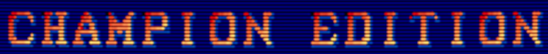
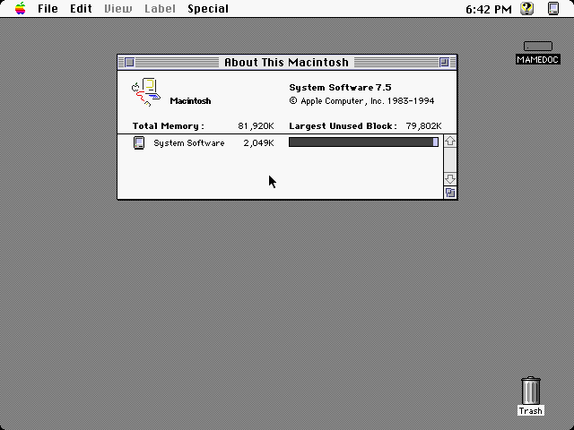

.. raw:: latex

	\clearpage

.. _advanced-tricks:

Truques para tornar a vida mais fácil
=====================================

.. contents:: :local:

.. raw:: latex

	\clearpage

.. _advanced-tricks-botões-ordem:

Configurando a ordem dos botões
~~~~~~~~~~~~~~~~~~~~~~~~~~~~~~~

O MAME por predefinição já assume uma ordem para os botões de um
controle, porém nem sempre essa ordem estará na ordem dos botões
originais de um determinado sistema, sendo necessário a configuração
manual, os exemplos a seguir mostram como alterar essa ordem.

Veja :ref:`Alterando os valores <mamemenu-alt-valores>` antes de
prosseguir.

O processo é muito simples, inicie um sistema qualquer como
``mame galaxian``, depois que o sistema iniciar pressione :kbd:`Tab` e
selecione :guilabel:`Atribuições da entrada (este sistema)`, no campo
:guilabel:`P1 BUTTON 1` (primeiro botão de disparo/tiro do jogador 1) e
defina o botão de tiro, pressione :kbd:`Tab` novamente para fechar a
interface.

Depois de confirmar o funcionamento do botão, pressione :kbd:`Esc` para
encerrar a emulação e criar um arquivo ``galaxian.cfg`` no diretório
**cfg**.

.. raw:: latex

	\clearpage

.. _advanced-tricks-mais-de-um-botão:

Configurando mais de um botão
~~~~~~~~~~~~~~~~~~~~~~~~~~~~~

Usando um controle de **Playstation 2** (ou qualquer outro tipo de
controle) ligado no PC com um adaptador USB como exemplo, faremos uma
configuração dos botões para os sistemas **Neo-Geo** executando o
comando ``mame kof2000``, pressione :kbd:`Tab`, depois selecione
:guilabel:`Atribuições da entrada (este sistema)` e configure os botões com a ordem da
sua preferência.

Dentro do diretório **cfg** será criado um arquivo chamado
``kof2000.cfg``, abra ele num editor de texto qualquer, no topo do
arquivo modifique o ``<system name=kof2000>`` para
``<system name=default>`` e salve este arquivo no diretório **ctrlr**
como ``neogeo.cfg``. No nosso exemplo a ordem dos botões ficou assim, o
**quadrado** é **soco fraco**, o **triângulo** é **soco forte**, o
**xis** é **chute fraco** e o **círculo** é **chute forte**:

Baixe uma cópia deste arquivo no link ao lado
https://pastebin.com/9Xp97xcd

.. code-block:: xml

	
    <?xml version="1.0"?>
    <!-- This file is autogenerated; comments and unknown tags will be stripped -->
    <mameconfig version="10">
    <system name="default">
        <input>
            <port tag=":edge:joy:JOY1" type="P1_BUTTON1" mask="16" defvalue="16">
                <newseq type="standard">
                    JOYCODE_1_BUTTON4
                </newseq>
            </port>
            <port tag=":edge:joy:JOY1" type="P1_BUTTON2" mask="32" defvalue="32">
                <newseq type="standard">
                    JOYCODE_1_BUTTON3
                </newseq>
            </port>
            <port tag=":edge:joy:JOY1" type="P1_BUTTON3" mask="64" defvalue="64">
                <newseq type="standard">
                    JOYCODE_1_BUTTON1
                </newseq>
            </port>
            <port tag=":edge:joy:JOY1" type="P1_BUTTON4" mask="128" defvalue="128">
                <newseq type="standard">
                    JOYCODE_1_BUTTON2
                </newseq>
            </port>
        </input>
      </system>
    </mameconfig>

Agora sempre que quiser usar essa configuração para os botões, basta
usar a opção :ref:`-ctrlr <mame-commandline-ctrlrpath>`, exemplo
``mame kof2003 -ctrlr neogeo``, você pode também adicionar esta opção
ao seu ``mame.ini`` porém note que esta configuração será aplicada em
todos os sistemas!

.. _advanced-tricks-botões-combinação:

Combinando os botões
~~~~~~~~~~~~~~~~~~~~

O personagem Zangief do **Street Fighter II** possui um golpe chamado
`Double Lariat <https://streetfighter.fandom.com/wiki/Double_Lariat>`_
que é ativado ao se pressionar os três botões de soco ao
**mesmo tempo**, é possível criar um arquivo de configuração para que
essa ação aconteça ao toque de um botão apenas.

Inicie o MAME com qualquer jogo da série ``mame sf2``, pressione
:kbd:`Tab`, depois selecione
:guilabel:`Atribuições da entrada (este sistema)`, ao configurar os
botões para os três socos, pressione :kbd:`Del` para apagar o valor,
logo depois escolha o botão que deseja ser soco fraco, pressione
:kbd:`Enter` e escolha quase será o seu botão de **três socos**. Caso
tenha feito tudo certo, deverá aparecer algo como
**Joy 1 button 0 or Joy 1 button 1**, é muito importante aparecer o
**OR** entre os botões.

Usando o mesmo controle de **Playstation 2** a ordem dos botões ficou
dessa forma, o **quadrado** é **soco fraco**, o **triângulo** é **soco
forte**, o **Xis** é **chute médio**, o **círculo** é **chute forte**, o
**L1** é **soco médio**, o **R1** é **chute fraco** e o botão **L2**
identificado como **JOYCODE_1_BUTTON5** faz o papel dos **três botões de
soco**:

Baixe uma cópia deste arquivo no link ao lado
https://pastebin.com/p6dB9DMy

.. code-block:: xml

	
    <?xml version="1.0"?>
    <mameconfig version="10">
    <system name="default">
        <input>
            <port tag=":IN1" type="P1_BUTTON1" mask="16" defvalue="16">
                <newseq type="standard">
                    JOYCODE_1_BUTTON4 OR JOYCODE_1_BUTTON5
                </newseq>
            </port>
            <port tag=":IN1" type="P1_BUTTON2" mask="32" defvalue="32">
                <newseq type="standard">
                    JOYCODE_1_BUTTON7 OR JOYCODE_1_BUTTON5
                </newseq>
            </port>
            <port tag=":IN1" type="P1_BUTTON3" mask="64" defvalue="64">
                <newseq type="standard">
                    JOYCODE_1_BUTTON1 OR JOYCODE_1_BUTTON5
                </newseq>
            </port>
            <port tag=":IN2" type="P1_BUTTON4" mask="1" defvalue="1">
                <newseq type="standard">
                    JOYCODE_1_BUTTON8
                </newseq>
            </port>
            <port tag=":IN2" type="P1_BUTTON5" mask="2" defvalue="2">
                <newseq type="standard">
                    JOYCODE_1_BUTTON3
                </newseq>
            </port>
            <port tag=":IN2" type="P1_BUTTON6" mask="4" defvalue="4">
                <newseq type="standard">
                    JOYCODE_1_BUTTON2
                </newseq>
            </port>
        </input>
    </system>
    </mameconfig>

Uma nota quanto a configuração acima, ela foi feita no Linux (SDL) e
pode ser que no Windows a definição para o botão **L1** seja alternada
para o botão **L2**, porém basta redefini-lo no Windows ou alterná-lo
para um outro botão qualquer depois.

O mesmo tipo de configuração também se aplica para qualquer sistema,
cito por exemplo os sistema rítmicos da série **Guitar Freaks**,
**Dance Dance Revolution**, **Beatmania** e tantas outros onde em alguns
momentos, necessitam que mais de um botão seja acionado ao mesmo tempo.

Baixe um exemplo de configuração de controle para `Guitar Freaks
<https://pastebin.com/g1iXAB1E>`_ e `Dance Dance Revolution
<https://pastebin.com/rSc4kd5u>`_.

.. _advanced-tricks-controle1-qualquer-jogador:

Usando o controle 1 para controlar qualquer outro jogador
~~~~~~~~~~~~~~~~~~~~~~~~~~~~~~~~~~~~~~~~~~~~~~~~~~~~~~~~~

Nos sistemas onde a posição do jogador é fixo como em **Sunset Riders**,
a série **Muscle Bomber**, **Teenage Mutant Ninja Turtles**, **Teenage
Mutant Ninja Turtles - Turtles in Time** e tantas outros sistemas, é
possível utilizar o controle do jogador 1 em qualquer uma das posições
com sistemas que aceitem 2 ou mais jogadores.

Inicie o sistema que deseja configurar e siga as instruções descritas no
capítulo :ref:`advanced-tricks-mais-de-um-botão` para gerar o seu
arquivo com a configuração personalizada para o seu controle. Abra o
arquivo num editor de textos e logo no começo haverá algo do tipo
(pode variar dependendo do seu controle):

.. code-block:: xml

	
    <port tag=":P1" type="P1_JOYSTICK_LEFT" mask="1" defvalue="1">

O que nos interessa são todas as partes que definem os comando para
**P1**, no seu editor de texto pressione :kbd:`CTRL` + :kbd:`H` ou o
comando usado para substituir texto e substitua **P1** por **P2**
ficando assim:

.. code-block:: xml

	
    <port tag=":P2" type="P2_JOYSTICK_LEFT" mask="1" defvalue="1">

Salve este arquivo como ``2P.cfg`` para ser usado como jogador 2, faça o
mesmo para o jogador 3 e 4. Não foi disponibilizado aqui todas as linhas
que foram substituídas, porém, veja como fica a configuração completa
para `2P.cfg <https://pastebin.com/tSkGwMgi>`_,
`3P.cfg <https://pastebin.com/WzfRW3Zm>`_ e
`4P.cfg <https://pastebin.com/BbdTyQ3L>`_. Não custa lembrar que todos
estes arquivos devem ficar armazenados dentro do diretório **ctrlr**.

Em sistemas Linux por exemplo a diferença entre maiúsculas e minúsculas
são levadas em consideração, caso salve estes arquivos com **P**
maiúsculo, faça o mesmo ao informar o nome da configuração, caso
contrário o MAME acusará um erro dizendo que os arquivos não foram
encontrados.

Para jogar com o **Donatello** (jogador 3) no sistema **Teenage
Mutant Ninja Turtles - Turtles in Time** faça o comando::

	mame tmnt2 -ctrlr 3P

Para inserir o crédito para o jogador 3 (Coin 3) pressione
:kbd:`7`, a partida deve iniciar com o **Donatello** ao clicar em
qualquer um dos botões do controle, abaixo tem uma colinha para
facilitar, para ver a listagem completa consulte o capítulo
:ref:`mamemenu`.

.. tabularcolumns:: |l|c|c|c|c|

.. list-table:: Colinha básica.
   :header-rows: 1

   * - Descrição
     - Jogador 1
     - Jogador 2
     - Jogador 3
     - Jogador 4
   * - **Crédito**
     - 5
     - 6
     - 7
     - 8
   * - **Início da Partida**
     - 1
     - 2
     - 3
     - 4

Repare que há sistemas como as da série **Muscle Bomber** por exemplo, é
preciso pressionar os botões relacionados ao inicio da partida de cada
jogador e não apenas pressionar os botões do controle para iniciar a
partida.

.. _advanced-tricks-configuração-controle-por-maquina:

Criando uma configuração de controle por sistema
~~~~~~~~~~~~~~~~~~~~~~~~~~~~~~~~~~~~~~~~~~~~~~~~

No exemplo de :ref:`configuração de botões
<advanced-tricks-mais-de-um-botão>` aprendemos como mapear os botões
de um controle para um determinado sistema, no entanto, um sistema pode
ter sistemas com diferentes configurações de botões, se pegarmos o
driver CPS1 por exemplo, o jogo **Street Fighter II** utiliza 6 botões
já o jogo **Final Fight** utiliza apenas 2 e ambos compartilham o mesmo
driver **CPS1**. Apesar da dica ter facilitado bastante a configuração
do controle para os sistemas que usam 6 botões, ela não irá funcionar
com todos os outros.

Para criar um mapa customizado para **Final Fight** por exemplo, siga as
instruções descritas em :ref:`advanced-tricks-mais-de-um-botão`, porém
usando o sistema **Final Fight** (``mame ffight``), uma vez que os
botões forem definidos e você sair do MAME, encontre o arquivo
``ffight.cfg`` no diretório **cfg** e faça as alterações necessárias.
Copie-o para o diretório **ctrlr** como ``ffight.cfg``. Entre no
diretório **ini** e crie um arquivo chamado ``ffight.ini``, abra-o num
editor de texto e adicione::

	ctrlr ffight

Salve e saia do editor, agora sempre que o sistema **Final Fight** for
iniciado, ele usará o novo mapa de configuração dos botões que foi
criado só para ele.

Repare que não é necessário que o arquivo de configuração tenha o mesmo
nome da sistema, é possível renomear estes arquivos como por exemplo,
``2-botoes.cfg``, ``3-botoes.cfg``, ``4-botoes.cfg`` e compartilhar
estas configurações conforme necessário.

.. _advanced-tricks-dat-sistema:

Gerando arquivos DAT para diferentes gerenciadores de ROMs
~~~~~~~~~~~~~~~~~~~~~~~~~~~~~~~~~~~~~~~~~~~~~~~~~~~~~~~~~~

Arquivos DAT são usados por gerenciadores de ROMs como
`RomCenter (Windows) <http://romcenter.com/>`_,
`RomVault (Linux e Windows) <http://www.romvault.com/>`_,
`Romulus (Windows) <https://romulus.cc>`_,
`Clrmamepro (Windows) <http://mamedev.emulab.it/clrmamepro/>`_,
`Clrmamepro (Mac) <http://www.emulab.it/>`_ dentre outros que aferem a
validade de cada arquivo existente dentro de um arquivo ROM
identificando o CRC e SHA1 de cada um, dentre outras funções.

Execute o MAME com o comando::

	mame -listxml >mame.xml

Baixe o `DatUtil <http://www.logiqx.com/Tools/DatUtil/>`_, extraia-o no
mesmo diretório do MAME e execute o comando::

	datutil mame.xml

Será criado o arquivo ``datutil.dat``.

Criando arquivos DAT separados por sistema
~~~~~~~~~~~~~~~~~~~~~~~~~~~~~~~~~~~~~~~~~~

Para criar um DAT para o sistema CPS1 (**cps1.dat**) compatível com o
**Clrmamepro** faça o comando::

	datutil.exe -G cps1.cpp -o cps1.dat -f cmp datutil.dat

Para o sistema CPS2::

	datutil.exe -G cps2.cpp -o cps2.dat -f cmp datutil.dat

Para o sistema Neo-Geo::

	datutil.exe -G neogeo.cpp -o neogeo.dat -f cmp datutil.dat

Para uma lista de Neo-Geo sem clones::

	datutil.exe -G neogeo.cpp -o neogeo.dat -r -f cmp datutil.dat

.. tip::

	A estrutura interna do MAME para a criação de projetos foi
	modificada depois `desta alteração <https://github.com/mamedev/mame/commit/cf11b3330261aea407a36911048f3835b7a48f31>`_.
	Assim, em vez de usar ``-G neogeo.cpp`` (por exemplo), é preciso
	usar ``neogeo/neogeo.cpp`` para que o ``datutil`` consiga
	identificar e criar o respectivo arquivo dat, caso contrário, ele
	aponta um erro na criação do arquivo. Para identificar a
	nomenclatura correta do driver, utilize a opção
	:ref:`-ls <mame-commandline-listsource>` seguido do nome do sistema,
	para o **Street Fighter II** (``mame -ls sf2``), por exemplo, a
	opção retorna ``capcom/cps1.cpp``. Esta deve ser a opção usada com o
	``datutil`` nas versões mais novas do MAME a partir da versão
	**0.246**.

E assim por diante, para criar um DAT em formato **RomCenter** troque o
``cmp`` por ``rc``, para **RomCenter 2** use ``rc2`` e para criar um
arquivo XML genérico aceito pelos outros gerenciadores use ``gx`` ou
``generic``. Para mais informações sobre outros formatos leia o arquivo
**Readme.txt** que acompanha o DatUtil, para ver alguns outros exemplos
práticos do programa, acesse `este link
<https://forum.recalbox.com/topic/4537/tutorial-datutil>`_.

Estes mesmos arquivos ``neogeo.dat``, ``cps2.dat`` e qualquer outro que
for criado poderá ser utilizado pelos gerenciadores de ROMs para
construir um ROM SET para cada um destes sistemas. É uma maneira muito
mais fácil de se separar as ROMs do que ter que fazer e
:ref:`usar scripts <arma-separando-roms>`. No entanto, apesar de ser
mais fácil utilizar um gerenciador, repare que é bem genérico. O uso de
scripts permitem que a separação seja bem mais específica caso seja
necessário.

.. raw:: latex

	\clearpage

.. _advanced-tricks-criando-romset:

Criando um ROMSET apenas com sistemas tipo Arcade
~~~~~~~~~~~~~~~~~~~~~~~~~~~~~~~~~~~~~~~~~~~~~~~~~

Umas das maneiras de se criar tal ROMSET é baixando o código-fonte e
compilando o MAME com a opção ``SUBTARGET=arcade``, isso fará com que o
MAME funcione e exiba apenas uma lista com sistemas classificados
internamente como "*arcade*", simples assim. Para mais informações leia
o capítulo :ref:`compiling-MAME`.

.. _advanced-tricks-using-mame-interface:

Usando a interface
------------------

Para aqueles que não estão familiarizados(as) com o processo de
compilação, só utilizam a versão oficial do MAME e que também não
tenham interesse em montar todo um ambiente de desenvolvimento só para
isso, é possível criar essa lista através da interface do MAME, o que
facilita muito a nossa vida.

* Faça o download da última versão do arquivo ``category.ini`` no site
  `Progetto-Snaps <http://www.progettosnaps.net/renameset/>`_ e extraia
  o diretório **folders** dentro do diretório do MAME.
* Inicie o MAME, no lado esquerdo da interface selecione
  :guilabel:`Categoria`, em :guilabel:`Arquivo` escolha
  :guilabel:`Working Arcade Clean.ini`, em :guilabel:`Incluir Clones`
  escolha :guilabel:`Não` e clique em :guilabel:`Retorna ao menu
  anterior`.
* No topo da interface, clique com o mouse no ícone do disquete para
  exportar a lista e escolha :guilabel:`Exporta a lista em formato XML
  (igual -listxml)`, depois de alguns segundos será gerado um arquivo
  **exported.xml** dentro do diretório **ui**.
* Assim como foi explicado no
  :ref:`capítulo anterior <advanced-tricks-dat-sistema>`, é possível usar
  o *DatUtil* para transformar o arquivo XML num arquivo DAT compatível
  com um dos gerenciadores listados no capítulo anterior ou utilizar
  diretamente o arquivo XML nos gerenciadores que não dependam de um
  arquivo DAT (como o Clrmamepro).
* Convertendo ou não o arquivo XML em DAT, use o seu gerenciador
  preferido para **reconstruir (Rebuild)** as ROMs, usando o diretório
  onde as suas ROMs se encontram e com o destino o diretório onde deseja
  ter somente as ROMs de arcade.

.. raw:: latex

	\clearpage

.. _advanced-tricks-using-clrmamepro:

Usando o Clrmamepro
-------------------

O **Clrmamepro** é apenas um dos diversos programas disponíveis para
gerenciar as suas ROMs, o exemplo abaixo mostra como usar o arquivo XML
gerado no passo anterior para **reconstruir (Rebuild)** o seu ROMSET
apenas com ROMs arcade.

* Baixe e instale o `Clrmamepro <https://mamedev.emulab.it/clrmamepro/>`_
  é importante saber em qual diretório ele foi instalado!
* Renomeie o arquivo **exported.xml** que está dentro do diretório
  **ui** para **arcade-clean.xml** assim é possível ter um controle do
  arquivo que está sendo carregado.
* Localize o diretório onde o *Clrmamepro* foi instalado e copie o
  arquivo **arcade-clean.xml** para dentro do diretório **datfiles**.
* Rode o *Clrmamepro* no campo direito onde diz **Profile** deve estar
  vazio.

.. figure:: images/Clrmamepro-add-dat.png
	:width: 300
	:align: center
	:figclass: align-center
	:alt: Add DatFile

* Clique em :guilabel:`Add DatFile...` e selecione o arquivo
  ``arcade-clean.xml``, na próxima tela apenas clique em :guilabel:`OK`.
* Clique em :guilabel:`Load / Update`, na próxima tela selecione
  :guilabel:`Default`.

.. figure:: images/Clrmamepro-load.png
	:width: 300
	:align: center
	:figclass: align-center
	:alt: Load Update

* Durante a leitura deve aparecer alguns erros do tipo
  :guilabel:`DatFile Problem`, apenas clique em :guilabel:`OK TO ALL`.
* Ao concluir clique no ícone :guilabel:`Rebuilder`.

.. raw:: latex

	\clearpage

* Sem alterar nenhuma das opções, vá em :guilabel:`Source` e selecione o
  diretório onde se encontram todas as suas ROMs. Em
  :guilabel:`Destination` selecione o diretório de destino onde será
  criada a sua nova *ROMSET*.

* **ATENÇÃO! Não escolha o mesmo diretório de origem**, escolha um
  diretório completamente diferente e se possível que seja em outro HDD,
  cartão de memória, pen-drive, etc!
* Clique em :guilabel:`Rebuild...` para iniciar e aguarde pois
  dependendo da quantidade de arquivos todo o processo será demorado.

Ao final do processo você terá um *ROMSET* apenas com as ROMs dos
sistemas arcades, o mesmo pode ser feito para qualquer outro sistema,
Mega Drive/Genesis, SNES, o céu é o limite!

.. _advanced-tricks-using-scripts:

Usando Scripts
--------------

Uma outra maneira para obter o mesmo resultado é através da utilização
de pequenos *scripts* usando a linha de comandos, apesar de ser um
processo mais manual e um pouco trabalhoso, o processo acaba sendo mais
poderoso pois permite que a filtragem e a seleção dos arquivos possa ser
mais refinada e podendo ser utilizada em qualquer sistema operacional e
não algo exclusivo do Windows apenas.

* Faça o download da última versão do arquivo ``category.ini`` no site
  `Progetto-Snaps <http://www.progettosnaps.net/renameset/>`_.
* Abra e extraia apenas o arquivo ``Working Arcade.ini``.
* Apague tudo e deixe apenas o que estiver depois de ``[ROOT_FOLDER]``.
* Salve este arquivo modificado como ``arcade.txt``.

.. _advanced-tricks-command-windows:

Usando a linha de comando no Windows
------------------------------------

Abra o prompt de comando no mesmo diretório onde se encontra o arquivo
``arcade.txt`` defina o caminho completo para onde deseja copiar os
arquivos::

	set DST=H:\arcade-roms

Seguido do comando abaixo::

	for /F %f in ('type arcade.txt') do @echo G:\roms\%f.zip >> caminho-roms.txt

O comando acima vai ler todos os nomes dos sistemas em ``arcade.txt``,
incluir o caminho completo onde estão armazenadas as suas ROMs,
adicionar o nome do sistema + a extensão .zip e por fim redirecionar a
saída para o arquivo ``caminho-roms.txt``.

.. raw:: latex

	\clearpage

Execute o comando abaixo para realizar a cópia dos arquivos com base na
lista que acabamos de criar::

	for /F %f in ('type caminho-roms.txt') do copy %f %DST%

Assim como no comando acima, o arquivo ``caminho-roms.txt`` será lido e
posteriormente irá alimentar o comando ``copy`` com o devido caminho e
o destino ``H:\arcade-roms``.

.. _advanced-tricks-others:

Usando o terminal no Linux, macOS e \*NIX em geral
--------------------------------------------------

Como descrito acima, abra o terminal no mesmo diretório onde se encontra
o arquivo ``arcade.txt`` e defina o diretório de destino::

	export DST=/mnt/usb/arcade-roms

É necessário converter o formato do arquivo de Windows (quebra de linha
**CRLF**) para um formato compatível com \*nix (quebra de linha
**LF**), caso contrário a lista ficará toda bagunçada::

	sed -i 's/\r//g' arcade.txt

Execute o comando abaixo para gerar o arquivo ``caminho-roms.txt`` onde
**/home/mame/roms** é o caminho completo onde as ROMs estão
armazenadas::

	for f in $(< arcade.txt); do echo /home/mame/roms/"$f".zip; done > caminho-roms.txt

Execute o comando abaixo para fazer a cópia dos arquivos::

	for f in $(< caminho-roms.txt); do cp "$f" "$DST"; done

Para separar um *ROMSET* com todas as *ROMs* para **Neo Geo** usando
apenas o terminal, crie o ``mame.xml`` com o comando::

	mame -lx > mame.xml

Faça o comando abaixo para criar uma lista destas ROMs nas versões
anteriores do **MAME 0.246**::

	cat mame.xml | grep 'sourcefile="neogeo.cpp"' | sed -rn 's/.* name="([a-z0-9]+)" .*/\1/p' | awk '!seen[$0]++' | sort -d > maquinas

Para novas versões após a versão **0.246**::

	cat mame.xml | grep 'sourcefile="neogeo/neogeo.cpp"' | sed -rn 's/.* name="([a-z0-9]+)" .*/\1/p' | awk '!seen[$0]++' | sort -d > maquinas

O primeiro comando ``cat mame.xml`` lista o arquivo ``mame.xml``, o
segundo comando filtra as linhas que contém
``sourcefile="neogeo/neogeo.cpp"``, o terceiro
``sed -rn 's/.* name="([a-z0-9]+)" .*/\1/p'`` seleciona os nomes, o
quarto comando ``awk '!seen[$0]++'`` remove os itens repetidos, o último
``sort -d`` organiza a lista em ordem alfabética e por último
``> maquinas`` redireciona todo o processamento para o arquivo
``maquinas``.

Dentro do arquivo ``maquinas`` nós teremos uma lista que inclui os
clones e a BIOS::

	2020bb
	2020bba
	2020bbh
	3countb
	...

Usando o mesmo exemplo, porém, criando uma lista **sem clones** e
**sem BIOS**, use o comando abaixo::

	cat mame.xml | grep 'romof="neogeo"' | sed -rn 's/.* name="([a-z0-9]+)" .*/\1/p' | awk '!seen[$0]++' | sort -d > maquinas

Assim teremos a seguinte lista::

	2020bb
	3countb
	alpham2
	androdun
	...

Agora com ou sem clones, geramos o arquivo com o caminho completo para
as *ROMs* que nós queremos::

	while read maquinas; do echo /media/mame/roms/"$maquinas".zip ; done < maquinas > lista-roms

O arquivo ``maquinas`` alimenta ``maquinas`` do ``while read`` que vai
substituindo os valores da lista em ``"$maquinas"`` assim que eles vão
sendo concluídos e no final redireciona a nossa lista pronta para
``lista-roms``. Isso gera a seguinte lista::

	/media/mame/roms/2020bb.zip
	/media/mame/roms/3countb.zip
	/media/mame/roms/alpham2.zip
	/media/mame/roms/androdun.zip
	...

Com a lista em mãos, supondo que eu queira criar uma pasta exclusiva
para *ROMs* de *Neo Geo* como por exemplo **/home/mame/roms/neogeo**,
primeiro eu crio o diretório com ``mkdir /home/mame/roms/neogeo`` e em
seguida, posso usar o comando abaixo para copiar todas as *ROMs* para
dentro desta pasta::

	while read copy ; do cp "$copy" /home/mame/roms/neogeo ; done < lista-roms

Assim como no exemplo anterior, ``copy`` de ``while read`` é alimentado
por ``lista-roms`` que vai substituindo os valores da lista em
``"$copy"`` assim que eles vão sendo concluídos e copiando os arquivos
da lista para ``/home/mame/roms/neogeo``.

Ao final, nós teremos todas as *ROMs* de *Neo Geo* dentro da pasta
escolhida. Note porém que o processo não é 100% perfeito para todos os
sistemas e talvez seja necessário verificar as *ROMs* com o seu
:ref:`gerenciador de ROM <advanced-tricks-dat-sistema>` preferido. Com
o Windows, é preferível gerar um arquivo DAT (neogeo.dat) como explicado
em :ref:`Criando arquivos DAT separados por sistema <advanced-tricks-dat-sistema>`
e depois usar o Clrmamepro para verificar se todas as ROMs foram mesmo
corretamente copiadas.

.. _advanced-tricks-powershell-redirect:

Resolvendo o redirecionamento do MAME com PowerShell da Microsoft #5694
~~~~~~~~~~~~~~~~~~~~~~~~~~~~~~~~~~~~~~~~~~~~~~~~~~~~~~~~~~~~~~~~~~~~~~~

Ao redirecionar a saída do MAME com o comando :ref:`-listxml / -lx
<mame-commandline-listxml>` usando o PowerShell da Microsoft, a saída
tem o dobro de tamanho se comparado com a saída do mesmo comando ao se
utilizar o terminal do Linux, macOS ou o comando prompt do Windows. [#]_

Segundo mostra `este artigo
<https://devblogs.microsoft.com/powershell/outputencoding-to-the-rescue/>`_
hospedado num blog de desenvolvimento da Microsoft, a codificação
predefinida do PowerShell não é UTF-8, originalmente ele vem
como `us-ascii <https://en.wikipedia.org/wiki/Code_page_20127>`_:

.. code-block:: kconfig

	$OutputEncoding
	
	IsSingleByte      : True
	BodyName          : us-ascii
	EncodingName      : US-ASCII
	HeaderName        : us-ascii
	WebName           : us-ascii
	WindowsCodePage   : 1252
	IsBrowserDisplay  : False
	IsBrowserSave     : False
	IsMailNewsDisplay : True
	IsMailNewsSave    : True
	EncoderFallback   : System.Text.EncoderReplacementFallback
	DecoderFallback   : System.Text.DecoderReplacementFallback
	IsReadOnly        : True
	CodePage          : 20127

Ao fazer o redirecionamento, a saída é codificada para
`iso-10646-ucs-2 BOM <https://en.wikipedia.org/wiki/ISO_10646>`_, isso
faz com que cada caractere comum seja armazenado com 2 bytes. Geralmente
o UTF-8 por exemplo utiliza de 1 a 4 bytes para caracteres
`diacríticos <https://pt.wikipedia.org/wiki/Diacrítico>`_, assim como
caracteres Cirílico, Grego, etc.

Para arrumar apenas o redirecionamento ``>`` ou ``>>`` faça o comando no
terminal do PowerShell:

.. code-block:: kconfig

	$PSDefaultParameterValues['Out-File:Encoding'] = 'utf8'

Para mudar a codificação de todo o terminal, faça o comando:

.. code-block:: kconfig

	$OutputEncoding = [Console]::OutputEncoding = [Text.UTF8Encoding]::UTF8

Um exemplo de como agora fica a codificação do terminal:

.. code-block:: kconfig

	$OutputEncoding
	
	BodyName          : utf-8
	EncodingName      : Unicode (UTF-8)
	HeaderName        : utf-8
	WebName           : utf-8
	WindowsCodePage   : 1200
	IsBrowserDisplay  : True
	IsBrowserSave     : True
	IsMailNewsDisplay : True
	IsMailNewsSave    : True
	IsSingleByte      : False
	EncoderFallback   : System.Text.EncoderReplacementFallback
	DecoderFallback   : System.Text.DecoderReplacementFallback
	IsReadOnly        : True
	CodePage          : 65001

Qualquer uma das opções funcionam, não é necessário usar as duas. Para
mais informações `veja este post
<https://devblogs.microsoft.com/scripting/understanding-the-six-powershell-profiles/>`_
para saber localizar os perfis do PowerShell no Windows e alternar estes
valores para que fiquem permanentes ou que sejam executados sempre que
uma seção do PowerShell seja iniciada.

.. raw:: latex

	\clearpage

.. _advanced-tricks-drummania:

Resolvendo o problema "please call attendant" dos sistemas DrumMania
~~~~~~~~~~~~~~~~~~~~~~~~~~~~~~~~~~~~~~~~~~~~~~~~~~~~~~~~~~~~~~~~~~~~

Os sistemas **DruMania 4th Mix** em diante não iniciam e param numa
tela de erro como mostra a imagem abaixo:

Existem duas maneiras de resolver o problema, aplicando um patch na
imagem o que altera a sua integridade ou usando um **cheat**. Crie os
arquivos abaixo dentro do diretório **cheat**, estes arquivos não são de
minha autoria e desconheço o autor original, caso alguém conheça, entre
em contato que o devido crédito será dado.

**drmn4m.xml**

.. code-block:: xml

	<mamecheat version="1">
		<cheat desc="Please Call Attendant Fix">
			
		</cheat>
	</mamecheat>

https://pastebin.com/JyaTSr4c

**drmn5m.xml**

.. code-block:: xml

	<mamecheat version="1">
		<cheat desc="Please Call Attendant Fix">
			
		</cheat>
	</mamecheat>

https://pastebin.com/dTQMeJB1

.. raw:: latex

	\clearpage

**drmn6m.xml**

.. code-block:: xml

	<mamecheat version="1">
		<cheat desc="Please Call Attendant Fix">
			
		</cheat>
	</mamecheat>

https://pastebin.com/tRAFhfaS

**drmn7m.xml**

.. code-block:: xml

	<mamecheat version="1">
		<cheat desc="Please Call Attendant Fix">
			
		</cheat>
	</mamecheat>

https://pastebin.com/LtMyNZ7i

**drmn7ma.xml**

.. code-block:: xml

	<mamecheat version="1">
		<cheat desc="Please Call Attendant Fix">
			
		</cheat>
	</mamecheat>

https://pastebin.com/MyX6scPk

**drmn8m.xml**

.. code-block:: xml

	<mamecheat version="1">
		<cheat desc="Please Call Attendant Fix">
			
		</cheat>
	</mamecheat>

https://pastebin.com/LGTnUd4Y

.. raw:: latex

	\clearpage

**drmn9m.xml**

.. code-block:: xml

	<mamecheat version="1">
		<cheat desc="Please Call Attendant Fix">
			
		</cheat>
	</mamecheat>

https://pastebin.com/at99MLqz

**drmn10m.xml**

.. code-block:: xml

	<mamecheat version="1">
		<cheat desc="Please Call Attendant Fix">
			
		</cheat>
	</mamecheat>

https://pastebin.com/EaJes6Eh

.. raw:: latex

	\clearpage

.. _advanced-tricks-imagem-fundo:

Usando uma imagem de fundo no MAME
~~~~~~~~~~~~~~~~~~~~~~~~~~~~~~~~~~

É possível utilizar uma imagem de fundo no MAME que é exibida na
interface como um papel de parede, somado com a opção de customização, é
possível alterar a aparência da sua interface. Escolha a imagem que
deseja usar em formato ``.jpg`` ou ``.png`` e renomeie o arquivo para
``background.jpg`` ou ``background.png``, cuidado para não usar imagens
muito pesadas, prefira o formato ``.jpg``.

Ao iniciar o MAME vá em :guilabel:`Definições gerais`,
:guilabel:`Opções diversas` e ative a opção
:guilabel:`Usa uma imagem como plano de fundo`.

Para ter uma interface com cores diferentes ao do padrão do MAME,
experimente a configuração abaixo, ela usa uma paleta de cores do filme
Tron::

	# UI OPTIONS
	#
	infos_text_size           0.700000
	font_rows                 37
	hide_main_panel           0
	ui_border_color           ffb7e7eb
	ui_bg_color               c8022f35
	ui_clone_color            ff808080
	ui_dipsw_color            ff03d2d8
	ui_gfxviewer_color        ef101030
	ui_mousedown_bg_color     9470b3d0
	ui_mousedown_color        fffa26ec
	ui_mouseover_bg_color     70276e84
	ui_mouseover_color        ff25b9a9
	ui_selected_bg_color      ef047289
	ui_selected_color         ff03d2d8
	ui_slider_color           ffffffff
	ui_subitem_color          ffffffff
	ui_text_bg_color          ef000000
	ui_text_color             ffffffff
	ui_unavail_color          ff404040

Salve estas opções no arquivo ``ui.ini`` no Windows e no Linux fica em
``~/.mame/ui.ini``.

Caso queira brincar com as cores, eu gosto do site
`Hex Colors Tools <https://www.hexcolortool.com/>`_.
No site é possível você entrar com o valor de cores em hex (#000000) e
ela oferece a possibilidade de variar a cor para mais claro ou mais
escuro em intervalos de 10% ou um outro valor qualquer.

Já para a combinação das cores é necessário saber sobre cores primárias,
cores frias, quentes, monocromáticas, análogas, saber como utilizar o
círculo cromático (dentre outras ferramentas) etc. Um tópico desta
natureza daria um livro (ou mais de um livro) só sobre o assunto, logo
este tópico não é coberto por este documento, no entanto, deixo algumas
sugestões de leitura como `combinando cores 1
<https://www.treinaweb.com.br/blog/voce-sabe-como-combinar-cores>`_,
`combinando cores 2 <https://www.publicitarioscriativos.com/descubra-de-
uma-vez-por-todas-como-utilizar-o-circulo-cromatico/>`_,
`combinando cores 3 <https://www.canva.com/colors/color-wheel/>`_, isso
sem falar nas centenas de milhares de vídeos no YouTube sobre o assunto.

Já em termos de ferramentas eu gosto bastante da `Paletton
<https://paletton.com>`_ e a `Adobe
<https://color.adobe.com/pt/create/color-wheel>`_.

Infelizmente a customização das cores da interface do MAME é muito
limitada pois alguma cores são fixas como o verde que fica no título das
janelas ou o texto verde das opções que estão ligadas, aquele azul da
seleção das ROMs, etc.

.. raw:: latex

	\clearpage

.. _advanced-tricks-performance:

Melhorando o desempenho em sistemas Linux
~~~~~~~~~~~~~~~~~~~~~~~~~~~~~~~~~~~~~~~~~

Os sistemas como **Dance Dance Revolution**, **Guitar Freaks**,
**DrumMania** dentre outros no Windows, eles funcionam sem qualquer
problema,  porém sofrem com diversos problemas no Linux, um dos motivos
é a configuração "padrão" que "vem de fábrica". Geralmente o seu sistema
Linux vem configurado em modo de economia de energia, drivers genéricos
e configurações básicas para o seu hardware, claro que não podemos nos
esquecer que o MAME é um ávido consumidor de recursos de hardware,
logo, quanto melhor, bem configurado e mais recente for o seu hardware
melhor será a sua experiência com o MAME. A melhoria no desempenho
contudo não será absoluta, extrairemos o melhor possível porém este
desempenho se limita ao desenvolvimento do MAME, se os drivers
responsáveis pelo sistema em questão já foram concluídos ou não, se o
desenvolvimento da emulação como um todo já foi concluído ou não, etc.

Os testes foram realizados com o **Debian 11.5** (Buster) e o
**Fedora 33** usando uma **AMD Radeon HD 7750** porém as configurações
descritas aqui devem ser compatíveis com outras distribuições Linux ou
talvez sirva como um guia para outros modelos de placas de vídeo. Não
entraremos nas questões de instalação de pacotes dada a complexidade de
cobrir todas as sua dependências e sim apenas na configuração.

.. tip::

	Tenha certeza de utilizar uma versão mais recente do Linux e do
	MAME!

.. tip::

	Considere o site `pkg.org <https://pkgs.org>`_ para pesquisar os
	pacotes para a sua distribuição.

.. warning::

	Antes de prosseguir saiba que dependendo da versão do driver amdgpu
	que você estiver usando ele pode **não ter áudio HDMI**, será
	preciso usar a sua placa de som ou fones de ouvidos.

.. _advanced-tricks-performance-cpu:

Ajustando a frequência da CPU
-----------------------------

O modo de economia de energia do processador pode atrapalhar bastante o
desempenho do MAME, incluindo a lentidão de alguns jogos quando rodados
no Linux que rodam sem lentidão no Windows, assim como, jogos que ficam
com o áudio falhando ou picotando.

Para ver em que modo o seu processador está rodando, execute o comando
abaixo no seu terminal::

	cat /sys/devices/system/cpu/cpu*/cpufreq/scaling_governor

O padrão para a maioria dos casos é ``conservative``, isso faz com que a
frequência do seu processador `seja mantida no mínimo <https://www.kernel.org/doc/html/v6.0/admin-guide/pm/cpufreq.html#conservative>`_,
conservando energia, porém, atrapalhando o desempenho geral da emulação.

Para alterar isso, no Debian instale o pacote ``linux-cpupower``::

	sudo apt install linux-cpupower

No Fedora, instale o ``kernel-tools``::

	sudo dnf install kernel-tools

Acesse o site `pkgs.org <https://pkgs.org/>`_ para identificar em qual
pacote vem o ``cpupower`` para a sua distro. 

Um vez instalado, rode o comando abaixo para identificar quais os modos
o seu processador suporta::

    sudo cpupower frequency-info
    analisando o CPU 0:
      driver: acpi-cpufreq
      CPUs que rodam na mesma frequência de hardware: 0
      CPUs que precisam ter suas frequências coordenadas por software: 0
      maior latência de transição: 4.0 us
      limites do hardware: 1.40 GHz - 4.00 GHz
      available frequency steps:  4.00 GHz, 3.40 GHz, 2.80 GHz, 2.10 GHz, 1.40 GHz
      reguladores do cpufreq disponíveis: performance schedutil
      política de frequência atual deve estar entre 1.40 GHz e 4.00 GHz.
                      O regulador "performance" deve decidir qual velocidade usar
                      dentro desse limite.
      current CPU frequency: 4.00 GHz (asserted by call to hardware)
      boost state support:
        Supported: yes
        Active: yes
        Boost States: 2
        Total States: 7
        Pstate-Pb0: 4200MHz (boost state)
        Pstate-Pb1: 4100MHz (boost state)
        Pstate-P0:  4000MHz
        Pstate-P1:  3400MHz
        Pstate-P2:  2800MHz
        Pstate-P3:  2100MHz
        Pstate-P4:  1400MHz

No nosso caso podemos utilizar ``performance`` e ``schedutil``, o modo
``performance`` faz com que o processador rode com a sua frequência
máxima, no nosso caso, **4000MHz**. Já o modo ``schedutil`` faz com que
a frequência do processador varie conforme a demanda.

Para alterar o modo, execute o comando abaixo::

	sudo cpupower -c all frequency-set -g schedutil

É possível deixar como ``performance`` porém lembre-se, neste modo o
processador sempre vai trabalhar com a frequência máxima, ainda que
nada esteja sendo feito no seu computador, causando um aquecimento e um
consumo extra de energia sem qualquer necessidade. O modo ``schedutil``
é o melhor dos dois mundos pois acelera a frequência do processador
quando for preciso e reduz ao mínimo quando nada estiver sendo feito.

Em sistemas com KDE e Gnome, é possível ir nas configurações de
**energia** do sistema e escolher a opção :guilabel:`balanceado`, que
também define o modo de operação do processador como ``schedutil``.

Acesse a `documentação do kernel <https://www.kernel.org/doc/html/v6.0/admin-guide/pm/cpufreq.html>`_
para obter mais informações estas e outras opções do o gerenciamento de
energia do kernel.

.. _advanced-tricks-performance-gpu:

Identificando o modelo da sua placa de vídeo
--------------------------------------------

No terminal execute o comando::

	lspci |grep VGA
	01:00.0 VGA compatible controller: Advanced Micro Devices, Inc.
	[AMD/ATI] Cape Verde PRO [Radeon HD 7750/8740 / R7 250E]

O que nos interessa é o nome do *chipset* da placa **Cape Verde**, ela é
da família **Southern Islands** ou **SI**. Consulte `a lista completa
<https://en.wikipedia.org/wiki/List_of_AMD_graphics_processing_units#Fea
tures_Overview>`_.

Confira qual o driver que está sendo utilizado no momento::

	lspci -vs 01:00.0|grep driver
	Kernel driver in use: radeon

.. raw:: latex

	\clearpage

.. _advanced-tricks-performance-vulkan-fedora:

Ativando o Vulkan no Fedora
---------------------------

Nem todos os pacotes e as suas respectivas dependências estão listadas,
rode o comando abaixo para instalar os pacotes necessários::

	sudo dnf install linux-firmware xorg-x11-drv-amdgpu vulkan-tools vulkaninfo radeontop mesa-vulkan-drivers mesa-dri-drivers tuned glx-utils

É preciso passar alguns parâmetros para o kernel no arquivo
``/etc/default/grub``, na opção ``GRUB_CMDLINE_LINUX`` deve haver algo
do tipo::

	GRUB_CMDLINE_LINUX="rhgb quiet"

Adicione as opções para a sua placa de vídeo, para o nosso exemplo eles
seriam::

	GRUB_CMDLINE_LINUX="rhgb quiet pcie_aspm.policy=performance radeon.si_support=0 amdgpu.si_support=1 modprobe.blacklist=radeon amdgpu.gpu_recovery=1 amdgpu.pcie_gen2=1 amdgpu.dpm=1"

.. warning::

	Observe que independente de como a linha acima apareça aqui neste
	documento, ela é direta e contínua!

* **pcie_aspm.policy**

    Desliga o gerenciamento de energia dos slots PCIe e permite que os
    dispositivos conectados a ele trabalhem com o máximo desempenho. Os
    valores válidos são ``default``, ``powersave`` e ``performance``,
    por predefinição o sistema usa economia de energia.

* **radeon.si_support**

    Ativa (1) ou desativa (0) o suporte ao driver **radeon**.

* **amdgpu.si_support**

    Ativa (1) ou desativa (0) o suporte ao driver **amdgpu**.

* **modprobe.blacklist**

    Evita que o kernel carregue o driver **radeon**.

* **amdgpu.gpu_recovery**

    Caso a sua placa de vídeo trave por algum motivo qualquer deixando a
    sua tela parada, o mecanismo de recuperação entra em ação.

* **amdgpu.pcie_gen2**

    Impõem o uso da geração da PCIe mais recente, não use se a sua
    placa-mãe e a placa de vídeo não forem compatíveis.

* **amdgpu.dpm**

    Gerenciamento dinâmico de energia, faz com que a sua GPU economize
    energia e trabalhe fria quando não estiver em uso e ofereça o máximo
    desempenho apenas quando for preciso.

.. raw:: latex

	\clearpage

Execute o comando abaixo caso o seu PC use EFI::

	sudo grub2-mkconfig -o /boot/efi/EFI/fedora/grub.cfg

Ou sem EFI::

	sudo grub2-mkconfig -o /boot/grub2/grub.cfg

Caso não queira lidar com o grub ou se a sua distribuição não usar o
grub, crie um arquivo ``amdgpu.conf`` dentro do diretório **/etc/modprobe.d**
com as mesmas opções::

	options radeon si_support=0
	options amdgpu si_support=1
	options amdgpu pcie_gen2=1
	options amdgpu gpu_recovery=1
	options amdgpu dpm=1
	options pcie_aspm policy=performance
	blacklist radeon

Regenere o **initramfs** no Fedora com o comando ``sudo dracut -fv`` e
**reinicie o seu computador**. Para aqueles que tem a opção de usar
ambos, escolha um ou o outro, **não utilizem os dois juntos!**
Particularmente prefiro usar o **modprobe** em vez do **grub** pois
qualquer erro que seja feito na configuração do arquivo do grub o seu
sistema não inicia mais e dá um baita trabalho arrumar depois, já pelo
modprobe a única coisa que acontece são alguns erros no seu registro de
logs. Em termos de desempenho ambos são iguais.

É possível listar todos os parâmetros disponíveis do módulo **amdgpu**
(ou qualquer outro módulo) com o comando ``modinfo amdgpu|grep parm``,
quase todos eles estão disponíveis no diretório
``/sys/class/drm/card0/device/driver/module/parameters/``, apesar de
estarem disponíveis não significa que todos eles sejam compatíveis com a
sua placa de vídeo.

Isso nada tem a ver com o MAME e o MAME tão pouco tira proveito desta
configuração específica, no entanto como já estamos turbinando as
configurações, caso o seu monitor e a sua placa de vídeo sejam
compatíveis com "Deep Color" ela pode ser ativada com a opção::

	options amdgpu deep_color=1

Regenere o **initramfs** e reinicie.

.. raw:: latex

	\clearpage

.. |cor| image:: images/deepcolor.png
   :scale: 30%
   :align: middle

.. tip::

	Antes das telas "Full HD" os monitores trabalhavam com VGA e usavam
	**8 bit** para cada canal de cor RGB (Vermelho, Verde e Azul) ou 256
	(2^8) variações de cores para cada componente RGB dando um total de
	**16.777.216** (256^3) ou 16.7 milhões de cores, nos PC's do final
	dos anos 90 o Windows exibia esta configuração como **True Color**.
	Com o **Deep Color** nós temos **12 bit** por canal, ou seja, 4096
	(2^12) variações de cores para cada componente, estamos falando de
	um total de **68.719.476.736** (4096^3) ou cerca de **68.7 bilhões
	de cores**.

.. tabularcolumns:: |c|

.. list-table:: Um exemplo **exagerado** das diferenças.

   * - |cor|

Verifique se o driver **amdgpu** está em uso::

	lspci -vs 01:00.0|grep driver
	Kernel driver in use: amdgpu

Verifique se tudo está em ordem::

	glxinfo -B|grep "OpenGL renderer" && glxinfo -B |grep "OpenGL version"
	
	OpenGL renderer string: AMD Radeon HD 7700 Series
	(VERDE, DRM 3.39.0, 5.9.13-200.fc33.x86_64, LLVM 11.0.0)
	OpenGL version string: 4.6 (Compatibility Profile) Mesa 20.2.4

.. raw:: latex

	\clearpage

Execute o comando ``vulkaninfo`` e verifique se ele não acusa qualquer
erro, se tudo estiver certo aparecerá uma lista detalhada com as
informações da sua placa de vídeo e das extensões que estão ativas para
ela, a lista abaixo é um **resumo** com informações da placa apenas::

	Layers: count = 1
	=================
	VK_LAYER_MESA_device_select (Linux device selection layer) Vulkan version 1.1.73, layer version 1:
	Layer Extensions: count = 0
	Devices: count = 2
		GPU id = 0 (AMD RADV VERDE (ACO))
		Layer-Device Extensions: count = 0
	
		GPU id = 1 (AMD Radeon HD 7700 Series)
		Layer-Device Extensions: count = 0
	
	GPU0:
	VkPhysicalDeviceProperties:
	---------------------------
	apiVersion     = 4202627 (1.2.131)
	driverVersion  = 83894276 (0x5002004)
	vendorID       = 0x1002
	deviceID       = 0x683f
	deviceType     = PHYSICAL_DEVICE_TYPE_DISCRETE_GPU
	deviceName     = AMD RADV VERDE (ACO)
	
	GPU1:
	VkPhysicalDeviceProperties:
	---------------------------
	apiVersion     = 4202655 (1.2.159)
	driverVersion  = 8388775 (0x8000a7)
	vendorID       = 0x1002
	deviceID       = 0x683f
	deviceType     = PHYSICAL_DEVICE_TYPE_DISCRETE_GPU
	deviceName     = AMD Radeon HD 7700 Series

	VkPhysicalDeviceDriverProperties:
	---------------------------------
	driverID           = DRIVER_ID_MESA_RADV
	driverName         = radv
	driverInfo         = Mesa 20.2.4 (ACO)
	conformanceVersion = 1.2.3.0

.. tip::

	Ignore o aviso **WARNING: radv is not a conformant vulkan
	implementation, testing use only.**

.. _advanced-tricks-performance-vulkan-debian:

Ativando o Vulkan no Debian
---------------------------

O Debian exige um tratamento todo especial por ser uma distribuição
bastante conservadora, que visa extrema estabilidade. A versão dos seus
pacotes é antiga se comparada à versão atual, portanto é necessário
fazer alterações significativas para que seja possível usar o driver
amdgpu compatível com o Vulkan.

Os procedimentos a seguir foram feitos a partir de uma instalação nova
do Debian 12 (Bookworm). Não recomendamos executá-los em seu computador
de uso diário, pois você pode perder totalmente o acesso à interface
gráfica e inclusive do terminal local.

Após concluir a instalação, adicione um usuário comum e adicione-o ao
grupo sudo com o comando ``usermod -aG sudo nome_do_usuário`` para que
ele possa usar o comando ``sudo``. Encerre a sessão caso esteja logado
na interface gráfica.

Abra um terminal e faça o comando:

.. code-block:: shell

	sudo cp /etc/apt/source.list /etc/apt/source.list~

Faça ``sudo echo "" > /etc/apt/source.list`` para limpar o arquivo e
adicione o seguinte conteúdo (para o nosso caso que vivemos no Brasil,
caso more num lugar diferente adicione o espelho da sua região)

.. code-block:: shell

	deb http://ftp.br.debian.org/debian/ testing main contrib non-free
	deb http://ftp.br.debian.org/debian/ testing-updates main contrib non-free
	deb http://security.debian.org/ testing-security main

Execute o comando ``sudo apt-get update && sudo apt-get upgrade`` e
aguarde a atualização de todos os pacotes (em alguns casos isso pode
levar um pouco mais de meia hora). Quando todo o processo terminar faça
o comando ``sudo apt dist-upgrade``, este comando vai atualizar o
restante dos pacotes que não foram atualizados no processo anterior e
também vai atualizar o kernel se for necessário.

Agora instale os seguintes pacotes:

.. tip:: Independente de como apareça para você, a linha abaixo é
   contínua e sem quebras.

.. code-block:: shell

	sudo apt-get install firmware-amd-graphics xserver-xorg-video-amdgpu
	libgl1-mesa-dri libdrm-amdgpu1 firmware-linux-nonfree
	libgl1-mesa-dri vulkan-tools radeontop mesa-vulkan-drivers
	mesa-utils libglvnd0 tuned vulkan-validationlayers mesa-opencl-icd
	lm-sensors inxi

Crie o arquivo ``/etc/modprobe.d/amdgpu.conf`` com o seguinte conteúdo::

	options radeon si_support=0
	options amdgpu si_support=1
	options amdgpu dpm=0
	options amdgpu dc=1

.. tip:: Para saber se a sua placa é compatível com o **SI** ou **CIK**
   execute o comando ``inxi -G |grep drivers`` no terminal, caso retorne
   **radeonsi** a configuração para a sua placa será ``si_support=1``,
   caso contrário ``cri_support=1``.

.. tip:: Dependendo da versão da sua *VGA/GPU* você precisa usar
   ``amdgpu dc=1``, caso contrário a tela fica preta no próximo reboot,
   `consulte este link <https://wiki.gentoo.org/wiki/Talk:AMDGPU>`_
   para obter mais informações.

Crie o arquivo ``/etc/modprobe.d/blacklist.conf`` com o seguinte
conteúdo:

.. code-block:: shell

	blacklist radeon

Quando terminar faça o comando ``sudo update-grub && sudo
update-initramfs -u`` para atualizar o grub e criar um novo initramfs
seguido de ``systemctl reboot`` para reiniciar. Rode o comando abaixo e
verifique se o driver **amdgpu** está em uso:

.. code-block:: shell

	lspci -vs 01:00.0|grep driver
	Kernel driver in use: amdgpu
	
	glxinfo -B|grep "OpenGL renderer" && glxinfo -B |grep "OpenGL version"
	OpenGL renderer string: AMD Radeon HD 7700 Series (VERDE, DRM 3.40.0, 5.10.0-1-amd64, LLVM 11.0.1)
	OpenGL version string: 4.6 (Compatibility Profile) Mesa 20.3.2

Execute o comando ``vulkaninfo`` e veja se ele não acusa qualquer erro,
se tudo estiver certo aparecerá uma lista detalhada com as informações
da sua placa de vídeo e das extensões que estão ativas para
ela, a lista abaixo é um **resumo** das informações da placa:

.. code-block:: shell

	vulkaninfo |grep GPU
	WARNING: radv is not a conformant vulkan implementation, testing use only.
	WARNING: lavapipe is not a conformant vulkan implementation, testing use only.
		GPU id = 0 (AMD RADV VERDE (ACO))
		GPU id = 1 (llvmpipe (LLVM 11.0.1, 256 bits))
		GPU id = 0 (AMD RADV VERDE (ACO))
		GPU id = 1 (llvmpipe (LLVM 11.0.1, 256 bits))
		GPU id = 0 (AMD RADV VERDE (ACO))
		GPU id = 1 (llvmpipe (LLVM 11.0.1, 256 bits))
	GPU id : 0 (AMD RADV VERDE (ACO)):
	GPU id : 1 (llvmpipe (LLVM 11.0.1, 256 bits)):

Se chegou até aqui não é preciso definir a variável
**VK_ICD_FILENAMES**.

.. raw:: latex

	\clearpage

.. _advanced-tricks-performance-erro:

Ops, alguma coisa deu errado!
-----------------------------

Caso a sua distribuição não configure a variável **VK_ICD_FILENAMES**,
o ``vulkaninfo`` e toda a configuração feita até aqui não vai
funcionar fazendo com que o teste falhe. Se for o caso, ao rodar o
comando ``vulkaninfo`` deve aparecer o erro logo no início:

.. code-block:: shell

	ERROR: Failed to find Vulkan Driver JSON

Ou pior:

.. code-block:: shell

	Cannot create Vulkan instance.
	This problem is often caused by a faulty installation of the Vulkan
	driver or attempting to use a GPU that does not support Vulkan.
	ERROR at ../vulkaninfo/vulkaninfo.h:641:vkCreateInstance failed with
	ERROR_INCOMPATIBLE_DRIVER

Tanto no Fedora quanto no Debian os arquivos \*.json devem estar
instalados no diretório ``/usr/share/vulkan/icd.d``, caso não estejam
tenha certeza de ter instalado o pacote ``mesa-vulkan-drivers``, o nome
do pacote é o mesmo tanto para Fedora quanto para o Debian. Verifique a
existência dos arquivos com o comando:

.. code-block:: shell

	sudo find /usr/share -name *_icd.*
	/usr/share/vulkan/icd.d/intel_icd.x86_64.json
	/usr/share/vulkan/icd.d/amd_icd.x86_64.json
	/usr/share/vulkan/icd.d/radeon_icd.x86_64.json

Edite o arquivo ``/etc/profile`` e no final do arquivo coloque:

.. code-block:: shell

	export XDG_RUNTIME_DIR=/run/user/$UID
	export VK_ICD_FILENAMES=/usr/share/vulkan/icd.d/amd_icd.x86_64.json:/usr/share/vulkan/icd.d/radeon_icd.x86_64.json:/usr/share/vulkan/icd.d/intel_icd.x86_64.json

A linha acima deve ser contínua, encerre a sua sessão e faça login
novamente. No terminal rode o comando ``journalctl -b -p err`` e tenha
**CERTEZA** que não há qualquer erro relacionado com o vulkan.

.. tip::

	Se mesmo depois de adicionar as entradas no ``/etc/profile``,
	reiniciar o computador e ainda aparecer exatamente o mesmo erro,
	adicione as duas linhas acima no final do seu perfil em
	``~/.profile``, encerre a sua sessão e faça login novamente.

Tente rodar novamente o ``vulkaninfo`` e dessa vez ele deve rodar sem
problemas exibindo todas as informações da sua placa de vídeo.

.. raw:: latex

	\clearpage

No caso do Linux acusar a falta de algum firmware para o **amdgpu**:

.. code-block:: shell

	update-initramfs: Generating /boot/initrd.img-5.10.0-7-amd64
	W: Possible missing firmware /lib/firmware/amdgpu/arcturus_gpu_info.bin for module amdgpu
	W: Possible missing firmware /lib/firmware/amdgpu/navy_flounder_ta.bin for module amdgpu
	W: Possible missing firmware /lib/firmware/amdgpu/navy_flounder_sos.bin for module amdgpu
	W: Possible missing firmware /lib/firmware/amdgpu/arcturus_ta.bin for module amdgpu
	W: Possible missing firmware /lib/firmware/amdgpu/arcturus_asd.bin for module amdgpu
	W: Possible missing firmware /lib/firmware/amdgpu/arcturus_sos.bin for module amdgpu
	W: Possible missing firmware /lib/firmware/amdgpu/arcturus_rlc.bin for module amdgpu
	W: Possible missing firmware /lib/firmware/amdgpu/arcturus_mec2.bin for module amdgpu
	W: Possible missing firmware /lib/firmware/amdgpu/arcturus_mec.bin for module amdgpu
	W: Possible missing firmware /lib/firmware/amdgpu/navy_flounder_rlc.bin for module amdgpu
	W: Possible missing firmware /lib/firmware/amdgpu/navy_flounder_mec2.bin for module amdgpu
	W: Possible missing firmware /lib/firmware/amdgpu/navy_flounder_mec.bin for module amdgpu
	W: Possible missing firmware /lib/firmware/amdgpu/navy_flounder_me.bin for module amdgpu
	W: Possible missing firmware /lib/firmware/amdgpu/navy_flounder_pfp.bin for module amdgpu
	W: Possible missing firmware /lib/firmware/amdgpu/navy_flounder_ce.bin for module amdgpu
	W: Possible missing firmware /lib/firmware/amdgpu/arcturus_sdma.bin for module amdgpu
	W: Possible missing firmware /lib/firmware/amdgpu/navy_flounder_sdma.bin for module amdgpu
	W: Possible missing firmware /lib/firmware/amdgpu/sienna_cichlid_mes.bin for module amdgpu
	W: Possible missing firmware /lib/firmware/amdgpu/navi10_mes.bin for module amdgpu
	W: Possible missing firmware /lib/firmware/amdgpu/navy_flounder_vcn.bin for module amdgpu
	W: Possible missing firmware /lib/firmware/amdgpu/arcturus_vcn.bin for module amdgpu
	W: Possible missing firmware /lib/firmware/amdgpu/navy_flounder_smc.bin for module amdgpu
	W: Possible missing firmware /lib/firmware/amdgpu/arcturus_smc.bin for module amdgpu
	W: Possible missing firmware /lib/firmware/amdgpu/navy_flounder_dmcub.bin for module amdgpu

É possível procurar por eles no site `PKGS <https://pkgs.org>`_,
geralmente será preciso baixar arquivos de outra distro, descompactar e
copiar para o local apropriado ou usar o próprio site do `Kernel Linux`_
para ver a lista destes arquivos.

Para evitar ficar copiando manualmente estes arquivos um a um, selecione
toda a lista acima (ou o que for gerado no seu terminal) e salve a lista
num arquivo qualquer (``bin.txt`` por exemplo) e execute o comando:

.. code-block:: shell

	cat bin.txt | awk '{print $5}' | awk -F "/lib/firmware/amdgpu/" '{print $2}' > missing.txt

Para gerar uma lista dentro do arquivo **missing.txt** com os arquivos
que estão faltando:

.. code-block:: shell

	arcturus_gpu_info.bin
	navy_flounder_ta.bin
	navy_flounder_sos.bin
	arcturus_ta.bin
	arcturus_asd.bin
	arcturus_sos.bin
	arcturus_rlc.bin
	arcturus_mec2.bin
	arcturus_mec.bin
	navy_flounder_rlc.bin
	navy_flounder_mec2.bin
	navy_flounder_mec.bin
	navy_flounder_me.bin
	navy_flounder_pfp.bin
	navy_flounder_ce.bin
	arcturus_sdma.bin
	navy_flounder_sdma.bin
	sienna_cichlid_mes.bin
	navi10_mes.bin
	navy_flounder_vcn.bin
	arcturus_vcn.bin
	navy_flounder_smc.bin
	arcturus_smc.bin
	navy_flounder_dmcub.bin

Baixe o `linux-firmware-main.tar.gz`_ (é um arquivo grande com cerca de
570 MiB),  abra o terminal no mesmo diretório do arquivo, extraia apenas
a pasta **amdgpu** com o comando:

.. code-block:: shell

	tar -zxvf linux-firmware-main.tar.gz linux-firmware-main/amdgpu

Ainda no terminal, copie o arquivo **missing.txt** para dentro de
**linux-firmware-main/amdgpu** e entre neste diretório:

.. code-block:: shell

	mv missing.txt linux-firmware-main/amdgpu && cd linux-firmware-main/amdgpu

Para copiar apenas os arquivos que faltam para o seu devido destino,
faça o comando:

.. code-block:: shell

	for firmware in $(<missing.txt); do sudo cp "$firmware" /lib/firmware/amdgpu; done

Ou para os mais puritanos:

.. code-block:: shell

	while read -r firmware; do sudo cp $firmware /lib/firmware/amdgpu; done < missing.txt

Pode ser que nem todos os arquivos estejam disponíveis, contudo, a não
ser que você tenha uma GPU que acabou de ser lançada (logo, este
firmware específico ainda não existe), isso não altera em nada na nossa
configuração.

Agora atualize o seu **initramfs** com o comando
``sudo update-initramfs -u`` no **Debian** ou ``sudo dracut -fv`` no
**Fedora**.

**Para casos onde o amdgpu trava.**

Adicione estas linhas extras ao seu ``/etc/modprobe.d/amdgpu.conf``:

.. code-block:: shell

	options amdgpu gpu_recovery=1
	options amdgpu lockup_timeout=6000
	options amdgpu noretry=0

A primeira opção ativa a recuperação do amdgpu, isso resolve a questão
das mensagens de erros "*amdgpu: GPU recovery disabled*" no registro de
eventos. A segunda opção determina o tempo limite para que a recuperação
aconteça, o padrão é ``10s``, o valor foi alterado para ``6s``. A
terceira opção é necessária para o processo de recuperação.

Para mais informações consulte
`amdgpu <https://www.kernel.org/doc/html/v4.20/gpu/amdgpu.html>`_.

.. _advanced-tricks-performance-ancora:

Removendo a âncora
------------------

Em geral as distros linux vem com um modo mais agressivo de economia de
energia ativo, para melhorar o desempenho do seu computador já que o
MAME exige dos recursos de processamento dele. No Fedora instale o
``sudo dnf kernel-tools``, no Debian instale o
``sudo apt install linux-cpupower``.

Após a instalação rode o comando ``sudo cpupower frequency-info`` para
ver quais são as opções compatíveis com o seu processador:

.. code-block:: shell

	sudo cpupower frequency-info
	analisando o CPU 3:
	  driver: acpi-cpufreq
	  CPUs que rodam na mesma frequência de hardware: 3
	  CPUs que precisam ter suas frequências coordenadas por software: 3
	  maior latência de transição: 4.0 us
	  limites do hardware: 1.40 GHz - 4.00 GHz
	  available frequency steps:  4.00 GHz, 3.40 GHz, 2.80 GHz, 2.10 GHz, 1.40 GHz
	  reguladores do cpufreq disponíveis: performance schedutil
	  política de frequência atual deve estar entre 1.40 GHz e 4.00 GHz.
					  O regulador "schedutil" deve decidir qual velocidade usar
					  dentro desse limite.
	  current CPU frequency: 1.40 GHz (asserted by call to hardware)
	  boost state support:
	Supported: yes
	Active: yes
	Boost States: 2
	Total States: 7
	Pstate-Pb0: 4200MHz (boost state)
	Pstate-Pb1: 4100MHz (boost state)
	Pstate-P0:  4000MHz
	Pstate-P1:  3400MHz
	Pstate-P2:  2800MHz
	Pstate-P3:  2100MHz
	Pstate-P4:  1400MHz

Para o nosso processador nós temos duas opções disponíveis,
**performance** e **schedutil**. A opção **performance** faz com que
ele ofereça o desempenho máximo deixando a frequência de operação no
máximo mesmo em idle, ou seja, nesta condição o seu processador vai
estar consumindo o máximo de energia que ele puder **mesmo parado e sem
fazer nada**. Já o **schedutil** faz o seu processador trabalhar
de forma dinâmica, acelerando ou reduzindo a frequência quando for
necessário e trazendo mais economia para você.

.. tip:: Observe que este programa só vai funcionar caso a sua placa
   mãe e o seu processador forem compatíveis com um sistema de
   gerenciamento de energia (ACPI) onde seja permitido a troca de
   frequência do processador.

Para ativar o modo **performance** rode o comando abaixo no termial:

.. code-block:: shell

	sudo cpupower -c all frequency-set -g performance

Para deixar o processador em modo econômico mas em alerta caso necesside
de mais poder de processamento, faça:

.. code-block:: shell

	sudo cpupower -c all frequency-set -g schedutil

Como as necessidades de cada um é diferente e para que você não precise
ficar digitando estes longos comandos crie um *"apelido"* para eles,
crie o arquivo **.bash_aliases** (atenção ao ponto no início do arquivo)
com o seguinte conteúdo:

.. code-block:: shell

	# Troca o CPU Governor
	# Desempenho, CPU sempre no máximo
	alias desempenho='sudo cpupower -c all frequency-set -g performance'
	
	# Economia, CPU com frequência variável
	alias economia='sudo cpupower -c all frequency-set -g schedutil'

Para tornar estes apelidos ativos execute no terminal
``. .bash_aliases`` (ponto, espaço, nome do arquivo). Agora basta
digitar **desempenho** ou **economia** para alternar os modos de
funcionamento do seu processador.

Execute o comando **sensors** para ver se está tudo bem com a
temperatura da sua placa de vídeo:

.. code-block:: shell

	sensors
	
	amdgpu-pci-0100
	Adapter:      PCI adapter
	fan1:         N/A
	edge:         +43.0°C  (crit = +120.0°C, hyst = +90.0°C)

Para concluir a nossa configuração, crie o arquivo
``/usr/share/X11/xorg.conf.d/10-amdgpu.conf`` e adicione a opção
``Option  "DRI" "3"`` como mostra o exemplo abaixo::

	Section "OutputClass"
		Identifier "AMDgpu"
		MatchDriver "amdgpu"
		Driver "amdgpu"
		Option  "DRI" "3"
	EndSection

Rode um vídeo qualquer, pode ser do Youtube, em seguida execute o
comando ``radeontop`` e veja se está havendo atividade enquanto o vídeo
está sendo executado, tecle **c** para ativar o modo colorido. Se não
houver qualquer atividade é porque há algum erro na sua configuração.

.. _advanced-tricks-performance-mame:

Configurando o MAME com o vulkan
--------------------------------

Antes de prosseguir leia com atenção:

* **AS CONFIGURAÇÕES SÓ FUNCIONAM COM A VERSÃO MAIS RECENTE DO MAME!**
  
  Elas foram testadas com a versão **0.226**, portanto as configurações
  valem desta versão ou versões mais recentes.

É importante que não haja conflitos de configuração, portanto, faça o
backup dos seus arquivos ``mame.ini``, ``ui.ini`` e ``plugins.ini``.
Crie novos arquivos com o comando ``mame -cc``.

Vá até onde o seu MAME está instalado, dentro do diretório **ini** crie
um arquivo ``raster.ini`` e edite-o com as seguintes configurações::

	rompath                   roms;outro_caminho_completo_das_suas_roms
	# Video
	video                     bgfx
	bgfx_backend              vulkan
	bgfx_screen_chains        crt-geom
	window                    1

.. tip:: A mesma configuração serve para o **Windows**, tenha certeza
   de estar usando a última versão dos drivers da sua placa de vídeo.

.. raw:: latex

	\clearpage

No terminal rode o comando ``radeontop``, ele deve exibir algumas
estatísticas.

.. image:: images/radeontop-idle.png
   :scale: 60%
   :align: center

Em outro terminal rode o sistema ``ddrmax2`` por exemplo (ou qualquer
outro listado no driver **ksys573**) com o comando ``mame ddrmax2 -v``,
além da mensagem **"WARNING: radv is not a conformant...** não deve
haver nada fora do normal, repare porém no terminal rodando o
**radeontop** que as estatísticas passam a se alterar e em especial a
frequência do **Memory Clock** e do **Shader Clock** que sobem para
100%, repare que também haverá um aumento do consumo da memória de vídeo
**VRAM**.

Na janela do MAME pressione :kbd:`Esc` para encerrar a emulação, se tudo
estiver corretamente configurado como demonstramos aqui, a frequência do
**Memory Clock** e do **Shader Clock** devem recuar logo após o
encerramento do MAME, caso não recue aguarde aproximadamente uns 10
minutos e se ainda assim continuarem em 100% significa que você está
utilizando algum perfil de alto desempenho que desativou o
gerenciamento de energia, não há problema deixar a sua placa de vídeo
rodando no máximo desde que você saiba **EXATAMENTE** o que está
fazendo.

.. raw:: latex

	\clearpage

.. _advanced-tricks-delete-nvram:

Excluindo arquivos NVRAM (script)
~~~~~~~~~~~~~~~~~~~~~~~~~~~~~~~~~

Algumas vezes é preciso excluir o diretório **NVRAM** de um determinado
sistema durante a depuração ou até mesmo antes de
um :ref:`-record <mame-commandline-record>` e antes de iniciar um
:ref:`-playback <mame-commandline-playback>` por motivos já
explicados nestes capítulos. Contudo, caso a exclusão destes diretórios
seja constante, eu crie dois scripts que me ajudam na tarefa de eliminar
estes diretórios. No **Windows**, crie o arquivo ``limpa.bat`` dentro
da pasta principal do MAME (ou onde a pasta **nvram** se encontra) com
o conteúdo abaixo::

    @echo off
    
    rem Verifica se o nome da ROM foi informada junto com o comando
    if "%1" == "" (
      echo use limpa nome_da_rom
      exit /b 1
    )
    
    set rom_name=%1
    
    rem Excluí os diretórios que batem com o nome da ROM.
    if exist "nvram\%rom_name%" (
      rmdir /s /q "nvram\%rom_name%"
    )
    
    for /L %%i in (0,1,16) do (
      rem Verifica a existência de outros diretórios seguido de número antes de tentar excluí-los.
      if exist "nvram\%rom_name%_%%i" (
        rmdir /s /q "nvram\%rom_name%_%%i"
      )
    )

.. raw:: latex

	\clearpage

Para o **Linux** e **macOS** crie o arquivo ``limpa`` dentro da pasta
principal do MAME (ou onde a pasta **nvram** se encontra) com o conteúdo
abaixo::

    #!/bin/bash
    
    # Verifica se o nome da ROM foi informada junto com o comando
    if [ "$1" == "" ]; then
      echo "use ./limpa nome_da_rom"
      exit 1
    fi
    
    rom_name="$1"
    
    # Excluí os diretórios que batem com o nome da ROM
    if [ -d "nvram/$rom_name" ]; then
      rm -rf "nvram/$rom_name"
    fi
    
    for i in {0..16}; do
      # Verifica a existência de outros diretórios seguido de número antes de tentar excluí-los.
      if [ -d "nvram/${rom_name}_$i" ]; then
        rm -rf "nvram/${rom_name}_$i"
      fi
    done

Ambos precisam rodar através do prompt de comando ou do terminal, no
caso do *shell script* para Linux/macOS, antes que ele possa ser
executado; também é preciso fazer ``chmod +x limpa``. O uso é simples,
no Windows, basta executar o script seguido do nome da ROM, por
exemplo::

	limpa sf2

No Linux/macOS faça::

	./limpa sf2

Isso excluirá a pasta **sf2** dentro de **nvram**, limpando todas as
definições, pontuações, configurações e tudo mais que o respectivo
sistema registrar em sua memória nvram. Note que em alguns casos como os
sistemas **Neo Geo** por exemplo, segundo a lista de BIOS compatíveis
listadas no
`código-fonte do MAME <https://github.com/mamedev/mame/blob/master/src/mame/neogeo/neogeo.cpp#L2250>`_,
dependendo da BIOS selecionada, o nome da pasta será seguida por um
número, então se usarmos a BIOS *"Unibios"*, o nome da pasta termina com
**_16**, ou seja, ``kof94_16`` e assim por diante, neste caso, o script
os excluirá também.

.. raw:: latex

	\clearpage

Removendo a suavização dos efeitos crt-geom/crt-geom-deluxe
~~~~~~~~~~~~~~~~~~~~~~~~~~~~~~~~~~~~~~~~~~~~~~~~~~~~~~~~~~~

A ideia destes efeitos é simular uma tela CRT com todas as suas
qualidade e defeitos, no que tange a questão de defeito, a tela é
suavizada de tal maneira que parece um embaçamento na tela inteira
deixando uma imagem mais "soft", porém, é uma questão de gosto
individual. Algumas pessoas que sofrem com miopia por exemplo,
utilizam óculos para justamente corrigir a visão embaçada, estes
efeitos borram a tela toda causando desconforto nas pessoas que já
sofrem deste problema.

Para aqueles que não sabem do que estamos falando, inicie o MAME com o
comando abaixo::

	mame sf2ce -video bgfx -bgfx_backend opengl -bgfx_screen_chains crt-geom

Repare que a imagem aparece num formato de tela CRT (com curvatura e
linhas de escaneamento) levemente embaçada, usaremos como referência o
recorte abaixo:

O primeiro efeito a ser desligado é a máscara [#GRILL]_, feche/encerre o
MAME, dentro da pasta do MAME encontre a pasta chamada **bgfx** e edite
o arquivo ``chains\crt-geom.json``, no final dele, altere a linha::

	"sampler": "mask_texture", "texture": "bgfx/chains/crt-geom/aperture_1_2_bgr.png"

Para::

	"sampler": "mask_texture", "texture": "bgfx/chains/crt-geom/none.png"

Salve o arquivo como ``crt-geom-edit.json`` ou qualquer outro nome,
assim ao atualizar o MAME você não perde as suas alterações, ao iniciar
o MAME novamente com os parâmetros abaixo::

	mame sf2ce -video bgfx -bgfx_backend opengl -bgfx_screen_chains crt-geom-edit

Repare que agora a imagem mantém a curvatura e as linhas de
escaneamento, um pouco mais clara e sem o efeito da máscara da tela.

O último passo agora é remover esse efeito de embaçamento da tela, ainda
com o arquivo ``chains\crt-geom.json`` aberto, altere a linha::

	"text": "Horizontal interpolation",
	  "default":  2,

Para::

	"text": "Horizontal interpolation",
	  "default":  0,

.. raw:: latex

	\clearpage

Note que mantivemos o efeito da tela CRT com as linhas de escaneamento,
sem os efeitos de embaçamento.

Com a tela com uma aparência mais limpa e sem os "defeitos" da tela CRT,
você pode alterar os outros valores do ``chains\crt-geom-edit.json``
para fazer um ajuste fino do efeito ou experimentar os outros
disponíveis dentro da pasta ``bgfx\chains``. Para quem achar a tela um
pouco escura demais, altere o valor abaixo::

	"text": "Gamma of simulated CRT",
	  "default":  2.4,

Para::

	"text": "Gamma of simulated CRT",
	  "default":  2.0,

.. tip::

	Em alguns `documentos técnicos <https://www.tomshardware.com/reviews/-glossary-gamma-definition,5884.html>`_,
	o valor indicado do gamma para monitores é **2.2** no Windows e
	**1.8** no macOS.

Os arquivos da máscara como o ``aperture_1_2_bgr.png`` estão dentro da
pasta ``artwork\bgfx\chains\crt-geom``. Apesar de particularmente
preferir o efeito ``none``, há efeitos mais sutis como os efeitos
``delta_``, eles dão uma aparência bacana (para quem gosta) sem borrar a
tela toda.

.. raw:: latex

	\clearpage

Listando as diferentes BIOS do Neo Geo
~~~~~~~~~~~~~~~~~~~~~~~~~~~~~~~~~~~~~~

Pode ser que por diferentes motivos, você queira usar uma BIOS diferente
do padrão. Estas BIOS estão listadas no
`código-fonte do MAME <https://github.com/mamedev/mame/blob/master/src/mame/neogeo/neogeo.cpp#L2250>`_,
caso esteja usando um Linux e tenha o código-fonte do MAME no
computador, entre na pasta onde o código-fonte está e faça o comando::

	find . -name neogeo.cpp
	./src/mame/neogeo/neogeo.cpp

Agora faça o comando abaixo para extrair apenas a lista das BIOS e vamos
redirecionar esta saída para o arquivo ``bios.txt``::

	cat src/mame/neogeo/neogeo.cpp|grep -i --color=auto rom_system_bios > bios.txt

No arquivo nós teremos a lista abaixo::

	ROM_SYSTEM_BIOS( x+ 0, "unibios40", "Universe BIOS (Hack, Ver. 4.0)" ) \
	ROM_SYSTEM_BIOS( x+ 1, "unibios33", "Universe BIOS (Hack, Ver. 3.3)" ) \
	ROM_SYSTEM_BIOS( x+ 2, "unibios32", "Universe BIOS (Hack, Ver. 3.2)" ) \
	ROM_SYSTEM_BIOS( x+ 3, "unibios31", "Universe BIOS (Hack, Ver. 3.1)" ) \
	ROM_SYSTEM_BIOS( x+ 4, "unibios30", "Universe BIOS (Hack, Ver. 3.0)" ) \
	ROM_SYSTEM_BIOS( x+ 5, "unibios23", "Universe BIOS (Hack, Ver. 2.3)" ) \
	ROM_SYSTEM_BIOS( x+ 6, "unibios23o", "Universe BIOS (Hack, Ver. 2.3, older?)" ) \
	ROM_SYSTEM_BIOS( x+ 7, "unibios22", "Universe BIOS (Hack, Ver. 2.2)" ) \
	ROM_SYSTEM_BIOS( x+ 8, "unibios21", "Universe BIOS (Hack, Ver. 2.1)" ) \
	ROM_SYSTEM_BIOS( x+ 9, "unibios20", "Universe BIOS (Hack, Ver. 2.0)" ) \
	ROM_SYSTEM_BIOS( x+10, "unibios13", "Universe BIOS (Hack, Ver. 1.3)" ) \
	ROM_SYSTEM_BIOS( x+11, "unibios12", "Universe BIOS (Hack, Ver. 1.2)" ) \
	ROM_SYSTEM_BIOS( x+12, "unibios12o", "Universe BIOS (Hack, Ver. 1.2, older)" ) \
	ROM_SYSTEM_BIOS( x+13, "unibios11", "Universe BIOS (Hack, Ver. 1.1)" ) \
	ROM_SYSTEM_BIOS( x+14, "unibios10", "Universe BIOS (Hack, Ver. 1.0)" ) \
	ROM_SYSTEM_BIOS( 0, "euro", "Europe MVS (Ver. 2)" ) \
	ROM_SYSTEM_BIOS( 1, "euro-s1", "Europe MVS (Ver. 1)" ) \
	ROM_SYSTEM_BIOS( 2, "asia-mv1c", "Asia NEO-MVH MV1C" ) \
	ROM_SYSTEM_BIOS( 3, "asia-mv1b", "Asia MV1B" ) \
	ROM_SYSTEM_BIOS( 4, "us", "US MVS (Ver. 2?)" ) \
	ROM_SYSTEM_BIOS( 5, "us-e", "US MVS (Ver. 1)" ) \
	ROM_SYSTEM_BIOS( 6, "us-v2", "US MVS (4 slot, Ver 2)" ) \
	ROM_SYSTEM_BIOS( 7, "us-u4", "US MVS (U4)" ) \
	ROM_SYSTEM_BIOS( 8, "us-u3", "US MVS (U3)" ) \
	ROM_SYSTEM_BIOS( 9, "japan", "Japan MVS (Ver. 3)" ) \
	ROM_SYSTEM_BIOS( 10, "japan-s2", "Japan MVS (Ver. 2)" ) \
	ROM_SYSTEM_BIOS( 11, "japan-s1", "Japan MVS (Ver. 1)" ) \
	ROM_SYSTEM_BIOS( 12, "japan-mv1b", "Japan MV1B" ) \
	ROM_SYSTEM_BIOS( 13, "japan-j3a", "Japan MVS (J3, alt)" ) \
	ROM_SYSTEM_BIOS( 14, "japan-mv1c", "Japan NEO-MVH MV1C" ) \
	ROM_SYSTEM_BIOS( 15, "japan-hotel", "Custom Japanese Hotel" ) \
	ROM_SYSTEM_BIOS( 0, "asia", "Asia AES" )
	ROM_SYSTEM_BIOS( 1, "japan", "Japan AES" )
	ROM_SYSTEM_BIOS( 2, "devel", "Development System ROM" )
	ROM_SYSTEM_BIOS( 0, "asia", "NEO-MVH MV1C" )
	ROM_SYSTEM_BIOS( 1, "japan", "Japan MVS (J3)" )
	ROM_SYSTEM_BIOS( 0, "asia-sp1", "Asia MV1B 263" )

.. raw:: latex

	\clearpage

Agora podemos por exemplo, listar apenas os nomes das BIOS com o
comando::

	cat bios.txt | awk -F ', "' '{print $2}' |  awk -F '"' '{print $1}'
	unibios40
	unibios33
	unibios32
	unibios31
	...

Podemos listar apenas as descrições::

	cat bios.txt | awk -F ', "' '{print $3}' | awk -F '" )' '{print $1}'
	Universe BIOS (Hack, Ver. 4.0)
	Universe BIOS (Hack, Ver. 3.3)
	Universe BIOS (Hack, Ver. 3.2)
	Universe BIOS (Hack, Ver. 3.1)
	...

Usando o script abaixo:

.. code-block:: shell

    #!/bin/bash
    
    # Define o nosso arquivo de entrada e o que nos interessa
    input_file='bios.txt'
    regex='^ROM_SYSTEM_BIOS[^"]*"([^"]*)".*"([^"]*)"'
    
    # Usamos o grep para extrair o que desejamos e as organizamos lado a lado
    while read -r line; do
      if [[ $line =~ $regex ]]; then
        value1="${BASH_REMATCH[1]}"
        value2="${BASH_REMATCH[2]}"
        echo "$value1 - $value2"
      fi
    done < "$input_file"

Nós podemos gerar uma lista com o nome da BIOS e a sua respectiva
descrição lado a lado, salve o script como ``filtra_bios``, torne-o
executável com ``chmod +x filtra_bios`` e rode-o com ``./filtra_bios``
para obter o resultado::

	unibios40 - Universe BIOS (Hack, Ver. 4.0)
	unibios33 - Universe BIOS (Hack, Ver. 3.3)
	unibios32 - Universe BIOS (Hack, Ver. 3.2)
	unibios31 - Universe BIOS (Hack, Ver. 3.1)
	...

Caso queira a lista em ordem alfabética rode como
``./filtra_bios | sort -d``::

	asia - Asia AES
	asia-mv1b - Asia MV1B
	asia-mv1c - Asia NEO-MVH MV1C
	asia - NEO-MVH MV1C
	asia-sp1 - Asia MV1B 263
	devel - Development System ROM
	euro - Europe MVS (Ver. 2)
	euro-s1 - Europe MVS (Ver. 1)
	japan-hotel - Custom Japanese Hotel
	japan-j3a - Japan MVS (J3, alt)
	japan - Japan AES
	japan - Japan MVS (J3)
	japan - Japan MVS (Ver. 3)
	japan-mv1b - Japan MV1B
	japan-mv1c - Japan NEO-MVH MV1C
	japan-s1 - Japan MVS (Ver. 1)
	japan-s2 - Japan MVS (Ver. 2)
	unibios10 - Universe BIOS (Hack, Ver. 1.0)
	unibios11 - Universe BIOS (Hack, Ver. 1.1)
	unibios12o - Universe BIOS (Hack, Ver. 1.2, older)
	unibios12 - Universe BIOS (Hack, Ver. 1.2)
	unibios13 - Universe BIOS (Hack, Ver. 1.3)
	unibios20 - Universe BIOS (Hack, Ver. 2.0)
	unibios21 - Universe BIOS (Hack, Ver. 2.1)
	unibios22 - Universe BIOS (Hack, Ver. 2.2)
	unibios23o - Universe BIOS (Hack, Ver. 2.3, older?)
	unibios23 - Universe BIOS (Hack, Ver. 2.3)
	unibios30 - Universe BIOS (Hack, Ver. 3.0)
	unibios31 - Universe BIOS (Hack, Ver. 3.1)
	unibios32 - Universe BIOS (Hack, Ver. 3.2)
	unibios33 - Universe BIOS (Hack, Ver. 3.3)
	unibios40 - Universe BIOS (Hack, Ver. 4.0)
	us-e - US MVS (Ver. 1)
	us-u3 - US MVS (U3)
	us-u4 - US MVS (U4)
	us - US MVS (Ver. 2?)
	us-v2 - US MVS (4 slot, Ver 2)

Uma outra maneira de listar apenas os nomes dessas BIOS com o MAME, é
rodar o comando abaixo no terminal ou no prompt de comando::

	mame kof94 -lx | grep -i "bios=" | awk '{print $4}' | awk -F '"' '{print $2}' | sort -d
	asia-mv1b
	asia-mv1c
	euro
	euro-s1
	...

No Windows também é possível fazer o mesmo com o comando abaixo::

	mame -lx kof94|findstr bios="
	euro
	euro-s1
	asia-mv1c
	asia-mv1b
	...

A partir da versão 0.252, o MAME agora tem a opção
:ref:`-listbios <mame-commandline-listbios>` para listar a BIOS de
qualquer sistema compatível.

Criando uma lista com todas as BIOS compatíveis usadas pelo MAME
~~~~~~~~~~~~~~~~~~~~~~~~~~~~~~~~~~~~~~~~~~~~~~~~~~~~~~~~~~~~~~~~

Agora com a opção :ref:`-listbios <mame-commandline-listbios>` nós
podemos criar um arquivo texto com uma lista de todas as BIOS
compatíveis com o MAME. Crie a lista com o comando::

	mame -listbios > lista_bios.txt

Usando um terminal Linux, macOS ou até mesmo o ambiente MinGW/MSYS2 no
Windows, faça o comando:

.. code-block:: shell

	awk '!/No BIOSes available/' lista_bios.txt | sed '/^$/d' | sed -e '/ BIOSes available for /i\\' | sed '1{/^$/d}' > bios.txt

O primeiro comando exclui as linhas listadas como ``No BIOSes
available``, o segundo comando ``sed '/^$/d'``, elimina todos os espaços
em branco. Já o terceiro, ``sed -e '/ BIOSes available for /i\\'`` cria
uma linha em branco antes das linhas que tiverem ``BIOSes available
for`` e por último, o comando ``sed '1{/^$/d}'`` elimina a primeira
linha em branco da nossa lista.

O resultado final fica assim:

.. code-block:: shell

	41 BIOSes available for driver "100lions".
	Name:             Description:
	au-nsw1           "Aristocrat MK6 Base (24013001, NSW/ACT)"
	au-nsw2           "Aristocrat MK6 Base (21012901, NSW/ACT)"
	...
	
	25 BIOSes available for driver "at".
	Name:             Description:
	at                "PC 286"
	ami206            "AMI C 206.1"
	amiht21           "AMI HT 21.1"

Para versões mais recentes do MAME (`0.254`_ em diante), use este
comando:

.. code-block:: shell

	awk '!/No BIOS options for/' lista_bios.txt | sed '/^$/d' | sed -e '/BIOS options for/i\\' > bios.txt

Caso tenha o ``enscript`` e o ``ghostscript`` instalado no seu sistema,
execute os comandos abaixo para transformar o arquivo texto em
PDF:

.. code-block:: shell

	enscript -p bios.ps bios.txt && ps2pdf bios.ps

Baixe `aqui <https://www.mediafire.com/file/yxn4iysgghrvfuc/bios.zip>`_
os arquivos ``bios.txt``, ``bios.ps`` e ``bios.pdf``.

.. raw:: latex

	\clearpage

Listando e iniciando diferentes sistemas MSX
~~~~~~~~~~~~~~~~~~~~~~~~~~~~~~~~~~~~~~~~~~~~

Por linha de comando
--------------------

Dentro da pasta com o código-fonte do MAME os principais sistemas MSX
podem ser encontrados dentro do diretório ``src/mame/msx``, mais
especificamente o meu foco está dentro dos arquivos
``src/mame/msx/msx1.cpp`` e ``src/mame/msx/msx2.cpp``. Todo o diretório
``src/mame/msx`` também se encontra no
`repositório oficial do MAME <https://github.com/mamedev/mame/tree/master/src/mame/msx>`_

Para listar todos os sistemas **MSX 1** do arquivo-fonte
``src/mame/msx/msx1.cpp`` nós fazemos assim:

.. code-block:: shell

	cat src/mame/msx/msx1.cpp | grep -i rom_start | sed 's/ROM_START(\(.*\))/\1/' | sort -d
	ax150
	canonv10
	canonv20
	canonv20e
	...

Para o **MSX 2** é a mesma coisa, apenas alteramos a versão:

.. code-block:: shell

	cat src/mame/msx/msx2.cpp | grep -i rom_start | sed 's/ROM_START(\(.*\))/\1/' | sort -d
	ax350
	ax350ii
	ax350iif
	ax370
	...

Outra maneira de fazer o mesmo usando a opção
:ref:`-listbios <mame-commandline-listbios>`:

.. code-block:: shell

	mame ax150 -lb
	Source file:         Name:            Parent:
	msx/msx1.cpp         ax150
	msx/msx1.cpp         ax170
	msx/msx1.cpp         ax230
	msx/msx1.cpp         canonv10         canonv20
	...

Para MSX 2:

.. code-block:: shell

	mame ax350 -lb
	Source file:         Name:            Parent:
	msx/msx2.cpp         ax350            ax350ii
	msx/msx2.cpp         ax350ii
	msx/msx2.cpp         ax350iif         ax350ii
	msx/msx2.cpp         ax370
	...

.. raw:: latex

	\clearpage

Pela interface
--------------

Inicie o MAME sem nenhuma opção e siga os passos:

* No lado esquerdo, clique no item :guilabel:`Filtro personalizado`;
* Em :guilabel:`Filtro 1` escolha :guilabel:`Não BIOS`;
* Clique duas vezes em :guilabel:`Adiciona um filtro`;
* Clique duas vezes em :guilabel:`Filtro 2`, selecione
  :guilabel:`Principais` (caso queira mostrar todos, pule para o próximo
  passo);
* Clique duas vezes em :guilabel:`Adicionar um filtro`;
* Clique duas vezes em :guilabel:`Filtro 3`, selecione
  :guilabel:`Source File` (Arquivo fonte);
* Clique duas vezes em qualquer nome que apareça terminado com **.cpp**
  logo abaixo de **Filtro 3** e digite **msx**.
* Escolha a versão do msx que deseja e retorne ao menu anterior para ver
  a listagem;

.. note:: Caso a lista retorne vazia, tenha certeza que o caminho das
   suas ROMs esteja disponível. Se estiver e ainda assim a lista
   aparecer vazia, clique em :guilabel:`Sem filtro` no lado esquerdo.
   No topo da tela clique no ícone da lupa e audite todas as ROMs e
   aguarde.
.. tip:: Essas dicas também podem ser utilizadas com outros sistemas.

.. raw:: latex

	\clearpage

Filtrando o nome das ROMs a partir do arquivo XML
~~~~~~~~~~~~~~~~~~~~~~~~~~~~~~~~~~~~~~~~~~~~~~~~~

No Linux/macOS ou no Windows com ferramentas
`MinGW/MSYS2 <https://www.mamedev.org/tools/>`_ já disponibilizada pelo
MAMEDEV, faça o comando abaixo para gerar o arquivo ``mame.xml``::

	mame -lx > mame.xml

Para listar as ROMs do Neo Geo por exemplo::

	grep 'romof="neogeo"' mame.xml | sed -rn 's/.* name="([a-z0-9]+)" .*/\1/p'
	2020bb
	3countb
	alpham2
	androdun
	aodk
	...

Para as ROMs do CPS2::

	grep 'sourcefile="capcom/cps2.cpp"' mame.xml | sed -rn 's/.* name="([a-z0-9]+)" .*/\1/p'
	1944
	1944d
	1944j
	1944u
	...

É possível fazer o mesmo usando o código-fonte, exemplo::

	cat src/mame/capcom/cps2.cpp|grep "GAME( "| awk '{print $3}'|sed 's/,$//'| sort -d 
	1944
	1944d
	1944j
	1944u
	...

.. _advanced-tricks-game-list:

Criando uma lista de jogos
~~~~~~~~~~~~~~~~~~~~~~~~~~

Para criar uma lista de jogos com o nome da ROM e a sua respectiva
descrição, faça o comando::

	mame -ll > gamelist

Com a lista em mãos, nós pegamos essas informações, separamos elas com
vírgulas e depois salvamos como ``gamelist.csv``::

	cat gamelist | awk '{$1=$1}1' OFS="," > gamelist.csv

Abra o arquivo ``gamelist.csv`` no
`LibreOffice <https://pt-br.libreoffice.org/>`_, no
`Office da Microsoft <https://www.microsoft.com/pt-br/microsoft-365>`_
ou mesmo no `Google Docs <https://docs.google.com/spreadsheets/u/0/>`_ e
aceite o padrão, você deverá ter as ROMs do lado esquerdo e a sua
descrição do lado direito.

Fonte: `u/cd4053b <https://www.reddit.com/r/MAME/comments/yc271k/rom_list/itpbrl2/?context=3>`_.

Correção da proporção da tela para o SNES
~~~~~~~~~~~~~~~~~~~~~~~~~~~~~~~~~~~~~~~~~

Na época que este sistema foi lançado o padrão das TVs do mundo inteiro
tinha uma proporção de tela (*Display Aspect Ratio* ou **DAR**) de
**4:3** com uma resolução comum de ``640x480`` para `PAL-M`_ (Brasil) e
`NTSC`_ (EUA e outros países).

O SNES gerava diferentes resoluções, entre ``256x224`` e ``512x448``,
sendo que a maioria ficava em ``256x224`` PAL-M/NTSC e ``256x240`` PAL
(Europa e outros países 50 Hz). Assim a resolução gerada tinha um
**SAR** (Source/Storage/Sample Display Ratio) de **8:7**, um **PAR**
(Pixel Aspect Ratio) de **1:1** (quadrado ou "*square*") que era
literalmente esticada na TV para um **DAR 4:3** (não quadrado ou
"*non-square*").

Os desenvolvedores criavam os seus jogos com tudo isso em mente para que
quando o jogo aparecesse na TV, a proporção dos gráficos seria corrigida
pela própria TV, por isso que a regra geral era um **DAR 4:3** para
todos os jogos (inclusive os de arcade). No entanto, muitos jogos
parecem ter saído fora deste padrão na época, e hoje com a emulação,
algumas pessoas acabaram notando diferenças. Objetos que deveriam ter
uma forma redonda acabavam ficando com um formato ovalado, o mesmo para
quadrados que ficavam retangulares na proporção 4:3, veja este
`exemplo`_ (em Inglês).

**Então, qual é a proporção correta?**

Sem dúvida é **4:3**! Porém ainda assim, a imagem aparece distorcida nas
nossas telas.

Este arquivo serve para te dar uma opção, você vai pode escolher entre o
padrão 4:3, 8:7 ou o formato "*pixel perfect*" que nada mais é do que
usar o SAR como DAR. Baixe o arquivo `snes.zip`_ e coloque na pasta
**artwork** do MAME (não é preciso descompactar). Inicie um jogo
qualquer do snes, pressione :kbd:`Tab`, vá em
:guilabel:`Opções do vídeo` > :guilabel:`Tela #0` e escolha uma das
novas opções disponíveis:

* :guilabel:`Aspect Ratio Fix NTSC/PAL 240 (4:3)`
* :guilabel:`Aspect Ratio Fix NTSC (Nintendo 8:7)`
* :guilabel:`Aspect Ratio Fix PAL (Nintendo 8:7)`
* :guilabel:`Pixel Perfect NTSC (256x224)`
* :guilabel:`Pixel Perfect PAL (256x240)`

Ao escolher uma, a sua preferencia ficará salva no arquivo
``cfg\snes.cfg``. Caso queira redefinir a configuração, basta apagar
este arquivo.

.. _advanced-tricks-dx9:

Usando o HLSL no Windows 8/10/11 sem precisar instalar o DirectX 9
~~~~~~~~~~~~~~~~~~~~~~~~~~~~~~~~~~~~~~~~~~~~~~~~~~~~~~~~~~~~~~~~~~

Para que os :ref:`efeitos HLSL funcionem no Windows <advanced-hlsl>` é
preciso definir a opção de :ref:`video <mame-commandline-video>` como
``d3d`` e para que esta opção funcione, é preciso instalar o `DirectX
End-User Runtime`_ que é compatível até o Windows 7, segundo a página da
própria Microsoft. O problema é que Windows 10 e mais recente não são
compatíveis com o DirectX 9 e se instalar, isso pode causar problemas
com o DirectShow e outros sistemas críticos do Windows, inclusive
causando travamentos e outras coisas desagradáveis.

Para resolver este empecilho, basta descompactar alguns arquivos dentro
da pasta do MAME (o mesmo lugar onde o executável do MAME se encontra),
baixe o `DirectX End-User Runtime`_, abra o arquivo com o `7-zip`_,
extraia apenas os arquivos que começam com ``Jun2010_*`` numa pasta
vazia qualquer no seu desktop, abra um prompt de comando onde estes
arquivos foram extraídos e rode o comando abaixo::

	mkdir dlls
	expand *_x64.cab -F:*.dll -R dlls

.. raw:: latex

	\clearpage

O comando extrairá os seguintes arquivos dentro da pasta **dlls**:

* D3DCompiler_43.dll
* d3dcsx_43.dll
* d3dx10_43.dll
* d3dx11_43.dll
* d3dx9_43.dll
* xactengine3_7.dll
* XAPOFX1_5.dll
* XAudio2_7.dll

Copie todos estes arquivos para a pasta do MAME, agora a opção
:ref:`-video d3d <mame-commandline-video>` deverá funcionar sem maiores
problemas.

.. tip::
   Caso queira eliminar o efeito de "grelha" ("*shadow mask*") da tela,
   use a opção ``-noshadow_mask_alpha`` na linha de comando ou salve a
   opção ``shadow_mask_alpha 0`` em algum ``.ini`` específico.

Convertendo alguns arquivos .CHD antigos para o novo formato createdvd
~~~~~~~~~~~~~~~~~~~~~~~~~~~~~~~~~~~~~~~~~~~~~~~~~~~~~~~~~~~~~~~~~~~~~~

A partir da versão 0.255 do MAME através do `commit 8f05076`_, o MAME
passa a poder usar o formato DVD CHD, assim sendo, será preciso
converter o formato de alguns sistemas como ``popn5``, ``popn6``,
``popn7``, ``popn8``, ``popnanm`` e alguns outros para o novo formato
DVD CHD.

Para fazer a conversão é simples, baixe a versão 0.255 do MAME do `site
oficial`_ e use o programa ``chdman`` que já vem com ele e rode o
comando abaixo para converter o CHD do ``popn5`` por exemplo::

	chdman extractraw -i a04jaa02.chd -o a04jaa02.iso

Exclua ou renomeie o arquivo ``a04jaa02.chd`` para algo como
``a04jaa02.chd.old``, geralmente quando o sistema acompanha mais de um
CHD, basta converter **o maior arquivo da pasta**, assim sendo no caso
do ``popn5``, basta converter o arquivo ``a04jaa02.chd``. Faça o comando
abaixo para criar um novo CHD no novo formato::

	chdman createdvd -i a04jaa02.iso -o a04jaa02.chd

Aguarde alguns minutos até a conclusão da conversão. O antigo arquivo
``a04jaa02.chd`` tinha as seguintes características::

	chdman info -i a04jaa02.chd
	chdman - MAME Compressed Hunks of Data (CHD) manager 0.255 (mame0255)
	Input file:   a04jaa02.chd
	File Version: 5
	Logical size: 2,686,978,048 bytes
	Hunk Size:    4,096 bytes
	Total Hunks:  656,001
	Unit Size:    512 bytes
	Total Units:  5,248,004
	Compression:  lzma (LZMA), zlib (Deflate), huff (Huffman), flac (FLAC)
	CHD size:     1,152,280,500 bytes
	Ratio:        42.9%
	SHA1:         49a017dde76f84829f6e99a678524c40665c3bfd
	Data SHA1:    568c4dcb15f3c1bb295cd30fb79b8ae1330667d5
	Metadata:     Tag='GDDD'  Index=0  Length=36 bytes
                      CYLS:1312001,HEADS:2,SECS:2,BPS:512.

Ao final da conversão o novo arquivo passa a ter as seguintes
características::

	chdman info -i a04jaa02.chd
	chdman - MAME Compressed Hunks of Data (CHD) manager 0.255 (mame0255)
	Input file:   a04jaa02.chd
	File Version: 5
	Logical size: 2,686,978,048 bytes
	Hunk Size:    2,048 bytes
	Total Hunks:  1,312,001
	Unit Size:    2,048 bytes
	Total Units:  1,312,001
	Compression:  lzma (LZMA), zlib (Deflate), huff (Huffman), flac (FLAC)
	CHD size:     1,147,285,394 bytes
	Ratio:        42.7%
	SHA1:         058167a6ac910183a701920021cfbc0933428e97
	Data SHA1:    568c4dcb15f3c1bb295cd30fb79b8ae1330667d5
	Metadata:     Tag='DVD '  Index=0  Length=1 bytes

Repare que em **Tag** em vez de ``GDDD`` agora temos ``DVD``.

.. warning::
   Antes de prosseguir, **FAÇA UM BACKUP DO SEU ARQUIVO CHD ANTES DE
   USAR ESTES SCRIPTS CASO VOCÊ COLECIONE VERSÕES ANTIGAS DELES!**.

Visando facilitar esse trabalho, eu criei um script chamado
``convert_chd_dvd.bat`` para Windows (há também uma versão para
Linux/macOS), no Windows basta copiar o script para dentro da pasta do
CHD, abrir num editor de texto e definir o ``CHDMAN_HOME`` (este é o
caminho onde se encontra o arquivo **chdman.exe** mais recente) e
salvar, depois basta arrastar o arquivo precisa ser convertido em cima
do script, se for o caso do ``a04jaa02.chd`` basta arrastar e soltar o
arquivo em cima do script ``convert_chd_dvd.bat`` que ele fará todo o
trabalho sujo deixando apenas o arquivo convertido e **excluindo** os
arquivos antigos (incluindo o arquivo ISO usado na conversão).

.. raw:: latex

	\clearpage

**Script para Windows**

.. code-block:: bash

	REM Criado por Wellington Terumi Uemura 08/05/2023
	REM CC by 4.0
	
	@echo off
	setlocal
	mode con cp select=850
	cls
	
	set CHDMAN_HOME=
	
	if "%CHDMAN_HOME%" == "" (
		echo.
		echo O CHDMAN_HOME não foi configurado!
		echo.
		echo Encerrando...
		pause
		goto :end
	)
	
	if exist %CHDMAN_HOME%\chdman.exe (
		echo.
		set chdman_cmd=%CHDMAN_HOME%\chdman.exe
		goto :command
	) else (
		echo Precisamos do chdman.exe para funcionar!
		echo.
		pause
		echo Encerrando...
		goto :end
	)
	
	:command
		for %%A in (%*) do %chdman_cmd% extractraw -i %%A -o %%~nA.iso && del %%A
		echo.
		for %%A in (%*) do %chdman_cmd% createdvd -i %%~nA.iso -o %%~nA.chd
		goto :clean
	
	:clean
		cd %~dp0
		for %%i in (*.iso) do del %%i
	
	:end
	endlocal
	exit /B

.. raw:: latex

	\clearpage

Nesta versão para Linux/macOS crie o arquivo ``convert_chd_dvd``, faça o
comando ``chmod +x`` para torná-lo executável e cole o script abaixo
nele:

.. code-block:: bash

	#!/bin/bash
	# Criado por Wellington Terumi Uemura 08/05/2023
	# CC by 4.0
	
	export CHDMAN_HOME=~/mame/tools

	if [ -z "$CHDMAN_HOME" ]; then
		echo "CHDMAN_HOME is not set!"
		echo "Closing..."
		read -n 1 -s -r -p "Press any key to continue"
		exit 1
	fi
	
	if [ ! -f "$CHDMAN_HOME/chdman" ]; then
		echo "We need chdman to work!"
		echo "Closing..."
		read -n 1 -s -r -p "Press any key to continue"
		exit 1
	fi
	
	for file in "$@"; do
		"$CHDMAN_HOME/chdman" extractraw -i "$file" -o "$(basename "$file" .*)".iso && rm "$file"
	done
	
	for iso_file in *.iso; do
		"$CHDMAN_HOME/chdman" createdvd -i "$iso_file" -o "${iso_file%.*}"
	done
	
	rm *.iso

Na versão atual do Gnome que eu utilizo, ele não permite "arrastar e
soltar" em cima do arquivo como no Windows. Então como no exemplo
anterior, defina o seu ``CHDMAN_HOME`` e decida se vai copiar o script
para o seu ``PATH`` padrão (``/usr/bin`` por exemplo) ou se vai copiá-lo
nas pastas que ele será utilizado e rode-o como um comando no seu
terminal, exemplo::

	convert_chd_dvd a04jaa02.chd

Assim como na versão do Windows, ele fará todo o trabalho para você
deixando apenas o arquivo convertido no lugar e excluindo o antigo.

.. _advanced-tricks-cd-chd:

Convertendo um CD-ROM para CHD com o chdman
~~~~~~~~~~~~~~~~~~~~~~~~~~~~~~~~~~~~~~~~~~~

Uma das grandes vantagens do ``chdman`` é o seu poder de compressão de
dados, com ele é possível reduzir o tamanho de uma imagem de uma mídia
de CD-ROM em quase **50%** ou mais dependendo da mídia. O ``chdman``
aceita uma grande variedade de formatos como ``.cue + .bin``,
``.toc + bin``, ``.iso``, ``.nrg``,  ``.gdi``, ``.cdr``, ``.img`` e
outros.

Para realizar tal tarefa o comando básico é:: 

	chdman createcd -i imagem_ou_cue -o arquivo.chd

Visando facilitar a vida de quem precisar converter uma certa quantidade
de imagens de uma vez, foi criado o script batch (Windows) abaixo, basta
arrastar os arquivos ``.cue`` e ``.toc`` em cima do script para iniciar
todo o processo, neste caso em específico, não é necessário arrastar
junto o arquivo ``.bin``. Nos outros formatos de imagem sem ``.cue`` e
``.toc`` como ``.iso`` por exemplo, basta arrastar estes arquivos direto
em cima do script. Salve como **cd-to-chd.bat** e coloque-o na mesma
pasta que o programa ``chdman.exe``.

.. code-block:: bash

	REM Criado por Wellington Terumi Uemura 31/03/2024
	REM CC by 4.0
	REM Arraste o arquivo .cue em cima deste batch script.
	
	@echo off
	
	setlocal
	mode con cp select=850
	
	cls
	
	Title Converte imagem de CD para CHD
	
	if exist %~dp0\chdman.exe (
	
	set CHDMAN=%~dp0\chdman.exe
	set CHDMAN_CONFIG=createcd -np 4
	
	) else (
		echo Não encontrei o chdman!
		echo Baixe de https://github.com/mamedev/mame/releases
		echo.
		pause
		echo Encerrando...
		goto :end
	)
	
	if not exist chd (
	goto :dir
	
	) else (
	goto :command
	)
	
	:dir
	mkdir chd
	goto :command
	
	:command
	for %%A in (%*) do %CHDMAN% %CHDMAN_CONFIG% -i %%A -o "chd\%%~nA.chd"
	
	:end
	endlocal
	exit /B

Na variável ``CHDMAN_CONFIG`` definimos ``-np 4`` (quantidade de
processadores), isso serve para limitar a quantidade de processadores
já que a compressão de dados consome uma grande quantidade de recursos
do processador. Caso tenha um processador moderno ou não tenha problema
com limitação de recursos, remova a opção ``-np 4``.

.. _advanced-tricks-chd-info:

Gerando um arquivo de registro de um arquivo CHD
~~~~~~~~~~~~~~~~~~~~~~~~~~~~~~~~~~~~~~~~~~~~~~~~

O batch script abaixo gera um arquivo ``nome_do_arquivo_chd.log`` no
mesmo diretório do arquivo ``.chd``. Salve como **chd-log.bat** e
coloque-o na mesma pasta que o programa ``chdman.exe`` e arraste um
arquivo ``.chd`` em cima dele.

.. code-block:: bash

	REM Criado por Wellington Terumi Uemura 31/03/2024
	REM CC by 4.0
	REM Arraste o arquivo .chd em cima deste batch script.
	
	@echo off
	
	setlocal
	mode con cp select=850
	
	cls
	
	Title Gera arquivo de informação do CHD
	
	if exist %~dp0\chdman.exe (
	
	set CHDMAN=%~dp0\chdman.exe
	set CHDMAN_CONFIG=info -v
	
	) else (
		echo Não encontrei o chdman!
		echo Baixe de https://github.com/mamedev/mame/releases
		echo.
		pause
		echo Encerrando...
		goto :end
	)
	
	for %%A in (%*) do %CHDMAN% %CHDMAN_CONFIG% -i %%A > "%%~nA.log" 2>&1
	
	:end
	endlocal
	exit /B

Extraindo uma lista de sistemas usando a interface
~~~~~~~~~~~~~~~~~~~~~~~~~~~~~~~~~~~~~~~~~~~~~~~~~~

Gerar uma lista de sistema com base no arquivo de código fonte usando a
interface é bem simples, inicie o MAME e siga os passos a seguir:

* No lado esquerdo da interface do MAME (onde há uma lista de itens
  disponíveis como :guilabel:`Sem filtro`, :guilabel:`Disponível`,
  :guilabel:`Indisponível`, etc.) selecione com um duplo clique no
  item :guilabel:`Source File`.
* Escolha o código fonte desejado, neste exemplo, selecionamos o
  ``capcom/cps2.cpp``.
* A interface deverá exibir uma lista com todos os sistemas existentes
  em ``capcom/cps2.cpp``.
* Clique no ícone do disquete no topo da tela e selecione
  :guilabel:`Exporta e lista em formato TXT`.

Um arquivo texto chamado **exported.txt** será criado dentro da pasta
**ui** com a sua lista, exemplo::

	Nome:             Descrição:
	1944              "1944: The Loop Master (Euro 000620)"
	...
	armwar            "Armored Warriors (Euro 941024)"
	...
	avsp              "Alien vs. Predator (Euro 940520)"

Extraindo uma lista de sistemas de um determinado driver
~~~~~~~~~~~~~~~~~~~~~~~~~~~~~~~~~~~~~~~~~~~~~~~~~~~~~~~~

O comando :ref:`-listfull / -ll <mame-commandline-listfull>` oferece uma
listagem de sistemas com o nome da ROM seguido da sua descrição (como
também foi demonstrado no capítulo :ref:`advanced-tricks-game-list`), no
entanto, o comando não cria uma lista com base num arquivo de código
fonte (driver) específico, como um determinado sistema que esteja dentro
de ``src/mame/capcom/cps1.cpp`` por exemplo, se usarmos o comando
``-ll`` com sistema ``sf2`` como exemplo, ele retorna::

	mame -ll sf2
	sf2 "Street Fighter II: The World Warrior (World 910522)"

Pessoas que têm uma leve noção de como o MAME é estruturado sabe que
este sistema pertence ao CPS-1 da CAPCOM e está dentro do arquivo
``src/mame/capcom/cps1.cpp``. O comando :ref:`-listsource / -ls
<mame-commandline-listsource>` ajuda a identificar qual o arquivo fonte
este sistema pertence, ainda usando o ``sf2`` como exemplo::

	mame -ls sf2
	sf2 capcom/cps1.cpp

Até o presente momento o MAME não possui nenhuma opção via linha de
comando para listar todos os sistemas de um determinado driver como o
``capcom/cps1.cpp`` por exemplo, por isso que neste caso precisamos
recorrer a ferramentas externas para obter tal lista.

O MAME suporta uma grande quantidade de ROMs, na casa de centena de
milhares, são tantas que é impossível tentar relatar o número exato,
pois mais e mais ROMs são adicionadas todos os dias. No entanto, é mais
fácil para a maioria das pessoas lembrar o nome específico do título em
vez do nome da ROM.

Para extrair todos os sistemas de ``src/mame/capcom/cps1.cpp``, podemos
utilizar as ferramentas ``grep``, ``awk`` e ``sed``, estas ferramentas
são nativas do Linux, macOS e podem ser usadas no Windows através do
ambiente de desenvolvimento `MSYS2`_. Baixe o código fonte do mame no
`site oficial do github`_ do MAME, geralmente o arquivo com o código fonte segue o
padrão ``mame[versão]`` com um **s** no final. Usar o ``git`` é mais
fácil, no Linux (Debian, Ubuntu, etc.) você instala com::

	sudo apt install git-all

Para sistemas como pacotes RPM (Fedora, RHEL, CentOS, etc.)::

	sudo dnf install git-all

`Veja aqui`_ como instalar no macOS.

No terminal, execute este comando e aguarde a sua conclusão::

	git clone https://github.com/mamedev/mame.git

Será criada uma pasta chamada **mame** entre nela com ``cd mame`` e rode
o comando abaixo::

	cat src/mame/capcom/cps1.cpp|grep "GAME( "| awk -F'"' '{print $4}'| sort -d

O comando vai extrair a lista de todos os sistemas em
``src/mame/capcom/cps1.cpp``, exemplo::

	1941: Counter Attack (Japan)
	1941: Counter Attack (USA 900227)
	...
	Adventure Quiz Capcom World 2 (Japan 920611)
	...
	Area 88 (Japan)
	...

Agora nós precisamos adicionar o nome da ROM ao lado dos títulos, para
isso fazendo o comando abaixo::

	cat src/mame/capcom/cps1.cpp|grep "GAME( "| awk -F', ' '{print $2 " - " $10}'| sed 's/"//g'| sort -d

	1941 - 1941: Counter Attack (World 900227)
	1941j - 1941: Counter Attack (Japan)
	...
	cworld2j - Adventure Quiz Capcom World 2 (Japan 920611)
	...
	area88 - Area 88 (Japan)
	...

Fica mais fácil redirecionar a lista num arquivo texto e usar o
:kbd:`Ctrl` + :kbd:`F` para buscar pelas palavras chaves::

	cat src/mame/capcom/cps1.cpp|grep "GAME( "| awk -F', ' '{print $2 " - " $10}'| sed 's/"//g'| sort -d > lista_cps1.txt

Ou ainda continuar usando o próprio terminal para filtrar o que deseja,
como ``Air`` por exemplo::

	cat src/mame/capcom/cps1.cpp|grep "GAME( "| awk -F', ' '{print $2 " - " $10}'| sed 's/"//g'| sort -d | grep Air
	cawing - Carrier Air Wing (World 901012)
	cawingr1 - Carrier Air Wing (World 901009)
	cawingu - Carrier Air Wing (USA 901130)
	cawingur1 - Carrier Air Wing (USA 901012)

Ou agora usando o arquivo ``src/mame/capcom/cps2.cpp`` e filtrando por
``Gem``::

	cat src/mame/capcom/cps2.cpp|grep "GAME( "| awk -F', ' '{print $2 " - " $10}'| sed 's/"//g'| sort -d | grep Gem
	sgemfa - Super Gem Fighter: Mini Mix (Asia 970904)
	sgemfd - Super Gem Fighter Mini Mix (USA 970904 Phoenix Edition) (bootleg)
	sgemfh - Super Gem Fighter: Mini Mix (Hispanic 970904)
	sgemf - Super Gem Fighter Mini Mix (USA 970904)

O mesmo pode ser feito em qualquer arquivo fonte, aqui para quem precisa
buscar por ``Money``  no arquivo fonte para sistemas Neo Geo::

	cat src/mame/neogeo/neogeo.cpp|grep "GAME( "| awk -F', ' '{print $2 " - " $10}'| sed 's/"//g'| sort -d | grep Money
	miexchng - Money Puzzle Exchanger / Money Idol Exchanger

Letas maiúsculas e minúsculas alteram o resultado, maiúscula::

	cat src/mame/neogeo/neogeo.cpp|grep "GAME( "| awk -F', ' '{print $2 " - " $10}'| sed 's/"//g'| sort -d |grep Bang
	b2b - Bang Bang Busters (2010 NCI release) 
	bangbead - Bang Bead

Minúscula::

	cat src/mame/neogeo/neogeo.cpp|grep "GAME( "| awk -F', ' '{print $2 " - " $10}'| sed 's/"//g'| sort -d |grep bang
	bangbead - Bang Bea

Indiferente (opção ``-i``)::

	cat src/mame/neogeo/neogeo.cpp|grep "GAME( "| awk -F', ' '{print $2 " - " $10}'| sed 's/"//g'| sort -d |grep -i bang
	b2b - Bang Bang Busters (2010 NCI release) 
	bangbead - Bang Bead

.. _advanced-tricks-mame-ini:

Como criar apenas um mame.ini com as configurações de fábrica
~~~~~~~~~~~~~~~~~~~~~~~~~~~~~~~~~~~~~~~~~~~~~~~~~~~~~~~~~~~~~

A opção :ref:`-cc <mame-commandline-createconfig>` cria um novo
``mame.ini`` junto com ``ui.ini`` e ``plugin.ini``, infelizmente a opção
não permite criar apenas o ``mame.ini``. Neste caso, rode o comando
abaixo::

	mame -norc -sc > mame_padrao.ini

A opção :ref:`-norc <mame-commandline-noreadconfig>` ignora qualquer
configuração que você possa ter no seu computador, já a opção
:ref:`-sc <mame-commandline-showconfig>` mostra as predefinições
internas do MAME, a parte final do comando redireciona essa lista para o
arquivo ``mame_padrao.ini``.

Se quiser substituir o seu ``mame.ini`` antigo, **faça o backup dele
primeiro** e em seguida::

	mame -norc -sc > mame.ini

Como este arquivo tem apenas os valores predefinidos do MAME, não se
esqueça de reconfigurar o seu **rompath** para que o MAME possa
localizar as suas ROMs, assim como outras configurações de vídeo e áudio
para que o seu MAME possa funcionar corretamente.

.. note:: Ao concluir a configuração, não se esqueça de definir a opção
  **readconfig** como **1** para que o MAME leia o novo arquivo criado.
  Caso contrário, ele irá ignorá-lo.

.. _advanced-boost-pre-installation:

Acelerando jogos que precisam de pré-instalação
~~~~~~~~~~~~~~~~~~~~~~~~~~~~~~~~~~~~~~~~~~~~~~~

Ao serem iniciados pela primeira vez, jogos como o **Dance Dance
Revolution**, **Street Fighter III** (dentre outros), eles precisam
instalar seus arquivos na pasta **NVRAM**, o que é um processo demorado.
Para acelerar todo o processo, inicie o MAME com o comando abaixo:

.. code-block:: shell

	mame -fs 10 -nosleep -nothrottle -speed 3 nome_da_rom

Ao concluir a instalação, encerre a emulação, faça o backup conforme
explicado no próximo capítulo e inicie a emulação normalmente e sem
essas opções.

.. _advanced-tricks-nvram:

Mantenha as configurações da BIOS de um sistema ao apagar a NVRAM
~~~~~~~~~~~~~~~~~~~~~~~~~~~~~~~~~~~~~~~~~~~~~~~~~~~~~~~~~~~~~~~~~

Diferentes sistemas armazenam dados em um *Non-Volatile Random Access
Memory* (NVRAM), ou memória não volátil de acesso aleatório e também
numa *Electrically-Erasable Programmable Read-Only Memory* (EEPROM),
para encurtar. Ao contrário da memória RAM convencional, que perde os
dados quando a alimentação é desligada. A memória não é volátil quando
armazenadas nessas memórias, o que significa que os dados permanecem
intactos mesmo durante falhas de energia ou se a alimentação for
cortada. Isso garante a integridade dos dados e evita a perda de
informações críticas.

O MAME armazena esses dados dentro da pasta **nvram**, geralmente
localizada na mesma pasta do executável do MAME ou em outro local
definido pela configuração **nvram_directory**, que fica dentro do
arquivo **mame.ini**. O valor predefinido é **nvram**. Caso utilize uma
versão compilada para macOS ou Linux, rode o comando abaixo para
identificar onde a sua pasta **nvram** está localizada na sua versão do
MAME:

.. code-block:: shell

	mame -norc -sc | grep nvram_directory
	nvram_directory           /usr/share/mame/nvram

No Windows:

.. code-block:: shell

	mame -norc -sc|findstr nvram_directory
	nvram_directory           nvram

Certos jogos, como os da série **Dance Dance Revolution** (entre vários
outros), precisam ser inicializados. A inicialização varia de sistema
para sistema, mas, no geral, certos dados são copiados da ROM ou de um
dispositivo de armazenamento, como um CD-ROM, para a NVRAM. Geralmente,
esse processo inicial leva algum tempo, mas é realizado apenas uma vez.
É nesse momento que algumas pessoas têm enfrentado problemas.

É preciso excluir a NVRAM de alguns sistemas por completo para que as
funções de :ref:`gravação <mame-commandline-record>` e de
:ref:`reprodução <mame-commandline-playback>` do MAME funcionem
corretamente. Um desses sistemas é o **Neo Geo**. Antes de gravar uma
nova jogada, é preciso apagar toda a NVRAM para que o sistema seja
inicializado com as configurações de fábrica. O mesmo deve ser feito
antes de reproduzir o que foi gravado para que a reprodução funcione nas
mesmas condições da gravação. Alguns erros podem acontecer, como, por
exemplo, erros de sincronismo, ou seja, a fase do jogo pode iniciar em
uma fase diferente daquela em que a gravação foi feita, os personagens
podem realizar movimentos em condições diferentes daquelas utilizadas
durante a gravação, entre outros.

Dance Dance Revolution Extreme (ddrextrm)
-----------------------------------------

Ao inicializá-la pela primeira vez, o processo levará algum tempo (para
acelerá-lo, pressione :kbd:`Ins` no Windows ou :kbd:`Pgdn` no
Linux/macOS). Ao concluir a inicialização, a máquina pedirá para ser
desligada. Agora, siga os passos:

.. tip:: Em sistemas Windows, instale o `7-zip`_.

* Pressione :kbd:`Shift` + :kbd:`F3` para reiniciar a emulação;
* Durante a inicialização, a inicialização vai parar na tela, então
  pressione :kbd:`F2` seguido de :kbd:`Esc` para encerrá-la;
* Entre na pasta **NVRAM\\ddrextrm** e confirme se todos os arquivos
  necessários para a inicialização da máquina estão lá;
* Pressione :kbd:`Ctrl` + :kbd:`A` para selecionar todos os aquivos;
* Clique com o botão direito e escolha a opção de **comprimir** no
  Windows/Linux/macOS e use o nome **ddrextrm** para gerar o arquivo
  **ddrextrm.zip**.
* No terminal, entre no diretório **NVRAM\\ddrextrm** e
  execute o comando: ``zip -r ddrextrm.zip * && mv ddrextrm.zip ..``,
  para criar e mover o arquivo para fora desta pasta;
* Para comprimir com o 7-zip que é compatível com o Windows e o macOS,
  entre na pasta **NVRAM\\ddrextrm**, selecione todos os arquivos e,
  no Windows, com o botão direito; escolha
  :guilabel:`7-zip` > :guilabel:`ddrextrm.zip` (no macOS haverá opção
  semelhante).
* Para fazer o mesmo via linha de comando, abra o termial ou prompt de
  comandos dentro da pasta **NVRAM\\ddrextrm** e execute o comando:
  ``7z a -mmt -mm=Deflate -mx=7 -mfb=258 -mpass=4 -r ddrextrm.zip *``
  (caso não funcione, tente trocar o comando ``7z`` por ``7za``);
* Em seguida, mova o arquivo **ddrextrm.zip** para fora desta pasta (se
  você utilizar a linha de comando acima, isso já será feito);
* Exclua a pasta **NVRAM\\ddrextrm**, mantenha apenas o arquivo
  **ddrextrm.zip**;

.. warning:: Observe que, ao excluir a pasta **NVRAM\\ddrextrm** (desta
   máquina ou de qualquer outra), você perderá conquistas destravadas,
   pontuações e outras coisas salvas na máquina. Assim sendo, faça um
   backup desses arquivos ou refaça o processo acima para manter os seus
   dados e as suas conquistas intactas. Ao fazê-lo, você poderá
   continuar de onde parou, mesmo que a pasta **NVRAM\\ddrextrm** tenha
   sido excluída. Repita o processo quantas vezes achar necessário.

Inicie novamente o **ddrextrm** e repare que ele não fica mais gastando
tempo fazendo o processo de inicialização. Todos os arquivos serão
descomprimidos em **NVRAM\\ddrextrm** e o sistema iniciará normalmente.
O processo se repetirá caso esta pasta seja excluída.

É possível comprimir ainda mais o arquivo utilizando o formato **.7z**
em vez do **.zip**. No caso do **ddrextrm**, por exemplo, é possível
reduzir de **32.4 MiB** para **27.9 MiB**. Embora essa redução possa
não parecer significativa para um único arquivo, é uma economia
considerável se você tiver centenas de arquivos nesta pasta.

Use o comando abaixo dentro da pasta **ddrextrm**:

.. code-block:: shell

	7za a -t7z -bb1 -mmt -m0=lzma2 -mx=9 -mfb=64 -md=32m -ms=on ddrextrm.7z *

.. warning:: Não caia na tentação de converter as suas ROMs em ``.zip``
  para ``.7z``, pois o MAME demora mais para realizar
  todo o processo de descompressão na memória em comparação com o
  formato ``.zip``. Embora não seja algo crítico, dependendo do tamanho
  da ROM, você passa de um carregamento quase instantâneo para uma
  espera de alguns segundos.

.. raw:: latex

	\clearpage

Além do que foi explicado anteriormente, é possível usar um site de
dicas, como o `DDR Freak`_, e aplicar um código nesta máquina
(**ddrextrm**) para liberar `todas as músicas`_:

* Inicie a máquina, aguarde a tela "**Now Loading**" e, ao aparecer a
  tela do jogo, pressione :kbd:`F2` para entrar na tela de operação da
  máquina;
* Use os direcionais para colocar o cursor em "**GAME OPTIONS**";
* Mantenha pressionado o **direcional baixo** + :kbd:`9` seguido de
  :kbd:`1` para entrar na tela "**SECRET**";
* Pressione :kbd:`1` para entrar em "**APPEND**";
* Para liberar todas as músicas, insira o código:
  ``BWUVHBK`` - ``KVXFXYA``. Use :kbd:`1` para soletrar adiante,
  mantenha :kbd:`1` pressionado e mova as setas para a esquerda para
  retroceder;
* Para registrar, mantenha pressionadas as setas esquerda e direita, 
  clique em :kbd:`1` (é mais fácil configurar as setas para qualquer
  tecla do teclado ou botão do joystick), deverá aparecer
  "**REGISTERED**", confirmando que o código foi aceito;
* Selecione "**EXIT**" até retornar para à tela principal;
* Selecione "**GAME MODE**" para retornar ao jogo e pressione :kbd:`Esc`
  para encerrar a emulação;

Repita o processo para comprimir os arquivos da NVRAM em um arquivo
**ddrextrm.zip**, mova-o para fora da pasta e exclua a pasta
**NVRAM\\ddrextrm**. Agora, a máquina sempre será iniciada com todas as
músicas disponíveis, ainda que o arquivo **NVRAM\\ddrextrm** seja
excluído posteriormente.

Neo Geo
-------

Neste sistema o processo é semelhante. Queremos usar a "Universe Bios" e
configurá-la para o AES (console) americano (ou qualquer outro que
desejarmos). Considerando a máquina "**SNK vs. Capcom - SVC Chaos
(NGM-2690 ~ NGH-2690)**" (**svc**), certos personagens, como o
*Shin Akuma* e o *Serious Mr. Karate*, só estão acessíveis por meio de
um `comando especial`_ nas versões AES (console) do Neo Geo, pois nas
versões MVS (arcade), o comando não funciona.

Se você quiser :ref:`gravar <mame-commandline-record>` e
:ref:`reproduzir <mame-commandline-playback>` depois, surgirá outro
problema: será preciso apagar a NVRAM antes de gravar e antes de
reproduzir, o que excluirá todas as configurações feitas na BIOS
anteriormente. Aqui entra a dica de comprimir os arquivos da NVRAM:

* Crie o arquivo **ini\\source\\neogeo.ini**;
* Adicione: ``bios unibios40`` e salve;
* No terminal/prompt de comando, inicie o jogo com **mame svc**;
* Quando a tela do "**Universe Bios**" aparecer, pressione os botões
  **A**, **B** e **C** para entrar na configuração;
* Pressione **A** em "**REGION SETUP**".
* Pressione **B** duas vezes para configurar "**AES USA**";
* Pressione **C** para encerrar a configuração e, em seguida, pressione
  :kbd:`Esc` para encerrar a emulação;
* Entre na pasta **NVRAM\\svc_16**;
* Clique no arquivo saveram para selecioná-lo;
* Clique com o botão direito e escolha a opção de comprimir no Windows,
  Linux ou macOS. Em seguida, use o nome **svc_16** para gerar o arquivo
  **svc_16.zip**;
* Mova o arquivo **svc_16.zip** para fora da pasta e apague a pasta
  **svc_16**;

Agora, você pode gravar suas jogadas. Após excluir a pasta, será
possível iniciar a reprodução e todas as configurações da Unibios serão
mantidas. Consulte o capítulo inputmacro do
:ref:`plugins-inputmacro-svc` caso queira criar comandos para liberar
personagens ocultos.

Certos jogos do NEC PC Engine não iniciam
~~~~~~~~~~~~~~~~~~~~~~~~~~~~~~~~~~~~~~~~~

Ao tentat iniciar jogos como o `3x3 Eyes - Sanjiyan Hensei`_, o MAME
não faz nada e retorna um erro na interface, via linha de comando ocorre
um erro:

.. code-block:: text

	[cd] super cd-rom system (japan) (v3.0).pce NOT FOUND (tried in pce/scdsys scdsys)
	Fatal error: Required files are missing, the machine cannot be run.

Os sistemas NEC PC Engine/TurboGrafx-16 precisam de um cartão para rodar
CD's, sem eles o CD não funciona. Se usarmos o cartão errado como o
"*3x3 Eyes*" por exemplo, o jogo mostra essa mulher te chamando de
"*inexperiente*" porque a versão do cartão está errada, claro que num
tom bem singelo e doce (Baajon ga chigau zo! Kono mijukumono-me.).

.. raw:: html

	

No site do `vgmuseum`_, é possível encontrar mais telas de erros
engraçadas do NEC PC Engine/TurboGrafx-16.

.. raw:: latex

	\clearpage

Abaixo temos os cartões lançados pela NEC:

* **1.0** (``cdsysb``): Necessário apenas se estiver jogando Altered
  Beast. É incompatível com CD+G. Talvez funcione com algum outro jogo
  específico.
* **2.0** (``cdsysa``): Roda todos jogos em CD, menos os definidos como
  *Super CD* ou *Arcade CD*.
* **2.1** (``cdsys``).
* **Games Express CD Card** (``gecd``): Cartão específico para jogar
  apenas os jogos: CD Mahjong Bishoujo Chuushinha (1993), Hi-Leg Fantasy
  (1994), CD Hanafuda Bishoujo Fan Club (1994) e AV Tanjou (1995).
* **3.0** (``scdsys``): Roda jogos comuns e *Super CD*, mas não os
  definidos como *Arcade CD*.
* **Arcade Card Pro** (``acardpro``): Roda todos os jogos em CD e os
  definidos como *Super* e *Arcade CD*.
* **Arcade Card Pro DUO** (``?``): Cartão específico para a versão DUO
  do console. Em comparação com o Pro, o Pro expande a memória do
  console para 17.5 Mbit de memoria RAM (2 MB + 192 kB) e já vinha com o
  System Card 3.0 embutido. Já o DUO vinha com 16 Mbit de memoria RAM
  (cerca de 2 MB) expandindo a memoria disponivel para o console e não
  vinha com o System Card 3.0.
* A grade vantagem entre o Pro e o DUO é que no Pro permite a rápida
  transferência de dados para a VRAM. Então na dúvida, fique com o
  **Arcade Card Pro**. Até a presente data não há a versão DUO.

Para configurar este sistema no MAME, crie o arquivo
``ini\source\pce.ini`` e adicione a opção:

.. code-block:: text

	cart acardpro

Caso algum jogo não seja compatível com este cartão, basta alterar a
configuração e usar uma outra versão.

Por que o jogo "X" não roda?
~~~~~~~~~~~~~~~~~~~~~~~~~~~~

Quando algum jogo não abre ou não funciona, o próprio MAME informa o que
está acontecendo, vamos simular um problema com "*Radiant Silvergun
(JUET 980523 V1.000)*" (``rsgun``), ao tentar iniciar o jogo pela
interface, aparece uma mensagem em vermelho acusando a falta de
**stvbios**, que é a BIOS do sistema. No terminal (Linux, macOS) ou no
prompt de comando (Windows), use a opção
:ref:`-verifyroms<mame-commandline-verifyroms>` para verificar os
problemas identificados pelo MAME:

.. code-block:: text

	mame rsgun -verifyroms
	rsgun       : epr-23603.ic8  (524288 bytes) - NOT FOUND (stvbios)
	rsgun       : epr-20091.ic8  (524288 bytes) - NOT FOUND (stvbios)
	rsgun       : epr-19730.ic8  (524288 bytes) - NOT FOUND (stvbios)
	rsgun       : epr-17951a.ic8 (524288 bytes) - NOT FOUND (stvbios)
	rsgun       : epr-17740a.ic8 (524288 bytes) - NOT FOUND (stvbios)
	rsgun       : epr-17740.ic8  (524288 bytes) - NOT FOUND (stvbios)
	rsgun       : epr-17954a.ic8 (524288 bytes) - NOT FOUND (stvbios)
	rsgun       : epr-17952a.ic8 (524288 bytes) - NOT FOUND (stvbios)
	rsgun       : epr-17741a.ic8 (524288 bytes) - NOT FOUND (stvbios)
	rsgun       : epr-19854.ic8  (524288 bytes) - NOT FOUND (stvbios)
	rsgun       : epr-17953a.ic8 (524288 bytes) - NOT FOUND (stvbios)
	rsgun       : epr-17742a.ic8 (524288 bytes) - NOT FOUND (stvbios)
	rsgun       : stv110.bin     (524288 bytes) - NOT FOUND (stvbios)
	rsgun       : stv1061.bin    (524288 bytes) - NOT FOUND (stvbios)
	romset rsgun [stvbios] is bad
	1 romsets found, 0 were OK.

Todos os arquivos que o MAME descreve como **"NOT FOUND"** (não
encontrado) são arquivos necessários para que ele funcione. Assim sendo,
é preciso encontrar o arquivo **stvbios.zip** e copiá-lo para a pasta
**roms**.

.. tip:: A emulação só será iniciada se o arquivo **stvbios.zip**
   contiver todas as ROMs, e cada arquivo precisa coincidir com os
   *hashes* CRC e SHA1 existentes no banco de dados do MAME. Para
   mais detalhes, consulte o capítulo :ref:`aboutromsets` e leia mais
   sobre a opção :ref:`-listroms<mame-commandline-listcrc>`.

Ao copiar o arquivo **stvbios.zip** correto para a pasta **roms**,
repita o comando **-verifyroms**:

.. code-block:: text

	mame rsgun -verifyroms
	romset rsgun [stvbios] is good
	1 romsets found, 1 were OK.

Veja como o MAME confirma que tudo está pronto para iniciar a emulação e
o jogo será executado sem problemas.

Listando todos os sistemas que usam cartão de memória
~~~~~~~~~~~~~~~~~~~~~~~~~~~~~~~~~~~~~~~~~~~~~~~~~~~~~

Em sistemas Linux e macOS, abra o terminal e faça o comando:

.. code-block:: shell

	./mame -lm |grep memcard
	2020bb           memcard          (memc)     .neo
	...
	bubucar          memcard1         (memc1)    .pg2  .bin  .mem
	...
	ddpdojt          memcard1         (memc1)    .pg2  .bin  .mem
	...
	ddr3ma           memcard1         (memc1)    .mc
	etc.

No Windows, abra o prompt de comando e faça o comando:

.. code-block:: shell

	mame -lm |find "memcard"
	2020bb           memcard          (memc)     .neo
	...
	bubucar          memcard1         (memc1)    .pg2  .bin  .mem
	...
	ddpdojt          memcard1         (memc1)    .pg2  .bin  .mem
	...
	ddr3ma           memcard1         (memc1)    .mc
	etc.

Você também pode usar o comando **findstr**:

.. code-block:: shell

	mame -lm |findstr memcard
	2020bb           memcard          (memc)     .neo
	...
	bubucar          memcard1         (memc1)    .pg2  .bin  .mem
	...
	ddpdojt          memcard1         (memc1)    .pg2  .bin  .mem
	...
	ddr3ma           memcard1         (memc1)    .mc
	etc.

Preparando o MAME para emular um PC 486 com o Windows 95
~~~~~~~~~~~~~~~~~~~~~~~~~~~~~~~~~~~~~~~~~~~~~~~~~~~~~~~~

Comece criando uma imagem com 300 MiB para ser usado como o HDD do nosso
computador virtual. A instalação completa do Windows 95 ocupa menos de
100 MiB, então 300 MiB será suficiente.

Chame o prompt de comando dentro da pasta do MAME e faça o comando:

.. code-block:: shell

	fsutil file createnew win95-hdd-300m.hd 314572800

.. tip:: Use ``2097152000`` bytes caso queira criar um disco com 2GiB.

No Linux e macOS, chame o terminal para criar o mesmo arquivo dentro da
pasta onde se encontra o executável do MAME:

.. code-block:: shell

	dd if=/dev/zero of=win95-hdd-300m.hd bs=1024 count=300k
	307200+0 records in
	307200+0 records out
	314572800 bytes (315 MB, 300 MiB) copied, 2.63498 s, 140 MB/s

.. tip:: Use ``count=2000k`` caso queira criar um disco com 2GiB.

Aproveite e crie uma imagem vazia de um disquete com o comando no
Windows:

.. code-block:: shell

	fsutil file createnew win95-install-mame.ima 1474560

No Linux ou macOS:

.. code-block:: shell

	/sbin/mkfs.msdos -C win95-install-mame.ima 1440

.. tip:: Caso tenha algum problema, baixe esta imagem vazia já pronta
   clicando no nome da imagem ao lado: `win95-install-mame.ima`_.

Para instalar o Windows 95 via CD-ROM, é preciso ter uma imagem de
inicialização (boot) compatível com o computador para que ele inicie com
um sistema mínimo, com o CD-ROM detectado e configurado. Eu customizei a
minha imagem de inicialização e para também funcionar com o MAME. Todos
os direitos autorais dos arquivos desta imagem são da Microsoft e de seus
respectivos proprietários; a única coisa que fiz foi configurá-la com o
mínimo para detectar a unidade de CD-ROM. Clique para baixar a imagem
`win95-boot-cdrom-oem.ima`_ para usar com o MAME. Descompacte-a com o
`7-zip`_ dentro da pasta do MAME.

.. raw:: latex

	\clearpage

Dentro da pasta do MAME, crie o arquivo de configuração
**ini\\source\\ct486.ini** com as configurações abaixo:

.. code-block:: text

	ram 32m
	hard1 win95-hdd-300m.hd
	board3:ide:ide:1 cdrom
	cdrm WINDOWS_95_BR.iso
	flop1 win95-boot-cdrom-oem.ima
	isa1 svga_s3
	isa2 sblaster_16
	mouse 1
	uesx 1
	fs 10
	throttle 0
	sleep 0
	speed 3

Nossa máquina virtual terá uma placa de áudio SoundBlaster, uma S3
como GPU, 32 MiB de memória e uma unidade de CD-ROM com a ISO de
instalação do Windows 95. Observe que aqui estou usando uma imagem de
instalação do Windows 95 chamada **WINDOWS_95_BR.iso**, use o nome da
sua imagem iso ou renomeie-a para o mesmo nome que estamos usando aqui.

.. note:: Antes de prosseguir, certifique-se que todos os arquivos estão
   dentro da pasta do MAME. Neste caso, os arquivos são:
   ``win95-hdd-300m.hd``, ``WINDOWS_95_BR.iso``,
   ``win95-boot-cdrom-oem.ima`` e ``win95-install-mame.ima``.

Para dar inicio à emulação, use o comando abaixo na linha de comando ou
prompt:

.. code-block:: shell

	mame ct486

.. tip:: Pressione :kbd:`Alt` + :kbd:`Tab` para liberar o mouse.

* Na primeira tela pressione :kbd:`F1`.
* Use as setas de direção do teclado para selecionar a opção
  :guilabel:`AUTO DETECT HARD DISK` e |prte2| :kbd:`Enter` para
  confirmar, na próxima tela |prte2| :kbd:`Y`  para confirmar os
  parâmetros.
* Quando iniciar a detecção do segundo disco |prte2| :kbd:`Esc`, depois
  |prte2| :kbd:`Y` para confirmar os parâmetros da segunda unidade.
* Use as setas de direção do teclado e selecione a opção
  :guilabel:`STANDARD CMOS SETUP`, |prte2| :kbd:`Enter` duas vezes.
* Em :guilabel:`Floppy Drive A:` |prte2| :kbd:`PgUp` (Page Up) duas
  vezes para selecionar a opção: :guilabel:`1.44 MB`.
* |prte| :kbd:`Esc` para sair dessa tela.
* Entre na opção :guilabel:`ADVANCED CMOS SETUP`, use as setas de
  direção do teclado até selecionar a opção
  :guilabel:`System Boot Up Sequence`, |prte2| :kbd:`PgUp` (Page Up)
  para definir a ordem de boot como: ``A, C``.
* |prte| :kbd:`Esc` para sair dessa tela.
* Selecione :guilabel:`WRITE TO CMOS AND EXIT` para encerrar a
  configuração da BIOS (|prte2| :kbd:`Y` para confirmar o encerramento).

O sistema deve iniciar pelo disquete sem maiores problemas e já
detectar o nosso CD-ROM chamado *MAMEDOC* no prompt mostrando
**A:\\**. Antes de prosseguir com a instalação, é preciso preparar o HD
com o fdisk e depois formatá-lo. Continue seguindo os passos abaixo:

* Digite **fdisk**, |prte2| :kbd:`Enter` três vezes para confirmar as
  opções. Na última mensagem, |prte2| :kbd:`Esc` para retornar ao
  prompt de comando.
* |prte| :kbd:`ScrLk` (Screen Lock) para ativar a interface do MAME
  seguido de :kbd:`Shift` + :kbd:`F3` para reiniciar a emulação.
* Ao concluir a inicialização e retornar ao prompt de comando, digite
  **format c:** seguido de :kbd:`Enter` (|prte2| :kbd:`Ç` do seu
  teclado para inserir os :kbd:`:`), e confirme com :kbd:`Enter`.
* |prte| :kbd:`S` seguido de :kbd:`Enter`. Após a formatação
  |prte2| :kbd:`Enter` novamente.
* Em sequência faça: **cd D:** seguido de :kbd:`Enter`, depois **D:**
  seguido de :kbd:`Enter` para entrar no CD-ROM.
* Digite: ``instalar /im /id /is`` seguido de :kbd:`Enter` para dar
  inicio a instalação do Windows.
* Clique na tela do MAME, |prte2| :kbd:`Enter` para dar andamento na
  instalação.

.. warning:: Não clique ou selecione nenhuma opção de detecção de
   hardware, pois isso só vai alongar o processo de instalação
   desnecessariamente. É possível fazer isso mais tarde, após concluir
   a instalação.

* |prte| :kbd:`SrcLk` (Screen Lock), :kbd:`Tab`, selecione
  :guilabel:`Gerenciador de arquivos`, selecione a opção
  :guilabel:`(flop1)`, |prte2| :kbd:`Enter`, escolha :guilabel:`[slot
  vazio]` e |prte2| :kbd:`Enter` novamente seguido da tecla :kbd:`Tab`,
  para ocultar a interface do MAME. Isso deixará a máquina sem disquete,
  o que será útil mais adiante.
* Em determinado ponto da instalação, o sistema te perguntará se você
  deseja criar um disquete de instalação. |prte| :kbd:`Tab` e, com os
  direcionais do teclado, selecione :guilabel:`Gerenciador de arquivos`.
  Selecione a opção :guilabel:`(flop1)` e |prte2| :kbd:`Enter`. Use os
  direcionais para selecionar a imagem `win95-install-mame.ima`_ criada
  anteriormente e confirme com :kbd:`Enter`.
* Selecione a opção :guilabel:`Leitura e escrita`. |prte| :kbd:`Enter`
  para confirmar e aguarde. Ao retornar para o menu anterior, |prte2|
  :kbd:`Tab` para ocultar a interface do MAME.
  Continue com a instalação do Windows clicando em :guilabel:`OK`.
* Após concluir a criação do seu disquete de boot, |prte2|
  :kbd:`Tab`, selecione a opção :guilabel:`(flop1)`,  pressione
  :kbd:`Enter`, escolha :guilabel:`[slot vazio]`, pressione
  :kbd:`Enter`, e então |prte2| :kbd:`Tab` para continuar com a
  instalação.
* Em determinado ponto da instalação, cancele a instalação da impressora
  (você poderá fazer isso mais tarde se quiser), feche a janela:
  "**Bem-vindo ao Windows 95**".
* Antes de fecharmos essa imagem, precisamos configurar o teclado para
  **ABNT2**. Para isso, vá em :guilabel:`Iniciar` >
  :guilabel:`Configurações` > :guilabel:`Painel de Controle` >
  :guilabel:`Teclado`. Clique na guia :guilabel:`Idioma` e, em seguida,
  em :guilabel:`Propriedades`. Em
  **Layout do teclado**, escolha :guilabel:`Português (Brasil ABNT2)`.
  Clique em :guilabel:`OK` e aguarde o Windows instalar os arquivos a
  partir do CD de instalação do Windows 95. Clique em :guilabel:`OK`
  para fechar e concluir a configuração.

.. raw:: latex

	\clearpage

Estamos entrando na parte final. Desligue o Windows, clique no menu
:guilabel:`Iniciar` > :guilabel:`Desligar`, selecione a opção
:guilabel:`Desligar o computador?` e clique em :guilabel:`Sim` para
desligar o Windows. |prte| :kbd:`Esc` para fechar a janela do MAME.

Altere novamente o arquivo de configuração **ini\\source\\ct486.ini**
com as configurações abaixo:

.. code-block:: text

	ram 32m
	hard1 win95-hdd-300m.hd
	board3:ide:ide:1 cdrom
	isa1 svga_s3
	isa2 sblaster_16
	mouse 1
	uesx 1
	fs 10
	throttle 0
	sleep 0
	speed 3

Removemos a imagem de disquete e o CD-ROM. Inicie novamente a emulação
usando o comando abaixo:

.. code-block::

	mame ct486

* Desmarque a opção :guilabel:`Exibir esta tela da próxima vez que você
  iniciar o Windows`. Feche novamente a tela de boas-vindas do Windows.
* Vamos fazer a desfragmentação do HD, um passo necessário para manter
  todos os dados organizados no disco. Clique duas vezes em
  "Meu Computador", selecione o drive **C:\\**, clique com o botão
  direito do mouse, selecione :guilabel:`Propriedades`, clique na aba
  :guilabel:`Ferramentas`, depois em  >
  :guilabel:`Desfragmentar agora...`.
* Clique em :guilabel:`Avançado`, **remova a seleção** de
  :guilabel:`Verificar se há erros na unidade de disco` e selecione
  a opção :guilabel:`Somente desta vez...`. Estamos fazendo assim para
  acelerar a desfragmentação já que a nossa imagem não tem erros.
* Clique em :guilabel:`Iniciar` para iniciar o processo de
  desfragmentação. Ao concluir, clique em :guilabel:`Sim` e, em seguida,
  em :guilabel:`Ok` para fechar a janela de ferramentas.
* Feche todas as janelas, clique no menu :guilabel:`Iniciar` >
  :guilabel:`Desligar`, selecione a opção
  :guilabel:`Desligar o computador?` e clique em :guilabel:`Sim` para
  desligar o Windows.
* |prte| :kbd:`ScrLk` (Screen Lock), em seguida, |prte2| :kbd:`Esc` para
  fechar a janela do MAME.

Ao concluir esta última etapa, agora nós temos uma imagem do Windows 95
instalada, já configurada com o teclado ABNT2 e com a imagem do HD
desfragmentada.

Agora, usamos o **chdman** para criar o CHD do nosso Windows 95,
tornando a nossa imagem **estática** nesse processo. Isso significa que
tudo o que for alterado posteriormente dentro da nossa imagem será
escrito em um arquivo ``.diff`` dentro da pasta **diff**. Como o nome do
nosso HD é **win95-hdd-300m.hd**, dentro da pasta **diff**, ele terá o
nome **win95-hdd-300m.diff**, o que facilita sua identificação dentro da
pasta.

.. raw:: latex

	\clearpage

Para criar o CHD a partir da nossa imagem, use o comando abaixo:

.. code-block:: shell

	chdman createhd --input win95-hdd-300m.hd --output win95-hdd-300m.chd --compression lzma
	chdman - MAME Compressed Hunks of Data (CHD) manager 0.272 (mame0272)
	Output CHD:   win95-hdd-300m.chd
	Input file:   win95-hdd-300m.hd
	Compression:  lzma (LZMA)
	Cylinders:    640
	Heads:        16
	Sectors:      60
	Bytes/sector: 512
	Sectors/hunk: 8
	Logical size: 314,572,800
	Compression complete ... final ratio = 12.1%

Para verificar a imagem criada, use o comando a seguir:

.. code-block:: shell

	chdman info -i win95-hdd-300m.chd
	chdman - MAME Compressed Hunks of Data (CHD) manager 0.272 (mame0272)
	Input file:   win95-hdd-300m.chd
	File Version: 5
	Logical size: 314,572,800 bytes
	Hunk Size:    4,096 bytes
	Total Hunks:  76,800
	Unit Size:    512 bytes
	Total Units:  614,400
	Compression:  lzma (LZMA)
	CHD size:     38,219,664 bytes
	Ratio:        12.1%
	SHA1:         cea7c9315d165689c510b989b3dbe14fb24e652f
	Data SHA1:    b513383b50dcc36d138a791e785c7310414ec80b
	Metadata:     Tag='GDDD'  Index=0  Length=34 bytes
	              CYLS:640,HEADS:16,SECS:60,BPS:512.

Altere novamente o arquivo de configuração **ini\\source\\ct486.ini**
com estas configurações finais:

.. code-block:: text

	ram 32m
	hard1 win95-hdd-300m.chd
	board3:ide:ide:1 cdrom
	isa1 svga_s3
	isa2 sblaster_16
	mouse 1
	uesx 1

Inicie a sua nova máquina com o comando abaixo:

.. code-block:: shell

	mame ct486

.. Tip:: Para usar o CD-ROM e poder montar imagens depois, mantenha a
   opção ``board3:ide:ide:1 cdrom``.

.. raw:: latex

	\clearpage

A emulação deve iniciar normalmente com o Windows 95.

Ao definir essas configurações, inicie o MAME com o comando
``mame ct486`` via prompt de comando ou terminal. Agora também é
possível iniciar está máquina pela interface gráfica do MAME. Inicie o
MAME, digite "*ct4*", selecione :guilabel:`PC/AT 486 with CS4031 chipset`
e |prte2| :kbd:`Enter` para iniciar a emulação já com todas as opções
ativas.

Depois de todo esse processo, veja como ficou o Windows 95 no MAME.

.. raw:: html

	

.. raw:: latex

	\clearpage

Preparando o MAME para emular um Macintosh LC 550
~~~~~~~~~~~~~~~~~~~~~~~~~~~~~~~~~~~~~~~~~~~~~~~~~

O `Macintosh LC 550`_ foi o primeiro computador com interface gráfica
que eu usei, vamos prepará-lo para dar boot no MAME.

Com disquetes
-------------

Será preciso ter a imagem dos disquetes de instalação 7.5.0 (ou mais
recente) em mãos, são 8 no total, 7 para instalar o sistema operacional
e um é o disco de ferramentas. Eu ainda tenho os disquetes originais do
Sistema 7.5.0, infelizmente eles não sobreviveram ao tempo.

.. raw:: html

	

O LC 550 vinha de fábrica com um HDD de 160 MiB. No Windows, chame o
prompt de comando dentro da pasta do MAME e execute o comando abaixo:

.. code-block::

	fsutil file createnew mac-flp-hdd-160m.hd 167772160

No Linux ou macOS, chame o terminal dentro da pasta do MAME e execute o
comando abaixo:

.. code-block:: shell

	dd if=/dev/zero of=mac-flp-hdd-160m.hd bs=1024 count=160k
	163840+0 records in
	163840+0 records out
	167772160 bytes (168 MB, 160 MiB) copied, 1,59015 s, 106 MB/s

Para as configurações iniciais, crie o arquivo de configuração
**ini\\maclc550.ini** com o seguinte conteúdo.

.. code-block:: text

	video opengl
	ram 80m
	hard1 mac-flp-hdd-160m.hd
	flop1 SSW750_DiskTools.img
	uesx 1
	fs 10
	throttle 0
	sleep 0
	speed 3
	sound none
	mouse 1

Inicie a emulação com o comando:

.. code-block:: shell

	mame maclc550

.. tip:: Pressione :kbd:`Alt` + :kbd:`Tab` para liberar o mouse.

É preciso iniciar com o disco de ferramentas para preparar o HD para a
instalação do sistema.

* Ao concluir a inicialização, clique duas vezes no ícone de disquete
  chamado **Disk Tools**;
* Clique duas vezes em **Apple HD SC Setup**, selecione
  :menuselection:`Initialize --> Init` e aguarde;
* Ao concluir, escolha um nome para o seu HD e clique em :guilabel:`Ok`;
* Clique em :menuselection:`Partition --> Custom`;
* Clique no nome que você deu ao seu HD, clique em :guilabel:`Remove`;
  e confirme clicando em :guilabel:`Ok`;
* Em :guilabel:`Partitions` clique em qualquer área vazia;
* Na próxima tela, escolha :guilabel:`Macintosh Volume`;
* Defina o tamanho máximo digitando ``163792``, e confirme clicando em
  :guilabel:`Ok`;

.. raw:: html

	

* Clique em :menuselection:`Done --> Quit` para concluir o processo;
* Na janela, clique no pequeno quadrado à esquerda para fechar a janela;
* Vá em :menuselection:`Special --> Shutdown`.
* Pressione a tecla :kbd:`SrcLk` (Screen Lock) seguido de :kbd:`Esc`
  para fechar a janela do MAME;

Vamos iniciar a instalação do sistema nos próximos passos. No prompt
ou linha de comando, inicie o MAME com a opção abaixo:

.. code-block:: shell

	mame maclc550 -flop1 sys75

A opção **-flop1 sys75** inicia o sistema usando a lista de programas do
MAME, caso tenha a imagem do disco 1, use a opção **-flop1 seu_disco**.

* Na tela inicial de instalação do sistema, clique em
  :menuselection:`Continue --> Install` e aguarde;
* Quando pedir o disco 2, pressione :kbd:`ScrLk` (Screen Lock), depois
  :kbd:`Tab`;
* Selecione :guilabel:`Gerenciador de arquivos` ‣
  :guilabel:`floppydisk (flop)` ‣ :guilabel:`Catálogo de programas` ‣
  :guilabel:`Apple Macintosh high density disk` ‣ :guilabel:`images` ‣
  :guilabel:`System Software 7.5 (US English)` ‣ :guilabel:`sys75 flop2
  (Install Disk 2)`;
* Você pode manter a interface do MAME ativa para ir trocando a imagem
  de disquete toda a vez que o sistema for pedindo. Repare que
  :guilabel:`floppydisk (flop)` ficará vazio quando o sistema pedir o
  novo disquete;

.. note:: Se não tiver o catálogo, selecione :menuselection:`Gerenciador
   de arquivos --> floppydisk (flop)` e escolha o caminho para a sua
   imagem do disco 2 e escolha a opção :guilabel:`Somente-leitura` e
   confirme com :kbd:`Enter`.

* Repita o procedimento anterior até instalar todos os 7 disquetes;

.. raw:: html

	

* Ao terminar a instalação dos disquetes clique em
  :guilabel:`Continue...`;
* Clique em :guilabel:`Quit` para encerrar o instalador, em seguida,
  clique em :guilabel:`Shutdown` e feche a janela do MAME;

.. raw:: latex

	\clearpage

Altere o arquivo **ini\\maclc550.ini** com as configurações abaixo:

.. code-block:: text

	video opengl
	ram 80m
	hard1 mac-flp-hdd-160m.hd
	uesx 1
	fs 10
	throttle 0
	sleep 0
	speed 3
	sound none

No prompt ou linha de comando, inicie o MAME novamente:

.. code-block:: shell

	mame maclc550

Antes de fechar a nossa imagem e passá-la para CHD precisamos definir
algumas configurações.

* Clique no ícone da maçã e vá em :menuselection:`Control Panels -->
  Monitors`;
* Escolha a opção :guilabel:`Thousands` para definir milhares de cores
  do monitor e feche a janela clicando no quadrado à esquerda da janela;
* Vá em :menuselection:`Special --> Shutdown`.
* Pressione a tecla :kbd:`SrcLk` (Screen Lock) seguido de :kbd:`Esc`
  para fechar a janela do MAME;

Ao concluir a nossa única configuração, passamos a nossa imagem para CHD
com o comando abaixo:

.. code-block:: shell

	chdman createhd --input mac-flp-hdd-160m.hd --output mac-flp-hdd-160m.chd --compression lzma
	chdman - MAME Compressed Hunks of Data (CHD) manager 0.272 (mame0272)
	Output CHD:   mac-flp-hdd-160m.chd
	Input file:   mac-flp-hdd-160m.hd
	Compression:  lzma (LZMA)
	Cylinders:    512
	Heads:        16
	Sectors:      40
	Bytes/sector: 512
	Sectors/hunk: 8
	Logical size: 167,772,160
	Compression complete ... final ratio = 4.7%

Altere o arquivo **ini\\maclc550.ini** com as configurações finais do
nosso sistema:

.. code-block:: text

	video opengl
	ram 80m
	hard1 mac-flp-hdd-160m.chd
	uesx 1
	mouse 1

.. raw:: latex

	\clearpage

E assim concluímos a nossa instalação do System 7.5.0.

.. raw:: html

	

Com CD-ROM
----------

O processo de instalação com um CD-ROM é mais fácil, agora vamos
instalar o System 7.6.1.

.. raw:: html

	

O LC 550 vinha de fábrica com um HDD de 160 MiB. No Windows, chame o
prompt de comando dentro da pasta do MAME e execute o comando abaixo:

.. code-block::

	fsutil file createnew mac-cd-hdd-160m.hd 167772160

No Linux ou macOS, chame o terminal dentro da pasta do MAME e execute o
comando abaixo:

.. code-block:: shell

	dd if=/dev/zero of=mac-cd-hdd-160m.hd bs=1024 count=160k
	163840+0 records in
	163840+0 records out
	167772160 bytes (168 MB, 160 MiB) copied, 1,59015 s, 106 MB/s

.. raw:: latex

	\clearpage

Altere o arquivo **ini\\maclc550.ini** com as configurações abaixo:

.. code-block:: text

	video opengl
	ram 80m
	hard1 mac-cd-hdd-160m.hd
	cdrm mac761
	uesx 1
	fs 10
	throttle 0
	sleep 0
	speed 3
	sound none

.. note:: Caso não tenha a imagem do CD-ROM de instalação do catálogo do
   MAME, informe o caminho completo da sua imagem na opção **cdrm** do
   arquivo **ini\\maclc550.ini** ou inicie o MAME com a opção na linha
   de comando, exemplo: **mame maclc550 -cdrm sua_imagem_iso**

A instalação do System 7.6.1 é um pouco diferente da instalação do
sistema anterior. Inicie a emulação com o comando:

.. code-block:: shell

	mame maclc550

.. tip:: Pressione :kbd:`Alt` + :kbd:`Tab` para liberar o mouse.

Clique duas vezes em **Install Mac OS**:

* Clique no ícone da opção **1** (jornal), após terminar a leitura,
  clique no pequeno quadrado à esquerda para fechar a janela;
* Clique no ícone da opção **2**, ao aparecer a tela de alerta, clique
  em :guilabel:`Continue`;
* selecione :menuselection:`Initialize --> Init` e aguarde;
* Ao concluir, escolha um nome para o seu HD e clique em :guilabel:`Ok`;
* Clique em :menuselection:`Partition --> Custom`;
* Clique no nome que você deu ao seu HD, clique em :guilabel:`Remove`;
  e confirme clicando em :guilabel:`Ok`;
* Em :guilabel:`Partitions` clique em qualquer área vazia;
* Na próxima tela, escolha :guilabel:`Macintosh Volume`;
* Defina o tamanho máximo digitando ``163792``, e confirme clicando em
  :guilabel:`Ok`;
* Clique em :menuselection:`Done --> Quit` para concluir o processo;
* Clique no ícone da opção **3**, confirme o nome que você deu ao seu
  disco e clique em :guilabel:`Select`;
* Clique no ícone da opção **4** para instalar o sistema, aceite a
  predefinição e clique em :guilabel:`Start`;
* Na próxima janela sobre a licença, clique em :guilabel:`Agree` e
  aguarde a conclusão da instalação;
* Clique em :guilabel:`Quit` para concluir o processo de instalação;
* Clique em :menuselection:`Special --> Shutdown` para desligar o
  sistema;
* Feche a janela do MAME;

Diferente do System 7.5, nós não precisamos configurar mais nada, porém
é preciso iniciar o sistema apenas uma vez para ele "reconstruir o
desktop". Inicie novamente a emulação com o comando:

.. code-block:: shell

	mame maclc550

Ao concluir a "reconstrução do desktop", clique em
:menuselection:`Special --> Shutdown` para desligar o sistema e feche a
janela do MAME.

Execute o comando abaixo para converter a nossa imagem para CHD:

.. code-block:: shell

	chdman createhd --input mac-cd-hdd-160m.hd --output mac-cd-hdd-160m.chd --compression lzma
	chdman - MAME Compressed Hunks of Data (CHD) manager 0.272 (mame0272)
	Output CHD:   mac-cd-hdd-160m.chd
	Input file:   mac-cd-hdd-160m.hd
	Compression:  lzma (LZMA)
	Cylinders:    512
	Heads:        16
	Sectors:      40
	Bytes/sector: 512
	Sectors/hunk: 8
	Logical size: 167,772,160
	Compression complete ... final ratio = 11.4%

Altere o arquivo **ini\\maclc550.ini** com a nossa configuração final:

.. code-block:: text

	video opengl
	ram 80m
	hard1 mac-cd-hdd-160m.chd
	uesx 1
	mouse 1

.. raw:: latex

	\clearpage

E assim concluímos a nossa instalação do System 7.6.1.

.. raw:: html

	

Criando uma lista de todos os sistemas marcados como ROM ruim (bad rom)
~~~~~~~~~~~~~~~~~~~~~~~~~~~~~~~~~~~~~~~~~~~~~~~~~~~~~~~~~~~~~~~~~~~~~~~

O comando abaixo funciona no Linux e macOS, pode funcionar no Windows
desde que você tenha estas ferramentas instaladas no seu sistema
operacional ou esteja no seu ``%%PATH%%``.

Use o comando abaixo para gerar uma lista onde o MAME identifica os
sistemas como *bad rom*:

.. code-block:: shell

	./mame -verifyroms | grep -i "is bad" >> ruim.txt

O comando filtra apenas as ROMs marcada como *"is bad"* e redireciona a
saída para o arquivo texto **ruim.txt**. O próximo comando pega a lista
de ROMs, alimenta o MAME com ela e faz com que o próprio MAME
identifique o nome da ROM para o nome completo do sistema:

.. code-block:: shell

	for f in $(awk '{print $2}' ruim.txt); do ./mame -ll "$f" | sed '1d'; done > lista_rom_ruim.txt

.. raw:: latex

	\clearpage

O comando faz o seguinte:

* Quando usamos **for f** estamos definindo um *loop* para **f**;
* Neste caso, *ruim.txt* tem uma lista com todos os sistemas marcado com
  "bad rom", assim sendo, o comando **$(awk '{print $2}' ruim.txt)** faz
  com que **awk** leia cada linha do arquivo **ruim.txt** e ecoe
  apenas a segunda palavra da lista (que é o nome da ROM que queremos);
* O nome da ROM é passada para o MAME através da variável **$f** que vai
  identificar o nome completo dessa ROM;
* O **sed '1d'** elimina a primeira linha da lista que contém **Name:**
  e **Description:**, deixando apenas o nome da ROM e o nome completo do
  sistema;
* Por fim o resultado é redirecionado para o arquivo texto
  **lista_rom_ruim.txt**;

Ao concluir, a lista terá o seguinte conteúdo:

.. code-block:: text

	a51mxr3k          "Area 51 / Maximum Force Duo (R3000, 2/10/98)"
	a51mxr3ka         "Area 51 / Maximum Force Duo (R3000, 2/02/98)"
	a51site4          "Area 51: Site 4 (HD Rev 2.01, September 7, 1998)"
	aa4               "Acorn A4"
	aa5000            "Acorn A5000"
	[...]

Como carregar ROMs sem precisar recompilar o MAME
~~~~~~~~~~~~~~~~~~~~~~~~~~~~~~~~~~~~~~~~~~~~~~~~~

Supondo que seja uma ROM para um sistema conhecido e que já exista
dentro da pasta **hash** como **neogeo.xml** por exemplo, monte uma
estrutura semelhante aos que já existem neste arquivo e na parte de ROM
use ``status="nodump"``, exemplo:

.. code-block:: XML

	<rom name="nome_da_rom.bin" size="0xtamanho_em_hex" status="nodump" />

ISO comprimida com o chdman antigo fica menor do que o chdman mais recente
~~~~~~~~~~~~~~~~~~~~~~~~~~~~~~~~~~~~~~~~~~~~~~~~~~~~~~~~~~~~~~~~~~~~~~~~~~

Pode acontecer de, em alguns casos, o ISO comprimido por uma versão mais
antiga do chdman ficar menor se a mesma ISO for convertida com uma
versão mais recente do chdman. Neste caso, experimente usar a opção
``--hunksize 2048``.

Fonte: `chdman question`_

.. note:: O tamanho do hunk deve ser um múltiplo do tamanho do setor. O
   tamanho ideal do hunk depende do tipo de dados no disco.

.. [#]	#5694 https://github.com/mamedev/mame/issues/5694
.. [#GRILL]	Para mais detalhes, acesse http://www.fazendovideo.com.br/infotec/crt.html
.. _PAL-M: https://pt.wikipedia.org/wiki/PAL-M
.. _NTSC: https://pt.wikipedia.org/wiki/NTSC
.. _exemplo: https://www.youtube.com/watch?v=ssluTgfkdlg
.. _snes.zip: https://www.mediafire.com/file/byz95kk0je8ishh/snes.zip
.. _DirectX End-User Runtime: https://www.microsoft.com/pt-br/download/details.aspx?id=8109
.. _7-zip: https://7-zip.org/download.html
.. _commit 8f05076: https://github.com/mamedev/mame/commit/8f05076b076adf494509d1ae5cbd2a6a07b25afa
.. _site oficial: https://www.mamedev.org/release.html
.. _MSYS2: https://www.msys2.org/
.. _site oficial do github: https://github.com/mamedev/mame/releases
.. _Veja aqui: https://git-scm.com/download/mac
.. _Kernel Linux: https://git.kernel.org/pub/scm/linux/kernel/git/firmware/linux-firmware.git/tree/amdgpu
.. _linux-firmware-main.tar.gz: https://git.kernel.org/pub/scm/linux/kernel/git/firmware/linux-firmware.git/commit/amdgpu
.. _DDR Freak: http://www.ddrfreak.com/versions/listver.php
.. _todas as músicas: http://www.ddrfreak.com/versions/faqs-arcade.php?version=80
.. _comando especial: https://strategywiki.org/wiki/SVC_Chaos:_SNK_vs._Capcom/Secrets
.. _3x3 Eyes - Sanjiyan Hensei: https://www.vgdb.com.br/turbografx-cd/jogos/3x3-eyes-sanjiyan-henjyo---/
.. _vgmuseum: https://www.vgmuseum.com/features/warn2/
.. _win95-boot-cdrom-oem.ima: https://www.mediafire.com/file/3u2y3w626qadlif/win95-boot-cdrom-oem.7z
.. _win95-install-mame.ima: https://www.mediafire.com/file/p9qj3telv40qthb/win95-install-mame.7z
.. |prte| replace:: Pressione a tecla
.. |prte2| replace:: pressione a tecla
.. _Macintosh LC 550: https://support.apple.com/pt-br/112206
.. _0.254: https://github.com/mamedev/mame/commit/b06dae9201f7990bd48b677ae6a97b3a6a7000df
.. _chdman question: https://www.reddit.com/r/MAME/comments/1l4n81t/chdman_question/
