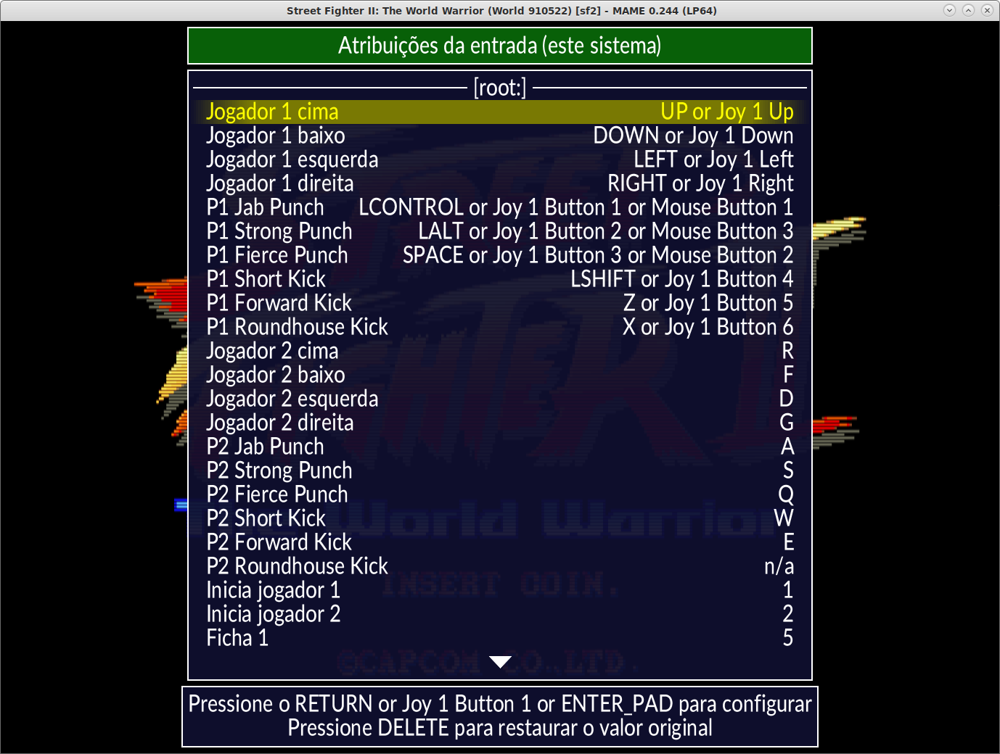
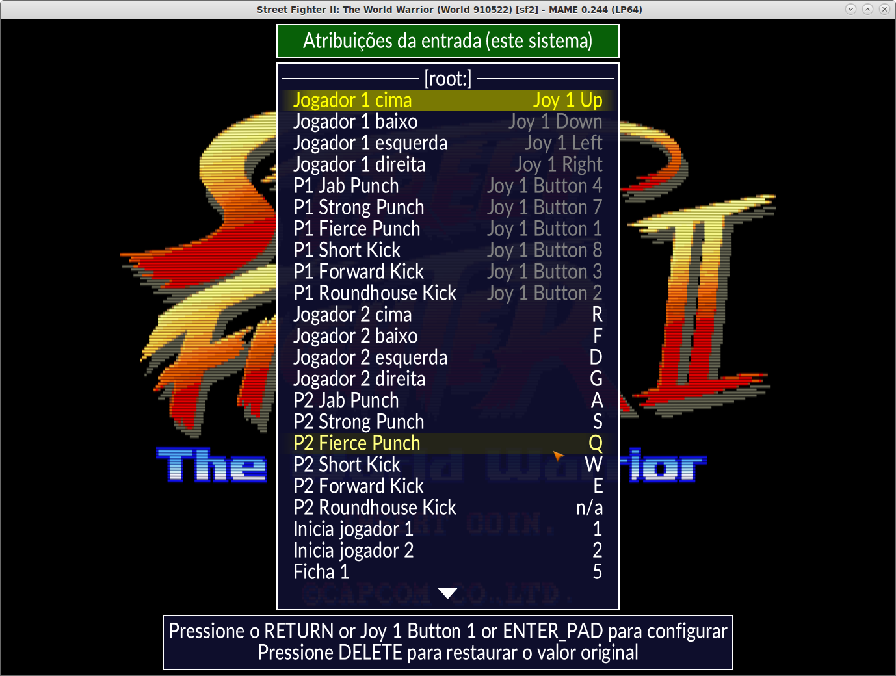

.. raw:: latex

	\clearpage

.. _configuringmame:

Configuração inicial
====================

.. contents:: :local:

.. raw:: latex

	\clearpage

Configuração básica
-------------------

Inicialmente o MAME precisa de poucas configurações para funcionar, num
primeiro momento o MAME precisa criar alguns arquivos de configuração e
depois é preciso configurar o caminho onde as suas ROMs estão.

Para os usuários do Windows, baixe o binário do `site oficial
<https://www.mamedev.org/release.html>`_ e descompacte-o em algum
lugar. Para usuários de outras versões como Linux ou macOS, será preciso
compilar ou ver a disponibilidade de versões já compiladas para o seu
sistema operacional.

No Windows, vá até a pasta onde o MAME foi descompactado, escolha um
ponto vazio da pasta, clique com o botão direito do mouse e escolha
**Novo --> Atalho**, quando aparecer a janela *"Criar atalho"* em
*"Digite o local do item"* insira **cmd** e clique em **OK**. O ícone do
prompt de comando deverá aparecer dentro da pasta do MAME, clique com o
*botão direito* em cima dele e selecione **Propriedades**, selecione a
aba **Atalho**, no campo **Iniciar em:** tem o caminho
**C:\\WINDOWS\\system32** ou algo assim, **apague** o que estiver neste
campo e clique em **OK**.

Clique duas vezes no ícone do prompt de comando e pronto, já estamos no
diretório do MAME, para criar os arquivos de configuração inicial
faça::

	mame -createconfig ou mame -cc

O comando também serve para as versões do Linux e do macOS, este comando
cria os seguintes arquivos:

* **mame.ini**

	É o arquivo que contém as principais configurações do MAME.

* **ui.ini**

	Contém as configurações da interface, como a definição do tipo e o
	tamanho da fonte, da cor do texto e do fundo, etc.

* **plugins.ini**

	Aqui fica a lista dos plug-ins disponíveis no MAME, depois do nome
	do plug-in, o **1** indica que ele está ativo e **0** que está
	desativado. Consulte :ref:`mamemenu-plugins` para obter mais
	detalhes sobre os plug-ins que acompanham o MAME.

No macOS os arquivos ficam em ``~/Application Support/mame``, nos
sistemas Linux eles ficam em ``/home/seu_usuário/.mame`` ou
simplificando, no diretório ``~/.mame``.

Observe que o ``mame.ini`` é basicamente um arquivo de texto simples,
podendo ser editado com qualquer editor de texto (como o Notepad,
o `Notepad++ <https://notepad-plus-plus.org/downloads/>`_, 
o `Geany <https://www.geany.org/>`_,
o `Emacs <https://www.gnu.org/software/emacs/>`_ ou
o `TextEdit <https://support.apple.com/pt-br/guide/textedit/welcome/mac>`_
por exemplo) e alterar todas as opções conforme a sua necessidade.

.. note::

	Sempre mantenha um backup destes arquivos!

.. raw:: latex

	\clearpage

.. _configuringmame-rompath:

O caminho das ROMs
------------------

Configuração tradicional
~~~~~~~~~~~~~~~~~~~~~~~~

A primeira configuração a ser feita é apontar o caminho completo onde as
suas principais ROMs estão armazenadas. A opção
:ref:`-rompath <mame-commandline-rompath>` permite a definição deste
caminho, porém, é possível deixá-lo fixo, para isso abra o ``mame.ini``
e edite a opção ``rompath``::

	rompath                   roms

Esta é a configuração original, ao definir ``roms`` o MAME vai procurar
por uma pasta chamada ``roms`` no mesmo diretório do executável do MAME.
Caso as suas ROMs fiquem em outro lugar, adicione o caminho completo
separado por ponto e vírgula, exemplo::

	rompath                   roms;D:\roms;E:\bkp\roms;F:\arcade\roms

Assim o MAME sempre irá buscar as ROMs nestes caminhos que foram
definidos.

.. note:: Caso estes caminhos tenham espaços no nome, coloque-os entre
   aspas ``" "`` (por exemplo, ``"D:\minhas roms1";"D:\minhas roms2"``
   e assim por diante).

Porém, dependendo da quantidade de ROMs em cada pasta e da quantidade de
caminhos, essa talvez não seja a melhor maneira de configurar, pois o
MAME pode ficar um pouco mais lento até conseguir varrer todos os
diretórios durante a inicialização da sua interface gráfica. Se houver
muitas ROMs em sua coleção, a melhor opção pode ser a configuração
avançada.

.. raw:: latex

	\clearpage

.. _configuringmame-rompath-advanced:

Configuração avançada
~~~~~~~~~~~~~~~~~~~~~

Uma outra maneira de se configurar o caminhos das ROMs é utilizando as
configurações individuais parcialmente descrito em
:ref:`-readconfig <mame-commandline-noreadconfig>`. Primeiro é preciso
identificar qual a configuração do seu ``inipath``, para isso faça o
comando no Windows::

	mame -showconfig|findstr initpath
	inipath                   .;ini;ini/presets

No Linux e no macOS faça::

	mame -showconfig|grep inipath
	inipath                   $HOME/.mame;.;ini

Em ambos os casos, o ponto final indica o mesmo lugar que o executável
do MAME. Uma vez identificado onde a sua pasta ``ini`` está, dentro dela
crie uma pasta chamada **sources**.

Vamos supor que queira jogar o **Sonic the Hedgehog** da SEGA no
Genesis/Mega Drive, primeiro identifique o driver com o comando::

	mame genesis -ls
	genesis          sega/mdconsole.cpp

O driver é ``mdconsole.cpp``, então crie o arquivo ``mdconsole.ini``
dentro da pasta ``ini\sources``, edite o arquivo ``mdconsole.ini`` e
adicione o caminho completo onde estão armazenados as suas ROMs do
Genesis/Mega Drive, exemplo::

	rompath                   D:\genesis\roms

No Linux ou macOS::

	rompath                   /media/genesis/roms

Isso pode ser feito com qualquer outro sistema, basta identificar o
driver, criar um arquivo ``*.ini`` com o nome do driver (sem o ``.cpp``)
dentro da pasta ``ini\sources``. Lembrando que caso o sistema que será
executado utilize algum tipo de BIOS como o Neo Geo por exemplo, é
preciso apontar o caminho completo onde se encontra a BIOS do sistema e
o caminho completo das ROMS do sistema.

Se for o caso do Neo Geo, crie o arquivo ``ini\sources\neogeo.ini``,
dentro do arquivo ``neogeo.ini`` adicione::

	rompath                   D:\roms;D:\bios

Um dos motivos de se deixar as ROMs dos sistemas separadas em vez de se
deixar tudo junto, depende muito da quantidade de ROMs existente na
pasta ``roms``. Caso tenha TODAS AS ROMS do MAME numa mesma pasta, o
gerenciamento delas pode ficar muito comprometido pois dependendo do
hardware usado, uma simples navegação dentro desta pasta pode ficar
extremamente lento dada a imensa quantidade de arquivos.

.. raw:: latex

	\clearpage

.. _configuringmame-graphics:

Configurando os gráficos
------------------------

A maneira mais simples de fazer a configuração gráfica do MAME é
clicar duas vezes em seu executável ou invocá-lo através do terminal
ou do prompt de comando sem qualquer opção. Quando a interface aparecer,
com o mouse, dê um clique duplo em :guilabel:`Definições gerais` e depois
em :guilabel:`Opções do vídeo`. Escolha uma das opções disponíveis em
:guilabel:`Modo do vídeo`. Para mais detalhes, consulte
:ref:`-video <mame-commandline-video>`.

Se for possível prefira a opção :guilabel:`bgfx`, caso contrário
:guilabel:`opengl` e em último caso **d3d**. O MAME ainda usa o Direct3D
versão 9 porém do Windows 7 em diante o Direct 3D 9 não é mais
compatível com as versões mais novas do Windows.

Note que apesar de ser possível selecionar o modo do vídeo, para tirar
proveito da aceleração da sua placa de vídeo, prefira usar a versão do
Direct3D do bgfx, neste caso, abra o seu ``mame.ini``, localize a opção
``vídeo`` e troque ``auto`` por ``bgfx``, exemplo::

	video                     bgfx

Agora, procure a opção ``bgfx_backend`` e troque ``auto`` por ``d3d11``
ou ``d3d12`` caso a sua placa de vídeo seja compatível::

	bgfx_backend              d3d12

Também é possível fazer a configuração **parcial** do vídeo usando a
própria interface do MAME, na linha de comando ou do prompt execute o
``mame`` sem nenhuma opção.

As configurações que já vem definidas são suficientes para a grande
maioria dos usuários, caso não queira que o MAME inicie ocupando a tela
inteira por exemplo, altere a opção :guilabel:`Modo janela` para
:guilabel:`Ligado`, depois faça um duplo clique em
:guilabel:`Retorne ao menu anterior` e novamente em
:guilabel:`Salve a configuração` para armazenar as alterações no
**mame.ini**.

Tenha em mente que nada que for feito aqui irá "quebrar" o MAME,
mas é possível que, por alguma questão de incompatibilidade, o MAME
não abra mais a interface, rode sem áudio, com tela preta ou apresente
algum outro tipo de problema. Neste caso, faça o backup dos seus
arquivos ``mame.ini``, ``ui.ini`` e ``plugins.ini``, crie uma nova
configuração com o comando ``mame -cc`` e tente novos ajustes, evite
aqueles que causaram problemas. Para mais informações, consulte
:ref:`-createconfig <mame-commandline-createconfig>`.

Para obter mais detalhes sobre todas as opções da parte da configuração
do vídeo, consulte :ref:`mamemenu-config-video`, :ref:`advanced-bgfx`.

.. _configuringmame-audio:

Configurando o áudio
--------------------

Assim como na configuração de vídeo, o MAME detecta e configura o áudio
automaticamente para que funcione com o hardware existente. Porém, é
possível obter uma latência (atraso) menor no áudio e, assim, melhorar o
seu desempenho. Sistemas como o **Dance Dance Revolution** e outros do
tipo podem se beneficiar bastante de uma latência menor. Experimente
opções como ``mame -sound wasapi`` ou ``mame -v -sound xaudio2``

.. _configuringmame-controls:

Configurando os controles
-------------------------

O MAME aceita dois tipos de configuração para os controles, a primeira é
a configuração feita através da interface, depois de iniciar um sistema
qualquer como o "*Street Fighter II*" da Capcom ``mame sf2``, pressione
:kbd:`Tab` e selecione :guilabel:`Configurações da entrada` ->
:guilabel:`Atribuições da entrada (este sistema)`:

Aqui temos a configuração que já vem predefinida para este sistema, o
**P1** são as definições para o **jogador 1** e assim por diante.
Selecione a configuração para **Up (cima)** e pressione :kbd:`Enter` no
teclado e pressione **cima** no seu controle, manche ou joystick e faça
o mesmo para as outras definições.

A sequência dos botões de soco para este sistema estão organizados como:

* :guilabel:`Jab Punch` (soco fraco)
* :guilabel:`Strong Punch` (soco médio)
* :guilabel:`Fierce Punch` (soco forte)

Para o chute nós temos:

* :guilabel:`Short Kick` (chute fraco)
* :guilabel:`Forward Kick` (chute médio)
* :guilabel:`Roundhouse Kick` (chute forte)

No final, o nome para cada tipo de controle pode ficar um pouco
diferente, isso pode variar muito dependendo do modelo e do adaptador
usado. No exemplo da foto abaixo e usando um adaptador USB para
Playstation 2 nós fizemos a seguinte configuração, **quadrado (soco
fraco)**, **L1 (soco médio)**, **triângulo (soco forte)**, **R1 (chute
fraco)**, **xis (chute médio)**, **círculo (chute forte)**.

.. raw:: latex

	\clearpage

Isso nos deixa com a seguinte configuração:

A escrita mais apagada do lado direito do comando indica que a
configuração está customizada ou usando uma configuração diferente da
configuração predefinida. Pressione a tecla **ESQ** até encerrar a
emulação ou simplesmente feche a janela. Ao encerrar a emulação o MAME
cria uma configuração com o nome desta ROM ``sf2.cfg`` na pasta ``cfg``:

.. code-block:: xml

	
    <?xml version="1.0"?>
    <!-- This file is autogenerated; comments and unknown tags will be stripped -->
    <mameconfig version="10">
        <system name="sf2">
            <input>
                <port tag=":IN1" type="P1_JOYSTICK_RIGHT" mask="1" defvalue="1">
                    <newseq type="standard">
                        JOYCODE_1_XAXIS_RIGHT_SWITCH
                    </newseq>
                </port>
                <port tag=":IN1" type="P1_JOYSTICK_LEFT" mask="2" defvalue="2">
                    <newseq type="standard">
                        JOYCODE_1_XAXIS_LEFT_SWITCH
                    </newseq>
                </port>
                <port tag=":IN1" type="P1_JOYSTICK_DOWN" mask="4" defvalue="4">
                    <newseq type="standard">
                        JOYCODE_1_YAXIS_DOWN_SWITCH
                    </newseq>
                </port>
                <port tag=":IN1" type="P1_JOYSTICK_UP" mask="8" defvalue="8">
                    <newseq type="standard">
                        JOYCODE_1_YAXIS_UP_SWITCH
                    </newseq>
                </port>
                <port tag=":IN1" type="P1_BUTTON1" mask="16" defvalue="16">
                    <newseq type="standard">
                        JOYCODE_1_BUTTON4
                    </newseq>
                </port>
                <port tag=":IN1" type="P1_BUTTON2" mask="32" defvalue="32">
                    <newseq type="standard">
                        JOYCODE_1_BUTTON7
                    </newseq>
                </port>
                <port tag=":IN1" type="P1_BUTTON3" mask="64" defvalue="64">
                    <newseq type="standard">
                    JOYCODE_1_BUTTON1
                </newseq>
                </port>
                <port tag=":IN2" type="P1_BUTTON4" mask="1" defvalue="1">
                    <newseq type="standard">
                        JOYCODE_1_BUTTON8
                    </newseq>
                </port>
                <port tag=":IN2" type="P1_BUTTON5" mask="2" defvalue="2">
                    <newseq type="standard">
                        JOYCODE_1_BUTTON3
                    </newseq>
                </port>
                <port tag=":IN2" type="P1_BUTTON6" mask="4" defvalue="4">
                    <newseq type="standard">
                        JOYCODE_1_BUTTON2
                    </newseq>
                </port>
            </input>
        </system>
    </mameconfig>

O MAME sempre vai procurar pela configuração ``sf2.cfg`` sempre que a
ROM ``sf2`` for carregada.

Porém, existem diferentes versões deste sistema em diferentes drivers
como o CPS-1, CPS-2, CPS-3 e várias outras que usam um esquema
semelhante de botões. Para evitar o trabalho de se criar uma
configuração destas para cada sistema individualmente, é possível
aplicar esta exata configuração **por sistema**, ou seja, todas os
sistemas do driver CPS-1 por exemplo, podem usar uma só configuração.

.. raw:: latex

	\clearpage

Para isso, copie o arquivo ``sf2.cfg`` da pasta ``cfg`` para a pasta
``ctrlr``, esta pasta fica junto com o executável do MAME, caso o seu
MAME venha de uma distribuição Linux ou macOS em particular com algum
tipo de instalação, faça o comando::

	mame -showconfig|grep ctrlrpath
	ctrlrpath                 /usr/share/ctrlr;etc

Depois de copiar o arquivo ``sf2.cfg`` para esta pasta, o renomeie para
algo como ``street.cfg`` (pode ser o nome que quiser). Abra o arquivo
``street.cfg`` (ou o nome do arquivo que usou) num editor de texto e
troque o **sf2** da linha ``<system name="sf2">`` para **default** ou
``<system name="defaut">`` e salve o arquivo.

Para aplicar a configuração para **TODOS** os sistemas do driver CPS-1,
crie uma pasta chamada ``sources`` dentro da pasta ``ini``,
dentro da pasta ``sources`` crie um arquivo chamado ``cps1.ini``, abra-o
no editor de texto e adicione a opção::

	ctrlr                 street

Note que ``street`` se refere ao ``street.cfg`` que criamos
**sem o .cfg**. Apague o seu arquivo ``sf2.cfg`` da pasta ``cfg`` e
inicie novamente o sistema, pressione :kbd:`Tab` e selecione
:guilabel:`Configurações da entrada` ->
:guilabel:`Atribuições da entrada (este sistema)`, repare que o MAME
carregou as configurações do seu controle. Encerre a emulação novamente,
tente outro sistema como a ``sf2ce``, repare que este sistema também
vai estar usando as configurações que você definiu para o seu controle,
o mesmo vai acontecer para todos os outros sistemas deste driver.

Neste driver também há sistemas de tiro, pancadaria, dentre outros.
Nestes casos é preciso criar uma configuração por sistema. Por exemplo,
o "*Carrier Air Wing (cawing)*" possuí 3 botões, é possível usar
o mesmo tipo de configuração já ensinado anteriormente com :kbd:`Tab` ->
:guilabel:`Configurações da entrada` ->
:guilabel:`Atribuições da entrada (este sistema)` em cada sistema ou
pegar a configuração que for criada, neste caso seria
``cfg\cawing.cfg``, alterar o **system name** para **default** como
também já foi explicado anteriormente, porém agora, salve este arquivo
como ``3-botoes.cfg`` dentro da pasta ``ctrlr``.

Vá até a pasta ``ini`` e crie um ini com o nome da ROM ou
``cawing.ini``, abra o arquivo num editor, adicione a opção e salve::

	ctrlr                 3-botões

Assim os outros sistemas usam a configuração ``street`` para jogos com
6 botões enquanto a ``cawing`` usa a configuração com 3 botões. O mesmo
princípio pode ser utilizado com sistemas que usam 2 botões e assim por
diante.

Outras configurações também podem ser feitas, neste caso, consulte o
capítulo :ref:`advanced-tricks`.
