.. raw:: latex

	\clearpage

.. _layfile:

Os arquivos layout
==================

.. contents:: :local:

.. _layfile-intro:

Introdução
----------

Os arquivos layout [#]_ são usados para informar ao MAME o que exibir
enquanto a emulação de um sistema estiver rodando e também como
organizá-los na tela. O MAME pode renderizar a emulação das telas
originais dos sistemas, as imagens, os textos, as formas e objetos
especiais na saída comum dos dispositivos.
Os elementos podem ser estáticos ou se atualizar de forma dinâmica para
refletir a condição das entradas e das saídas.
Os layouts podem ser gerados automaticamente com base no número ou no
tipo da tela que será emulada, ser construído e conectado internamente
ao binário do MAME ou sendo disponibilizado externamente. Para o MAME os
arquivos layout são interpretados como arquivos XML porém utilizam a
extensão ``.lay``.

.. raw:: latex

	\clearpage

.. _layfile-concepts:

Conceitos básicos
-----------------

.. _layfile-concepts-numbers:

Números
~~~~~~~

Os layouts do MAME possuem dois tipos de números, números inteiros e os
de ponto flutuante.

Os números inteiros podem ser usados com notação decimal ou hexadecimal.
Um número decimal inteiro consiste em um prefixo opcional **#**
(hash [#]_), um caractere opcional **+/-** (mais ou menos) ou uma
sequência de dígitos entre **0-9**.

Um número hexadecimal consiste em que um dos prefixos
seja o **$** (cifrão) ou **0x** (zero xis) seguido por uma sequência de
números decimais entre **0-9** em conjunto com as letras entre **A-F**.
Não há diferenciação entre as letras maiúsculas e as letras minúsculas
no índice e nos dígitos dos números hexadecimais.

Os números de ponto flutuante podem ser usados com decimal de ponto
fixo ou com notação científica. Observe que os prefixos do número
inteiro e os valores hexadecimais *não* são aceitos caso um número de
ponto flutuante seja esperado.

São permitidos como atributos ambos os números inteiros e os números de
ponto flutuante. Nesses casos a presença de um prefixo **#** (hash),
**$** (cifrão) ou **0x** (zero xis) faz com que o valor seja
interpretado como um número inteiro.
Caso nenhum prefixo de número inteiro, o ponto decimal ou a letra E
(maiúsculo ou minusculo) seja encontrado na introdução de um expoente,
este será interpretado como um número de ponto flutuante.
Caso nenhum prefixo de número inteiro, ponto decimal ou a letra E seja
encontrado, o número será interpretado como um número inteiro.

Os números são analisados usando uma acentuação de caracteres em C [#]_
por questões de portabilidade.

.. raw:: latex

	\clearpage

.. _layfile-concepts-coordinates:

Coordenadas
~~~~~~~~~~~

As coordenadas do layout são representadas internamente através da norma
IEEE754 como um número binário de 32-bit de ponto flutuante (também
conhecido como "*precisão simples*"). O incremento das coordenadas
se dão nas direções da direita e para baixo. A origem (**0,0**) não
possui um significado em particular e valores negativos podem ser
usados.

O MAME pressupõe que as coordenadas da visualização possuem a mesma
proporção de aspecto com relação aos pixels gerados pelo dispositivo
(janela ou nativa).
Considerando que sejam pixels quadrados e sem rotação, isso significa
que a distância seja igual nos eixos **X** e **Y** o que corresponde a
distâncias iguais na vertical e na horizontal que for gerado pela
renderização.

Todos os elementos, os grupos e as visualizações possuem os seus
sistemas internos de coordenadas. Quando um elemento ou um grupo é
referenciado a partir de uma visualização ou de um outro grupo, as
suas coordenadas são dimensionadas de acordo com a necessidade para que
os limites sejam definidos.

Os objetos são posicionados e dimensionados através do elemento
``bounds`` que define os seus limites e também as suas fronteiras.
A posição horizontal e o seu tamanho podem ser definidos de três
maneiras:

* A borda esquerda e a largura usando atributos ``x`` e ``width``.
* O eixo horizontal centralizado onde **c** significa que a referência
  usada será o **centro** do objeto/imagem e a largura usando atributos
  ``xc`` e ``width``.
* As bordas esquerda e direita usando atributos ``left`` e ``right``.
* De maneira semelhante a posição vertical e o seu tamanho podem ser
  definidos através da borda superior e a altura usando atributos
  ``y`` e ``height``.
* O eixo vertical centralizado e a altura usando atributos ``yc`` e
  ``height``.
* As bordas superiores e inferiores usando atributos ``top`` e
  ``bottom``.

No exemplo abaixo estes três elementos ``bounds`` são equivalentes:

.. code-block:: xml

    <bounds x="455" y="120" width="12" height="8" />
    <bounds xc="461" yc="124" width="12" height="8" />
    <bounds left="455" top="120" right="467" bottom="128" />

É possível utilizar diferentes esquemas nas direções horizontal e
vertical. Por exemplo, estes elementos ``bounds`` equivalentes também
são válidos:

.. code-block:: xml

    <bounds x="455" top="120" width="12" bottom="128" />
    <bounds left="455" yc="124" right="467" height="8" />

Caso nenhum valor seja informado, é predefindo que seja **1.0** para o
atributo ``width``/``height`` ou ``right``/``bottom``.
O MAME irá considerar como um erro caso os atributos ``width`` ou
``height`` tenham valores negativos, ``right`` tenha um valor menor que
``left`` ou caso ``bottom`` tenha um valor menor que ``top``.

.. raw:: latex

	\clearpage

.. _layfile-concepts-colours:

Cores
~~~~~

As cores são definidas no espaço RGBA. O MAME não trabalha com todo o
leque da gama de cores, portanto, as cores serão interpretadas como
sRGB em conjunto da definição do gamma do seu sistema que geralmente é
**2.2**. Os valores dos canais são definidos como números de ponto
flutuante. Os valores dos canais vermelho, verde e azul variam entre
**0.0** (desligado) até **1.0** (intensidade plena).
Os valores alfa variam entre **0.0** (transparência absoluta) até
**1.0** (opaco). Os valores dos canais das cores não são previamente
multiplicadss pelo valor alfa.

O componente e a cor do item da visualização são definidas através dos
elementos ``color``.
Os atributos relevantes são vermelho ``red``, verde ``green``,
azul ``blue`` e ``alpha``. Este exemplo do elemento ``color`` determina
todos os valores dos canais:

.. code-block:: xml

    <color red="0.85" green="0.4" blue="0.3" alpha="1.0" />

Qualquer atributo omitido do canal terá o seu valor predefinido para
**1.0** (intensidade absoluta ou opaca). Será considerado como um erro
caso os valores do canal estejam fora do intervalo entre de **0.0** até
**1.0**.

Nem toda a ferramenta de edição de imagens trabalhe com o mesmo sistema
que o MAME, assim sendo, utilize
`esta calculadora <https://doc.instantreality.org/tools/color_calculator/>`_
para converter um valor RGB hexadecimal usado em HTML ou RGB por
exemplo, para o formato que o MAME aceita.

.. _layfile-concepts-params:

Parâmetros
~~~~~~~~~~

Os parâmetros funcionam como variáveis que podem ser utilizadas para
substituir o valor dos atributos, basta cercar o seu nome com caracteres
til *(~)*.
Nenhuma substituição será feita caso nenhum parâmetro seja definido.
No exemplo abaixo é possível ver como os valores dos parâmetros
``digitno`` e do ``x`` substituirão o ``~digitno~`` e o ``~x~``:

.. code-block:: xml

	<repeat count="8">
		<param name="digitno" start="1" increment="1" />
		<param name="x" start="0" increment="114" />
	<element name="digit~digitno~" ref="digit">
		<bounds x="~x~" y="80" width="25" height="40" />
	</element>

Um nome para o parâmetro é uma sequência de letras maiúsculas das letras
**A-Z**, das letras minusculas **a-z**, dígitos decimais **0-9**, ou
caracteres subtraço (_).
As letras maiúsculas e as letras minúsculas são levadas em consideração
nos nomes dos parâmetros. Durante a procurar por um parâmetro o motor do
layout começando a trabalhar da parte mais interna do escopo atual até a
sua parte mais externa. O nível mais periférico do escopo corresponde ao
elemento do primeiro nível ``mamelayout``. Cada elemento ``repeat``,
``group`` ou ``view`` cria um novo nível de encadeamento do escopo.

Internamente um parâmetro pode conter uma string, números inteiros ou
números de ponto flutuante, porém esta é bem mais óbvia.
Os números inteiros são armazenados como *64-bit signed* com dois valores
complementares, já os números de ponto flutuante são armazenados como
binários *IEEE754* com *64-bit*, estes números também são conhecido como
"precisão dupla". Os números inteiros são substituídos em notação
decimal, já os números de ponto flutuante são substituídos pelo seu
formato padrão que pode ser um decimal de ponto fixo ou dependendo do
valor pode ser uma notação científica. Não há nenhuma maneira de
substituir a formatação predefinida dos parâmetros de um número inteiro
ou de ponto flutuante.

Existem dois tipos de parâmetros: os *valores* e os *geradores*. O
parâmetro "value" mantém o seu valor atribuído até que eles sejam
alterados, já o parâmetro "*gerador*" possui um valor inicial, um
incremento e/ou um deslocamento [#]_ aplicado em cada interação.

Os valores dos parâmetros são atribuídos através do elemento ``param``
junto com os elementos ``name`` e ``value``, os seus valores podem
aparecer de dentro de um elemento de primeiro nível ``mamelayout`` e
dentro dos elementos ``repeat``, ``view`` assim como dentro da definição
dos elementos ``group`` (isso é, elementos ``group`` dentro do nível
superior do elemento ``mamelayout``, ao contrário dos elementos
``group`` dentro de elementos ``view`` definidos por outros elementos
``group``.
O valor do parâmetro pode ser reatribuído a qualquer momento.

Aqui está um exemplo de como atribuir o valor "4" para o parâmetro
"firstdigit":

.. code-block:: xml

	<param name="firstdigit" value="4" />

Os parâmetros dos geradores são atribuídos através do elemento ``param``
em conjunto com os atributos ``name``, ``start``, ``increment``,
``lshift`` e ``rshift``.
Os parâmetros dos geradores só podem aparecer de dentro dos elementos
``repeat`` (consulte :ref:`layfile-parts-repeats` para obter mais
informações) e também não devem ser reatribuídos dentro do mesmo escopo
(um parâmetro com um nome idêntico pode ser atribuído em um escopo
através da sua ramificação). Abaixo alguns parâmetros de exemplos dos
geradores:

.. code-block:: xml

    <param name="nybble" start="3" increment="-1" />
    <param name="switchpos" start="74" increment="156" />
    <param name="mask" start="0x0800" rshift="4" />

* O parâmetro ``nybble`` geram os valores 3, 2, 1...
* O parâmetro ``switchpos`` geram os valores 74 (``74``), 230 (``74 + 156``), 386 (``230 + 156``)...
* O parâmetro ``mask`` geram os valores 2048 (``0x0800``), 128 (``0x0800 >> 4``), 8 (``0x80 >> 4``)...

O atributo ``increment`` deve ser um número inteiro ou de ponto
flutuante que será adicionado ao valor do parâmetro. Os atributos
``lshift`` e ``rshift`` devem ser números positivos e inteiros pois
definem a quantidade dos bits que serão aplicados aos parâmetros. O
deslocamento (shift) e o incremento são aplicados no final do bloco que
está sendo repetido antes do inicio da próxima iteração.
O valor do parâmetro poderá ser interpretado como um número de ponto
flutuante ou um número inteiro antes que o incremento ou o deslocamento
seja aplicado. Caso informe ambos os valores para incremento e para o
deslocamento, então o valor do incremento será aplicado primeiro e
depois o valor deslocado.

Caso o atributo ``increment`` esteja presente e seja um número de
ponto flutuante, o seu valor será convertido para um número de ponto
flutuante caso seja necessário antes que o incremento seja adicionado.
Caso o atributo ``increment`` esteja presente e seja um valor inteiro
enquanto o valor do parâmetro seja um número de ponto flutuante, o valor
do incremento será convertido para um número de ponto flutuante antes
que o valor seja adicionado.

Caso os atributos ``lshift`` ou ``rshift`` estejam presentes porém não
sejam iguais, o valor do parâmetro será convertido para um número
inteiro e deslocado conforme a necessidade. O deslocamento para a
esquerda é definido como um deslocamento feito em direção ao bit de
maior importância.
Caso ambos os parâmetros ``lshift`` e ``rshift`` sejam passados, estes
serão compensados antes dos valores serem aplicados. Significa que
não é possível usar atributos iguais tanto para o ``lshift`` como para o
`rshift`` por exemplo para limpar os bits em um valor do final do
parâmetro após a primeira iteração.

Será considerado um erro caso o elemento ``param`` não esteja em
qualquer um dos atributos ``value`` ou ``start``, será também
considerado um erro caso ambos os elementos ``param`` tiverem  os mesmos
atributos ``value`` ou qualquer um dos mesmos atributos ``start``,
``increment``, ``lshift``, ou ``rshift``.

Um elemento ``param`` define ou reatribui o seu valor em um parâmetro no
escopo atual mais interno. Não é possível definir ou reatribuir os
parâmetros em um escopo de contenção.

.. raw:: latex

	\clearpage

.. _layfile-concepts-predef-params:

Parâmetros já predefinidos
~~~~~~~~~~~~~~~~~~~~~~~~~~

Uma certa quantidade de valores predefinidos nos parâmetros já estão
disponíveis e fornecem informações sobre a máquina que está em execução:

**devicetag**

	Um exemplo do caminho completo da etiqueta [#TAG]_ dispositivo que será
	responsável pela leitura do layout, seria ``:`` para o driver do
	controlador do dispositivo raiz ou ``:tty:ie15`` para o terminal
	conectado em uma porta. Este parâmetro é uma sequência de caracteres
	definida no escopo global de visualização do layout.

**devicebasetag**

	A base da etiqueta do dispositivo que será responsável pela leitura
	do layout, como por exemplo ``root`` para o driver do dispositivo
	raiz ou ``ie15`` para o terminal que estiver conectado em uma porta.
	Este parâmetro é uma sequência de caracteres definida no escopo
	global do layout.

**devicename**

	O nome completo (descrição) do dispositivo que será responsável pela
	leitura do layout, como por exemplo os terminais ``AIM-65/40`` ou
	``IE15``. Este parâmetro é uma sequência de caracteres
	definida no escopo global do layout.

**deviceshortname**

	Um nome curto do dispositivo que será responsável pela leitura do
	layout, como por exemplo os terminais ``aim65_40`` ou ``ie15``.
	Este parâmetro é uma sequência de caracteres definida no escopo
	global do layout.

**scr0physicalxaspect**

	A parte horizontal da relação de aspecto físico da primeira tela
	(caso esteja presente). A relação de aspecto físico é fornecida como
	uma fração impropriamente reduzida. Observe que este é o componente
	horizontal aplicado *antes* da rotação. Este parâmetro é um número
	inteiro definido no escopo global do layout.

**scr0physicalyaspect**

	A parte vertical da relação de aspecto físico da primeira tela
	(caso esteja presente). A relação de aspecto físico é fornecida como
	uma fração impropriamente reduzida. Observe que este é o componente
	vertical aplicado *antes* da rotação. Este parâmetro é um número
	inteiro definido no escopo global do layout.

**scr0nativexaspect**

	A parte horizontal da relação de aspecto do pixel visível na região
	da primeira tela (caso esteja presente). A relação de aspecto
	do pixel é fornecida como uma fração impropriamente reduzida.
	Observe que este é o componente horizontal aplicado *antes* da
	rotação. Este parâmetro é um número inteiro definido no escopo
	global do layout.

**scr0nativeyaspect**

	A parte vertical da relação de aspecto do pixel visível na região da
	primeira tela (caso esteja presente). A relação de aspecto do pixel
	é fornecida como uma fração impropriamente reduzida. Observe que
	este é o componente vertical aplicado *antes* da rotação. Este
	parâmetro é um número inteiro definido no escopo global do layout.

.. raw:: latex

	\clearpage

**scr0width**

	A largura da região visível da primeira tela (se houver) nos pixels
	emulados. Observe que a largura é aplicada *antes* da rotação.
	Este parâmetro é um número inteiro definido no escopo global do
	layout.

**scr0height**

	A altura da região visível da primeira tela (se houver) nos pixels
	emulados. Observe que a altura é aplicada *antes* da rotação.
	Este parâmetro é um número inteiro definido no escopo global do
	layout.

**scr1physicalxaspect**

	A parte horizontal da relação de aspecto físico da primeira tela
	(caso esteja presente). Este parâmetro é um número inteiro definido
	no escopo global do layout.

**scr1physicalyaspect**

	A parte vertical da relação de aspecto físico da segunda tela
	(caso esteja presente). Este parâmetro é um número inteiro
	definido no escopo global do layout.

**scr1nativexaspect**

	A parte horizontal da relação de aspecto do pixel visível na região
	da segunda tela (caso esteja presente). Este parâmetro é um número
	inteiro definido no escopo global de visualização do layout.

**scr1nativeyaspect**

	A parte vertical da relação de aspecto do pixel visível na região da
	segunda tela (caso esteja presente). Este parâmetro é um número inteiro
	definido no escopo global de visualização do layout.

**scr1width**

	A largura da região visível da segunda tela (se houver) nos pixels
	emulados. Este parâmetro é um número inteiro definido no escopo
	global do layout.

**scr1height**

	A altura da região visível da segunda tela (se houver) nos pixels
	emulados. Este parâmetro é um número inteiro definido no escopo
	global do layout.

**scr\ *N*\ physicalxaspect**

	A parte horizontal da relação de aspecto físico da tela (base-zero)
	*N*\ th (caso esteja presente). Este parâmetro é um número inteiro
	definido no escopo global do layout.

**scr\ *N*\ physicalyaspect**

	A parte vertical da relação de aspecto físico da tela (base-zero)
	*N*\ th (caso esteja presente). Este parâmetro é um número inteiro
	definido no escopo global do layout.

**scr\ *N*\ nativexaspect**

	A parte horizontal da relação de aspecto da parte visível da tela
	(base-zero) *N*\ th (caso esteja presente). Este parâmetro é um
	número inteiro definido no escopo global do layout.

**scr\ *N*\ nativeyaspect**

	A parte vertical da relação de aspecto da parte visível da tela
	(base-zero) *N*\ th (caso esteja presente). Este parâmetro é um
	número inteiro definido no escopo global do layout.

.. raw:: latex

	\clearpage

**scr\ *N*\ width**

	A largura da região visível da tela (base-zero) *N*\ th (se
	presente) nos pixels emulados. Este parâmetro é um número inteiro
	definido no escopo da visualização do layout.

**scr\ *N*\ height**

	A largura da região visível da tela (base-zero) *N*\ th (se
	presente) nos pixels emulados. Este parâmetro é um número inteiro
	definido no escopo de visualização do layout.

**viewname**

	O nome da visualização atual. Este parâmetro é uma sequências de
	caracteres definido no escopo de visualização.
	Não é definido fora do campo de visão.

Para parâmetros relacionados à tela, elas são numeradas do zero na
ordem em que aparecem na configuração da máquina. Todas as telas estão
inclusas (não apenas nos sub-dispositivos do dispositivo que fizeram com
que o layout fosse carregado). **X/width** e **Y/height** referem-se as
dimensões horizontal e vertical da tela *antes* da rotação ser aplicada.
Os valores baseados na região visível são calculados no final da
configuração. Caso o sistema não reconfigure a tela durante a execução
os valores dos parâmetros não serão atualizados assim como os layouts
não serão recalculados.

.. raw:: latex

	\clearpage

.. _layfile-parts:

As partes de um layout
----------------------

Uma visualização define a disposição de um objeto gráfico a ser exibido.
O arquivo layout do MAME pode conter diversas visualizações. As
visualizações são construídas a partir de elementos *elements* e telas
*screens*. Para simplificar a organização dos layouts complexos são
compatíveis entre si a repetição dos blocos e dos grupos que podem ser
reutilizados.

O primeiro elemento do cabeçalho de um arquivo layout do MAME deve
ser um elemento chamado ``mamelayout`` junto com um atributo
``version``. O atributo ``version`` deve ser um valor inteiro.
Atualmente, o MAME suporta apenas a versão 2 e não carregará qualquer
outra versão diferente.
Este é um exemplo de uma tag inicial para um elemento ``mamelayout``:

.. code-block:: xml

	<mamelayout version="2">

Para fins de compatibilidade na identificação do arquivo com diversos
editores de texto é possível declarar que o mesmo é um arquivo XML,
logo, o MAME também aceita o arquivo com uma declaração XML:

.. code-block:: xml

	<?xml version="1.0"?>
	<mamelayout version="2">

Da mesma maneira que é possível usar o identificador XML, também é
possível identificar a codificação do arquivo caso seja necessário:

.. code-block:: xml

	<?xml version="1.0" encoding="UTF-8"?>
	<mamelayout version="2">

Os comentários podem ser adicionados em qualquer parte do arquivo desde
que estejam entre ``<!--`` e ``-->``:

.. code-block:: xml

	<?xml version="1.0"?>
	<!-- Este é um comentário -->
	
	<!--
	Este tipo de comentário também é válido.
	-->
	
	<!--
		Também é possível incluir longas instruções ou informações
		relevantes no seu arquivo layout para que as pessoas saibam
		o que fazer ou como prosseguir caso seja necessário.
		Identifique os seus arquivos, utilize estes espaços para deixar
		o seu nome ou apelido, a versão, a data que o layout foi criado
		ou que o arquivo foi alterado, a descrição das alterações, os
		direitos autorais, etc.
		
		The Alpha Betas and the Lambda Lambda Lambda Fraternity
		Versão: 1.0
		Criado em: 10/11/2020
		Licença: CC by 4.0
	-->

	<mamelayout version="2">

.. raw:: latex

	\clearpage

Algumas regras devem ser observadas ao adicionar os comentários:

* Os comentários não devem aparecer antes da declaração XML.
* Os comentários não devem aparecer dentro da etiqueta de um elemento.
* Os comentários não devem aparecer dentro do valor de um atributo.
* Os comentários não pode ter a sequência de caracteres ``--``.

Em geral, as ramificações do primeiro elemento ``mamelayout`` são
processados na ordem em que eles chegam, de cima para baixo, exceto as
visualizações que são processadas por último.
Isso significa que as visualizações veem os valores finais de todos os
parâmetros no final do elemento ``mamelayout`` e pode se referir a
elementos e grupos que possam aparecer depois deles.

Os seguintes elementos são permitidos dentro do primeiro elemento
``mamelayout``:

**param**

    Define ou reatribui um valor ao parâmetro. Consulte
    :ref:`layfile-concepts-params` para mais informações.

**element**

    Define um elemento, um dos objetos primários a serem organizados
    em uma Visualização. Consulte :ref:`layfile-parts-elements` para
    obter mais informações.

**group**

    Define um grupo dos elementos ou das telas que possam ser
    reutilizáveis e que também possam ser usados como referência numa
    visualização ou nos outros grupos.

    Consulte :ref:`layfile-parts-groups` para obter mais informações.

**repeat**

    Um grupo de elementos repetidos que podem conter os elementos
    ``param``, ``element``, ``group`` e ``repeat``.
    Consulte :ref:`layfile-parts-repeats` para obter mais informações.

**view**

    Um arranjo dos elementos ou das telas que podem ser exibidos na
    saída de um dispositivo (uma janela ou uma tela do host).
    Consulte :ref:`layfile-parts-views` para obter mais informações.

**script**

    Permite que scripts lua sejam usados num layout aprimorado ainda
    mais a interação.

.. raw:: latex

	\clearpage

.. _layfile-parts-elements:

Os elementos
~~~~~~~~~~~~

Os elementos são um dos objetos visuais mais básicos que podem ser
organizados em conjunto com as telas na composição de uma visualização.
Os elementos podem ser construídos com um ou mais componentes porém um
elemento é tratado como uma única superfície na composição do gráfico
da cena e da sua renderização. Um elemento pode ser usado em diversas
visualizações e pode também serem utilizadas várias vezes dentro da
visualização.

A aparência de um elemento depende do seu *estado*. O estado é um
valor inteiro que geralmente vem de uma região da porta E/S ou da
emulação gerada (consulte :ref:`layfile-interact-elemstate` para obter
mais informações de como conectar um elemento numa porta ou na saída
E/S de uma emulação).
Qualquer componente de um elemento pode estar restrito apenas ao desenho
quando o estado do elemento tiver um valor em particular. Alguns
componentes (como os mostradores com múltiplos segmentos e os
mostradores rotativos [#]_ (reels) por exemplo) que usam diretamente o
seu estado para determinar a sua aparência final.

Cada elemento possui o seu próprio sistema interno de coordenadas. Os
limites dos elementos dos sistema de coordenadas são computados através
da união dos limites individuais dos componentes que ele é composto.

Todo elemento deve ter o seu nome definido através do atributo ``name``.
Os elementos são mencionados através do nome quando forem solicitados
nos grupos ou nas visualizações. Haverá um erro caso o arquivo de
layout tenha vários elementos ``name`` com valores iguais.
Os elementos podem de forma opcional, ser utilizado para informar um
valor padrão do seu estado através do atributo ``defstate`` caso esteja
conectado em uma saída emulada ou em uma porta E/S. O valor do atributo
``defstate`` deve possuir um valor inteiro e positivo, os valores
negativos geram erros e fazem com que o layout não seja mais carregado.

As ramificações do elemento ``element`` instanciam componentes que são
desenhados na textura do elemento na ordem de leitura a partir do
primeiro ao último elemento utilizando alpha blending (os componente são
desenhados por cima e podem se sobrepor aos componentes que venham antes
dele). Todos os componentes são compatíveis com algumas características
em comum:

* Os componentes podem ser desenhados de forma condicional dependendo da
  condição do elemento ao informar os atributos ``state`` ou
  ``statemask``. Caso estejam presentes, estes atributos devem ser
  inteiros com valores positivos. Caso apenas o atributo ``state``
  esteja presente, então o componente só será desenhado na tela quando
  o elemento ``state`` coincidir com o seu valor. Caso apenas o atributo
  ``statemask`` esteja presente, então o componente só será desenhado na
  tela caso todos os bits estejam definidos e os seus valores estejam
  definidos através do atributo ``state``.
  
  Na existência de ambos os atributos ``state`` e ``statemask``, então o
  componente só será desenhado na tela quando os bits no elemento
  ``state`` corresponderem ao bit que estiver definido no atributo
  ``statemask`` e também corresponder com os bits do valor do atributo
  ``state``.
  
  O componente sempre será desenhado na ausência de ambos os atributos
  ``state`` ou ``statemask`` ou caso o valor do atributo ``statemask``
  for zero.

.. raw:: latex

	\clearpage

* Cada componente pode ter um sub-elemento ``bounds`` definindo a
  sua posição e o seu tamanho (consulte
  :ref:`layfile-concepts-coordinates`). Na ausência de tal elemento os
  limites serão predefinidos a uma unidade quadrada com o valor igual a
  **1.0** tanto para a largura quanto para a altura e com o canto
  superior esquerdo com valor **0.0**.
  
  A posição ou o tamanho de um componente pode ser animado de acordo com
  o estado do elemento ao prover diversos elementos ``bounds`` em
  conjunto com atributos ``state``. O atributo ``state`` de cada
  ramificação do elemento ``bounds`` deve ser um número inteiro e
  positivo. Os atributos ``state`` não devem ser iguais para quaisquer
  um dos dois elementos ``bounds`` que estiverem dentro de um
  componente.
  
  Caso o estado do elemento seja inferior que o valor do atributo
  ``state`` de qualquer uma das ramificações do elemento ``bounds``,
  será utilizada a posição/tamanho definido através do elemento
  ``bounds`` com o menor valor do atributo ``state``. Já quando o estado
  do elemento for maior que o valor do atributo ``state`` de qualquer
  elemento ``bounds``, será utilizada a posição/tamanho especificado
  através do elemento ``bounds`` com o maior valor do atributo
  ``state``. Se o estado do elemento estiver entre os valores do
  atributo ``state`` dos dois elementos ``bounds``, a posição/tamanho
  será interpolada de forma linear.
* Cada componente de cor pode ter um elemento ``color`` definindo uma
  cor RGBA (Consulte :ref:`layfile-concepts-colours` para obter mais
  informações).
  Isto pode ser usado para controlar a geometria da cor dos componentes
  desenhados de forma algorítmica ou textual. Para os componentes
  ``image``, a cor dos pixels da imagem são multiplicadas através da cor
  que foi definida. Caso tal elemento não esteja presente, será usada
  uma cor branca opaca já predefinida.
  
  A cor do componente pode ser animada de acordo com o estado do
  elemento ao prover diversos elementos ``color`` em conjunto com os
  atributos ``state``. Os atributos ``state`` não devem ser iguais em
  qualquer um dos dois elementos ``color`` internos de um componente.
  
  Caso o estado do elemento seja inferior ao valor do atributo ``state``
  de qualquer elemento ``color``, será utilizada a cor especificada
  através do elemento ``color`` com o menor valor do atributo ``state``.
  
  Caso o estado do elemento seja superior ao valor do atributo ``state``
  de qualquer elemento ``color``, será utilizada a cor especificada
  através do elemento ``color`` com o maior valor do atributo ``state``.
  Caso o estado do elemento estiver entre os valores do atributo
  ``state`` de dois elementos ``color``, os componentes de cor RGBA
  serão interpolados de forma linear.

.. raw:: latex

	\clearpage

Há suporte para os seguintes componentes:

**rect**

	Desenha um retângulo colorido uniforme com as suas bordas preenchidas.

**disk**

	Desenha uma elipse (círculo) colorido e uniforme.

**image**

	Exibe uma imagem na tela a partir de um arquivo PNG, JPEG, Window
	DIB (BMP) ou um arquivo SVG. O nome do arquivo que será carregado
	(incluindo a sua extensão) é definido usando o atributo ``file``.
	Adicionalmente, é possível utilizar um atributo opcional chamado
	``alphafile`` para determinar o nome de um arquivo PNG (incluindo a
	sua extensão) para ser carregada dentro do canal alfa.

	Alternativamente, os dados da imagem podem ser informados no próprio
	arquivo layout utilizando um sub-elemento ``data``. Isto pode ser
	útil para oferecer gráficos SVG simples e legíveis. Será considerado
	como um erro caso nenhum atributo ``file`` ou ``data`` seja
	informado.

	O arquivo usado como ``alphafile`` deve ter as mesmas dimensões
	(em pixels) que o arquivo do atributo ``file`` e a sua profundidade
	de bits por pixel da imagem não deve ser maior que 8 bits por canal.
	A intensidade de brightness desta imagem é copiada para o canal alfa
	com total intensidade (branco em escala de cinza) o que corresponde
	a um opaco completo e o preto uma total transparência.
	
	O atributo ``alphafile`` será ignorado caso o atributo ``file``
	aponte para um arquivo SVG ou um sub-elemento ``data`` contendo
	dados SVG, o atributo é apenas utilizado com imagens do tipo bitmap.

	O(s) arquivo(s) da(s) imagem(s) devem ser colocados no mesmo
	diretório que o arquivo layout. Os formatos da imagem são
	detectados durante a analise do conteúdo dos arquivos, os nomes das
	extensões dos arquivos não são levados em consideração. Note porém
	que nos sistemas \*nix o nome dos aquivos com maiúsculas e com
	minúsculas são levadas em consideração quando não estiverem dentro
	de um arquivo ``.zip`` ou ``.7z``.

	É possível identificar quando o MAME não conseguir carregar as
	imagens pois aparecem uma sequência de pequenas bolinhas cinzas na
	tela, isso mostra que ou o MAME não encontrou os arquivos ou houve
	algum outro erro com o formato do arquivo.

**text**

	Desenha o texto usando a fonte da interface e na cor definida pelo
	usuário. O texto que será desenhado deve ser informado através do
	atributo ``string``.  Um atributo ``align`` pode ser usado para
	definir o alinhamento do texto. Se presente, o atributo ``align``
	deve ser um valor inteiro onde (zero) significa centralizado, 1 (um)
	alinhado à esquerda e 2 (dois) alinhado à direita.
	Caso o atributo ``align`` esteja ausente o texto será
	centralizado automaticamente.

**dotmatrix**

	Desenha um segmento horizontal de oito pixels em um mostrador em
	formato de matriz de pontos, usando pixels circulares em uma cor
	determinada. Os bits que determinam o estado do elemento definem
	quais os pixels que estarão acesos, com o bit de menor importância
	correspondendo ao pixel mais à esquerda. Os pixels que estiverem
	apagados são desenhados com uma intensidade menor (**0x20/0xff**).

.. raw:: latex

	\clearpage

**dotmatrix5dot**

	Desenha um segmento horizontal de cinco pixels em um mostrador em
	formato de matriz de pontos, usando pixels circulares em uma cor
	determinada. Os bits que determinam o estado do elemento definem
	quais os pixels que estarão acesos, com o bit de menor importância
	correspondendo ao pixel mais à esquerda. Os pixels que estiverem
	apagados são desenhados com uma intensidade menor (**0x20/0xff**).

**dotmatrixdot**

	Desenha um único elemento de um mostrador em formato de de matriz de
	pontos com pixels circulares em uma determinada cor. O bit de menor
	importância do estado do elemento determina se o pixel vai estar
	aceso. Um pixel apagado é desenhado com uma intensidade menor
	(**0x20/0xff**).

**led7seg**

	Desenha um mostrador LED ou fluorescente alfanumérico comum com
	dezesseis segmentos e o mostrador em uma cor determinada. Os oito bits
	baixos do estado do elemento controlam quais os segmentos estarão
	acesos. Começando pelo bit de menor importância a sequência de
	atualização dos bits correspondentes começam no segmento superior,
	superior direito, depois continuando no sentido horário para o
	segmento superior esquerdo, a barra central e o ponto decimal.
	Os pixels que estiverem apagados são desenhados com uma intensidade
	menor (**0x20/0xff**).

**led8seg_gts1**

	Desenha um mostrador fluorescente digital de oito segmentos do tipo
	usado em máquinas de fliperama *Gottlieb System 1* [#]_ (na verdade
	uma parte da Futaba). Comparado com um mostrador padrão com sete
	segmentos, esses mostradores não têm ponto decimal, a barra do meio
	horizontal está quebrada no centro, assim como no meio da barra
	vertical controlada pelo bit que controlaria o ponto decimal num
	mostrador comum com sete segmentos. Os pixels que estiverem apagados
	são desenhados com uma intensidade menor (**0x20/0xff**).

**led14seg**

	Desenha um mostrador LED ou fluorescente alfanumérico padrão com
	catorze segmentos em uma cor determinada. Os 14 bits mais baixos do
	controle de estado do elemento determinam quais os segmentos estarão
	acesos.
	Começando pelo bit com menor importância, os bits correspondentes ao
	segmento superior, o segmento superior direito, continuando no
	sentido horário para o segmento superior esquerdo, as metades
	esquerda e direita da barra central horizontal, as metades superior
	e inferior do meio vertical da barra, e as barras diagonais no
	sentido horário da parte inferior esquerda para a direita inferior.
	Os pixels que estiverem apagados são desenhados com uma intensidade
	menor (**0x20/0xff**).

**led14segsc**

	Desenha um mostrador LED ou fluorescente alfanumérico padrão com
	catorze segmentos com ponto decimal/vírgula em uma cor determinada.
	Os 16 bits baixos do elemento controlam quais segmentos estarão
	acesos. Os 14 bits baixos correspondem aos mesmos segmentos que no
	componente ``led14seg``. Os dois bits adicionais correspondem ao
	ponto decimal e a vírgula. Os pixels que estiverem apagados são
	desenhados com uma intensidade menor (**0x20/0xff**).

.. raw:: latex

	\clearpage

**led16seg**

	Desenha um mostrador LED ou fluorescente alfanumérico padrão com
	dezesseis segmentos em uma cor determinada. Os 16 bit baixos do
	elemento controlam quais os elementos que estarão acesos. Começando
	pelo bit de menor importância a sequência de atualização dos bits
	correspondentes começam da metade esquerda da barra superior, a
	metade direita da barra superior, continuando no sentido horário
	para o segmento superior esquerdo, as metades esquerda e direita da
	barra central e horizontal, as metades superior e inferior da barra
	do meio vertical, e as barras diagonais no sentido horário a partir
	do canto inferior esquerdo até a parte inferior direito. Os pixels
	que estiverem apagados são desenhados com uma intensidade menor
	(**0x20/0xff**).

**led16segsc**

	Desenha um mostrador LED ou fluorescente alfanumérico padrão com
	dezesseis segmentos e o ponto decimal em uma determinada cor.
	Os 16 bits baixos do elemento controlam quais os segmentos estarão
	acesos. Os 18 bits inferiores correspondem aos mesmos controles do
	estado dos segmentos que em ``led16seg``. Os dois bits adicionais
	correspondem ao ponto decimal e a vírgula. Os pixels que estiverem
	apagados são desenhados com uma intensidade menor (**0x20/0xff**).

**simplecounter**

	Exibe o valor numérico do estado do elemento usando a fonte do
	sistema em uma cor determinada. O valor é formatado em notação
	decimal. Um atributo ``digits`` pode ser informado para definir a
	quantidade mínima de dígitos que serão exibidos. Se presente, o
	atributo ``digits`` deve ser um número inteiro, na sua ausência será
	exibido um dígito com no mínimo dois dígitos.

	O atributo ``maxstate`` pode ser informado para definir o valor
	máximo do estado que será exibido. Se presente, o atributo
	``maxstate`` deve ser um número positivo; na sua ausência o valor
	predefinido é **999**.  Um atributo ``align`` pode ser usado para
	determinar o alinhamento do texto através do atributo ``align``
	que deve ser um número inteiro onde **0** significa alinhar
	ao centro, **1** alinhar à esquerda e **2** alinhar à direita.
	Na sua ausência, o texto será centralizado automaticamente.

**reel**

	Usado para desenhar os cilindros usados por máquinas de caça
	níquel.
	Os atributos compatíveis são ``symbollist``, ``stateoffset``,
	``numsymbolsvisible``, ``reelreversed`` e ``beltreel``.

.. raw:: latex

	\clearpage

Um exemplo de um elemento que desenha um texto estático do lado esquerdo
da tela:

.. code-block:: xml

	<element name="label_reset_cpu">
		<text string="CPU" align="1"><color red="1.0" green="1.0" blue="1.0" /></text>
	</element>

Um exemplo de um elemento que mostra um LED redondo onde a intensidade
do seu brilho depende do nível do seu estado na saída:

.. code-block:: xml

	<element name="led" defstate="0">
		<disk state="0"><color red="0.43" green="0.35" blue="0.39" /></disk>
		<disk state="1"><color red="1.0" green="0.18" blue="0.20" /></disk>
	</element>

Um exemplo de um elemento para um botão que retorna um efeito visual
quando ele for clicado:

.. code-block:: xml

	<element name="btn_rst">
		<rect state="0"><bounds x="0.0" y="0.0" width="1.0" height="1.0" /><color red="0.2" green="0.2" blue="0.2" /></rect>
		<rect state="1"><bounds x="0.0" y="0.0" width="1.0" height="1.0" /><color red="0.1" green="0.1" blue="0.1" /></rect>
		<rect state="0"><bounds x="0.1" y="0.1" width="0.9" height="0.9" /><color red="0.1" green="0.1" blue="0.1" /></rect>
		<rect state="1"><bounds x="0.1" y="0.1" width="0.9" height="0.9" /><color red="0.2" green="0.2" blue="0.2" /></rect>
		<rect><bounds x="0.1" y="0.1" width="0.8" height="0.8" /><color red="0.15" green="0.15" blue="0.15" /></rect>
		<text string="RESET"><bounds x="0.1" y="0.4" width="0.8" height="0.2" /><color red="1.0" green="1.0" blue="1.0" /></text>
	</element>

Um exemplo de um elemento que desenha um LED com sete segmentos
usando imagens externas:

.. code-block:: xml

	<element name="digit_a" defstate="0">
		<image file="a_off.png" />
		<image file="a_a.png" statemask="0x01" />
		<image file="a_b.png" statemask="0x02" />
		<image file="a_c.png" statemask="0x04" />
		<image file="a_d.png" statemask="0x08" />
		<image file="a_e.png" statemask="0x10" />
		<image file="a_f.png" statemask="0x20" />
		<image file="a_g.png" statemask="0x40" />
		<image file="a_dp.png" statemask="0x80" />
	</element>

.. raw:: latex

	\clearpage

Um exemplo de um gráfico com barras que crescem verticalmente e mudam da
cor verde, passando pelo amarelo e para o vermelho à medida que o nível
for aumentando:

.. code-block:: xml

	<element name="pedal">
		<rect>
			<bounds state="0x000" left="0.0" top="0.9" right="1.0" bottom="1.0" />
			<bounds state="0x610" left="0.0" top="0.0" right="1.0" bottom="1.0" />
			<color state="0x000" red="0.0" green="1.0" blue="0.0" />
			<color state="0x184" red="1.0" green="1.0" blue="0.0" />
			<color state="0x610" red="1.0" green="0.0" blue="0.0" />
		</rect>
	</element>

Um exemplo de um gráfico com barras que crescem horizontalmente para a
esquerda ou para a direita e muda de cor do verde, passando pelo
amarelo e para o vermelho à medida que o nível muda da posição neutra:

.. code-block:: xml

	<element name="wheel">
		<rect>
			<bounds state="0x800" left="0.475" top="0.0" right="0.525" bottom="1.0" />
			<bounds state="0x280" left="0.0" top="0.0" right="0.525" bottom="1.0" />
			<bounds state="0xd80" left="0.475" top="0.0" right="1.0" bottom="1.0" />
			<color state="0x800" red="0.0" green="1.0" blue="0.0" />
			<color state="0x3e0" red="1.0" green="1.0" blue="0.0" />
			<color state="0x280" red="1.0" green="0.0" blue="0.0" />
			<color state="0xc20" red="1.0" green="1.0" blue="0.0" />
			<color state="0xd80" red="1.0" green="0.0" blue="0.0" />
		</rect>
	</element>

.. raw:: latex

	\clearpage

.. _layfile-parts-views:

As visualizações
~~~~~~~~~~~~~~~~

Uma visualização (elemento ``view``) define um arranjo dos elementos ou
das imagens exibidas da tela emulada numa janela ou numa tela.
As exibições também conectam os elementos, as entradas E/S e as saídas
emuladas.
Um arquivo layout pode conter vários elementos ``view``, caso uma
delas corresponda a uma tela inexistente, esta se torna *inválida*.

O MAME exibirá uma mensagem de aviso ignorando toda a visualização que
for considerada inválida e continuará a carregar aquelas que estiverem
corretas.
Isso é muito útil nos sistemas onde uma tela seja opcional, como
computadores que tenham apenas controles no painel frontal e onde um
terminal serial seja opcional.

As visualizações são identificadas através do nome na interface de
usuário do MAME ou na linha de comando. Para os arquivos dos layouts que
sejam associados aos dispositivos ou a outros onde o dispositivo do
controlador principal, os nomes das visualizações dos dispositivos sejam
precedidos por uma tag (com os dois pontos iniciais omitidos) por
exemplo, para exibir um dispositivo chamado "*Keyboard LEDs*" vindo do
dispositivo ``:tty:ie15``, ele deve ser associado como **tty:ie15
Keyboard LEDs**.

As visualizações são exibidas na ordem em que forem sendo carregadas.

As visualizações são criadas com elementos ``view`` dentro de um
atributo do primeiro nível do elemento ``mamelayout``. É obrigatório que
cada elemento ``view`` tenha um atributo ``name`` informando um nome
único que será disponibilizado na interface do usuário e nas opções da
linha de comando. Este é um exemplo de um atributo válido para um
elemento ``view``:

.. code-block:: xml

    <view name="Painel de controle">

O elemento "view" cria uma seção visível do ``mamelayout``. Os elementos
``view`` apenas são processados **depois** que todas as outras
ramificações dos outros elementos do``mamelayout`` forem corretamente
carregadas. Isso significa que uma visualização pode fazer referência a
elementos e aos grupos que apareçam posteriormente naquele arquivo assim
como os valores finais dos parâmetros que estejam anexados ao escopo do
``mamelayout``.

As seguintes ramificações dos elementos são permitidos dentro de um
elemento ``view``:

**bounds**

	Define a origem e o tamanho da visualização através das coordenadas
	interna do sistema caso um esteja presente.
	Consulte :ref:`layfile-concepts-coordinates` para obter mais
	informações.
	Em sua ausência os limites da visualização serão computadas
	unindo os limites de todas as telas e dos elementos dentro da
	região exibida. Só faz sentido ter um elemento ``bounds`` caso seja
	uma ramificação direta de um elemento ``view``.
	Qualquer conteúdo fora dos limites da visualização ficarão
	recortados e a visualização será redimensionada de forma
	proporcional para que se ajuste aos limites da tela ou da
	janela.

**param**

	Define ou reatribui um valor no parâmetro do escopo da visualização.
	Consulte :ref:`layfile-concepts-params` para obter mais informações.

.. raw:: latex

	\clearpage

**element**

	Adiciona um elemento à visualização (consulte
	:ref:`layfile-parts-elements`) através do atributo do elemento
	obrigatório ``ref``.
	Haverá um erro caso nenhum elemento ``ref`` seja definido no arquivo
	layout.

	Opcionalmente pode estar conectada em uma porta E/S emulada
	através dos atributos ``inputtag`` e o ``inputmask`` ou através
	da emulação de uma saída usando um atributo ``name``. Consulte
	:ref:`layfile-interact-clickable` e também 
	:ref:`layfile-interact-elemstate` para obter mais detalhes sobre
	como informar o valor de uma condição/estado para o elemento
	que for solicitado.

**screen**

	Adiciona uma imagem emulada da tela na visualização. A tela deve ser
	identificada através do atributo ``index`` ou do atributo ``tag``
	(um elemento ``screen`` não pode ter ambos os atributos ``index`` e
	``tag``).
	Caso esteja presente, o atributo ``index`` deve ter um valor inteiro
	e positivo. As telas são numeradas através da ordem em que aparecem
	na configuração da máquina, começando com zero (**0**). Caso o
	atributo ``tag`` esteja presente, este deve ser o caminho da
	etiqueta para a tela com relação ao dispositivo para que provoque a
	leitura do layout. As telas são desenhadas na ordem em que aparecem
	no arquivo layout.

	Pode opcionalmente estar conectada em uma porta E/S emulada através
	dos atributos ``inputtag`` e ``inputmask`` ou através de uma saída
	emulada através do atributo ``name``. Consulte
	:ref:`layfile-interact-clickable` para obter mais informações.

**collection**

	Adiciona as telas ou os itens em uma coleção de itens que poderão
	ser exibidos ou escondidos pelo usuário (consulte
	:ref:`layfile-parts-collections`). O nome da coleção é definida
	através do atributo ``name``. Há um limite de até 32 ``collection``
	por visualização.

**group**

	Adiciona o conteúdo do grupo na visualização (consulte
	:ref:`layfile-parts-groups`). O nome do grupo que será adicionado
	pode ser definido através do atributo ``ref``. Haverá um erro caso
	nenhum grupo com este atributo seja definido no arquivo layout.
	Veja abaixo para mais informações sobre a questão de posicionamento.

**repeat**

	Repete seu conteúdo pela quantidade de vezes que estiver definida no
	atributo ``count``. O atributo ``count`` deve ser um número inteiro
	e positivo. O elemento ``repeat`` aceita os elementos ``element``,
	``screen``, ``group`` mais os elementos ``repeat`` que funcionam da
	mesma maneira que quando colocados em uma visualização direta.
	Consulte :ref:`layfile-parts-repeats` para saber como usar os
	elementos ``repeat``.

.. raw:: latex

	\clearpage

As telas com os elementos ``screen`` e os elementos ``element`` do
layout podem ter um atributo ``id``. Quando presente o atributo
``id`` deve ser único entre os elementos ``view`` e seu valor não pode
ser vazio, isso incluí telas (screens) e os elementos instanciados
através dos grupos reutilizáveis e da repetição dos blocos. Os elementos
de tela e layout com o atributo ``id`` são identificados através de
scripts Lua (consulte :ref:`layscript`).

As telas com os elementos ``screen``, elementos do layout ``element`` e
os elementos de grupo ``group``, podem ter a sua orientação alterada
usando o elemento ``orientation``.
Para as telas, os modificadores de orientação são aplicados em conjunto
com os modificadores de orientação definido na tela do dispositivo e na
máquina.
O elemento ``orientation`` suporta os seguintes atributos opcionais:

**rotate**

	Se presente, aplica rotação no sentido horário em incrementos de
	90 graus. Deve ser um número inteiro igual a **0**, **90**,
	**180 (90 + 90)** ou **270 (180 + 90)**.

**swapxy**

	Permite que a tela, elemento ou grupo seja espelhado ao longo de uma
	linha em 45 graus na vertical, da esquerda para a direita.
	Se presente o seu valor deve ser ``yes`` ou ``no``.
	O espelhamento se aplica logicamente após a rotação.

**flipx**

	Permite que a tela, elemento ou grupo sejam espelhados à partir de
	uma linha com 45 graus em torno de seu eixo vertical, vindo da quina
	superior esquerda até a quina inferior direita. Se presente o seu
	valor deve ser ``yes`` ou ``no``.
	O espelhamento ocorre após a rotação.

**flipy**

	Permite que a tela, elemento ou grupo sejam espelhados ao redor do
	seu eixo horizontal de cima para baixo. Se presente o seu valor deve
	ser ``yes`` ou ``no``.
	O espelhamento ocorre após a rotação.

As telas (elementos ``screen``) e os elementos do layout (elementos
``element``) podem conter um atributo ``blend`` para determinar o modo
de mesclagem dos elementos gráficos. Os valores válidos são
``none`` (sem mesclagem), ``alpha`` (transparência) [#]_,
``multiply`` (soma dos valores RGB) [#]_ e
``add`` (soma das camadas) [#]_. A predefinição para a tela é alpha
permitindo que o driver defina a mesclagem dos elementos do layout
através de camadas.

As telas (elementos ``screen``), elementos do layout (elementos
``element``) e elementos de grupo (``group``) podem ser posicionados e
redimensionados usando um elemento ``bounds``
(consulte :ref:`layfile-concepts-coordinates` para mais informações).
Na ausência do sub-elemento ``bounds`` os elementos "screen" e "layout"
retornam aos valores predefinidos em unidades quadradas (origem em
**0,0** e ambos os valores de altura e largura serão igual a **1**).

Na ausência do elemento ``bounds``, os grupos são expandidos sem
qualquer tradução ou redimensionamento (note que os grupos podem
posicionar as telas ou elementos fora dos seus limites. Este exemplo
mostra uma visualização com referência a posição da tela com um elemento
individual do layout e dois grupos de elementos:

.. code-block:: xml

    <view name="LED Displays, Terminal and Keypad">
        <screen index="0"><bounds x="0" y="132" width="320" height="240" /></screen>
        <element ref="beige"><bounds x="320" y="0" width="172" height="372" /></element>
        <group ref="displays"><bounds x="0" y="0" width="320" height="132" /></group>
        <group ref="keypad"><bounds x="336" y="16" width="140" height="260" /></group>
    </view>

As telas (elementos ``screen``), os elementos do layout (``element``) e
os elementos do grupos (``group``) podem ter um sub-elemento ``color``
(consulte :ref:`layfile-concepts-colours`) ao definir uma cor
modificadora. O valor dessa cor será usada como multiplicador para
alterar as cores componentes da tela ou dos elementos do layout.

As telas (elementos ``screen``) e os elementos do layout (``element``)
podem ter a sua cor, posição e tamanho animados ao informar diversos
elementos ``color`` e/ou sub-elementos ``bounds`` em conjunto com o
atributo ``state``. Consulte :ref:`layfile-interact-itemanim` para obter
mais informações.

.. _layfile-parts-collections:

Coleções
~~~~~~~~

As coleções das telas ou dos elementos do layout que são agrupados de
maneira que possam ser exibidos ou não pelo usuário conforme a sua
necessidade caso este esteja definido pelo autor do layout. Em uma
visualização única é possível ambas as visualizações e um teclado
numérico (keypad) selecionável por exemplo, permitir que o usuário
esconda o teclado numérico deixando visível apenas a visualização. As
coleções são criadas através do elemento ``collection`` dentro dos
elementos ``view``, ``group`` e dos outros elementos ``collection``.

Um elemento ``collection`` deve ter um atributo ``name`` informando o
nome da visualização. Os nomes destinados para ``collection`` devem ser
únicos. A visualização inicial da coleção deve ser definida através do
atributo ``visible``. Defina o atributo ``visible`` para ``yes`` caso a
coleção deva estar visível desde o inicio ou ``no`` caso queira
escondê-la. É predefinido que as coleções estejam visíveis.

Aqui um exemplo demonstrando a utilização de um ``collection``
permitindo que partes de uma visualização possam ser escondidas pelo
usuário:

.. code-block:: xml

	<view name="Telas LED, CRT e Teclado Numérico">
		<collection name="Telas LED">
			<group ref="displays"><bounds x="240" y="0" width="320" height="47" /></group>
		</collection>
		<collection name="Teclado numérico">
			<group ref="keypad"><bounds x="650" y="57" width="148" height="140" /></group>
		</collection>
		<screen tag="screen"><bounds x="0" y="57" width="640" height="480" /></screen>
	</view>

Uma coleção cria um escopo de parâmetros agrupados. Qualquer elemento
``param`` que estiver dentro do elemento de coleção define os parâmetros
no escopo local para a coleção. Para mais detalhes sobre os parâmetros
consulte :ref:`layfile-concepts-params`. Observe que o nome da coleção e
a visualização predefinida não fazem parte do seu conteúdo, quaisquer
referências dos parâmetros nos atributos ``name`` e ``visible`` serão
substituídos usando os valores dos parâmetros a partir da origem do
escopo relacionado com a coleção.

Para mais informações consulte :ref:`layfile-disable-objects`.

.. raw:: latex

	\clearpage

.. _layfile-parts-groups:

Grupos reutilizáveis
~~~~~~~~~~~~~~~~~~~~

Os grupos permitem que um arranjo das telas ou dos elementos do layout
sejam usados várias vezes em uma visualização ou outros grupos. Os
grupos podem ser de grande ajuda mesmo que seja usado o arranjo apenas
uma vez, pois eles podem ser usados para agregar parte de um layout
complexo.
Os grupos são definidos usando elementos ``group`` dentro de elementos
``mamelayout`` de primeiro nível e representados ao usar elementos
``group`` dentro de elementos ``view`` e outros elementos ``group``.

Cada definição de grupo deve ter um atributo ``name`` informando um
identificador único. Será considerado um erro caso o arquivo layout
tenham várias definições de grupos usando um atributo ``name`` idêntico.
O valor do atributo ``name`` é usado quando for justificar a
visualização de um grupo ou outro. Este é um exemplo da abertura da
etiqueta para definir o grupo de um elemento dentro do primeiro elemento
``mamelayout``:

.. code-block:: xml

    <group name="panel">

Este grupo pode então ser justificado em uma visualização ou em outro
elemento ``group`` usando um elemento de grupo como referência.
Opcionalmente os limites de destino, a orientação e as modificações
das cores poderão ser informados também.
O atributo ``ref`` identifica o grupo a qual faz referência, neste
exemplo são informados os limites dos valores:

.. code-block:: xml

    <group ref="panel"><bounds x="87" y="58" width="23" height="23.5" /></group>

Os elementos de definição dos grupos permitem que todos os elementos
filhos que forem iguais, sejam exibidos. O posicionamento e as
orientações das telas, os elementos do layout e o arranjo destes grupos
para que funcionem da mesma maneira que as visualizações.
Veja :ref:`layfile-parts-views` para mais informações.
Um grupo pode justificar outros grupos, porém loops recursivos não são
permitidos. Será considerado um erro caso um grupo represente a si
mesmo de forma direta ou indireta.

Os grupos possuem seus próprios sistemas de coordenadas internas.
Caso um elemento de definição de grupo não tenha um elemento limitador
``bounds`` como filho direto, os seus limites serão computados junto com
a união dos limites de todas as telas, os elementos do layout ou dos
grupos relacionados.
Um elemento filho ``bounds`` pode ser usado para definir
explicitamente grupos limitadores
(consulte :ref:`layfile-concepts-coordinates` para mais informações).
Observe que os limites dos grupos são usados com a única justificativa
para calcular as coordenadas de transformação quando forem relacionados
a um grupo. Um grupo pode posicionar as telas ou os elementos fora dos
seus limites sem que sejam cortados.

.. raw:: latex

	\clearpage

Para demonstrar como o cálculo dos limites funcionam, considere este
exemplo:

.. code-block:: xml

    <group name="autobounds">
        <!-- limites automaticamente calculados com sua origem em (5,10), largura 30, e altura 15 -->
        <element ref="topleft"><bounds x="5" y="10" width="10" height="10" /></element>
        <element ref="bottomright"><bounds x="25" y="15" width="10" height="10" /></element>
    </group>

    <view name="Teste">
        <!--
           Os grupos limitadores são traduzidos e escalonados para preencher 2/3 da escala
           horizontal e o dobro verticalmente.
           O elemento superior esquerdo posicionado em  (0,0) com 6.67 de largura e 20 de altura
           O elemento inferior direito posicionado em (13.33,10) com 6.67 de largura e 20 de altura
           Os elementos de visualização calculado com origem em (0,0) 20 de largura e 30 de altura
        -->
        <group ref="autobounds"><bounds x="0" y="0" width="20" height="30" /></group>
    </view>

Como todos os elementos inerentemente caem dentro dos limites calculados
ao grupo de forma automática. Agora, considere o que acontece caso a
posição dos elementos de um grupo estejam fora dos seus limites:

.. code-block:: xml

    <group name="periphery">
        <!-- os limites dos elementos estão acima da quina superior e à direita da quina direita -->
        <bounds x="10" y="10" width="20" height="25" />
        <element ref="topleft"><bounds x="10" y="0" width="10" height="10" /></element>
        <element ref="bottomright"><bounds x="30" y="20" width="10" height="10" /></element>
    </group>

    <view name="Test">
        <!--
           Os grupos limitadores são traduzidos e escalonados para preencher 2/3 da escala
           horizontal unido verticalmente.
           O elemento superior esquerdo posicionado em (5,-5) com 15 de largura e 10 de altura
           O elemento inferior direito posicionado em (35,15) com 15 de largura e 10 de altura
           Os elementos de visualização calculado com origem em (5,-5) 45 de largura e 30 de altura
        -->
        <group ref="periphery"><bounds x="5" y="5" width="30" height="25" /></group>
    </view>

Os elementos de grupo são traduzidos e escalonados conforme sejam
necessários para distorcer os limites internos dos grupos para o limite
de visualização final. O conteúdo dos grupos não ficam restritos aos
seus limites. A visualização considera os limites dos elementos atuais
ao calcular os seus próprios limites e não aos limites do destino
definido para o grupo.

.. raw:: latex

	\clearpage

Quando um grupo é instanciado [#INSTANCIA]_, ele cria um escopo agrupado
do parâmetro.
A lógica do escopo principal é o escopo do parâmetro de visualização,
do grupo ou do bloco de repetição onde o grupo for instanciado (*não* é
um parente léxico ao elemento de primeiro nível ``mamelayout``).
Qualquer elemento ``param`` dentro da definição do conjunto, estabelece
os parâmetros dos elementos no escopo local para o grupo instanciado.
Os parâmetros locais não se preservam através das várias instancias.

Consulte :ref:`layfile-concepts-params` para obter mais informações sobre
os parâmetros. (Observe que o nome dos grupos não fazem parte do seu
conteúdo e qualquer referência de parâmetro no próprio atributo ``name``
será substituído no ponto onde a definição do grupo aparecer no primeiro
nível do elemento de escopo ``mamelayout``.)

.. raw:: latex

	\clearpage

.. _layfile-parts-repeats:

Repetindo os blocos
~~~~~~~~~~~~~~~~~~~

A repetição dos blocos fornecem uma maneira concisa de gerar ou para
organizar uma grande quantidade de elementos iguais. A repetição dos
blocos são geralmente usados em conjunto com o gerador de parâmetros
(consulte :ref:`layfile-concepts-params`).
A repetição dos blocos podem ser agrupados para criar arranjos mais
complexos.

Os blocos repetidos são criados através do elemento ``repeat``.
Cada elemento ``repeat`` requer um atributo ``count`` definindo uma
quantidade de iterações que serão geradas.
O atributo ``count`` deve ser um número inteiro e positivo. A repetição
dos blocos é permitida dentro do elemento de primeiro nível
``mamelayout``, dentro dos elementos ``group`` e ``view`` assim como
dentro dos outros elementos ``repeat``. O exato sub-elemento permitido
dentro do elemento ``repeat`` depende de onde ele for aparecer:

* Um bloco repetido dentro do elemento de primeiro nível ``mamelayout``
  podem conter os seguintes elementos
  ``param``, ``element``, ``group`` (definição) e ``repeat``.
* Um bloco repetido dentro de um elemento ``group`` ou ``view`` podem
  conter os seguintes elementos, ``param``, ``element`` (referência),
  ``screen``, ``group`` (referência) e ``repeat``.

Um bloco de repetição repete o seu conteúdo diversas vezes dependendo do
valor definido no atributo ``count``. Consulte as seções relevantes para
obter mais informações de como os sub-elementos são usados
(:ref:`layfile-parts`, :ref:`layfile-parts-groups`
e :ref:`layfile-parts-views`). Um bloco que se repete cria um escopo de
parâmetros agrupados dentro do escopo do parâmetro do seu elemento
léxico principal (DOM).

O exemplo abaixo geram rótulos numéricos em branco a partir do zero até
o onze com o nome ``label_0``, ``label_1`` e assim por diante (dentro do
elemento de primeiro nível ``mamelayout``):

.. code-block:: xml

    <repeat count="12">
        <param name="labelnum" start="0" increment="1" />
        <element name="label_~labelnum~">
        <text string="~labelnum~"><color red="1.0" green="1.0" blue="1.0" /></text>
        </element>
    </repeat>

Uma fileira horizontal com 40 mostradores digitais, separadas por cinco
unidades de espaço entre elas, controladas pelas saídas ``digit0`` até
``digit39`` (dentro de um elemento ``group`` ou ``view``):

.. code-block:: xml

    <repeat count="40">
        <param name="i" start="0" increment="1" />
        <param name="x" start="5" increment="30" />
        <element name="digit~i~" ref="digit">
        <bounds x="~x~" y="5" width="25" height="50" />
        </element>
    </repeat>

.. raw:: latex

	\clearpage

Oito mostradores com matrix de ponto medindo cinco por sete em uma
linha, com pixels controlados por ``Dot_000`` até ``Dot_764``
(dentro de um elemento ``group`` ou ``view``):

.. code-block:: xml

    <!-- 8 dígitos -->
    <repeat count="8">
        <param name="digitno" start="1" increment="1" />
        <!-- a distância entre os dígitos ((111 * 5) + 380) -->
        <param name="digitx" start="0" increment="935" />
          <!-- 7 linhas para cada dígito -->
          <repeat count="7">
        <param name="rowno" start="1" increment="1" />
        <!-- a distância vertical entre os LEDs -->
        <param name="rowy" start="0" increment="114" />
          <!-- 5 colunas em cada dígito -->
          <repeat count="5">
        <param name="colno" start="1" increment="1" />
        <!-- a distância horizontal entre os LEDs -->
        <param name="colx" start="~digitx~" increment="111" />
          <element name="Dot_~digitno~~rowno~~colno~" ref="Pixel" state="0">
          <!-- o tamanho de cada LED -->
          <bounds x="~colx~" y="~rowy~" width="100" height="100" />
             </element>
           </repeat>
        </repeat>
    </repeat>

Dois teclados que podem ser clicados, separados horizontalmente por um
teclado numérico quatro por quatro (dentro de um elemento ``group`` ou
``view``):

.. code-block:: xml

    <repeat count="2">
        <param name="group" start="0" increment="4" />
        <param name="padx" start="10" increment="530" />
        <param name="mask" start="0x01" lshift="4" />
          <repeat count="4">
        <param name="row" start="0" increment="1" />
        <param name="y" start="100" increment="110" />
          <repeat count="4">
        <param name="col" start="~group~" increment="1" />
        <param name="btnx" start="~padx~" increment="110" />
        <param name="mask" start="~mask~" lshift="1" />
          <element ref="btn~row~~col~" inputtag="row~row~" inputmask="~mask~">
          <bounds x="~btnx~" y="~y~" width="80" height="80" />
             </element>
           </repeat>
        </repeat>
    </repeat>

.. raw:: latex

	\clearpage

Os botões são desenhados usando os elementos ``btn00`` na parte superior
esquerda, ``btn07`` na parte superior direita, ``btn30`` na parte
inferior esquerda e ``btn37`` na parte inferior direita contando entre
eles. As quatro colunas são conectadas às portas E/S ``row0``, ``row1``,
``row2``, and ``row3`` de cima para baixo.
As colunas consecutivas são conectadas aos bits das portas E/S começando
com o bit de menor importância do lado esquerdo.

Observe que o parâmetro ``mask`` no elemento mais interno ``repeat``
recebe o seu valor inicial a partir do parâmetro correspondentemente
nomeado no delimitador do escopo, porém sem alterá-lo.

Gerando um tabuleiro de xadrez com valores alfa alternados entre 0.4 e
0.2 (dentro de um elemento ``group`` ou ``view``):

.. code-block:: xml

    <repeat count="4">
        <param name="pairy" start="3" increment="20" />
        <param name="pairno" start="7" increment="-2" />
          <repeat count="2">
        <param name="rowy" start="~pairy~" increment="10" />
        <param name="rowno" start="~pairno~" increment="-1" />
        <param name="lalpha" start="0.4" increment="-0.2" />
        <param name="ralpha" start="0.2" increment="0.2" />
          <repeat count="4">
        <param name="lx" start="3" increment="20" />
        <param name="rx" start="13" increment="20" />
        <param name="lmask" start="0x01" lshift="2" />
        <param name="rmask" start="0x02" lshift="2" />
          <element ref="hl" inputtag="board:IN.~rowno~" inputmask="~lmask~">
          <bounds x="~lx~" y="~rowy~" width="10" height="10" />
          <color alpha="~lalpha~" />
          </element>
          <element ref="hl" inputtag="board:IN.~rowno~" inputmask="~rmask~">
          <bounds x="~rx~" y="~rowy~" width="10" height="10" />
          <color alpha="~ralpha~" />
             </element>
           </repeat>
        </repeat>
    </repeat>

O elemento ``repeat`` mais externo gera um grupo com duas colunas em
cada interação; o próximo elemento ``repeat`` gera uma coluna individual
em cada interação; o elemento ``repeat`` interno produz dois recortes
horizontais adjacentes em cada interação.
As colunas são conectadas às portas E/S através do ``board:IN.7``
no topo do ``board.IN.0`` na parte inferior.

.. raw:: latex

	\clearpage

.. _layfile-interact:

Interatividade
--------------

As visualizações com interatividade são suportadas através da permissão
dos itens que serão vinculados nas saídas e nas portas E/S. Há suporte
para cinco tipos de interatividades:

**Itens que podem ser clicados**

	Caso um item em uma visualização esteja vinculado com uma região dos
	interruptores da porta E/S, será possível clicar no item para ativar
	o interruptor ou um botão emulado.

**Componentes que dependam de uma condição**

	Dependendo do estado do elemento que o contiver, alguns componentes
	serão desenhados de forma diferente. Isso inclui a matriz de pontos,
	o display de LEDs com vários segmentos, os contadores simples e os
	elementos com mostradores rotativos. Consulte
	:ref:`layfile-parts-elements` para obter mais detalhes.

**Componentes desenhados de forma condicional**

	Os componentes podem ser desenhados de forma condicional ou
	escondidos dependendo da condição do conteúdo do elemento a partir
	da informação dos valores para os elementos ``state`` e/ou
	``statemask``. Consulte :ref:`layfile-parts-elements` para obter mais
	detalhes.

**Parâmetros para a animação dos componentes**

	A posição, tamanho e a cor dos componentes contido em seus elementos
	talvez possam ser animados de acordo com a condição do elemento a
	partir da informação dos diversos elementos ``color`` e/ou
	``bounds`` em conjunto com os atributos de condição ``state``.
	Consulte :ref:`layfile-parts-elements` para obter mais detalhes.

**Parâmetros para a animação dos itens**

	A cor, a posição e o tamanho dos itens restritos ao seu espaço de
	visualização podem ser animados de acordo com a sua condição.

.. raw:: latex

	\clearpage

.. _layfile-interact-clickable:

Itens que podem ser clicados
~~~~~~~~~~~~~~~~~~~~~~~~~~~~

Caso um item de visualização (elemento ``element`` ou ``screen``) tenham
atributos ``inputtag`` e ``inputmask`` com valores que correspondam a
uma região com interruptores digitais no sistema emulado, será possível
clicar no elemento para que determinado interruptor seja ativado. O
interruptor permanecerá ativo enquanto o botão do mouse estiver
pressionado e o ponteiro estiver dentro dos limites do item.
(Observe que os limites podem mudar dependendo da condição do estado de
animação do item, consulte :ref:`layfile-interact-itemanim`).

O atributo ``inputtag`` determina o caminho do identificador de uma
porta E/S relativa ao dispositivo responsável pelo carregamento do
arquivo layout. O atributo ``inputmask`` deve ser um valor inteiro
definindo os bits da região da porta de E/S que o item deve ativar.
Este exemplo demonstra a instanciação dos botões que podem ser
clicados:

.. code-block:: xml

    <element ref="btn_3" inputtag="X2" inputmask="0x10">
        <bounds x="2.30" y="4.325" width="1.0" height="1.0" />
    </element>
    <element ref="btn_0" inputtag="X0" inputmask="0x20">
        <bounds x="0.725" y="5.375" width="1.0" height="1.0" />
    </element>
    <element ref="btn_rst" inputtag="RESET" inputmask="0x01">
        <bounds x="1.775" y="5.375" width="1.0" height="1.0" />
    </element>

Ao lidar com o retorno das informações vindas do mouse o MAME trata
todos os elementos do layout como sendo retangular e ativa apenas o
primeiro item que possa ser pressionado cuja região inclua a posição do
ponteiro do mouse.

Para **bloquear** o elemento de ser clicado na tela crie uma camada
vazia com as mesmas dimensões do item bloqueado antes do item que você
deseja bloquear. Primeiro crie-o no inicio do layout:

.. code-block:: xml

	<element name="nada" defstate="0">
		<text string=" " />
	</element>

Em seguida use-o **antes** do elemento que será protegido:

.. code-block:: xml

	<element ref="nada" blend="add" inputtag="IN0" inputmask="0x0" inputraw="yes">
		<bounds x="1783" y="3919" width="270" height="270" />
	</element>
	<element ref="controle" inputtag="IN0" inputmask="0xf" inputraw="yes">
		<bounds x="1783" y="3919" width="270" height="270" />
	</element>

Consulte também :ref:`layfile-advanced-settings`.

.. raw:: latex

	\clearpage

.. _layfile-interact-elemstate:

O Estado do elemento
~~~~~~~~~~~~~~~~~~~~

Um item de visualização que instancie um elemento (elemento ``element``)
pode fornecer um valor da sua condição para o elemento a partir de uma
porta emulada de E/S ou para a saída. Consulte
:ref:`layfile-parts-elements` para obter mais detalhes sobre como o
estado de um elemento afeta sua aparência.

O valor do estado do elemento será obtido através do valor da saída
emulada que corresponda a tal nome caso o elemento ``element`` tenha um
atributo ``name``. Observe que os nomes das saídas são globais
e podem se tornar um problema quando uma máquina utilizar várias
instâncias do mesmo tipo do dispositivo. Este exemplo mostra como
os monitores digitais podem ser conectados na saída emulada:

.. code-block:: xml

    <element name="digit6" ref="digit"><bounds x="16" y="16" width="48" height="80" /></element>
    <element name="digit5" ref="digit"><bounds x="64" y="16" width="48" height="80" /></element>
    <element name="digit4" ref="digit"><bounds x="112" y="16" width="48" height="80" /></element>
    <element name="digit3" ref="digit"><bounds x="160" y="16" width="48" height="80" /></element>
    <element name="digit2" ref="digit"><bounds x="208" y="16" width="48" height="80" /></element>
    <element name="digit1" ref="digit"><bounds x="256" y="16" width="48" height="80" /></element>

O valor do estado do elemento será obtido a partir do valor da porta
correspondente ao E/S mascarado com o valor do ``inputmask`` caso o
elemento ``element`` tenha os atributos ``inputtag`` e ``inputmask``
porém não tenha um atributo ``name``. O atributo ``inputtag``
determina o caminho do identificador de uma porta E/S relativa ao
dispositivo responsável pelo carregamento do arquivo layout. O
atributo ``inputmask`` deve ser um valor inteiro para definir os bits da
região da porta E/S que o item deve ativar.

O valor da porta E/S é mascarado com o valor do ``inputmask`` e feito
uma operação XOR [#XOR]_ com o valor predefinido da região da porta E/S
caso o elemento ``element`` não tenha qualquer atributo ``inputraw`` ou
caso o valor do atributo ``inputraw`` seja **no**. Em geral é utilizado
para fornecer um retorno visual para os botões que sejam clicáveis como
valores normais para os interruptores alto-ativo e baixo-ativo.

O estado do elemento será obtido a partir dos valores da porta E/S
mascarado com o valor do ``inputmask`` e deslocada para a direita
para remover os zeros restantes caso o elemento ``element`` tenha um
atributo ``inputraw`` com o valor **yes** (por exemplo, uma máscara com
o valor **0x5** não terá deslocamento algum enquanto uma máscara com o
valor **0xb0** resultará num deslocamento com quatro bits à direita).
É útil para obter os valores analógicos das entradas ou das posições.

.. raw:: latex

	\clearpage

.. _layfile-interact-itemanim:

A visualização de um item animado
~~~~~~~~~~~~~~~~~~~~~~~~~~~~~~~~~

A cor, a posição e o tamanho dos itens que estejam dentro dos limites da
visualização poderão ser animados. Isso é feito através da definição dos
diversos sub-elementos ``color`` ou ``bounds`` com atributos ``state``.
O atributo ``state`` deve ser um número inteiro positivo para cada
elemento ``color`` ou sub-elemento ``bounds``. Dentro do item de
visualização os dois elementos ``color`` e os dois elementos ``bounds``
não podem ter os mesmos atributos ``state`` com os mesmos valores.

Para definir a posição ou o tamanho do item através do sub-elemento
``bounds`` será usado o menor valor do atributo ``state`` caso o estado
de animação do item seja menor que o valor do atributo ``state`` de
qualquer um dos sub-elementos ``bounds``. Já a posição ou o tamanho
definido pelo sub-elemento ``bounds`` será utilizado com o maior valor
do atributo ``state`` caso o estado da animação do item seja maior que o
valor do atributo ``state`` de qualquer um dos sub-elementos ``bounds``.
No entanto a posição ou o tamanho será interpolada de forma linear caso
o estado da animação do item esteja entre os valores do atributo
``state`` dos dois sub-elementos ``bounds``.

A cor será atribuída através do sub-elemento ``color`` com o menor valor
do atributo ``state`` caso o estado de animação do item seja menor do
que o valor do atributo ``state`` de qualquer sub-elemento ``color``.
O mesmo princípio é usado com o maior valor do atributo ``state``.
Os componentes da cor RGBA serão interpolados de forma linear caso o
estado da animação do item esteja entre os valores do atributo ``state``
dos dois sub-elementos ``color``.

O estado da animação de um item pode estar limitada a uma saída emulada
ou a entrada de uma porta durante o fornecimento de um sub-elemento
``animate``. Quando estiver presente o elemento ``animate`` deve possuir
ou um atributo ``inputtag`` ou um atributo ``name`` (porém não ambos).
Na ausência do sub-elemento ``animate`` o estado de animação do item
será idêntico ao estado do seu elemento (consulte
:ref:`layfile-interact-elemstate`).

Quando um sub-elemento ``animate`` estiver presente e tiver um atributo
``inputtag``, o estado da animação do item será obtido a partir do valor
correspondente à porta E/S. O atributo ``inputtag`` determina o caminho
da etiqueta de uma porta E/S relativa ao dispositivo que provoque a
leitura do arquivo layout. São utilizados os valores brutos da porta
da entrada, os valores baixo-ativo do interruptor não são normalizados.

Na presença de um sub-elemento ``animate`` com o atributo ``name`` o
estado da animação do item será obtido através do valor do nome
correspondente a saída emulada. Observe que os nomes das saídas são
globais e podem se tornar um problema quando uma máquina utilizar várias
instâncias do mesmo tipo do dispositivo.

O estado da animação será mascarado com o valor ``mask`` e deslocada
para a direita para remover os zeros restantes caso um sub-elemento
``animate`` tenha um atributo ``mask`` (por exemplo, uma máscara com o
valor **0x5** não terá deslocamento algum enquanto uma máscara com o
valor **0xb0** resultará num deslocamento com quatro bits à direita).
Observe que o atributo ``mask`` aplica o valor da saída (determinado
através do atributo ``inputtag``). Na presença do atributo ``mask`` o
seu valor deve ser inteiro, na ausência, é equivalente a todas as
definições com 32 bits.

.. raw:: latex

	\clearpage

Este exemplo exibe elementos com estado independente para o elemento e
para a animação obtendo o estado da animação a partir das saídas
emuladas para controlar a sua posição:

.. code-block:: xml

    <repeat count="5">
        <param name="x" start="10" increment="9" />
        <param name="i" start="0" increment="1" />
        <param name="mask" start="0x01" lshift="1" />

        <element name="cg_sol~i~" ref="cosmo">
            <animate name="cg_count~i~" />
            <bounds state="0" x="~x~" y="10" width="6" height="7" />
            <bounds state="255" x="~x~" y="48.5" width="6" height="7" />
        </element>

        <element ref="nothing" inputtag="FAKE1" inputmask="~mask~">
            <animate name="cg_count~i~" />
            <bounds state="0" x="~x~" y="10" width="6" height="7" />
            <bounds state="255" x="~x~" y="48.5" width="6" height="7" />
        </element>
    </repeat>

Assim como no exemplo anterior porém agora usa o estado da emulação a
partir da posição emulada da entrada para controlar as suas posições:

.. code-block:: xml

        <repeat count="4">
            <param name="y" start="1" increment="3" />
            <param name="n" start="0" increment="1" />
            <element ref="ledr" name="~n~.7">
                <animate inputtag="IN.1" mask="0x0f" />
                <bounds state="0" x="0" y="~y~" width="1" height="1" />
                <bounds state="11" x="16.5" y="~y~" width="1" height="1" />
            </element>
        </repeat>

.. raw:: latex

	\clearpage

.. _layfile-errors:

Lidando com erros
-----------------

* Para os arquivos internos do layout (fornecidos pelo desenvolvedor),
  os erros são detectados através script ``complay.py`` durante uma
  falha de compilação.
* O MAME irá parar de carregar um arquivo layout caso encontre um
  erro de sintaxe, fazendo assim com que nenhuma visualização do
  layout fique disponível.
  Alguns exemplos de erros de sintaxe incluem referências para
  elementos ou grupos indefinidos, limites inválidos, cores inválidas,
  grupos recursivamente emaranhados e a redefinição do gerador dos
  parâmetros.
* O MAME exibirá uma mensagem de aviso e continuará caso uma
  visualização faça referência à uma tela inexistente durante o
  carregamento de um layout.
  Visualizações apontando para telas não existentes não são exibidas,
  elas são consideradas inviáveis e tão pouco estarão disponíveis para o
  usuário.

.. _layfile-autogen:

As visualizações que são geradas automaticamente
------------------------------------------------

Após o carregamento interno dos layouts (fornecido pelo desenvolvedor) e
do layout externo (fornecido pelo usuário). As seguintes visualizações
são geradas automaticamente:

* Será exibido a mensagem "*No screens Attached to the system*" ou
  "*Sem telas anexadas ao sistema*" caso o sistema não possua telas e
  tão pouco sejam encontradas visualizações viáveis no sistema interno ou
  externo do layout.
* A tela será exibida com a sua proporção física e com a rotação
  aplicada em cada tela que for emulada.
* A tela será exibida em uma proporção onde os pixels sejam quadrados e
  com a rotação aplicada para cada tela emulada onde a proporção
  configurada para o pixel não corresponda a proporção física.
* Serão exibidos duas cópias da imagem da tela uma uma sobreposta a
  outra com um pequeno espaço entre elas caso o sistema emule apenas uma
  tela.
  A cópia da parte de cima será rotacionada em 180 graus. Esta visão
  pode ser usada em um cabine tipo cocktail, que disponibiliza uma mesa
  onde os jogadores se sentam frente a frente e cada um com a sua tela,
  ou alternando os jogos que não girem automaticamente a tela para o
  segundo jogador.
* As telas serão organizadas horizontalmente da esquerda para a direita
  e verticalmente de cima para baixo, ambos com e sem as pequenas
  lacunas entre elas caso o sistema tenha exatamente duas telas emuladas
  e nenhuma visualização no layout interno ou no layout externo exibindo
  todas as telas, ou caso o sistema tenha mais de duas telas emuladas.
* As telas serão exibidas em formato de grade em ambas as fileiras
  principais (da esquerda para a direita e de cima para baixo) e o pilar
  principal (de cima para baixo e depois da esquerda para a direita).
  As visualizações são geradas com e sem intervalos entre as telas.

.. raw:: latex

	\clearpage

.. _layfile-complay:

Usando o complay.py
-------------------

No código fonte do MAME existe um script Python chamado **complay.py**,
encontrado no subdiretório **scripts/build**. Como parte do processo de
compilação do MAME esse script é usado para reduzir o tamanho dos dados
dos layouts internos e para convertê-los de maneira que possam ser
anexados dentro do executável.

O script pode também detectar muitos erros comuns de formatação
exibindo mensagens de erro com mais informações das que o MAME exibe.

Observe que o script não executa todo o mecanismo do layout e portanto
não tem a capacidade de detectar erros nos parâmetros usados como
referências para elementos indefinidos ou para agrupamentos dos grupos
organizados de forma recursiva.
O script **complay.py** é compatível com os interpretadores Python
a partir das versões 2.7, 3 ou mais recente, ele usa três parâmetros,
um nome do arquivo na entrada, um nome do arquivo na saída e um nome
base para as variáveis na saída: ::

	python scripts/build/complay.py <input> [<output> [<varname>]]

É obrigatório o uso de um arquivo na entrada. Caso nenhum nome de arquivo
seja usado na saída, o **complay.py** irá analisar e verificar apenas o
arquivo da entrada, informando quaisquer erros que forem encontrados e
não gerando qualquer tipo de arquivo na saída.
Caso nenhum ``varname`` seja informado, o **complay.py** irá
gerar um com base no nome do arquivo da entrada. Isso não garante a
geração de identificadores válidos.

O status gera os seguintes valores:

* **0** (zero) quando for concluído com êxito.
* **1** quando houver um erro durante a invocação através da linha de comando.
* **2** caso haja erro no arquivo de entrada.
* **3** caso seja um erro de E/S.

Ao definir um arquivo na saída, este será criado ou substituído caso
seja concluído com sucesso ou será removido caso haja um erro.

Para aferir e testar um arquivo layout, execute o script apontando o
caminho completo do arquivo como mostra o exemplo abaixo::

	python scripts/build/complay.py artwork/dino/default.lay

.. raw:: latex

	\clearpage

.. _layfile-create-layout:

Criando diferentes arquivos layout na prática
---------------------------------------------

Neste capítulo criaremos um layout do zero para a máquina **Galaxian**
demonstrando como definir todos os parâmetros para que todos os objetos
apareçam na tela em seus devidos lugares e com o tamanho correto, no
final será possível ver a capacidade do MAME de apresentar o design
completo na tela, com a devida animação dos controles e dos botões e com
todos os botões clicáveis.

.. _layfile-tools:

Ferramentas necessárias
~~~~~~~~~~~~~~~~~~~~~~~

Para esta tarefa precisamos dos seguintes itens:

* Um editor de texto da sua preferência, recomendo o
  `Notepad++ <https://notepad-plus-plus.org/downloads/>`_ no Windows ou
  o `Geany <https://www.geany.org/>`_ para \*nix e macOS.
* `Gimp <https://www.gimp.org/>`_.
* A `versão básica <http://www.mediafire.com/file/knpn3uzmrjrxets/basic_galaxian.zip>`_
  do layout da máquina Galaxian usada neste documento.
* A versão básica do layout da máquina Galaxian usando o `método inputraw <http://www.mediafire.com/file/47bm4e5eb3hsm61/inputraw_galaxian.zip>`_.
* A `versão avançada <http://www.mediafire.com/file/bj9m9j2spqhdanh/advanced_galaxian.zip>`_
  do layout com diferentes versões da máquina Galaxian.
* O `layout modelo <https://www.mediafire.com/file/qq344sz0lz1kyu9/layout_modelo_mame.zip>`_ criado para identificar as posições do controle para 2
  e 4 jogadores.
* A arte utilizada aqui foi criada por `Etienne MacGyver
  <http://vectorlib.free.fr/Galaxian_Namco/>`_.
* Uma `planilha <https://www.mediafire.com/file/ktc2ohsoiev9jmd/aspect_ratio.zip>`_
  feita com `LibreOffice <https://pt-br.libreoffice.org>`_ para
  facilitar o cálculo da relação de aspecto da tela.
* Os botões foram criados pela minha amiga **u/cd4053b**.
* A rom da máquina **Galaxian**.
* O MAME configurado e instalado no seu computador.

A versão básica do **Galaxian** já deve ter um arquivo ``default.lay``
montado e funcionando, porém vamos descrever como encontramos cada um
dos valores utilizados nele. Os arquivos vêm com os respectivos nomes
``basic_galaxian.zip``, ``inputraw_galaxian.zip`` e
``advanced_galaxian.zip``, para melhor acompanhar o andamento dos
capítulos faça a descompressão dos arquivos dentro do diretório
**artwork** onde cada um esteja dentro do seu próprio diretório ou seja
``basic_galaxian``, ``inputraw_galaxian`` e ``advanced_galaxian``.
Quando quiser avaliar qualquer um deles basta renomear **um deles** para
**galaxian**

.. _layfile-identify-parts:

Identificando as partes
~~~~~~~~~~~~~~~~~~~~~~~

No diretório onde o seu MAME está instalado vá até **artwork**, dentro
dele crie outro diretório chamado **galaxian** extraia o conteúdo do
arquivo de imagens dentro deste diretório. Abra o seu editor de texto e
adicione as duas primeiras linhas:

.. code-block:: xml

	<?xml version="1.0"?>
	<mamelayout version="2">

Salve o arquivo como ``default.lay``.

O próximo passo é definir um nome para a nossa imagem de fundo, estamos
usando o nome "Italiano" pois é a versão italiana da máquina Galaxian e
também precisamos anexar junto ao nome a imagem que servirá como o fundo
da nossa máquina:

.. code-block:: xml

	<element name="Italiano">
		<image file="arte.png" />
	</element>

.. raw:: latex

	\clearpage

Todas as imagens em grupos, é importante utilizar nomes bem específicos
para cada uma elas. O ``defstate`` define a sua condição inicial e o
``state`` define o seu o estado em cada condição onde ``0`` (zero)
significa quando o botão não estiver pressionado e ``1`` quando
estiver, observe que a imagem usada para os direcionais e para o disparo
pode ser a mesma:

.. code-block:: xml

	<element name="J1" defstate="0">
		<image file="btn0.png" state="0" />
		<image file="btn1.png" state="1" />
	</element>

	<element name="J2" defstate="0">
		<image file="btn0.png" state="0" />
		<image file="btn1.png" state="1" />
	</element>

	<element name="esquerda" defstate="0">
		<image file="vermelho0.png" state="0" />
		<image file="vermelho1.png" state="1" />
	</element>

	<element name="direita" defstate="0">
		<image file="vermelho0.png" state="0" />
		<image file="vermelho1.png" state="1" />
	</element>

	<element name="disparo" defstate="0">
		<image file="vermelho0.png" state="0" />
		<image file="vermelho1.png" state="1" />
	</element>

	<element name="pisca" defstate="0">
		<image file="pisca1.png" state="1" />
	</element>

Usamos o exemplo abaixo para definir o nome da visualização que vai
aparecer na interface do MAME para ser selecionada na opção **Vídeo**
(:kbd:`Tab` --> :guilabel:`Opções do vídeo`):

.. code-block:: xml

	<view name="Galaxian Italiano">

Precisamos informar ao MAME o tamanho exato da imagem, para ver estas
informações clique com o mouse direito do mouse em cima dela e
selecione **Propriedades** ou abra o arquivo ``arte.png`` no *Gimp* e
selecione :guilabel:`Imagem` --> :guilabel:`Propriedades da imagem` para
identificar que a imagem tem ``3296`` x ``4093``:

.. code-block:: xml

	<element ref="Italiano">
		<bounds x="0" y="0" width="3296" height="4093" />
	</element>

.. raw:: latex

	\clearpage

.. _layfile-screen-position:

A Posição e a proporção de tela
~~~~~~~~~~~~~~~~~~~~~~~~~~~~~~~

Para aqueles que nunca trabalharam com gráficos de linhas o **eixo x**
vai lidar com as coordenadas da posição **horizontal** e o **eixo y**
da **vertical**.

Para descobrir os valores **x** e **y** abra o arquivo **arte.png** no
*Gimp*, na parte de baixo da tela próximo ao zoom ficam as coordenadas
**x,y** como mostra a imagem abaixo. É dali que obtemos os valores e
eles aparecem conforme movimentamos o mouse:

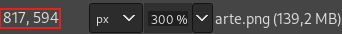

.. raw:: latex

	\clearpage

O espaço quadriculado ao centro é a área vazia da imagem, dê um zoom na
imagem na casa dos 300% ou mais posicione o mouse na borda entre o
quadriculado e a parte preta da imagem do lado **ESQUERDO** para
encontrar o valor de **x** e em **CIMA** para encontrar o valor de
**y**, para facilitar foram posicionados duas linhas azuis na imagem
abaixo indicando a posição que o mouse deve estar para obter as
coordenadas que são ``817`` e ``575``:

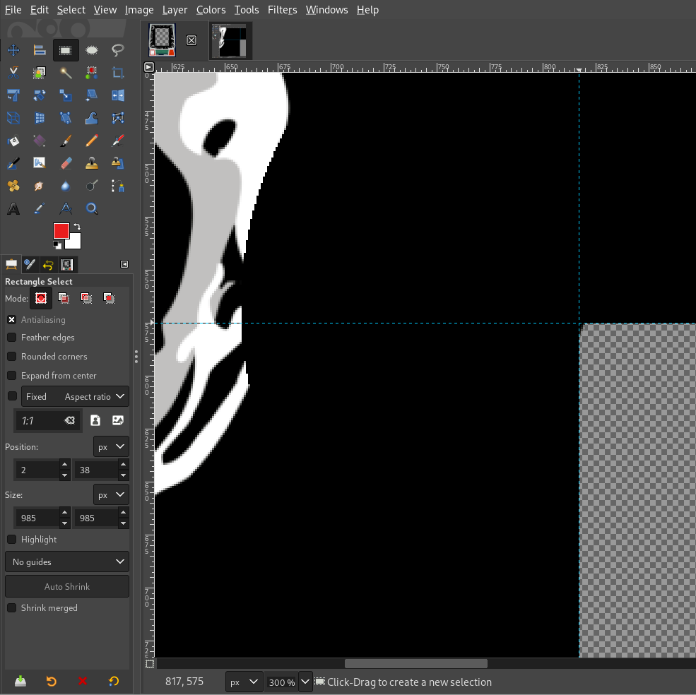

Uma maneira ainda mais fácil de se obter estes valores é pressionando a
tecla :kbd:`U` do seu teclado para selecionar a "varinha" ou a
:guilabel:`Ferramenta de seleção contígua`, clique dentro da área
quadriculada da imagem para selecioná-la. Em seguida pressione a tecla
:kbd:`R` ou a :guilabel:`Ferramenta de seleção retangular` e clique em
qualquer região da área quadriculada, no painel à esquerda deve aparecer
os mesmos valores para a coordenada **x** (``817``) e **y** (``575``):

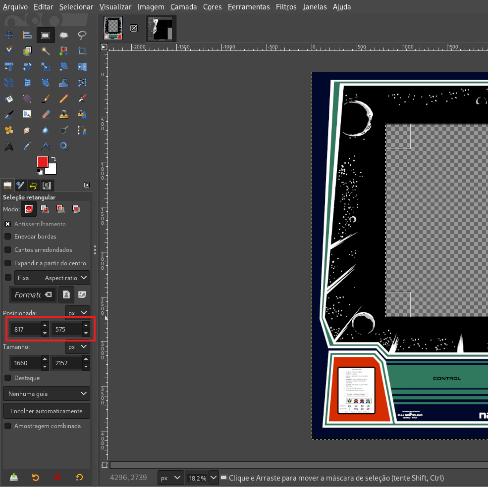

Observe que nem sempre haverá um vazio selecionável na imagem para ser
mensurado, assim sendo, utilize a técnica que funcionar melhor com o
desenho ou a arte que estiver utilizando.

Com a posição da tela definida agora é necessário dimensioná-la mantendo
a sua proporção **4:3** que é o padrão para a maioria dos arcades e
telas CRT da época. A tela está invertida com proporção **3:4** então
pegue o valor da **largura** como mostra a imagem acima e faça as
contas::

	x = 1660 * (4 / 3)
	x = 1660 * 1,333333333
	x = 2213

Ou utilize a ferramenta disponibilizada em :ref:`layfile-tools` para
facilitar o cálculo destas dimensões exibindo o mesmo resultado no campo
**3:4**.

Insira os valores no campo **verde**, o primeiro campo verde no topo
serve como uma fácil identificação da relação de aspecto da tela de um
valor qualquer, caso um valor seja inserido no segundo campo será feito
o cálculo da largura com base nos dados da primeira linha, se nenhum
valor for inserido, nada será calculado. O segundo campo em verde serve
para situações como demonstrada acima onde você identifica uma área
qualquer e quer saber qual seria a proporção *4:3 ideal* para ela, você
insere o valor da altura quando a tela for horizontal ou largura quando
a tela estiver na vertical para que a planilha calcule os valores.

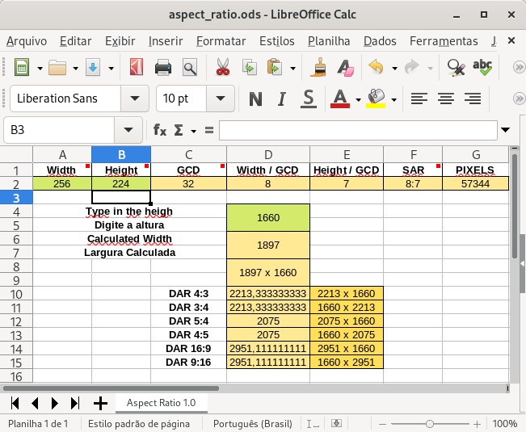

A planilha também faz o cálculo da largura com o valor do **SAR**
(Storage Aspect Ratio ou Relação de Aspecto da Origem), este valor é
vulgarmente conhecido como **pixel perfect**. Supondo que você vá fazer
um layout para um jogo de um determinado console e queira o tal "pixel
perfect", insira uma das resoluções do console no primeiro campo para
obter o **SAR** e descobrir o valor da largura com base neste **SAR**
em vez de utilizar o **DAR** (Display Aspect Ratio ou a Proporção da
Imagem na Tela).

Esta planilha foi criada com a intenção de facilitar os cálculos e para
ser usada no desenvolvimento dos layouts, ela não serve para nada muito
técnico ou avançado, porém a planilha está aberta, podendo ser alterada
para atender qualquer outra necessidade que você venha a ter.

.. note::

	Sempre que possível, procure usar valores inteiros na definição da
	resolução da sua tela. Em certas máquinas como a do exemplo acima
	não haverá qualquer diferença visível, contudo, certas máquinas não
	são tão tolerantes assim e podem apresentar pixels distorcidos na
	tela ou até mesmo artefatos estranhos durante o uso de shaders como
	o CRT-geom por exemplo. Assim, aumente o valor da altura na planilha
	até quem um valor inteiro seja encontrado.
	
	Se fosse o caso do exemplo acima, o valor ideal seria
	``1662`` x ``1899``.

Com o valor calculado em mãos, a resolução final será
``1660`` x ``2213``. Assim temos todos os valores para posicionarmos a
nossa tela emulada na tela (screen) e a sua correta proporção:

.. code-block:: xml

	<screen index="0">
		<bounds x="817" y="575" width="1660" height="2213" />
	</screen>

.. raw:: latex

	\clearpage

É possível organizar este layout de duas maneiras diferentes dependendo
do efeito que você queira dar ao seu design. O MAME organiza o layout em
camadas obedecendo a ordem em que elas forem definidas no arquivo de
layout, então a composição da sua tela emulada e o gráfico pode começar
com a ilustração no fundo e a tela emulada em cima desta arte:

.. code-block:: xml

	<element ref="Italiano">
		<bounds x="0" y="0" width="3296" height="4093" />
	</element>
	<screen index="0">
		<bounds x="817" y="575" width="1660" height="2213" />
	</screen>

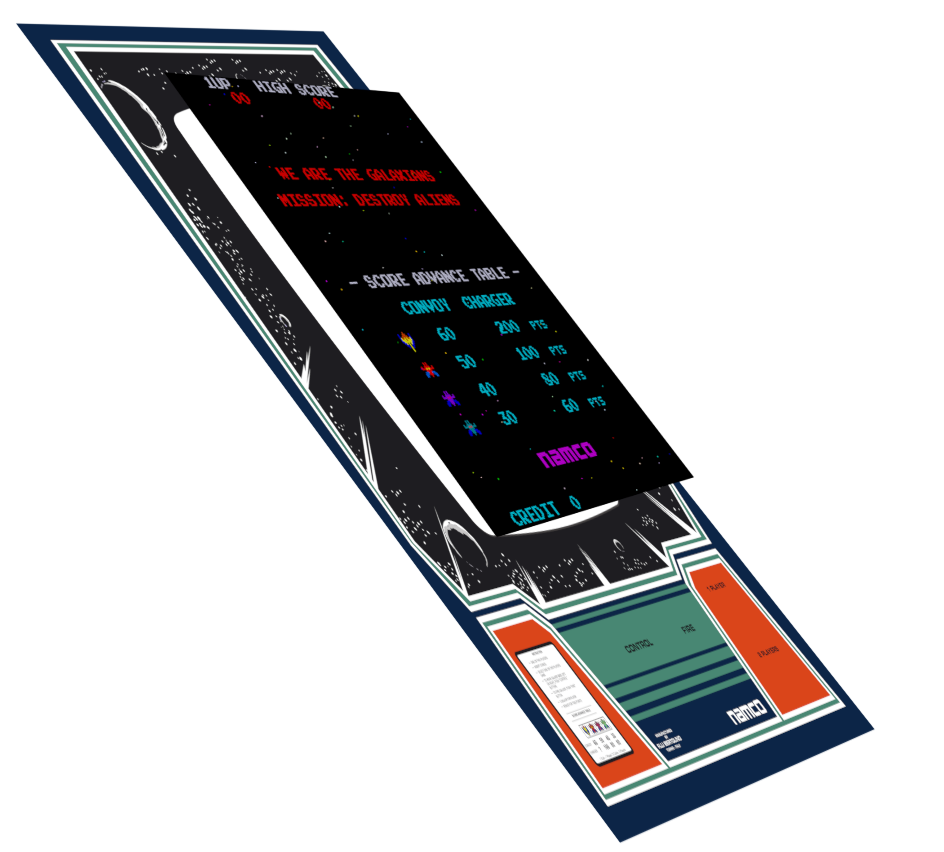

.. raw:: latex

	\clearpage

Ou ao contrário, com a arte gráfica por cima da tela:

.. code-block:: xml

	<screen index="0">
		<bounds x="817" y="575" width="1660" height="2213" />
	</screen>
	<element ref="Italiano">
		<bounds x="0" y="0" width="3296" height="4093" />
	</element>

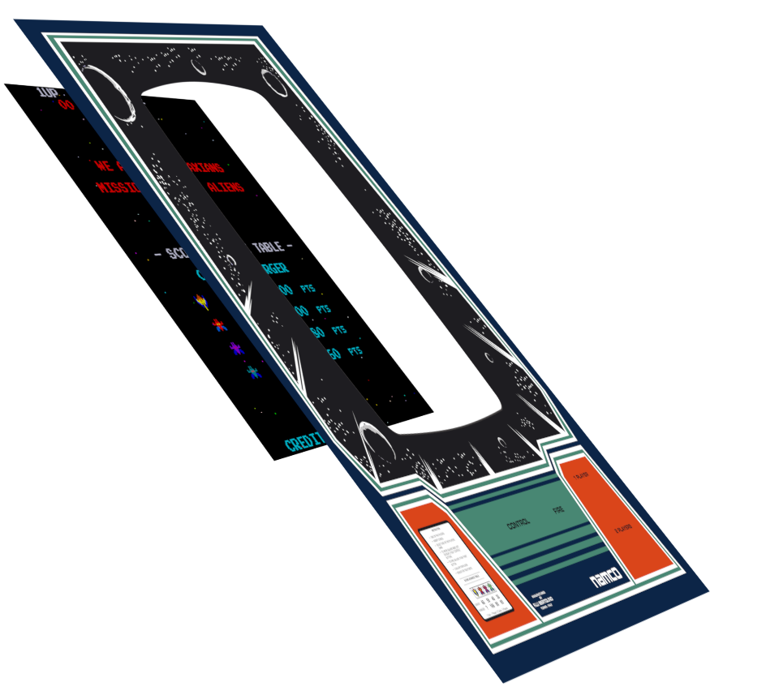

Os motivos de se escolher um ou outro depende do efeito final que você
queira dar na tela. A arte que estamos utilizando tem uma área preta na
região da tela fazendo com que ambos se misturem quase que criando uma
composição de um fundo infinito, porém caso eu queira dar um efeito de
tela recortada como uma tela CRT eu usaria a segunda opção para
aproveitar o recorte do design.

.. raw:: latex

	\clearpage

Na Galaxian não dá para perceber este recorte da tela pois tanto a arte
quanto a tela são pretas, porém com outras máquinas é possível por
exemplo, colocar uma moldura em volta da tela com efeitos de sombra,
como mostra `este exemplo <https://www.mediafire.com/file/gwt9yvwkgj14ws
f/mslug2.zip>`_:

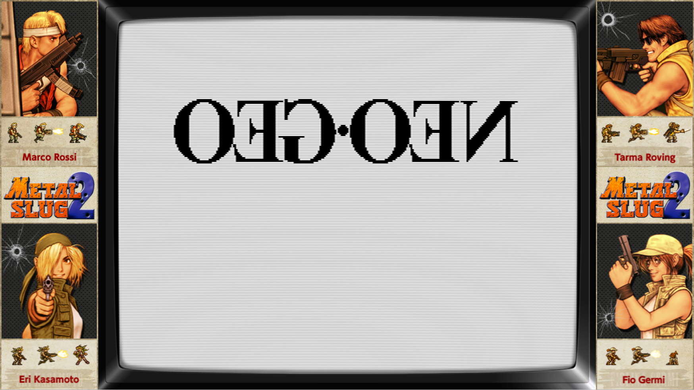

Neste caso nós definimos a tela primeiro, a arte e por último a moldura
(screen_bezel) da tela já com alguns efeitos de sombra e transparência:

.. code-block:: xml

	<screen index="0">
		<bounds x="292" y="43" width="1340" height="997" />
	</screen>
	<element ref="Artwork_1">
		<bounds x="0" y="0" width="1920" height="1080" />
	</element>
	<element ref="screen_bezel">
		<bounds x="272" y="0" width="1376" height="1080" />
	</element>

Repare que os efeitos da sombra e da transparência da moldura aparecem
perfeitamente sobre a tela emulada. Neste caso específico a tela foi um
pouco esticada horizontalmente para cobrir as barras pretas que aparecem
nos cantos da tela.

.. raw:: latex

	\clearpage

.. _layfile-button-posicionando:

Posicionando os botões na tela
~~~~~~~~~~~~~~~~~~~~~~~~~~~~~~

Para posicionar qualquer outra imagem na tela como botões, controles ou
o que quer que seja, será preciso estar com a arte que será usada no
MAME já aberta no *Gimp*, pegue a imagem de um botão por exemplo e
arraste para a tela do *Gimp*, ele deverá aparecer como uma camada,
posicione-o na região desejada e se for o caso redimensione-o usando a
ferramenta de redimensionamento :kbd:`Shift` + :kbd:`S`, para o botão
escolhi o tamanho de ``190`` **px**. Quando concluir selecione a camada
do botão com o botão direito do mouse e escolha :guilabel:`Alfa para a
seleção`, em seguida pressione :kbd:`R` ou escolha :guilabel:`Ferramenta
de seleção retangular` e clique na imagem do botão, na barra à esquerda
já deve aparecer as informações do tamanho e a posição na tela que seria
**x** ``1105`` e **y** ``3314`` com o tamanho de ``190`` x ``190``.

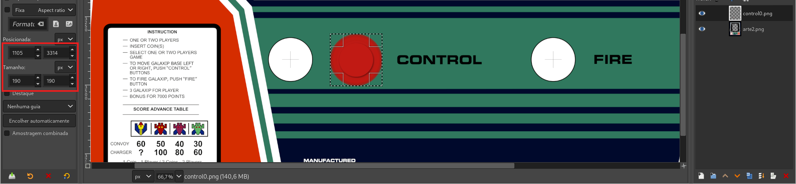

Com todos os botões posicionados e com os valores em mãos, temos então a
seguinte configuração para o botão ``esquerda``, ``direita`` e
``disparo``:

.. code-block:: xml

	<element ref="esquerda">
		<bounds x="867" y="3313" width="190" height="190" />
	</element>
	<element ref="direita">
		<bounds x="1105" y="3313" width="190" height="190" />
	</element>
	<element ref="disparo">
		<bounds x="1819" y="3313" width="190" height="190" />
	</element>

Outra maneira de se posicionar os botões na tela é utilizar os valores
centralizados, no modo descrito anteriormente a referência utilizada
como coordenadas é o limite da imagem do lado **esquerdo** ou **x** e o
limite do **topo** da imagem ou **y**. Os valores centralizados utilizam
exatamente a posição do ponteiro do mouse na tela e por isso tais
coordenadas são definidas como **xc** e **yc** como mostra a figura
abaixo:

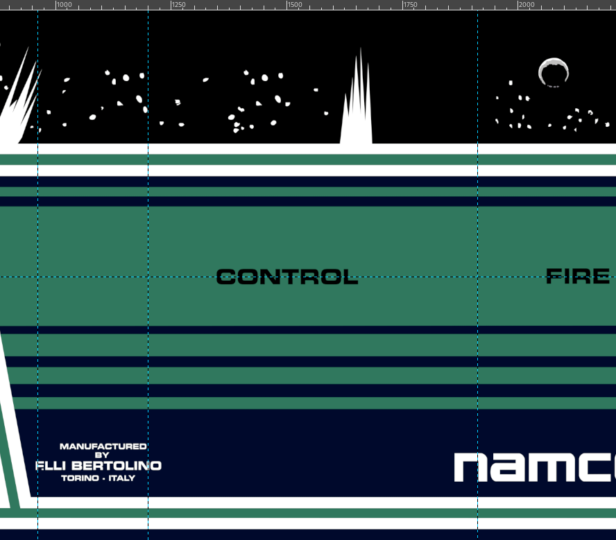

Posicione o ponteiro do mouse bem em cima onde as linhas se cruzam para
ver as coordenadas na parte de baixo da tela do *Gimp*, fica mais fácil
fazer um zoom com 300% ou mais, assim os valores podem ser encontrados
de forma mais precisa, para isso, posicione o ponteiro no ponto
desejado, mantenha pressionado :kbd:`Ctrl` e movimente a roda do mouse
para cima para aplicar o zoom na região do ponteiro do mouse:

.. code-block:: xml

	<element ref="esquerda">
		<bounds xc="962" yc="3407" width="190" height="190" />
	</element>
	<element ref="direita">
		<bounds xc="1201" yc="3407" width="190" height="190" />
	</element>
	<element ref="disparo">
		<bounds xc="1913" yc="3407" width="190" height="190" />
	</element>

.. raw:: latex

	\clearpage

.. _layfile-button-logica:

Conectando os botões e ativando as suas funções lógicas
~~~~~~~~~~~~~~~~~~~~~~~~~~~~~~~~~~~~~~~~~~~~~~~~~~~~~~~

A referência "ref" ``esquerda``, ``direita`` e ``disparo`` são os nomes
dos conjuntos das imagens definidos lá no começo, durante o inicio da
emulação o MAME identifica o ``defstate`` (condição/estado
inicial) inicial, como o seu valor é **0** (zero), a primeira imagem que
aparece será aquela que estiver definida como ``state=0``. Quando
acionarmos o botão e a sua condição mudar para ``state=1`` o MAME
carregará a imagem definida como ``state=1``, a mecânica para todo este
processo é bem simples:

.. code-block:: xml

	<element name="disparo" defstate="0">
		<image file="vermelho0.png" state="0" />
		<image file="vermelho1.png" state="1" />
	</element>

Para conectar os botões e para dar as suas funções lógicas é necessário
encontrar os valores para ``inputtag`` e ``inputmask`` onde ``inputtag``
é o nome da porta usada pela máquina para os controles e botões do
jogador 1, 2, etc. Já ``inputmask`` é o valor usado pela máquina para
definir os valores hexadecimais dos comandos, botões, etc.

Para encontrar estes valores, inicie a máquina Galaxian::

	mame galaxian

Pressione :kbd:`Tab` e vá em :guilabel:`Entrada (esta máquina)`.
Selecione :guilabel:`P1 Left`, no teclado clique na tecla :kbd:`Del`
para excluir o valor e usando o seu controle, joystick ou teclado,
clique no direcional para o lado esquerdo, faça o mesmo para
:guilabel:`P1 Right` e :guilabel:`P1 Button 1`, quando terminar,
pressione :kbd:`Tab` seguido de :kbd:`Esq` para encerrar a emulação.

Será criado dentro do diretório **cfg** um arquivo chamado
``galaxian.cfg``, abra-o em um editor de texto e veja que para cada
configuração feita para os controles e para o botão há um valor
específico para eles, aqui um exemplo usando um controle de
*Playstation 2*::

    <input>
        <port tag=":IN0" type="P1_JOYSTICK_LEFT" mask="4" defvalue="0">
            <newseq type="standard">
                JOYCODE_1_XAXIS_LEFT_SWITCH
            </newseq>
        </port>
        <port tag=":IN0" type="P1_JOYSTICK_RIGHT" mask="8" defvalue="0">
            <newseq type="standard">
                JOYCODE_1_XAXIS_RIGHT_SWITCH
            </newseq>
        </port>
        <port tag=":IN0" type="P1_BUTTON1" mask="16" defvalue="0">
            <newseq type="standard">
                JOYCODE_1_BUTTON3
            </newseq>
        </port>
    </input>

.. raw:: latex

	\clearpage

Para o botão de disparo :guilabel:`P1_BUTTON1` por exemplo, temos o
valor da porta ``tag=":IN0"`` que usaremos em ``inputtag`` e o valor
``mask="16"`` que usaremos em ``inputmask``, assim a nossa configuração
fica assim:

.. code-block:: xml

	<element ref="esquerda" inputtag="IN0" inputmask="4">
		<bounds x="867" y="3313" width="190" height="190" />
	</element>
	<element ref="direita" inputtag="IN0" inputmask="8">
		<bounds x="1105" y="3313" width="190" height="190" />
	</element>
	<element ref="disparo" inputtag="IN0" inputmask="16">
		<bounds x="1819" y="3313" width="190" height="190" />
	</element>

Na primeira definimos  que vamos associar a imagem **esquerda** na
entrada ``IN0`` e que seu código (máscara) para este botão é **4** e
assim sucessivamente, com isso nós conectamos e damos funções para as
imagens na parte lógica da máquina fazendo com que o MAME passe a
interpretá-las de forma animada na tela quando o botão for pressionado
no seu joystick ou seja acionado na tela quando for clicado pelo mouse.

Observe que não é preciso copiar os dois pontos **iniciais** existentes
em ``tag=":IN0"``, copie apenas o seu valor ``IN0``. Cada máquina possuí
a sua configuração específica, no caso das máquinas Neo Geo por exemplo
a **tag** aparece como ``tag=":edge:joy:JOY1"``, apenas ignore os dois
pontos iniciais e copie **todo** o resto, ou seja, a nossa ``inputtag``
para as máquinas Neo Geo ficaria ``inputtag="edge:joy:JOY1"``.

.. _layfile-button-alerta-retorno:

Alertas e retornos externos
~~~~~~~~~~~~~~~~~~~~~~~~~~~

A máquina *Galaxian* possui uma porta que sinaliza através de um sinal
luminoso quando 1 crédito é inserido, o sinal da lâmpada passa a piscar
indicando que o jogador deve clicar nele para iniciar a partida para o
jogador 1 e o mesmo ocorre quando dois créditos são inseridos indicando
o inicio da partida para o jogador 1 ou para o jogador 2. A versão da
máquina *Galaxian* Italiana não possui tais luzes porém vamos
adicioná-las mesmo assim para fins didáticos.

Usando o *Gimp*, posicione os botões para o jogador 1 e para o jogador 2,
escolhemos o tamanho de ``200`` x ``200`` **px** e então chegamos na
seguinte configuração:

.. code-block:: xml

	<element ref="J1" inputtag="IN1" inputmask="1">
		<bounds xc="2670" yc="3408" width="200" height="200" />
	</element>
	<element ref="J2" inputtag="IN1" inputmask="2">
		<bounds xc="2790" yc="3753" width="200" height="200" />
	</element>

Execute o MAME no terminal ou prompt de comando com a opção abaixo::

	mame -output console galaxian

Insira 2 créditos na máquina, repare no terminal que é possível ver os
valores ``lamp0`` e ``lamp1`` se alternando entre ``0`` (desligado) e
``1`` (ligado), são estes sinais que usaremos para fazer piscar uma
imagem na tela simulando uma lâmpada e indicando os créditos para os
respectivos jogadores.

É possível montar este layout de duas maneiras, posicionando a nossa
lâmpada uma a uma ou utilizando ``cont`` em conjunto com os
:ref:`layfile-concepts-params`. Imagine o seguinte cenário, você está
montando um layout onde precisa colocar *lamp0* até *lamp100* na tela, é
possível fazer isso de forma manual ou usar parâmetros para facilitar
escrevendo poucas linhas e deixando que o MAME lide com o resto.

Dada a simplicidade da máquina *Galaxian* não é preciso usar qualquer
parâmetro porém usaremos mesmo assim para que fique fácil a compreensão
de como isso funciona.

.. raw:: latex

	\clearpage

São duas lâmpadas ``lamp0`` e ``lamp1`` então contamos até 2:

.. code-block:: xml

	<repeat count="2">

No parâmetro nós definimos que a variável ``i`` inicie uma contagem, que
comece a partir do ``0`` (zero) e termine em ``1``.

.. code-block:: xml

	<param name="i" start="0" increment="1" />

A nossa "lâmpada" será um anel azul que vai aparecer e sumir na tela
simulando um pisca-pisca. Definimos os parâmetros para a posição deste
primeiro anel azul (pisca) no eixo x (horizontal), **x** é o nome da
nossa variável e esta pode ter qualquer nome, escolhemos **x** para
facilitar a identificação do eixo horizontal, ``start`` define a posição
inicial do anel que fica bem em cima da posição do botão **J1**
(Jogador 1) como descrito na configuração alguns parágrafos atrás, não
precisamos fazer nenhum deslocamento no eixo x, portanto o valor de
``increment`` é zero.

.. code-block:: xml

	<param name="x" start="2790" increment="0" />

Fazemos o mesmo para o eixo y (vertical), para que o segundo anel azul
possa ficar alinhado exatamente onde queremos realizado o cálculo
abaixo.
O cálculo serve para descobrir quantos pixels a mais eu preciso para
deslocar o anel azul da primeira coordenada no eixo y a partir da
posição do **J1** (``3408``) até a segunda coordenada vertical do eixo y
(``3753``) do **J2**. A conta foi organizada para que o minuendo tenha o
maior valor que o subtraendo para que se obtenha um número inteiro
positivo::

	increment = J2 y - J1 y
	increment = 3753 - 3408
	increment = 345 

Definimos uma variável **y** para facilitar a identificação do eixo y
(vertical), nós começamos na coordenada ``3408`` e para que o anel azul
fique em cima do botão **J2** precisamos deslocá-lo ``345`` pixels.

.. code-block:: xml

	<param name="y" start="3408" increment="345" />

Aqui é onde toda a mágica acontece, usaremos as variáveis que definimos
para que elas sejam substituídas automaticamente pelos seus respectivos
valores, aqui o valor da variável ``~i~`` será automaticamente
substituído por ``0`` e ``1``, então ``lamp~i~`` se transforma em
``lamp0`` e ``lamp1`` respectivamente, repare que utilizamos apenas 1
linha para isso, se fosse o caso para 100 lamps seria a mesma coisa:

.. code-block:: xml

	<element name="lamp~i~" ref="pisca">

Para ficar fácil a compreensão do resultado, a linha acima se traduziria
desta forma para o MAME:

.. code-block:: xml

	<element name="lamp0" ref="pisca">
	<element name="lamp1" ref="pisca">

**Pisca** está definido com os parâmetros:

.. code-block:: xml

	<element name="pisca" defstate="0">
		<image file="pisca1.png" state="1" />
	</element>

O valor de ``lamp0`` sempre retorna ``0`` (zero) quando estiver
desligado e ``1`` (um) quando estiver ligado, o mesmo acontece com
``lamp1``, como não é preciso definir nada para quando ``lamp0`` e
``lamp1`` estiverem desligados basta definir apenas a condição de
ligado, portanto ``defstate="0"`` estabelece a sua condição inicial é
``0`` ou não faça nada, o anel azul só vai aparecer caso a sua condição
mude para 1 através do ``state="1"``.

.. raw:: latex

	\clearpage

As variáveis ``~x~`` e ``~y~`` são substituídas pelos seus respectivos
valores que foram definidos anteriormente fazendo com que a imagem do
anel azul seja posicionada corretamente no eixo **x** (horizontal) e no
eixo **y** (vertical), assim como definimos que o seu tamanho será pouca
coisa maior que o desenho do botão para que ele cubra um pouco a mais
dos limites do botão, assim o valor seria de ``250`` **pixels** de
largura por ``250`` **pixels** de altura.

.. code-block:: xml

	<bounds xc="~x~" yc="~y~" width="250" height="250" />
	</element>

O atributo abaixo encerra as definições para ``repeat``

.. code-block:: xml

	</repeat>

Finalizamos o nosso layout com os dois últimos itens:

.. code-block:: xml

	</view>
	</mamelayout>

.. raw:: latex

	\clearpage

Este é o nosso arquivo completo:

.. code-block:: xml

	<?xml version="1.0"?>
	<!-- Layout file created by: Wellington Terumi Uemura
		Bezel design by: Etienne MacGyver
		Round Buttons design by: u/cd4053
		License: CC by 4.0
		https://mamedoc.readthedocs.io/pt/latest/techspecs/layout_files.html
	 -->
	<mamelayout version="2">
	<element name="Italiano">
		<image file="arte.png" />
	</element>
	<element name="J1" defstate="0">
		<image file="btn0.png" state="0" />
		<image file="btn1.png" state="1" />
	</element>
	<element name="J2" defstate="0">
		<image file="btn0.png" state="0" />
		<image file="btn1.png" state="1" />
	</element>
	<element name="disparo" defstate="0">
		<image file="vermelho0.png" state="0" />
		<image file="vermelho1.png" state="1" />
	</element>
	<element name="esquerdo" defstate="0">
		<image file="vermelho0.png" state="0" />
		<image file="vermelho1.png" state="1" />
	</element>
	<element name="direito" defstate="0">
		<image file="vermelho0.png" state="0" />
		<image file="vermelho1.png" state="1" />
	</element>
	<element name="pisca" defstate="0">
		<image file="pisca1.png" state="1" />
	</element>
	<view name="Galaxian Italiano">
	<element ref="Italiano">
		<bounds x="0" y="0" width="3296" height="4093" />
	</element>
	<screen index="0">
		<bounds x="817" y="575" width="1660" height="2213" />
	</screen>
	<element ref="J1" inputtag="IN1" inputmask="1">
		<bounds xc="2790" yc="3408" width="200" height="200" />
	</element>
	<element ref="J2" inputtag="IN1" inputmask="2">
		<bounds xc="2790" yc="3753" width="200" height="200" />
	</element>
	<element ref="esquerdo" inputtag="IN0" inputmask="4">
		<bounds xc="962" yc="3407" width="190" height="190" />
	</element>
	<element ref="direito" inputtag="IN0" inputmask="8">
		<bounds xc="1201" yc="3407" width="190" height="190" />
	</element>
	<element ref="disparo" inputtag="IN0" inputmask="16">
		<bounds xc="1913" yc="3407" width="190" height="190" />
	</element>
	<repeat count="2">
		<param name="i" start="0" increment="1" />
		<param name="x" start="2790" increment="0" />
		<param name="y" start="3408" increment="345" />
		<element name="lamp~i~" ref="pisca">
		<bounds xc="~x~" yc="~y~" width="250" height="250" />
	</element>
	</repeat>
	</view>
	</mamelayout>

.. _layfile-funcionar-efeitos:

Colocando para funcionar e adicionando efeitos na tela
~~~~~~~~~~~~~~~~~~~~~~~~~~~~~~~~~~~~~~~~~~~~~~~~~~~~~~

Para ver a nossa criação funcionar, dentro do diretório do MAME existe
o diretório **artwork**, dentro deste diretório crie um novo chamado
**galaxian**, dentro deste diretório coloque o arquivo acima com o nome
``default.lay`` e todos os arquivos **\*.png**. Rode o mame com o
comando::

	mame -window galaxian

A tela deve aparecer com a arte e todos os botões em seus respectivos
lugares, experimente clicar nos botões com o mouse e verá que eles
reagem ao seu clique, ao adicionar 2 créditos o nosso anel azul deve
aparecer simulando o piscar de uma luz.

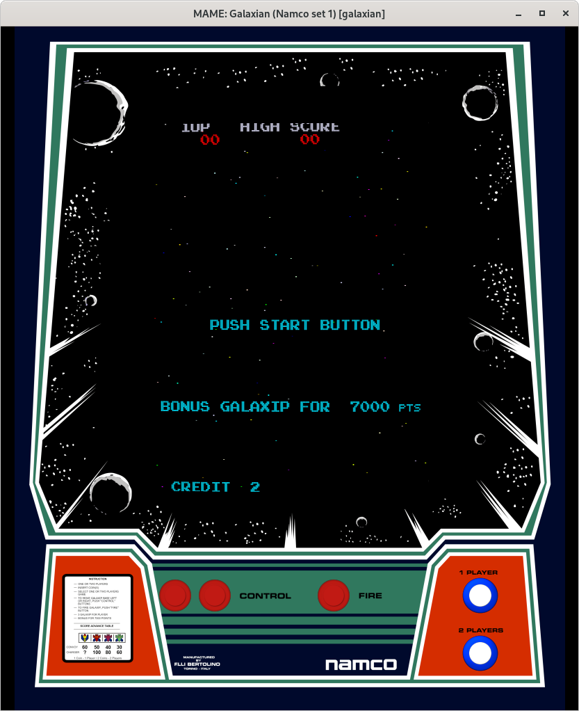

O MAME aceita trabalhar com o diretório como está ou então comprimindo-o
em formato .zip ou .7zip. Ao usar a arte como um diretório permite que
você altere alguma coisa enquanto realiza testes, caso altere o arquivo
ou alguma imagem, é possível recarregar todos eles sem precisar encerrar
o MAME pressionando :kbd:`Shift` + :kbd:`F3`.

.. raw:: latex

	\clearpage

Caso queira aplicar shaders na tela para dar um efeito de uma tela CRT
como mostra a foto, baixe `este arquivo <https://drive.google.com/file/d
/0B10tgIdlTMwYSWt2emJtbU81NGc/view?usp=sharing>`_, descompacte-o dentro
de um diretório chamado **glsl**. Vá até o diretório **ini** e crie o
arquivo ``galaxian.ini`` e dentro dele adicione estas opções::

	video                     opengl
	gl_glsl                   1
	gl_glsl_filter            1

	# No Windows use
	glsl_shader_mame0 glsl\osd\CRT-geom

	# No Linux use
	glsl_shader_mame0 glsl/osd/CRT-geom

Ao rodar o *galaxian* novamente a tela terá uma aparência de um CRT,
caso queira manter a aparência porém eliminando um pouco a curvatura da
tela, edite o arquivo ``CRT-geom.vsh`` e use estas configurações::

	// START of parameters
	
	// gamma of simulated CRT
	CRTgamma = 2.2;
	// gamma of display monitor (typically 2.2 is correct)
	monitorgamma = 2.2;
	// overscan (e.g. 1.02 for 2% overscan)
	overscan = vec2(1.01,1.01);
	// aspect ratio
	aspect = vec2(1.0, 0.75);
	// lengths are measured in units of (approximately) the width of the monitor
	// simulated distance from viewer to monitor
	d = 2.0;
	// radius of curvature
	R = 10.0;
	// tilt angle in radians
	// (behavior might be a bit wrong if both components are nonzero)
	const vec2 angle = vec2(0.01,0.01);
	// size of curved corners
	cornersize = 0.03;
	// border smoothness parameter
	// decrease if borders are too aliased
	cornersmooth = 1000.0;
	
	// END of parameters

Caso queira aplicar essas configurações para **TODAS** as máquinas
classificadas como **Arcade**, então renomeie o arquivo ``galaxian.ini``
para ``arcade.ini``, assim a máquina **Galaxian** e muitas outras terão
este efeito na tela.

Altere o valor do ``overscan`` de ``vec2(1.01,1.01)`` para
``vec2(1.00,1.00)`` para que a tela apareça completa na tela.

.. raw:: latex

	\clearpage

.. _layfile-advanced-settings:

Adicionando diagonais nos controles com 8 direções usando o inputraw
~~~~~~~~~~~~~~~~~~~~~~~~~~~~~~~~~~~~~~~~~~~~~~~~~~~~~~~~~~~~~~~~~~~~

Algumas máquinas possuem controles simples como a própria **Galaxian**
tem apenas 2 direções, **esquerda** e **direita**, outras como
**Pacman** possuem 4 direções, **cima**, **baixo**, **esquerda**,
**direita**. Nestes casos a criação de um layout animado para o controle
por exemplo é bem simples, basta adicionar uma imagem para cada posição
associando-a com os seus respectivos ``inputtag`` e ``inputmask`` para
que seja possível ver a sua animação na tela quando cada uma das
posições forem acionadas, no entanto a coisa muda um pouco quando se
trata de uma máquina com um joystick com 8 direções (ou mais).

Nestes casos, quando qualquer uma das diagonais é acionada o MAME
sobrepõem outras imagens uma em cima da outra, caso a diagonal superior
direita seja acionada no controle, o MAME irá exibir a imagem para a
diagonal superior direita em cima da imagem **cima** e em cima da
imagem **direita** ou seja, em vez de aparecer apenas uma imagem para a
diagonal escolhida irão aparecer outras duas. Na internet diferentes
pessoas encontraram diferentes soluções para o problema, algumas
criaram imagens na diagonal com um tamanho suficiente para cobrir as
duas outras imagens dentre diversas outras soluções.

Outra maneira de lidar com o problema é utilizar o ``inputraw``, com
esta opção o MAME faz a leitura dos dados diretamente da entrada do
controle, vamos aproveitar o layout que acabamos de criar para a máquina
**Galaxian** e ver como isso ficaria modificando a lógica para os
controles e adicionando 3 imagens para simular um joystick:

.. code-block:: xml

	<element name="controle"		defstate="0xc">
		<image file="esquerda.png"	state="0x1" />
		<image file="direita.png"	state="0x2" />
		<image file="centro.png"	state="0x0" />
	</element>

Assim como foi feito anteriormente, usamos o *Gimp* para posicionar o
joystick na região que queremos que ele apareça, com as coordenadas em
mãos nós montamos toda a lógica dele:

.. code-block:: xml

	<element ref="controle" inputtag="IN0" inputmask="0xc" inputraw="yes">
		<bounds x="1010" y="3260" width="250" height="250" />
	</element>

Agora em vez de 2 botões vermelhos nós temos um joystick preto na
posição que escolhemos e se move conforme nós mexemos nos controles.
Fica claro que a quantidade de linhas necessárias para que esta animação
aconteça se reduz deixando o layout mais enxuto e simplificado.

Note que ao clicar com o mouse em cima do controle ele faz um movimento
indesejado, para evitar essa anomalia adicionamos uma camada de "nada"
com o mesmo tamanho da imagem do controle e exatamente na mesma posição:

.. code-block:: xml

	<element name="nada" defstate="0">
		<text string=" " />
	</element>

E aplicamos isso **antes** do controle com ``inputmask="0x00"`` pois o
MAME interpreta estes elementos na ordem que eles aparecem no layout,
assim temos a camada "nada" sendo construída primeiro seguida do
controle logo abaixo desta camada, bloqueando qualquer interação do
mouse:

.. code-block:: xml

	<element ref="nada" blend="add" inputtag="IN0" inputmask="0x00" inputraw="yes">
		<bounds x="1010" y="3260" width="250" height="250" />
	</element>
	<element ref="controle" inputtag="IN0" inputmask="0xc" inputraw="yes">
		<bounds x="1010" y="3260" width="250" height="250" />
	</element>

Ao executar a máquina novamente o controle não mais responde aos cliques
do mouse.

Como estamos trabalhando com dados vindos diretamente dos controles, é
necessário encontrar os valores para ``defstate``, ``inputmask`` e para
``state``.
O ``defstate`` e o ``inputmask`` utilizam o mesmo valor, este valor
**precisa ser calculado**, para isso acessamos o
`código fonte do driver Galaxian <https://github.com/mamedev/mame/blob/m
aster/src/mame/drivers/galaxian.cpp#L2836>`_, bem na linha ``2634`` de
cara já temos o nosso ``inputtag`` com o valor ``IN0`` que utilizamos
acima, observe quem nem sempre o valor do ``inputtag`` está disponível
assim tão fácil, o driver **Playstaion** (psx) por exemplo utiliza
``port1:digital_pad:PSXPAD0``, já a máquina **Neo Geo** usa
``edge:joy:JOY1`` e assim por diante. Para casos como estes é preferível
neste caso é preferível utilizar a maneira descrita no capítulo
:ref:`layfile-button-logica`.

A Galaxian tem apenas duas direções, esquerda e direita, preste atenção
ao valor ``0x04`` para ``IPT_JOYSTICK_LEFT`` e ``0x08`` para
``IPT_JOYSTICK_RIGHT``. Abra a calculadora do seu celular ou do seu
sistema operacional em modo programador ou qualquer função que consiga
somar valores em **hexadecimais** e some os valores ``4`` + ``8`` para
obter ``c`` ou ``0xc``, este é o valor do nosso ``defstate`` e
``inputmask`` **específicos para esta máquina**, dependendo da máquina
este valor pode mudar, é possível ter uma ideia vendo a tabela logo
abaixo.

Já os valores para ``state`` vão de ``0x0`` até ``0xf`` nas máquinas
mais comuns, porém em outras máquinas mais complexas como as máquinas
de corrida de carro e de moto que usam um volante ou guidão, os valores
vão muito além disso. O assunto foge ao escopo do que estamos
apresentando aqui então recomendo o belo trabalho do
`Mr.Do <https://mrdo.mameworld.info/mame_artwork_ingame.php>`_ e de
todas as pessoas que colaboram com aquele projeto, baixe o arquivo
**hangon.ZIP** e veja um exemplo de até onde o nível de complexidade
pode chegar.

Até o presente momento não há uma ferramenta que ajude a obter os
valores para ``state`` e portanto eles devem ser encontrados de forma
**manual** o que dá um certo trabalho, para facilitar, veja o exemplo da
tabela abaixo com os valores para algumas máquinas:

.. _layfile-codigos-direcionais:

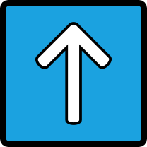
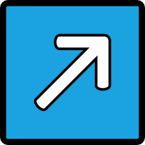
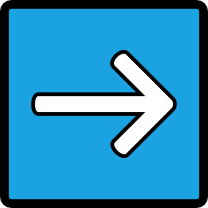

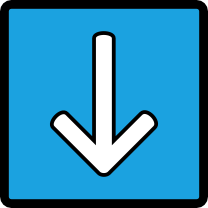

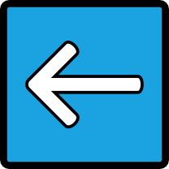
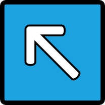
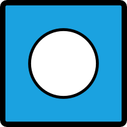

.. tabularcolumns:: |c|c|c|c|c|c|c|c|c|c|c|

.. list-table:: Códigos dos direcionais de alguns drivers

   * - Driver
     - defstate
     - |cima|
     - |sdir|
     - |dire|
     - |idir|
     - |baix|
     - |iesq|
     - |esqu|
     - |sesq|
     - |cent|
   * - cps1
     - ``0xf``
     - ``0x7``
     - ``0x6``
     - ``0xe``
     - ``0xa``
     - ``0xb``
     - ``0x9``
     - ``0xd``
     - ``0x5``
     - ``0xf``
   * - cps2
     - ``0xf``
     - ``0x7``
     - ``0x6``
     - ``0xe``
     - ``0xa``
     - ``0xb``
     - ``0x9``
     - ``0xd``
     - ``0x5``
     - ``0xf``
   * - cps3
     - ``0xf``
     - ``0xe``
     - ``0x6``
     - ``0x7``
     - ``0x5``
     - ``0xd``
     - ``0x9``
     - ``0xb``
     - ``0xa``
     - ``0xf``
   * - ddragon
     - ``0xf``
     - ``0xb``
     - ``0xa``
     - ``0xe``
     - ``0x6``
     - ``0x7``
     - ``0x5``
     - ``0xd``
     - ``0x9``
     - ``0xf``
   * - dkong
     - ``0xf``
     - ``0x4``
     - 
     - ``0x1``
     - 
     - ``0x8``
     - 
     - ``0x2``
     - 
     - ``0x0``
   * - galaxian
     - ``0xc``
     - 
     - 
     - ``0x1``
     - 
     - 
     - 
     - ``0x2``
     - 
     - ``0x0``
   * - kinst
     - ``0x3c0``
     - ``0xe``
     - ``0x6``
     - ``0x7``
     - ``0x5``
     - ``0xd``
     - ``0x9``
     - ``0xb``
     - ``0xa``
     - ``0xf``
   * - m72/m92
     - ``0xf``
     - ``0x7``
     - ``0x6``
     - ``0xe``
     - ``0xa``
     - ``0xb``
     - ``0x9``
     - ``0xd``
     - ``0x5``
     - ``0xf``
   * - midtunit
     - ``0xf``
     - ``0xe``
     - ``0x6``
     - ``0x7``
     - ``0x5``
     - ``0xd``
     - ``0x9``
     - ``0xb``
     - ``0xa``
     - ``0xf``
   * - midwunit
     - ``0xf``
     - ``0xe``
     - ``0x6``
     - ``0x7``
     - ``0x5``
     - ``0xd``
     - ``0x9``
     - ``0xb``
     - ``0xa``
     - ``0xf``
   * - model1
     - ``0xf0``
     - ``0xd``
     - ``0x9``
     - ``0xb``
     - ``0xa``
     - ``0xe``
     - ``0x6``
     - ``0x7``
     - ``0x5``
     - ``0xf``
   * - nemesis
     - ``0xf``
     - ``0xb``
     - ``0x9``
     - ``0xd``
     - ``0x5``
     - ``0x7``
     - ``0x6``
     - ``0xe``
     - ``0xa``
     - ``0xf``
   * - neogeo
     - ``0xf``
     - ``0xe``
     - ``0x6``
     - ``0x7``
     - ``0x5``
     - ``0xd``
     - ``0x9``
     - ``0xb``
     - ``0xa``
     - ``0xf``
   * - pacman
     - ``0xf``
     - ``0xe``
     - 
     - ``0xb``
     - 
     - ``0x7``
     - 
     - ``0xd``
     - 
     - ``0xf``
   * - psx
     - ``0xf0``
     - ``0xe``
     - ``0xc``
     - ``0xd``
     - ``0x9``
     - ``0xb``
     - ``0x3``
     - ``0x7``
     - ``0x6``
     - ``0xf``
   * - segas16a
     - ``0xf0``
     - ``0xd``
     - ``0x9``
     - ``0xb``
     - ``0xa``
     - ``0xe``
     - ``0x6``
     - ``0x7``
     - ``0x5``
     - ``0xf``
   * - segas18
     - ``0xf0``
     - ``0xd``
     - ``0x9``
     - ``0xb``
     - ``0xa``
     - ``0xe``
     - ``0x6``
     - ``0x7``
     - ``0x5``
     - ``0xf``
   * - seibuspi
     - ``0xf``
     - ``0xe``
     - ``0x6``
     - ``0x7``
     - ``0x5``
     - ``0xd``
     - ``0x9``
     - ``0xb``
     - ``0xa``
     - ``0xf``
   * - simpsons
     - ``0xf``
     - ``0xb``
     - ``0x9``
     - ``0xd``
     - ``0x5``
     - ``0x7``
     - ``0x6``
     - ``0xe``
     - ``0xa``
     - ``0xf``
   * - stv
     - ``0xf0``
     - ``0xd``
     - ``0x9``
     - ``0xb``
     - ``0x6``
     - ``0xe``
     - ``0x6``
     - ``0x7``
     - ``0x5``
     - ``0xf``
   * - tmnt
     - ``0xf``
     - ``0xb``
     - ``0x9``
     - ``0xd``
     - ``0x5``
     - ``0x7``
     - ``0x6``
     - ``0xe``
     - ``0xa``
     - ``0xf``
   * - toaplan2
     - ``0xf``
     - ``0x1``
     - ``0x9``
     - ``0x8``
     - ``0xa``
     - ``0x2``
     - ``0x6``
     - ``0x4``
     - ``0x5``
     - ``0x0``

.. raw:: latex

	\clearpage

Aqui vai a **dica de ouro** para quem for criar os seus próprios layouts
com o método ``inputraw``, se ao carregar um layout a imagem usada para
o centro (posição neutra do controle) **não aparecer** ou se durante o
acionamento do direcional uma das posições sumir da tela, significa que:

* O valor do ``inputtag`` está errado.
* O valor do ``state`` está errado.
* O valor do ``defstate`` não foi calculado corretamente.

Todos estes valores variam de máquina para máquina, em determinadas
máquinas por exemplo, ainda que o valor ``inputtag`` esteja incorreto a
imagem do controle relacionada ao ponto neutro ou **centro** poderá
aparecer ou não e em outras vezes apesar da imagem do ponto neutro
aparecer, não haverá qualquer animação do controle na tela. Para a
maioria das máquinas avaliadas o ``state`` para o ponto neutro funciona
com o valor ``0xf``, contudo há algumas máquinas onde o valor precisa
ser alterado para ``0x0`` para que funcione ou algum outro valor onde
este irá depender do tipo da máquina emulada. Quando você movimenta os
direcionais e nota que o controle fica piscando na tela, este é um bom
indicativo que você está no caminho certo pois indica que a combinação
``inputtag`` e ``inputmask`` está correta e apenas os valores para o
``state`` estão errados.

Nos casos onde a animação aparece invertida na tela como por exemplo se
ao clicar para cima o controle na tela aparece para baixo e assim por
diante, basta inverter os valores dos seus respectivos ``state`` e
clicar em **SHIFT+F3** para recarregar o arquivo e ver como ficou.

Há casos onde nenhum dos valores da tabela mostrada acima vai funcionar
com a máquina que você estiver desenvolvendo o layout mesmo que os
valores estejam corretos para ``inputtag``, ``defstate`` e
``inputmask``. Nestes casos inicie a sua configuração com todos os
valores ``state`` zerados:

.. code-block:: xml

	<element name="controle"		defstate="0xf">
		<image file="cima.png"		state="0x0" />
		<image file="baixo.png"		state="0x0" />
		<image file="esquerda.png"	state="0x0" />
		<image file="direita.png"	state="0x0" />
		<image file="centro.png"	state="0xf" />
	</element>

Comece alterando o valor ``state`` para o comando **cima**, comece com
``0x1`` e vá subindo, clique :kbd:`Shift` + :kbd:`F3` a cada alteração
para ver se alteração surtiu algum efeito. É muito comum encontrar um
determinado valor onde você aciona o controle para cima e ocorre uma
animação para qualquer outra direção, supondo que a animação que
apareceu foi para baixo, altere o valor do ``state`` relacionado com
**baixo.png** e continue incrementando o valor até chegar em ``0xf``,
depois comece novamente a partir de ``0x1``. Observe que alguns valores
já testados e que não retornaram nenhuma animação agora passam a
responder, continue definindo os valores encontrados para as suas
respectivas posições até encontrar todos os valores.

.. raw:: latex

	\clearpage

.. _layfile-dois-ou-mais:

Máquinas com dois ou mais controles
~~~~~~~~~~~~~~~~~~~~~~~~~~~~~~~~~~~

Em máquinas com dois ou mais controles como a **Neo Geo** por exemplo,
nós fazemos assim:

.. code-block:: xml

	<element name="controle"		defstate="0xf">
		<image file="baixodireito.png"	state="0x5" />
		<image file="cimadireita.png"	state="0x6" />
		<image file="direita.png"	state="0x7" />
		<image file="baixoesquerdo.png"	state="0x9" />
		<image file="cimaesquerda.png"	state="0xa" />
		<image file="esquerda.png"	state="0xb" />
		<image file="baixo.png"		state="0xd" />
		<image file="cima.png"		state="0xe" />
		<image file="centro.png"	state="0xf" />
	</element>
	
	</element>
	<element ref="nada" blend="add" inputtag="edge:joy:JOY1" inputmask="0x00" inputraw="yes">
		<bounds x="158" y="794" width="150" height="150" />
	</element>
	<element ref="controle" inputtag="edge:joy:JOY1" inputmask="0xf" inputraw="yes">
		<bounds x="158" y="794" width="150" height="150" />
	</element>
	<element ref="nada" blend="add" inputtag="edge:joy:JOY2" inputmask="0x00" inputraw="yes">
		<bounds x="665" y="794" width="150" height="150" />
	</element>
	<element ref="controle" inputtag="edge:joy:JOY2" inputmask="0xf" inputraw="yes">
		<bounds x="665" y="794" width="150" height="150" />
	</element>

Ambos os controles utilizam os mesmos valores para ``state`` e
``defstate``, o que muda é o valor do ``inputtag`` onde
``edge:joy:JOY1`` define que este é o controle do **jogador 1** e que
``edge:joy:JOY2`` é o controle do **jogador 2**.

Contudo há máquinas como a **CPS2** que apresentam o mesmo valor ``IN0``
no ``inputtag`` para ambos os jogadores, nestes casos devemos recorrer
novamente ao código fonte do MAME para este driver, observando a linha
`#1001 <https://github.com/mamedev/mame/blob/master/src/mame/drivers/cps2.cpp#L1001>`_
nós temos os 4 valores para a porta do 2º jogador ``PORT_PLAYER(2)``,
temos o valor ``100`` para a direita, ``200`` para a esquerda, ``400``
para baixo e ``800`` para cima. Assim foi feito anteriormente, some
todos os valores hexadecimais com uma calculadora compatível para obter
o valor ``f00`` ou seja ``100`` + ``200`` + ``400`` + ``800`` = ``f00``.

.. raw:: latex

	\clearpage

Este é o valor que deve ser usado no ``inputmask`` da configuração do
controle do 2º jogador como mostra o exemplo abaixo que também funcionam
para todas as outras máquinas existentes no driver **CPS2** do MAME:

.. code-block:: xml

	<element name="controle"		defstate="0xf">
		<image file="cimaesquerda.png"	state="0x5" />
		<image file="cimadireita.png"	state="0x6" />
		<image file="cima.png"		state="0x7" />
		<image file="baixoesquerda.png"	state="0x9" />
		<image file="baixodireita.png"	state="0xa" />
		<image file="baixo.png"		state="0xb" />
		<image file="esquerda.png"	state="0xd" />
		<image file="direita.png"	state="0xe" />
		<image file="centro.png"	state="0xf" />
	</element>
	
	<element ref="nada" blend="add" inputtag="IN0" inputmask="0x00" inputraw="1">
		<bounds x="158" y="794" width="150" height="150" />
	</element>
	<element ref="controle_J1" inputtag="IN0" inputmask="0xf" inputraw="1">
		<bounds x="158" y="794" width="150" height="150" />
	</element>
	<element ref="nada" blend="add" inputtag="IN0" inputmask="0x00" inputraw="1">
		<bounds x="665" y="794" width="150" height="150" />
	</element>
	<element ref="controle_J2" inputtag="IN0" inputmask="0xf00" inputraw="1">
		<bounds x="665" y="794" width="150" height="150" />
	</element>

.. raw:: latex

	\clearpage

Utilize o **layout modelo** disponibilizado em :ref:`layfile-tools` para
realizar testes em diferentes máquinas e obter uma visualização simples
e rápida dos controles, depois de baixar e extrair o arquivo, copie-o
para o diretório **artwork** e o renomeie com o nome da máquina que será
testada, para o exemplo usado na foto o nome do diretório é
**ssriders**. Rodando o comando ``mame -window ssriders`` irá
aparecer uma tela com um design branco genérico, será possível escolher
um modelo para 2 ou 4 jogadores através do menu
:guilabel:`Opções do Vídeo` (:kbd:`TAB` --> :menuselection:`Opções
do vídeo`), faça as alterações necessárias no arquivo de layout e para
visualizar na tela pressione :kbd:`Shift` + :kbd:`F3`.

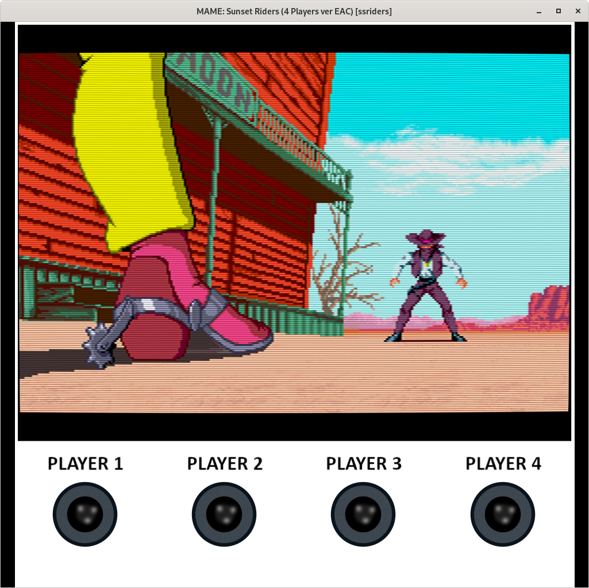

Abaixo as teclas predefinidas do MAME para os 4 jogadores, para mais
informações consulte :ref:`mamemenu-general-inputs-P1`.

.. tabularcolumns:: |c|c|c|c|c|

.. list-table:: Teclas predefinidas do MAME para o controle dos jogadores

   * - 1º Jogador
     - Direcional **cima**
     - Direcional **baixo**
     - Direcional **esquerda**
     - Direcional **direita**
   * - 2º Jogador
     - **R**
     - **F**
     - **G**
     - **D**
   * - 3º Jogador
     - **I**
     - **K**
     - **J**
     - **L**
   * - 4º Jogador
     - Teclado num. **8**
     - Teclado num. **2**
     - Teclado num. **4**
     - Teclado num. **6**

.. raw:: latex

	\clearpage

.. _layfile-mais-de-uma-visualizacao:

Um único arquivo para diferentes visualizações
~~~~~~~~~~~~~~~~~~~~~~~~~~~~~~~~~~~~~~~~~~~~~~

Com os layouts também é possível montar diferentes visualizações não
ficando limitado a apenas uma, ou seja, é possível dar a opção ao
jogador para escolher aquilo que ele possa querer ver na tela como por
exemplo, ter diferentes versões de visualização para a máquina
**Galaxian**. No arquivo da versão completa (disponível em
:ref:`layfile-tools`) temos o exemplo da **Galaxian** Italiana, Americana
e a Japonesa com diferentes configurações para os botões para o 1º e 2º
jogador, algumas utilizam botões simples e outras usam os botões
iluminados da *NAMCO*.

As configurações para as diferentes visualizações devem ficar entre os
elementos ``view``. Assim como é feito com um layout simples, primeiro
**todas as imagens** que serão utilizadas são definidas, depois cada
visualização fica separada através dos elementos ``view`` e cada um com
seus respectivos nomes:

.. code-block:: xml

	<view name="Nome da visualização 1">
		...
		...
	</view>
	<view name="Nome da visualização 2">
		...
		...
	</view>
	<view name="Nome da visualização 3">
		...
		...
	</view>

Estas visuzalizações ficam acessíveis através do menu :guilabel:`Opções
do Vídeo` (:kbd:`TAB` --> :guilabel:`Opções do vídeo`).

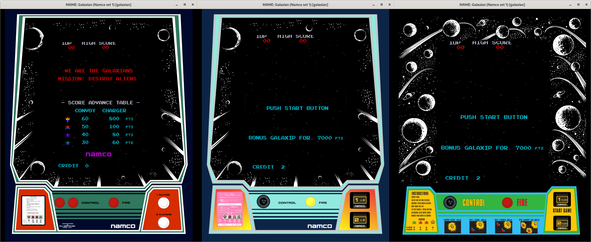

.. raw:: latex

	\clearpage

.. _layfile-disable-objects:

Desativando objetos na tela
~~~~~~~~~~~~~~~~~~~~~~~~~~~

Assim como foi descrito em :ref:`layfile-parts-collections` isso é
possível organizando os objetos da tela dentro dos elementos
``collections``, quando a visualização tiver esta opção, o jogador
poderá desligar qualquer objeto na tela desde que tenha sido organizado
desta maneira pelo autor da arte. Use ``visible`` **yes** ou **no**
(também funciona com ``1`` ou ``0``) dentro do elemento ``collection``
caso queira que ele já inicie **ligado** ou **desligado**. Baixe este
arquivo para ver como funciona na prática com a máquina
`mspacman <https://www.mediafire.com/file/ltjl0mnczuvc532/mspacman.zip>`_.

.. code-block:: xml

	<collection name="Botão para o inicio da partida para o 1º Jogador" visible="no">
	<element ref="btn-namco">
		<bounds x="2605" y="3217" width="350" height="291" />
	</element>
	<element name="lamp0" ref="J1JP" inputtag="IN1" inputmask="1">
		<bounds x="2666" y="3299" width="230" height="126" />
	</element>
	</collection>

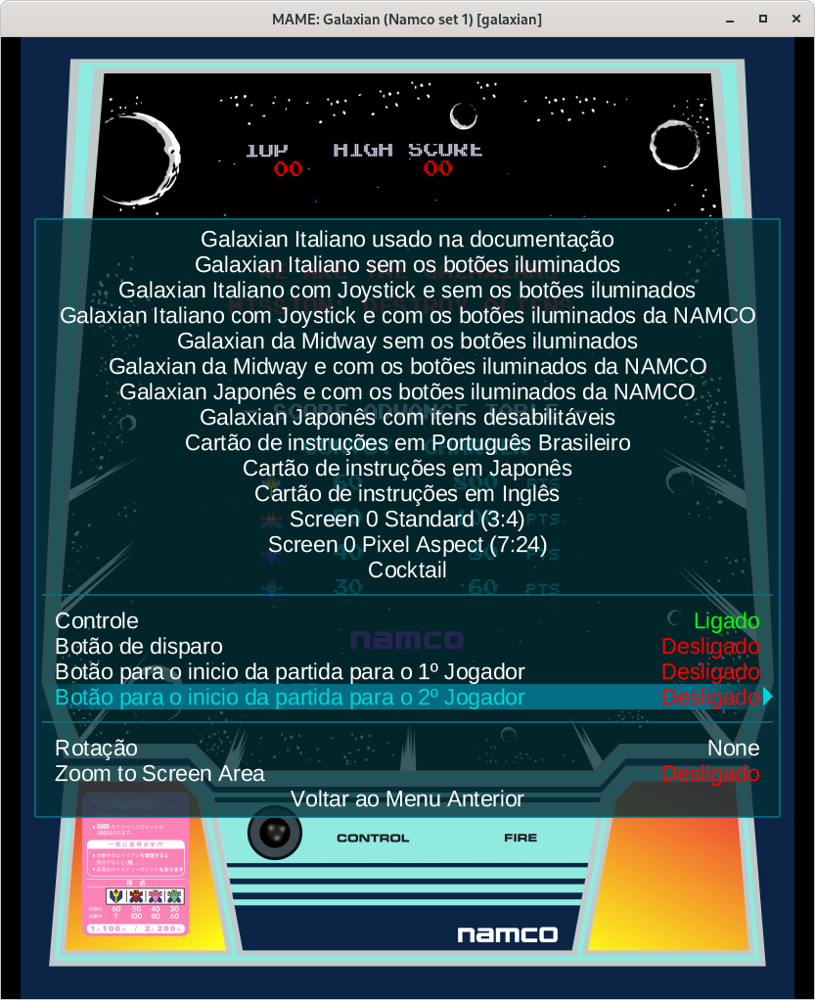

.. raw:: latex

	\clearpage

.. _layfile-create_joystick_positions:

Criando as posições de um controle arcade
~~~~~~~~~~~~~~~~~~~~~~~~~~~~~~~~~~~~~~~~~

Para animar os movimentos de um joystick é preciso antes definir os
limites de onde ele vai operar para que quando tudo estiver pronto a sua
animação se comporte como a movimentação de um controle arcade
tradicional. Usando as referências deste limite, nós podemos definir a
posição de cada movimento do controle.

* No *Inkscape*, crie um novo arquivo, pressione :kbd:`Ctrl` +
  :kbd:`Shift` + :kbd:`D` ou :guilabel:`File` --> :guilabel:`Document
  properties`, em :guilabel:`Page` defina :guilabel:`Display units` como
  **PX**.
* Crie um círculo preto, defina o seu tamanho em **W:** e **H:**
  com ``7,700`` **px**, este será aquela peça preta que fica no fim do
  eixo do joystick, ele vai ajudar a dar a ilusão de movimento.
* Vá em **Layers** :kbd:`Shift` + :kbd:`Ctrl` + :kbd:`L`, altere o nome
  deste primeiro layer para **centro base** clique no :guilabel:`+` para
  adicionar um layer chamado  **centro** e um outro chamado
  **quadrado**, este layer **quadrado** deve ficar abaixo do layer
  **centro base**.
* Clique no círculo preto para selecioná-lo, pressione :kbd:`Ctrl` +
  :kbd:`D` para duplicá-lo, escolha uma cor vermelha qualquer, defina o
  seu tamanho para ``9,700`` **px**. Clique com o botão direito em cima
  deste círculo vermelho e selecione a opção :guilabel:`Move to
  Layer...` e mova este círculo para o layer **centro**.

.. _layfile-export_svg:

Exportando arquivos SVG
^^^^^^^^^^^^^^^^^^^^^^^

Para definir o limite eu multiplico ``1.8`` **vezes** o valor do
diâmetro círculo do controle para determinar o tamanho total desse
quadrado. Este valor funciona bem ao fazer um joystick genérico,
dependendo do design pode ser que um valor multiplicado por ``1.5`` ou
por ``2`` funcione melhor dependendo do modelo/tipo do joystick que você
está querendo imitar, ajuste e faça testes para ver qual se adapta
melhor ao seu design e veja se a animação fica boa **na tela**.

* Fazendo os cálculos, ``9,700`` * ``1,8`` = ``17,46``, vá em
  :guilabel:`File` --> :guilabel:`Document Properties` (:kbd`Shift` +
  :kbd`Ctrl` + :kbd`D`), em :guilabel:`Custom size` defina as unidades
  para **PX** e defina também o :guilabel:`Width/Height` para ``17,46``,
  pressione **Enter** para aplicar e feche a janela.
* Vá em :guilabel:`Object` --> :guilabel:`Align and distribute`, clique
  no círculo **preto**, na aba :guilabel:`Align` -> :guilabel:`Relative
  To:` escolha :guilabel:`Page`, clique no botão logo abaixo
  (:guilabel:`Center on vertical axis`), depois (:guilabel:`Center on
  horizontal axis`) para centralizar o objeto. Clique no círculo
  vermelho e faça o mesmo com ele. * Pressione o :kbd:`3` no teclado
  numérico (lado direito do teclado) para que o círculo apareça no
  centro da tela.
* Clique 2x no sinal de :kbd:`-` no teclado numérico ou pressione
  :kbd:`Ctrl` e gire a roda do mouse para traz para recuar um pouco.
* Crie um quadrado com ``17,46`` x ``17,46 px``.
* Pressione :kbd:`Ctrl` + :kbd:`Shift` + :kbd:`F` para abrir o
  :guilabel:`Fill and Stroke`, ainda com o quadrado selecionado, em
  :guilabel:`Fill` clique no :guilabel:`X` para remover o preenchimento,
  mantenha o :kbd:`Shift` pressionado e com o mouse, clique na cor preta
  na parte debaixo da tela.
* Novamente na aba :guilabel:`Fill and Stroke`, defina
  :guilabel:`Width:` para ``0,005``, isso cria uma borda bem fina no
  nosso quadrado, fina o suficiente para ele pode ser selecionado, isso
  será útil mais adiante.
* Selecione o quadrado e mova ele para o layer **quadrado**.
* Na aba :guilabel:`Align and distribute`, clique nos mesmos botões para
  centralizar o quadrado na página.

.. raw:: latex

	\clearpage

Até aqui nós temos uma imagem como esta:

	.. image:: images/joy_center.svg
		:width: 50%
		:align: center
		:alt: joystick centro

Em caso de problema, basta baixar a imagem acima (caso esteja lendo o
documento no formato HTML) e abra ele no *Inkscape* para seguir os
próximos passos e recrie todos layers **quadrado**, **centro base** e
**centro**, depois mova círculo vermelho para o layer **centro** (clique
no ícone do olho para escondê-lo) e faça o mesmo com o círculo preto e
mova ele para o layer **centro base**, faça o mesmo com o quadrado,
sempre deixando o layer do quadrado abaixo de todos os outros layers.

* Pressione :kbd:`Shift` + :kbd:`Ctrl` + :kbd:`A` para abrir a aba
  :guilabel:`Align and distribute`, em :guilabel:`Relative To:` escolha
  :guilabel:`Last Selected` para alinhar com último objeto que for
  selecionado.
* Na aba :guilabel:`Layers` crie as camadas **cima**, **baixo**,
  **esquerda** e **direita**, clique no olho para escondê-las.
* Deixe o círculo do centro visível, clique nele e pressione
  :kbd:`Ctrl` + :kbd:`D` para duplicar.
* Com o :kbd:`Shift` pressionado clique no quadrado na borda da página,
  solte o :kbd:`Shift` e na aba de alinhamento escolha o ícone com a
  seta para a direita (:guilabel:`Align right sides`), isso alinha o
  nosso círculo para os limites da página do lado direito.
* Clique em qualquer ponto vazio da tela para remover a seleção, clique
  no círculo vermelho e com o botão direito do mouse, escolha a opção
  para movê-lo para a camada **direita**, o círculo do lado direito
  deve desaparecer logo em seguida.
* Clique no círculo vermelho ao centro, pressione :kbd:`Ctrl` + :kbd:`D`
  para duplicar, mantenha :kbd:`Shift` pressionado, clique no quadrado,
  solte o :kbd:`Shift`, na aba de alinhamento clique no ícone a seta
  para a esquerda (:guilabel:`Align left sides`) para alinhar o círculo
  para o lado esquerdo, repita o passo anterior e faça o mesmo para as
  posições **cima** e **baixo**.

.. raw:: latex

	\clearpage

Temos agora as quatro primeiras posições:

	.. image:: images/joy_positions.svg
		:width: 50%
		:align: center
		:alt: Posições do joystick

Na questão das diagonais do joystick, seguindo a mesma lógica, elas
seriam alinhadas bem nos cantos do quadrado assim com foi feito com as
outras posições, porém a animação fica estranha, parece que o eixo
oculto do controle permite que o círculo vá muito além do que deveria.
Na imagem abaixo temos duas opções, na esquerda as diagonais foram
alinhadas no limite do quadrado e depois recuados cerca de 5 pontos
(clicando no :guilabel:`+` e :guilabel:`-` do :guilabel:`X:` e
:guilabel:`Y:` trazendo o círculo mais para dentro).
Já na imagem da direita, foi criado um círculo nas mesmas dimensões
do quadrado (``17,46`` x ``17,46`` **px**) e as diagonais foram
alinhadas no limite do círculo:

	.. image:: images/diagonais.svg
		:width: 80%
		:align: center
		:alt: diagonais

A decisão de usar um ou outro vai depender de como ele se comporta **no
seu design** e **na tela**, o alinhamento com base em um círculo
pode parece "*curto*" em determinados designs e assim por diante, por
isso que **não há uma regra**, cabe ao artista/designer testar e avaliar
o que fica melhor. No nosso exemplo usamos o alinhamento com base no
círculo.

	.. image:: images/full_joystick.svg
		:width: 50%
		:align: center
		:alt: joystick completo

Caso use a imagem acima, é preciso criar todos os layers novamente e
mover cada posição do círculo para cada um dos seus respectivos layers,
isso é importante para isolar o elemento que será exportado depois.

Depois que todas as posições já estiverem nas suas respectivas camadas
(layers), começamos o processo de exportação:

* Clique em qualquer um dos layers com o botão direito do mouse e
  escolha a opção :guilabel:`Hide all layers` para ocultar tudo.
* Ative (torne visível) apenas os layers, **centro base** e
  **centro**.
* Vá em :guilabel:`File` --> :guilabel:`Save a Copy` ou :kbd:`Shift` +
  :kbd:`Ctrl` + :kbd:`Alt` + :kbd:`S`, escolha o caminho
  **MAME\\Artwork\\sfa3**, ou a mesma pasta onde está o ``default.lay``
  que criamos, no nome insira **centro.svg** e na parte debaixo desta
  janela troque a opção :guilabel:`Inkscape SVG` por
  :guilabel:`Optimized SVG`, clique em :guilabel:`Save` e clique em
  :guilabel:`OK` na próxima janela que aparecer.
* Esconda o layer **centro** e deixe apanas o layer **direita** visível
  e repita o procedimento anterior, faça o mesmo para cada uma das
  posições.

As imagens das diagonais têm os seguintes nomes:

* **Diagonal superior direita** ``cimad``
* **Diagonal superior esquerda** ``cimae``
* **Diagonal inferior direita** ``baixod``
* **Diagonal inferior esquerda** ``baixoe``

.. _layfile-export_png:

Exportando arquivos PNG
^^^^^^^^^^^^^^^^^^^^^^^

Existe um pequeno truque que precisa ser feito para exportar imagens
como estas que precisam estar dentro de algo invisível, pois diferente
da exportação em SVG, não basta simplesmente deixar visível o que se
deseja exportar, também é preciso exportar o quadrado junto e aqui
está o "*pulo do gato*", definimos o :guilabel:`Stroke` (como descrito
no capítulo anterior) com ``0,005`` ou até mesmo ``0,001`` para que este
quadrado possa ser selecionável no *Inkscape* e que quando exportado, a
borda não apareça quando for carregado pelo MAME.

No final, a imagem exportada ficará dentro de uma área invisível onde
ocorrerá a animação dos movimentos. É preciso fazer assim pois caso
contrário, em vez de uma animação de movimentos nós teremos o controle
sendo jogado de um lado para o outro.

Usando o mesmo arquivo que você usou acima:

* Pressione :kbd:`Shift` + :kbd:`Ctrl` + :kbd:`E` para abrir a aba
  :guilabel:`Export PNG image`.
* Deixe apenas o layout **centro** e **quadrado** visível.
* Clique no círculo, mantenha o :kbd:`Shift` pressionado e clique no
  quadrado fazendo com que o círculo e o quadrado fiquem selecionados.
* Em :guilabel:`Export PNG image`, na aba :guilabel:`Export area` o
  :guilabel:`Selection` vai estar selecionado.
* Em :guilabel:`Image size` defina ambos para ``174``.
* Em :guilabel:`Filename` defina o caminho completo e o nome do arquivo
  (``centro.png``), no caso, exportaremos essa imagem para dentro da
  pasta **artwork\sfa3**.
* Faça o mesmo com as outras posições e respeitando o mesmo nome usado
  anteriormente, porém, com a extensão **.png**, ``centro.png``,
  ``cima.png``, ``baixo.png``, etc.

.. _layfile-working_with_groups:

Trabalhando com grupos
~~~~~~~~~~~~~~~~~~~~~~

Trabalhar com grupos é como trabalhar com camadas em programas como o
*Adobe Illustrator* ou o *Inkscape*, você desenha, posiciona os seus
objetos onde eles precisam ficar e no final você **agrupa** tudo para 
que o seu design composto de diferentes pedaços fiquem fixos e você
possa movimentá-los livremente.

O sistema de layout do MAME trabalha da mesma maneira e possui também a
mesma vantagem, primeiro você define o tamanho da sua área de trabalho,
define o tamanho e a posição de todos os seus elementos dentro deste
grupo e faz o que quiser com ele depois.

Sem organizar o seu layout dentro de um grupo, você precisaria
posicionar todos os seus elementos num ponto da tela e mais tarde caso
queira movê-los para um outro ponto, você teria que literalmente ajustar
cada elemento na nova posição da tela.

Exportaremos os gráficos tanto em **.PNG** (gráficos matriciais/pixels)
quanto em **.SVG** (gráficos vetoriais), o suporte  o MAME ao formato
**.SVG** é simples, ele consegue carregar arquivos simples porém ele não
aceita designs complexos e cheio de efeitos. Por isso dependendo da
complexidade do design é preferível exportar tais gráficos no formato
**.PNG**.

Os gráficos vetoriais por serem coordenadas em texto e cálculos
matemáticos para criar as formas geométricas, tamanho, cor, etc; tais
gráficos não se deterioram quando eles são expandidos, eles mantém as
suas bordas lisas e o seu arquivo final é extremamente leve, já os
gráficos matriciais quando a aproximação ultrapassa o seu tamanho
original ele se deteriora, os pixels que compõem essa imagem começa a
ficar mais evidente, nas bordas começa a aparecer um serrilhamento, etc.
Para compensar tal limitação é preciso exportar um gráfico cada vez
maior e com isso tais imagens ficam cada vez mais pesadas. Quando for
possível, use SVG, caso o seu design seja mais complexo, use PNG.

Colocaremos um pequeno joystick animado sobreposto num canto da tela,
porém antes precisamos saber de duas coisas, o tamanho da tela e o
tamanho do objeto que será colocado nela. Para saber o tamanho da tela,
inicie uma máquina qualquer como a **sfa3** (``mame sfa3``), pressione
:kbd:`Tab` --> :guilabel:`Informação da máquina`, na parte de **Vídeo**
vai estar listado ``384`` x ``224`` (valor em **pixels**).

* Abra o *Inkscape*, vá em :guilabel:`File` --> :guilabel:`Document
  properties...` ou :kbd:`Shift` + :kbd:`Ctrl` + :kbd:`D`, em
  :guilabel:`Page` --> :guilabel:`Units` alterne de :guilabel:`mm` para
  :guilabel:`px` (pixels), em :guilabel:`Width` defina ``384,0`` e em
  :guilabel:`Height` defina ``224,0``, feche a janela.

Abaixo temos uma imagem para ilustrar o tamanho, a área em azul é a
área de segurança de quem usa shaders para deixar a tela curvada e com
scanlines.

	.. image:: images/screen_size.svg
		:width: 80%
		:align: center
		:alt: Tamanho da tela

Com a nossa área de trabalho definida, precisamos definir o tamanho e a
posição do nosso joystick na tela, como é um controle animado, ele não
precisa ser muito grande pois a região já é pequena. No nosso exemplo,
este controle só vai nos servir como uma referência para o que está
acontecendo na tela, assim, ele não precisa de muitos detalhes. Na
imagem abaixo tem uma ilustração da posição que foi escolhida e do
tamanho.

	.. image:: images/joystick_position.svg
		:width: 80%
		:align: center
		:alt: joystick position

Para o joystick da nossa tela, foi criado um objeto com ``60,017``
**px** de largura por ``30,760`` **px** de altura com uma cor qualquer e
com a mesma cor na porém porém mais escura.

	.. image:: images/base.svg
		:width: 80%
		:align: center
		:alt: base do joystick

Dentro dessa área posicionaremos o joystick, os botões, a arte de fundo
(se for o caso), etc. Depois obtemos as coordenadas **X** (horizontal),
**Y** (vertical), **W** (largura) e **H** (altura), como o tamanho da
tela e dos elementos são pequenos, todos os elementos e as suas bordas
tem um tamanho um pouco exagerado e com bordas bem grossas, porém pois
quando tudo isso for projetado na tela o resultado final ficará dentro
do desejado.

	.. image:: images/base_botoes_joystick.svg
		:width: 80%
		:align: center
		:alt: joystick com os botões

Com todos os elementos posicionados nós temos:

* Joystick, **X** = ``2,397``, **Y** = ``6,378``, **W** = ``18``, **H** = ``18``
* Botão 1, **X** = ``21,201``, **Y** = ``4,337``,  **W** = ``9,6``, **H** = ``9,6``
* Botão 2, **X** = ``33,641``, **Y** = ``4,292``, **W** = ``9,6``, **H** = ``9,6``
* Botão 3, **X** = ``46,126``, **Y** = ``4,292``, **W** = ``9,6``, **H** = ``9,6``
* Botão 4, **X** = ``21,201``, **Y** = ``16,820``, **W** = ``9,6``, **H** = ``9,6``
* Botão 5, **X** = ``33,641``, **Y** = ``16,820``, **W** = ``9,6``, **H** = ``9,6``
* Botão 6, **X** = ``46,126``, **Y** = ``16,820``, **W** = ``9,6``, **H** = ``9,6``

.. _layfile-using_svg_files:

Usando os botões gerados pelo MAME e os arquivos SVG
^^^^^^^^^^^^^^^^^^^^^^^^^^^^^^^^^^^^^^^^^^^^^^^^^^^^

Na pasta do MAME vá em **Artwork**, crie uma pasta chamada **sfa3**,
dentro dela crie um novo arquivo texto chamado ``default.lay``, tenha
certeza de estar criando um arquivo ``default.lay`` e não
``default.lay.txt``, no Windows é preciso alterar as configurações da
pasta para `ver a extensão dos arquivos <https://www.softdownload.com.br/como-exibir-extensao-arquivos-windows-10-8-7.html>`_.

Abra o arquivo em um editor de texto, iniciamos o nosso layout pelo
cabeçalho e colocando todas as informações que achamos relevantes:

.. code-block:: xml

	<?xml version="1.0"?>
	<mamelayout version="2">
	<!--
		Joystick for CPS2
		Created by: Wellington Terumi Uemura
		License: CC by 4.0
		https://mamedoc.readthedocs.io/
		Date: October 02, 2021
		Download: https://www.mediafire.com/file/o8j2cdqonfxyz58/sfa3-v1.zip
	-->

Aqui nós definimos os tipos (círculos) e as cores de todos os objetos
que usaremos neste design, vamos criar os círculos coloridos (azul,
amarelo, vermelho) e um círculo branco ao centro para indicar um botão
na sua condição normal, quando o jogador pressionar um destes botões
definidos em ``hit azul``, ``hit amarelo`` e ``hit vermelho`` a cor vai
se alterar para um tom mais escuro das cores do botão:

.. code-block:: xml

	<!-- elementos gerados -->
	<!-- Aqui definimos a cor azul e o mesmo é feito com as outras cores -->
	<element name="azul">
		<disk><color red="0" green="0.549" blue="0.831" /></disk>
	</element>
	<!-- definimos um tom mais escuro da cor do botão, o mesmo é feito com as outras cores -->
	<element name="hit azul" defstate="1">
		<disk state="1"><color red="0" green="0.369" blue="0.6" /></disk>
	</element>
	<element name="amarelo">
		<disk><color red="1" green="0.933" blue="0" /></disk>
	</element>
	<element name="hit amarelo" defstate="1">
		<disk state="1"><color red="0.639" green="0.596" blue="0" /></disk>
	</element>
	<element name="vermelho">
		<disk><color red="1" green="0.007" blue="0.105" /></disk>
	</element>
	<element name="hit vermelho" defstate="1">
		<disk state="1"><color red="0.6" green="0" blue="0.058" /></disk>
	</element>

	<!-- Este é o elemento branco que fica em cima dos círculos coloridos -->
	<element name="branco">
		<disk><color red="0.925" green="0.925" blue="0.925" /></disk>
	</element>

	<!-- Definimos um elemento vazio que será usado para evitar os cliques do mouse -->
	<element name="tampa" defstate="0">
		<text string=" " />
	</element>

	<!-- Agrupamos as imagens que formam o movimento do controle num único elemento -->
	<element name="comandos"		defstate="0xf">
		<image file="cima.svg"		state="0x7" />
		<image file="cimad.svg"		state="0x6" />
		<image file="direita.svg"	state="0xe" />
		<image file="baixod.svg"	state="0xa" />
		<image file="baixo.svg"		state="0xb" />
		<image file="baixoe.svg"	state="0x9" />
		<image file="esquerda.svg"	state="0xd" />
		<image file="cimae.svg"		state="0x5" />
		<image file="centro.svg"	state="0xf" />
	</element>

	<!-- Carregamos a imagem da base do nosso controle -->
	<element name="base">
		<image file="base.svg" />
	</element>

Organizamos tudo isso dentro de um grupo e usamos o ``count`` para
duplicar os nossos botões no eixo vertical. Aqui nós também conectamos
os respectivos botões ao driver, no caso, a lógica vai funcionar com
qualquer máquina *CPS2*. Alguns valores aparecem diferente daqueles que
nós obtemos, é um ajuste fino necessário para alinhar os objetos na
tela:

.. code-block:: xml

	<!-- Nome do grupo, este é o joystick do jogador 1 -->
	<group name="Joystick J1">

	<!-- Definimos o tamanho do grupo -->
	<bounds x="0" y="0" width="60.017" height="30.760" />

	<!-- Usamos a nossa base do joystick e definimos o seu tamanho -->
	<element ref="base">
		<bounds x="0" y="0" width="60.017" height="30.760" />
	</element>

	<!-- São 2 botões no eixo Y (vertical) iniciando na posição 4.292.-->
	<!-- Incremente 12.528 para definir a posição do segundo botão. -->
	<!-- Para encontrar o valor 12.528, use o Inkscape para posicionar o botão onde deseja -->
	<!-- pegue o valor de Y do segundo botão (16,82) e subtraia com o valor -->
	<!-- de Y do primeiro botão (4,292), ou seja, 16,82 - 4,292 = 12,528. -->
	<!-- No eixo X inicie em 21.202 e use o valor calculado para definir Y. -->
	<!-- Crie o nosso elemento com 9.7px x 9.7px -->
	<!-- O mesmo é feito com os outros botões -->
	<repeat count="2">
		<param name="y" start="4.292" increment="12.528" />
		<param name="i" start="0" increment="1" />
		<element ref="azul"><bounds x="21.202" y="~y~" width="9.7" height="9.7" />
	</element>
	</repeat>
	<repeat count="2">
		<param name="y" start="5.292" increment="12.528" />
		<param name="i" start="0" increment="1" />
		<element ref="branco"><bounds x="22.202" y="~y~" width="7.7" height="7.7" />
	</element>
	</repeat>
	<repeat count="2">
		<param name="y" start="4.292" increment="12.528" />
		<param name="i" start="0" increment="1" />
		<element ref="amarelo"><bounds x="33.641" y="~y~" width="9.7" height="9.7" />
	</element>
	</repeat>
	<repeat count="2">
		<param name="y" start="5.292" increment="12.528" />
		<param name="i" start="0" increment="1" />
		<element ref="branco"><bounds x="34.641" y="~y~" width="7.7" height="7.7" />
	</element>
	</repeat>
	<repeat count="2">
		<param name="y" start="4.292" increment="12.528" />
		<param name="i" start="0" increment="1" />
		<element ref="vermelho"><bounds x="46.129" y="~y~" width="9.7" height="9.7" />
	</element>
	</repeat>
	<repeat count="2">
		<param name="y" start="5.292" increment="12.528" />
		<param name="i" start="0" increment="1" />
		<element ref="branco"><bounds x="47.129" y="~y~" width="7.7" height="7.7" />
	</element>
	</repeat>

	<!-- Aqui a tampa cobre toda a área do joystick para evitar o click do mouse -->
	<element ref="tampa" blend="add" inputtag="IN0" inputmask="0x00" inputraw="yes">
		<bounds x="0" y="0" width="60.017" height="30.760" />
	</element>

	<!-- Invocamos os nossos comandos, definimos a sua posição e tamanho na base do joystick -->
	<element ref="comandos" inputtag="IN0" inputmask="0xf" inputraw="yes">
		<bounds x="2.397" y="6.378" width="18" height="18" />
	</element>

	<!-- Aqui conectamos toda a lógica dos botões -->
	<element ref="hit azul" inputtag="IN0" inputmask="0x10">
		<bounds x="22.202" y="5.292" width="7.7" height="7.7" />
	</element>
	<element ref="hit azul" inputtag="IN1" inputmask="0x1">
		<bounds x="22.202" y="17.820" width="7.7" height="7.7" />
	</element>
	<element ref="hit amarelo" inputtag="IN0" inputmask="0x20">
		<bounds x="34.641" y="5.292" width="7.7" height="7.7" />
	</element>
	<element ref="hit amarelo" inputtag="IN1" inputmask="0x2">
		<bounds x="34.641" y="17.820" width="7.7" height="7.7" />
	</element>
	<element ref="hit vermelho" inputtag="IN0" inputmask="0x40">
		<bounds x="47.129" y="5.292" width="7.7" height="7.7" />
	</element>
	<element ref="hit vermelho" inputtag="IN1" inputmask="0x4">
		<bounds x="47.129" y="17.820" width="7.7" height="7.7" />
	</element>
	</group>

Como já explicado em :ref:`layfile-screen-position`, as telas CRT da
época tinham uma proporção de 4:3, assim sendo, precisamos ajudar a
resolução de tela. Use a planilha disponibilizada em
:ref:`layfile-tools`, no campo :guilabel:`Digite a altura' insira
``224``, note que o cálculo retorna um **DAR** com ``298,666666666667``,
isso não é bom pois causa
:ref:`aliasing <mame-commandline-unevenstretch>`, então, precisamos
de um valor inteiro.

Substitua ``224`` por ``225``, note que os cálculos retornam valores
inteiros, é este valor que usaremos para definir o tamanho da nossa
tela ``300`` x ``225``. Logo abaixo nós definimos a posição do nosso
joystick e o seu respectivo tamanho.

.. code-block:: xml

	<!-- Definimos o nome que vai aparecer na seleção -->
	<view name="Controle">

	<!-- Não precisamos da posição, só do tamanho da tela -->
	<screen index="0">
		<bounds x="0" y="0" width="300" height="225" />
	</screen>

	<!-- Aqui definimos um nome que vai aparecer nas opções para -->
	<!-- tirar o joystick da tela, será possível ligar e desligar esta opção. -->
	<!-- Já fica predefinido que quando a emulação começar, o joystick já apareça na tela. -->
	<collection name="Joystick do jogador 1" visible="yes">

	<!-- Invocamos o nome do grupo, definimos a posição e o seu tamanho -->
	<group ref="Joystick J1">
		<bounds x="1.5" y="169.239" width="60.017" height="30.760" />
	</group>
	</collection>

	<!-- Fim do layout -->
	</view>
	</mamelayout>

Salve o arquivo, execute o comando no terminal/prompt de comando
``mame sfa3`` e veja que todos os botões e o controle reagem ao que você
fizer no seu controle. Pressione
:kbd:`Tab` --> :guilabel:`Opções do vídeo` --> :guilabel:`Tela #0`, veja
que há a opção :guilabel:`Joystick do jogador 1` que pode ser ligada
ou desligada.

Para adicionar o controle para o jogador 2, basta agora adicionar a
lista abaixo **depois** do grupo **Joystick J1** e adaptar a lógica para
o controle 2.

.. code-block:: xml

	<!-- Nome do grupo, este é o joystick do jogador 2 -->
	<group name="Joystick J2">
	<bounds x="0" y="0" width="60.017" height="30.760" />
	<element ref="base">
		<bounds x="0" y="0" width="60.017" height="30.760" />
	</element>
	<repeat count="2">
		<param name="y" start="4.292" increment="12.528" />
		<param name="i" start="0" increment="1" />
		<element ref="azul"><bounds x="21.202" y="~y~" width="9.7" height="9.7" />
	</element>
	</repeat>
	<repeat count="2">
		<param name="y" start="5.292" increment="12.528" />
		<param name="i" start="0" increment="1" />
		<element ref="branco"><bounds x="22.202" y="~y~" width="7.7" height="7.7" />
	</element>
	</repeat>
	<repeat count="2">
		<param name="y" start="4.292" increment="12.528" />
		<param name="i" start="0" increment="1" />
		<element ref="amarelo"><bounds x="33.641" y="~y~" width="9.7" height="9.7" />
	</element>
	</repeat>
	<repeat count="2">
		<param name="y" start="5.292" increment="12.528" />
		<param name="i" start="0" increment="1" />
		<element ref="branco"><bounds x="34.641" y="~y~" width="7.7" height="7.7" />
	</element>
	</repeat>
	<repeat count="2">
		<param name="y" start="4.292" increment="12.528" />
		<param name="i" start="0" increment="1" />
		<element ref="vermelho"><bounds x="46.129" y="~y~" width="9.7" height="9.7" />
	</element>
	</repeat>
	<repeat count="2">
		<param name="y" start="5.292" increment="12.528" />
		<param name="i" start="0" increment="1" />
		<element ref="branco"><bounds x="47.129" y="~y~" width="7.7" height="7.7" />
	</element>
	</repeat>
	<element ref="tampa" blend="add" inputtag="IN0" inputmask="0x00" inputraw="yes">
		<bounds x="0" y="0" width="60.017" height="30.760" />
	</element>
	<element ref="comandos" inputtag="IN0" inputmask="0xf00" inputraw="yes">
		<bounds x="2.397" y="6.378" width="18" height="18" />
	</element>
	<!-- Aqui conectamos toda a lógica dos botões para o J2-->
	<element ref="hit azul" inputtag="IN0" inputmask="0x1000">
		<bounds x="22.202" y="5.292" width="7.7" height="7.7" />
	</element>
	<element ref="hit azul" inputtag="IN1" inputmask="0x10">
		<bounds x="22.202" y="17.820" width="7.7" height="7.7" />
	</element>
	<element ref="hit amarelo" inputtag="IN0" inputmask="0x2000">
		<bounds x="34.641" y="5.292" width="7.7" height="7.7" />
	</element>
	<element ref="hit amarelo" inputtag="IN1" inputmask="0x20">
		<bounds x="34.641" y="17.820" width="7.7" height="7.7" />
	</element>
	<element ref="hit vermelho" inputtag="IN0" inputmask="0x4000">
		<bounds x="47.129" y="5.292" width="7.7" height="7.7" />
	</element>
	<element ref="hit vermelho" inputtag="IN2" inputmask="0x4000">
		<bounds x="47.129" y="17.820" width="7.7" height="7.7" />
	</element>
	</group>

Para que funcione, nós adicionamos a opção "Controle" e adicionamos a
opção para o jogador 2 logo depois das configurações do jogador 1.

.. code-block:: xml

	<collection name="Joystick do jogador 1" visible="yes">
	<group ref="Joystick J1" blend="add">
		<bounds x="1.5" y="169.239" width="60.017" height="30.760" />
	</group>
	</collection>

	<collection name="Joystick do jogador 2" visible="no">
	<group ref="Joystick J2" blend="add">
		<bounds x="238.4" y="169.239" width="60.017" height="30.760" />
	</group>
	</collection>

Salve e rode o **sfa3** novamente, parece que nada mudou, porém ao
entrar nas opções do vídeo novamente, verá que está disponível a opção
para o :guilabel:`Joystick do jogador 2` e ele está
:guilabel:`desligado`. Quem define isso é a opção ``visible="no"``,
porém para deixar ele sempre ativo sem ter que mexer no arquivo layout,
basta deixar o segundo joystick visível e encerrar a emulação, isso
salva as definições esta máquina e na próxima vez o joystick vai
aparecer na tela.

.. _layfile-simplifying_layout:

Simplificando o layout
^^^^^^^^^^^^^^^^^^^^^^

Uma outra maneira de se lidar com grupos e evitar a duplicidade de
configuração como foi feito para o controle do jogador 1 e 2, seria
organizar a parte visual primeiro num grupo que poderia ser usado por
ambos e deixar a parte lógica dos botões de fora, invocando a lógica
individual de cada controle separadamente.

A parte visual do nosso controle ficaria assim:

.. code-block:: xml

	<group name="Joystick">
		<bounds x="0" y="0" width="60.017" height="30.760" />
	<element ref="base">
		<bounds x="0" y="0" width="60.017" height="30.760" />
	</element>
	<repeat count="2">
		<param name="y" start="4.292" increment="12.528" />
		<param name="i" start="0" increment="1" />
		<element ref="azul"><bounds x="21.202" y="~y~" width="9.7" height="9.7" />
	</element>
	</repeat>
	<repeat count="2">
		<param name="y" start="5.292" increment="12.528" />
		<param name="i" start="0" increment="1" />
		<element ref="branco"><bounds x="22.202" y="~y~" width="7.7" height="7.7" />
	</element>
	</repeat>
	<repeat count="2">
		<param name="y" start="4.292" increment="12.528" />
		<param name="i" start="0" increment="1" />
		<element ref="amarelo"><bounds x="33.641" y="~y~" width="9.7" height="9.7" />
	</element>
	</repeat>
	<repeat count="2">
		<param name="y" start="5.292" increment="12.528" />
		<param name="i" start="0" increment="1" />
		<element ref="branco"><bounds x="34.641" y="~y~" width="7.7" height="7.7" />
	</element>
	</repeat>
	<repeat count="2">
		<param name="y" start="4.292" increment="12.528" />
		<param name="i" start="0" increment="1" />
		<element ref="vermelho"><bounds x="46.129" y="~y~" width="9.7" height="9.7" />
	</element>
	</repeat>
	<repeat count="2">
		<param name="y" start="5.292" increment="12.528" />
		<param name="i" start="0" increment="1" />
		<element ref="branco"><bounds x="47.129" y="~y~" width="7.7" height="7.7" />
	</element>
	</repeat>
	<element ref="tampa" blend="add" inputtag="IN0" inputmask="0x00" inputraw="yes">
		<bounds x="0" y="0" width="60.017" height="30.760" />
	</element>
	</group>

Aqui a parte lógica para o jogador 1.

.. code-block:: xml

	<group name="Logic J1">
		<bounds x="0" y="0" width="60.017" height="30.760" />
	<element ref="hit azul" inputtag="IN0" inputmask="0x10">
		<bounds x="22.202" y="5.292" width="7.7" height="7.7" />
	</element>
	<element ref="hit azul" inputtag="IN1" inputmask="0x1">
		<bounds x="22.202" y="17.820" width="7.7" height="7.7" />
	</element>
	<element ref="hit amarelo" inputtag="IN0" inputmask="0x20">
		<bounds x="34.641" y="5.292" width="7.7" height="7.7" />
	</element>
	<element ref="hit amarelo" inputtag="IN1" inputmask="0x2">
		<bounds x="34.641" y="17.820" width="7.7" height="7.7" />
	</element>
	<element ref="hit vermelho" inputtag="IN0" inputmask="0x40">
		<bounds x="47.129" y="5.292" width="7.7" height="7.7" />
	</element>
	<element ref="hit vermelho" inputtag="IN1" inputmask="0x4">
		<bounds x="47.129" y="17.820" width="7.7" height="7.7" />
	</element>
	<element ref="comandos" inputtag="IN0" inputmask="0xf" inputraw="yes">
		<bounds x="2.397" y="6.378" width="18" height="18" />
	</element>
	</group>

Aqui a parte lógica para o jogador 2.

.. code-block:: xml

	<group name="Logic J2">
		<bounds x="0" y="0" width="60.017" height="30.760" />
	<element ref="hit azul" inputtag="IN0" inputmask="0x1000">
		<bounds x="22.202" y="5.292" width="7.7" height="7.7" />
	</element>
	<element ref="hit azul" inputtag="IN1" inputmask="0x10">
		<bounds x="22.202" y="17.820" width="7.7" height="7.7" />
	</element>
	<element ref="hit amarelo" inputtag="IN0" inputmask="0x2000">
		<bounds x="34.641" y="5.292" width="7.7" height="7.7" />
	</element>
	<element ref="hit amarelo" inputtag="IN1" inputmask="0x20">
		<bounds x="34.641" y="17.820" width="7.7" height="7.7" />
	</element>
	<element ref="hit vermelho" inputtag="IN0" inputmask="0x4000">
		<bounds x="47.129" y="5.292" width="7.7" height="7.7" />
	</element>
	<element ref="hit vermelho" inputtag="IN2" inputmask="0x4000">
		<bounds x="47.129" y="17.820" width="7.7" height="7.7" />
	</element>
	<element ref="comandos" inputtag="IN0" inputmask="0xf00" inputraw="yes">
		<bounds x="2.397" y="6.378" width="18" height="18" />
	</element>
	</group>

Aqui alteramos a parte final do layout, invocamos primeiro a parte
visual e depois a parte lógica.

.. code-block:: xml

	<view name="Controle">
	<screen index="0">
		<bounds x="0" y="0" width="300" height="225" />
	</screen>

	<collection name="Joystick do jogador 1" visible="yes">
	<group ref="Joystick" blend="add">
		<bounds x="1.5" y="169.239" width="60.017" height="30.760" />
	</group>
	<group ref="Logic J1">
		<bounds x="1.5" y="169.239" width="60.017" height="30.760" />
	</group>
	</collection>

	<collection name="Joystick do jogador 2" visible="no">
	<group ref="Joystick" blend="add">
		<bounds x="238.4" y="169.239" width="60.017" height="30.760" />
	</group>
	<group ref="Logic J2">
		<bounds x="238.4" y="169.239" width="60.017" height="30.760" />
	</group>
	</collection>

Ao rodar a máquina novamente verá que toda a parte funcional e das
opções continuam os mesmos, porém, o nosso arquivo layout está mais
organizado.

`Baixe este arquivo completo aqui <https://www.mediafire.com/file/aqxsi79b4j38wh8/sfa3-v2.zip>`_.

.. _layfile-using_png_files:

Usando imagens PNG para o mesmo tipo de layout
^^^^^^^^^^^^^^^^^^^^^^^^^^^^^^^^^^^^^^^^^^^^^^

Ao trabalhar com imagens PNG é preciso exportar **CADA** elemento do
nosso joystick, além de todas as posições do controle é preciso exportar
todo o resto, além disso, é preciso levar em consideração o seu tamanho
final pois como foi explicado antes, a imagem matricial se deteriora
caso ela seja expandida para dimensões maiores do que ela foi projetada.

Neste exemplo usaremos design abaixo como referência:

	.. image:: images/base_botoes_joystick.svg
		:width: 80%
		:align: center
		:alt: joystick com os botões

* Abra a imagem no *Inkscape*, pressione :kbd:`Ctrl` + :kbd:`A` para
  selecionar todos os elementos, em seguida faça :kbd:`Shift` +
  :kbd:`Ctrl` + :kbd:`G` para separar todos os elementos do grupo.
* Faça :kbd:`Shift` + :kbd:`Ctrl` + :kbd:`E` ou :guilabel:`File` -->
  :guilabel:`Export PNG Image` para abrir a aba de exportação.
* Clique nos números e pressione :kbd:`Del` para excluí-los.
* Clique no círculo azul com o centro escuro, na aba
  :guilabel:`Export PNG Image` em :guilabel:`Image size` defina ambos
  :guilabel:`Width/Height` como ``100`` (poderia ser maior mas serve
  para o nosso exemplo).
* Em :guilabel:`Filename` exporte para a pasta **artwork/sfa3** com o
  nome ``azul1.png``.
* Clique no outro botão azul com o centro claro e faça o mesmo, porém
  exporte com o nome ``azul0.png``.
* Faça o mesmo com os outros botões, no final você deverá ter os
  arquivos ``azul0.png``, ``azul0.png``, ``amarelo0.png``,
  ``amarelo1.png``, ``vermelho0.png`` e ``vermelho1.png``.
* Clique na base do nosso joystick, exporte ele com o tamanho
  ``575`` x ``294`` e defina o seu nome como ``base.png``.

Com todas as imagens em mãos podemos começar a montar o nosso layout:

.. code-block:: xml

	<?xml version="1.0"?>
	<mamelayout version="2">
	<!--
		Joystick for CPS2
		Created by: Wellington Terumi Uemura
		License: CC by 4.0
		https://mamedoc.readthedocs.io/
		Date: October 02, 2021
		Download: https://www.mediafire.com/file/90ethuuvvd61mp1/sfa3-v3.zip
	-->

Em seguida definimos as condicionais dos botões e a nossa tampa:

.. code-block:: xml

	<element name="painel">
		<image file="base.png" />
	</element>
	<element name="azul" defstate="0">
		<image file="azul0.png" state="0" />
		<image file="azul1.png" state="1" />
	</element>
	<element name="amarelo" defstate="0">
		<image file="amarelo0.png" state="0" />
		<image file="amarelo1.png" state="1" />
	</element>
	<element name="vermelho" defstate="0">
		<image file="vermelho0.png" state="0" />
		<image file="vermelho1.png" state="1" />
	</element>
	<element name="tampa" defstate="0">
		<text string=" " />
	</element>

Aqui nós definimos todas as posições do joystick:

.. code-block:: xml

	<element name="comandos"		defstate="0xf">
		<image file="cima.png"		state="0x7" />
		<image file="cimad.png"		state="0x6" />
		<image file="direita.png"	state="0xe" />
		<image file="baixod.png"	state="0xa" />
		<image file="baixo.png"		state="0xb" />
		<image file="baixoe.png"	state="0x9" />
		<image file="esquerda.png"	state="0xd" />
		<image file="cimae.png"		state="0x5" />
		<image file="centro.png"	state="0xf"/>
	</element>

Neste primeiro momento, usamos a área que nós definimos para o controle
``60,017`` x ``30,760`` **px** e dentro dessa área posicionamos todas
as partes do controle.

.. code-block:: xml

	<group name="controle J1">
		<bounds x="0" y="0" width="60.017" height="30.760" />
	<element ref="painel">
		<bounds x="0" y="0" width="60.017" height="30.760" />
	</element>
	<!-- aqui cobrimos toda a área do joystick para não interagir com o mouse -->
	<element ref="tampa" blend="add" inputtag="IN0" inputmask="0x00" inputraw="yes">
		<bounds x="0" y="0" width="60.017" height="30.760" />
	</element>
	<!-- Botão 1 -->
	<element ref="azul" inputtag="IN0" inputmask="16">
		<bounds x="21.201" y="4.292" width="9.6" height="9.6" />
	</element>
	<!-- Botão 4 -->
	<element ref="azul" inputtag="IN1" inputmask="1">
		<bounds x="21.201" y="16.820" width="9.6" height="9.6" />
	</element>
	<!-- Botão 2 -->
	<element ref="amarelo" inputtag="IN0" inputmask="32">
		<bounds x="33.641" y="4.292" width="9.6" height="9.6" />
	</element>
	<!-- Botão 5 -->
	<element ref="amarelo" inputtag="IN1" inputmask="2">
		<bounds x="33.641" y="16.820" width="9.6" height="9.6" />
	</element>
	<!-- Botão 3 -->
	<element ref="vermelho" inputtag="IN0" inputmask="64">
		<bounds x="46.126" y="4.292" width="9.6" height="9.6" />
	</element>
	<!-- Botão 6 -->
	<element ref="vermelho" inputtag="IN1" inputmask="4">
		<bounds x="46.126" y="16.820" width="9.6" height="9.6" />
	</element>
	<element ref="comandos" inputtag="IN0" inputmask="0xf" inputraw="yes">
		<bounds x="2.397" y="6.378" width="18" height="18" />
	</element>
	</group>
	<!-- Aqui os parâmetros para o joystick para o segundo jogador -->
	<group name="controle J2">
		<bounds x="0" y="0" width="60.017" height="30.760" />
	<element ref="painel">
		<bounds x="0" y="0" width="60.017" height="30.760" />
	</element>
	<element ref="tampa" blend="add" inputtag="IN0" inputmask="0x00" inputraw="yes">
		<bounds x="0" y="0" width="60.017" height="30.760" />
	</element>
	<!-- Botão 1 -->
	<element ref="azul" inputtag="IN0" inputmask="0x1000">
		<bounds x="21.201" y="4.337" width="9.6" height="9.6" />
	</element>
	<!-- Botão 4 -->
	<element ref="azul" inputtag="IN1" inputmask="0x10">
		<bounds x="21.156" y="16.820" width="9.6" height="9.6" />
	</element>
	<!-- Botão 2 -->
	<element ref="amarelo" inputtag="IN0" inputmask="0x2000">
		<bounds x="33.641" y="4.292" width="9.6" height="9.6" />
	</element>
	<!-- Botão 5 -->
	<element ref="amarelo" inputtag="IN1" inputmask="0x20">
		<bounds x="33.641" y="16.820" width="9.6" height="9.6" />
	</element>
	<!-- Botão 3 -->
	<element ref="vermelho" inputtag="IN0" inputmask="0x4000">
		<bounds x="46.126" y="4.292" width="9.6" height="9.6" />
	</element>
	<!-- Botão 6 -->
	<element ref="vermelho" inputtag="IN2" inputmask="0x4000">
		<bounds x="46.126" y="16.820" width="9.6" height="9.6" />
	</element>
	<element ref="comandos" inputtag="IN0" inputmask="0xf00" inputraw="yes">
		<bounds x="2.397" y="6.378" width="18" height="18" />
	</element>
	</group>

O mesmo caso anterior, definimos o nome e uma resolução **4:3**, no
caso, ``300`` x ``225``, posicionamos os controles na tela e encerramos
o layout.

.. code-block:: xml

	<view name="Controles">
	<screen index="0">
		<bounds x="0" y="0" width="300" height="225" />
	</screen>
	<collection name="Joystick do jogador 1" visible="yes">
	<group ref="controle J1">
		<bounds x="1.5" y="169.239" width="60.017" height="30.760" />
	</group>
	</collection>
	<collection name="Joystick do jogador 2" visible="no">
	<group ref="controle J2">
		<bounds x="238.4" y="169.239" width="60.017" height="30.760" />
	</group>
	</collection>
	</view>
	</mamelayout>

Ao testar o layout com as imagens o controle funciona normalmente,
contudo, repare que nos botões **amarelos** e nos botões **vermelhos**,
parece que há uma borda preta neles.

	.. image:: images/wtf.png
		:width: 50%
		:align: center
		:alt: mas que m...

Parece que outra pessoa já identificou este problema e ele ainda
`não foi corrigido <https://github.com/mamedev/mame/issues/7868>`_,
a solução parece que é criar um quadrado do mesmo tamanho do círculo (ou
outra cor qualquer menos preto), alinhe com a página, preencha com o
mesmo amarelo do círculo ``ffee00ff``, baixe o **alpha** para zero
ficando ``ffee0000`` e exporte a imagem **.png** novamente.

.. _layfile-simplifying_layout2:

Simplificando o layout novamente
^^^^^^^^^^^^^^^^^^^^^^^^^^^^^^^^

Usando o conhecimento aprendido em :ref:`layfile-using_svg_files`,
podemos fazer o mesmo com imagens **PNG**, dando a mesma funcionalidade
porém deixando o layout mais enxuto, separamos o que é visual do lógico
e depois montamos.

.. code-block:: xml

	<?xml version="1.0"?>
	<mamelayout version="2">
	<!--
		Joystick for CPS2
		Created by: Wellington Terumi Uemura
		License: CC by 4.0
		https://mamedoc.readthedocs.io/
		Date: October 02, 2021
		Download: https://www.mediafire.com/file/11t2a32xnowi2nl/sfa3-v4.zip
	-->
	
	<element name="painel">
		<image file="base.png" />
	</element>
	<element name="azul" defstate="0">
		<image file="azul0.png" state="0" />
		<image file="azul1.png" state="1" />
	</element>
	<element name="amarelo" defstate="0">
		<image file="amarelo0.png" state="0" />
		<image file="amarelo1.png" state="1" />
	</element>
	<element name="vermelho" defstate="0">
		<image file="vermelho0.png" state="0" />
		<image file="vermelho1.png" state="1" />
	</element>
	<element name="tampa" defstate="0">
		<text string=" " />
	</element>
	
	<element name="comandos"            defstate="0xf">
		<image file="cima.png"          state="0x7" />
		<image file="cimad.png"         state="0x6" />
		<image file="direita.png"       state="0xe" />
		<image file="baixod.png"        state="0xa" />
		<image file="baixo.png"         state="0xb" />
		<image file="baixoe.png"        state="0x9" />
		<image file="esquerda.png"      state="0xd" />
		<image file="cimae.png"         state="0x5" />
		<image file="centro.png"        state="0xf"/>
	</element>
	
	<group name="Joystick">
		<bounds x="0" y="0" width="60.017" height="30.760" />
	<element ref="painel">
		<bounds x="0" y="0" width="60.017" height="30.760" />
	</element>
	<element ref="tampa" blend="add" inputtag="IN0" inputmask="0x00" inputraw="yes">
		<bounds x="0" y="0" width="60.017" height="30.760" />
	</element>
	</group>
	
	<group name="Logic J1">
		<bounds x="0" y="0" width="60.017" height="30.760" />
	<element ref="azul" inputtag="IN0" inputmask="0x10">
		<bounds x="21.202" y="4.292" width="9.7" height="9.7" />
	</element>
	<element ref="azul" inputtag="IN1" inputmask="0x1">
		<bounds x="21.202" y="16.820" width="9.7" height="9.7" />
	</element>
	<element ref="amarelo" inputtag="IN0" inputmask="0x20">
		<bounds x="33.641" y="4.292" width="9.7" height="9.7" />
	</element>
	<element ref="amarelo" inputtag="IN1" inputmask="0x2">
		<bounds x="33.641" y="16.820" width="9.7" height="9.7" />
	</element>
	<element ref="vermelho" inputtag="IN0" inputmask="0x40">
		<bounds x="46.129" y="4.292" width="9.7" height="9.7" />
	</element>
	<element ref="vermelho" inputtag="IN1" inputmask="0x4">
		<bounds x="46.129" y="16.820" width="9.7" height="9.7" />
	</element>
	<element ref="comandos" inputtag="IN0" inputmask="0xf" inputraw="yes">
		<bounds x="2.397" y="6.378" width="18" height="18" />
	</element>
	</group>
	
	<group name="Logic J2">
		<bounds x="0" y="0" width="60.017" height="30.760" />
	<element ref="azul" inputtag="IN0" inputmask="0x1000">
		<bounds x="21.202" y="4.292" width="9.7" height="9.7" />
	</element>
	<element ref="azul" inputtag="IN1" inputmask="0x10">
		<bounds x="21.202" y="16.820" width="9.7" height="9.7" />
	</element>
	<element ref="amarelo" inputtag="IN0" inputmask="0x2000">
		<bounds x="33.641" y="4.292" width="9.7" height="9.7" />
	</element>
	<element ref="amarelo" inputtag="IN1" inputmask="0x20">
		<bounds x="33.641" y="16.820" width="9.7" height="9.7" />
	</element>
	<element ref="vermelho" inputtag="IN0" inputmask="0x4000">
		<bounds x="46.129" y="4.292" width="9.7" height="9.7" />
	</element>
	<element ref="vermelho" inputtag="IN2" inputmask="0x4000">
		<bounds x="46.129" y="16.820" width="9.7" height="9.7" />
	</element>
	<element ref="comandos" inputtag="IN0" inputmask="0xf00" inputraw="yes">
		<bounds x="2.397" y="6.378" width="18" height="18" />
	</element>
	</group>
	
	<view name="Controle">
	<screen index="0">
		<bounds x="0" y="0" width="300" height="225" />
	</screen>
	
	<collection name="Joystick do jogador 1" visible="yes">
	<group ref="Joystick" blend="add">
		<bounds x="1.5" y="169.239" width="60.017" height="30.760" />
	</group>
	<group ref="Logic J1">
		<bounds x="1.5" y="169.239" width="60.017" height="30.760" />
	</group>
	</collection>
	
	<collection name="Joystick do jogador 2" visible="no">
	<group ref="Joystick" blend="add">
		<bounds x="238.4" y="169.239" width="60.017" height="30.760" />
	</group>
	<group ref="Logic J2">
		<bounds x="238.4" y="169.239" width="60.017" height="30.760" />
	</group>
	</collection>
	</view>
	</mamelayout>

.. raw:: latex

	\clearpage

.. _layfile-split-screen:

Dividindo a tela com um controle ou outro tipo de informação
~~~~~~~~~~~~~~~~~~~~~~~~~~~~~~~~~~~~~~~~~~~~~~~~~~~~~~~~~~~~

Usar uma tela dividida com um controle pode ser útil para jogos do tipo
*Mahjong* por exemplo, o uso do teclado do PC ou até mesmo um joystick
comum em tais jogos pode ser confuso, deixando o controle visível e com
a possibilidade de poder clicar nos botões na tela, assim você se
preocupa com  o jogo e não em lidar com o mapeamento do teclado.

Neste exemplo usaremos a máquina *Lovely Pop Mahjong JangJang Shimasho
(Japan)*, ela usa o driver
`ssv.cpp <https://github.com/mamedev/mame/blob/master/src/mame/drivers/ssv.cpp>`_,
precisamos acessá-lo para identificar todas as suas entradas e
posteriormente, mapear todos os botões.

Para os controles usaremos uma variação do controle do capítulo
:ref:`default-mahjong-hanafuda-keys`:

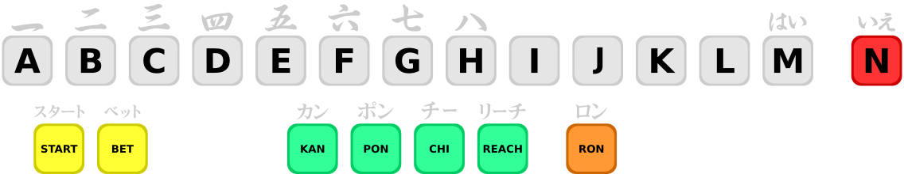

.. raw:: html

	

Crie a pasta ``artwork\janjans1``, dentro dela copie o arquivo **.svg**
acima, crie também o arquivo ``default.lay`` e abra-o num editor de
texto.

Iniciamos o layout com o básico:

.. code-block:: xml

	<?xml version="1.0"?>
	<mamelayout version="2">

	<!--
		Joystick Mahjang for janjans1
		Created by: Wellington Terumi Uemura
		License: CC by 4.0
		https://mamedoc.readthedocs.io/
		Date: October 25, 2021
		Download: https://www.mediafire.com/file/gq1mgezijhcvx2p/janjans1.zip
	-->
	<!-- Aqui carregamos o nosso controle -->
	<element name="base">
		<image file="mahjongpanel2.svg" />
	</element>

	<!--
		Aqui deixamos reservado para uso futuro, como iluminar as teclas
		depois de serem clicadas por exemplo, porém, distrai demais.
		Assim deixamos ele vazio.
	-->
	<element name="btn" defstate="1">
		<text string=" ">
			<color red="0.0" green="0.0" blue="0.0" />
			<bounds x="0" y="0" width="58.038" height="58.038" />
		</text>
	</element>

Agora precisamos ver no driver como os botões estão definidos para poder
conectá-los na imagem do nosso controle, na data de criação deste texto,
essa informação começa na
`linha 1033 <https://github.com/mamedev/mame/blob/master/src/mame/drivers/ssv.cpp#L1033>`_:

.. code-block:: xml

	<!-- Definimos o tamanho da nossa área de trabalho dentro de um grupo -->
	<group name="Controle_mah">
		<bounds x="0" y="0" width="1136" height="216.63" />

	<!-- Informamos o tamanho original da imagem do nosso controle -->
	<element ref="base">
		<bounds x="0" y="0" width="1136" height="216.63" />
	</element>

	<!--
		Aqui mapeamos todos os botões segundo o driver, abrindo a nossa
		imagem no Inkscape e desagrupando todos os elementos
		(Shift + Ctrl + G), ao clicar na região amarelo claro do botão
		"Start" por exemplo, nós temos as coordenadas e o seu respectivo
		tamanho no topo da tela (lembrando que os valores devem estar em
		px!).
		É assim que obtemos os valores de posição e tamanho que usamos
		abaixo.
	-->
		<!-- PON -->
		<element ref="btn" inputtag="KEY0" inputmask="0x4">
			<bounds x="442.969" y="159.961" width="58.038" height="58.038" />
		</element>
		<!-- L -->
		<element ref="btn" inputtag="KEY0" inputmask="0x8">
			<bounds x="882.979" y="47.960" width="58.038" height="58.038" />
		</element>
		<!-- H -->
		<element ref="btn" inputtag="KEY0" inputmask="0x10">
			<bounds x="562.979" y="47.960" width="58.038" height="58.038" />
		</element>
		<!-- D -->
		<element ref="btn" inputtag="KEY0" inputmask="0x20">
			<bounds x="242.979" y="47.960" width="58.038" height="58.038" />
		</element>

		<!-- RON -->
		<element ref="btn" inputtag="KEY1" inputmask="0x2">
			<bounds x="715.014" y="159.961" width="58.038" height="58.038" />
		</element>
		<!-- CHI -->
		<element ref="btn" inputtag="KEY1" inputmask="0x4">
			<bounds x="522.965" y="159.961" width="58.038" height="58.038" />
		</element>
		<!-- K -->
		<element ref="btn" inputtag="KEY1" inputmask="0x8">
			<bounds x="802.979" y="47.960" width="58.038" height="58.038" />
		</element>
		<!-- G -->
		<element ref="btn" inputtag="KEY1" inputmask="0x10">
			<bounds x="482.979" y="47.960" width="58.038" height="58.038" />
		</element>
		<!-- C -->
		<element ref="btn" inputtag="KEY1" inputmask="0x20">
			<bounds x="162.979" y="47.960" width="58.038" height="58.038" />
		</element>

		<!-- BET -->
		<element ref="btn" inputtag="KEY2" inputmask="0x1">
			<bounds x="122.981" y="159.961" width="58.038" height="58.038" />
		</element>
		<!-- REACH -->
		<element ref="btn" inputtag="KEY2" inputmask="0x2">
			<bounds x="602.965" y="159.961" width="58.038" height="58.038" />
		</element>
		<!-- N -->
		<element ref="btn" inputtag="KEY2" inputmask="0x4">
			<bounds x="1075" y="47.961" width="58.038" height="58.038" />
		</element>
		<!-- J -->
		<element ref="btn" inputtag="KEY2" inputmask="0x8">
			<bounds x="722.979" y="47.960" width="58.038" height="58.038" />
		</element>
		<!-- F -->
		<element ref="btn" inputtag="KEY2" inputmask="0x10">
			<bounds x="402.979" y="47.960" width="58.038" height="58.038" />
		</element>
		<!-- B -->
		<element ref="btn" inputtag="KEY2" inputmask="0x20">
			<bounds x="82.979" y="47.960" width="58.038" height="58.038" />
		</element>

		<!-- START -->
		<element ref="btn" inputtag="KEY3" inputmask="0x1">
			<bounds x="42.980" y="159.961" width="58.038" height="58.038" />
		</element>
		<!-- KAN -->
		<element ref="btn" inputtag="KEY3" inputmask="0x2">
			<bounds x="362.965" y="159.961" width="58.038" height="58.038" />
		</element>
		<!-- M -->
		<element ref="btn" inputtag="KEY3" inputmask="0x4">
			<bounds x="962.979" y="47.960" width="58.038" height="58.038" />
		</element>
		<!-- I -->
		<element ref="btn" inputtag="KEY3" inputmask="0x8">
			<bounds x="642.979" y="47.960" width="58.038" height="58.038" />
		</element>
		<!-- E -->
		<element ref="btn" inputtag="KEY3" inputmask="0x10">
			<bounds x="322.979" y="47.960" width="58.038" height="58.038" />
		</element>
		<!-- A -->
		<element ref="btn" inputtag="KEY3" inputmask="0x20">
			<bounds x="2.979" y="47.960" width="58.038" height="58.038" />
		</element>
	</group>

Resolvida a questão dos controles, agora é preciso definir como vamos
disponibilizar os objetos na tela. Ao iniciar a máquina com
``mame janjans1`` e ao clicar em
:guilabel:`Tab` --> :guilabel:`Informação da máquina`, o driver informa
que o tamanho da tela tem ``336`` x ``240``.

* Inicie o *Inkscape*, defina o :guilabel:`Units` e a página em **px**,
  defina o tamanho da página como ``336`` por ``240`` **px**.
* Importe para esta página a imagem do controle fornecida acima, durante
  a importação da imagem deve aparecer uma tela, em
  :guilabel:`DPI for rendered SVG` mantenha :guilabel:`96` DPI.
* Clique no cadeado entre os valores :guilabel:`W:` e `H:` para travar a
  proporção.
* Em :guilabel:`W:` coloque ``336,0`` e pressione :kbd:`Enter` para
  aplicar, agora temos um objeto na tela com ``336`` por ``63,904``.
* Somando a altura do objeto com a altura da tela ``63,904`` + ``240``
  nós temos uma altura total de ``303,904``.
* Pressione :kbd:`Shift` + :kbd:`Ctrl` + :kbd:`D` e na altura da página
  coloque ``303,904`` **px**.
* Desenhe um quadrado que vai simular a nossa tela com ``336`` por
  ``240`` alinhado no **Topo da página**.
* Posicione a imagem do controle logo abaixo e alinhe, isso lhe dará uma
  visão geral daquilo que pretende fazer.
* Como o controle fica muito colado com a tela, descemos o controle
  cerca de um toque do direcional para baixo.
* Faça :kbd:`Ctrl` + :kbd:`A` para selecionar tudo seguido de
  :kbd:`Ctrl` + :kbd:`G` para agrupar ambos os objetos, agora temos uma
  altura final com ``305,904``.
* Faça novamente :kbd:`Shift` + :kbd:`Ctrl` + :kbd:`D` e atualize a
  altura da página em **px**, isso é importante para obter as devidas
  coordenadas para o posicionamento dos elementos na tela.

Se deu tudo certo até aqui, você deve ter algo semelhante ao exemplo
abaixo:

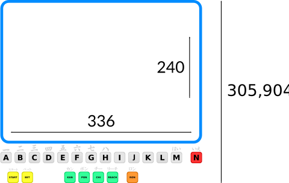

.. raw:: html

	

Agora faça :kbd:`Ctrl` + :kbd:`A` seguido de :kbd:`Shift` + :kbd:`Ctrl`
+ :kbd:`G` para desagrupar o objeto tela do controle, repare que ao
clicar no objeto tela e depois no controle, nós obtemos as coordenadas
e seus respectivos tamanhos, é com estas informações que
usamos para concluir o nosso layout:

.. code-block:: xml

	<!-- Nome -->
	<view name="Controle">
		<!-- Delimitamos a nossa área de exibição -->
		<bounds x="0" y="0" width="336" height="305.904" />
	<screen index="0">
		<!-- O tamanho original da tela -->
		<bounds x="0" y="0" width="336" height="240" />
	</screen>
		<!-- Invocamos o nosso controle -->
		<group ref="Controle_mah">
		<bounds x="0.4" y="242" width="335" height="63.904" />
	</group>
	</view>
	</mamelayout>

Observe que os valores **X**, **Y** e **width** de ``Controle_mah``
estão um pouco diferentes do que obtivemos com o *Inkscape*, não é algo
comum, porém, algumas vezes é necessário para fazer um ajuste fino de
alinhamento para que os elementos apareçam em seus devidos lugares na
tela do MAME.

Com tudo pronto, rodamos a máquina novamente com ``mame janjans1`` e
entramos no modo de serviço (:kbd:`Tab` --> :guilabel:`Chaves DIP` -->
:guilabel:`Service Mode` --> :guilabel:`On`, depois
:guilabel:`Redefine`. Clique no botão **A** na tela uma vez para pular o
teste de cores, clique novamente para entrar no modo de teste e
pressione :kbd:`Tab` para fechar o quadro de informação na tela).

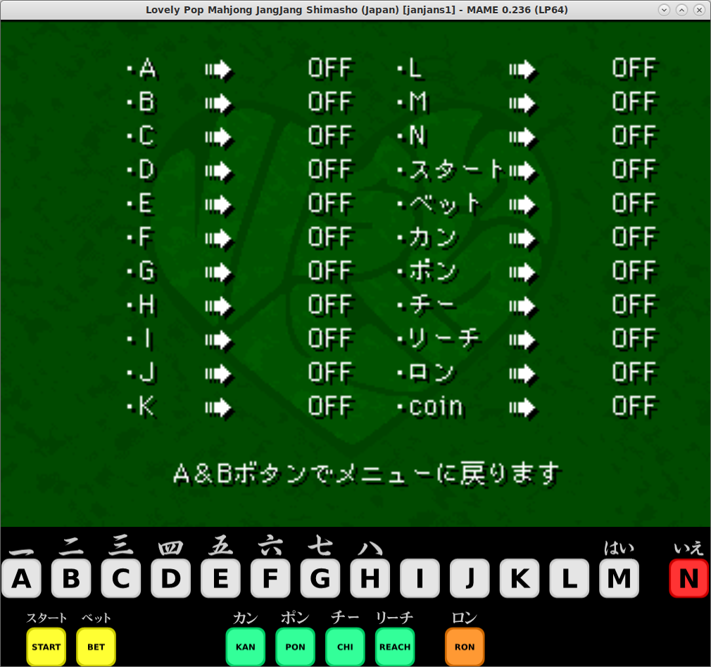

.. raw:: html

	

Ao clicar nos botões da tela, os botões da emulação deverão se alternar
entre **ON** e **OFF** indicando que todos os botões estão funcionando.
Retorne ao :guilabel:`Service Mode`, mude a chave para :guilabel:`Off`
e clique em :guilabel:`Redefine` para reiniciar a máquina.

.. raw:: latex

	\clearpage

.. _layfile-examples:

Exemplos de outros arquivos layout
----------------------------------

Estes arquivos layout demonstram as várias características do sistema
de visualização, todo eles estão embutidos no MAME.

* `sstrangr.lay <https://git.redump.net/mame/tree/src/mame/layout/sstrangr.lay?h=mame0235>`_

    Um caso simples da utilização de transparências coloridas para
    visualizar a separação e o destaque dos elementos em uma tela preto
    e branco.

* `seawolf.lay <https://git.redump.net/mame/tree/src/mame/layout/seawolf.lay?h=mame0235>`_

    Este sismtema utiliza lâmpadas para os elementos importantes do
    jogo. Os modos de mesclagem são utilizados para a transparência
    colorida que é colocada na frente do monitor. Também utiliza
    ``collections`` permitindo que partes do layout sejam desativadas
    seletivamente.

* `armora.lay <https://git.redump.net/mame/tree/src/mame/layout/armora.lay?h=mame0235>`_

    A tela deste jogo é vista diretamente através de uma transparência
    colorida em vez de ser refletida a partir de dentro do gabinete.
    Isso significa que a transparência reflete a luz ambiente assim como
    afeta a cor da imagem do vídeo.

* `tranz330.lay <https://git.redump.net/mame/tree/src/mame/layout/tranz330.lay?h=mame0235>`_

    Uma tela e um teclado alfanumérico com vários segmentos. As teclas
    são clicáveis e fornecem feedback visual quando pressionadas.

* `esq2by16.lay <https://git.redump.net/mame/tree/src/mame/layout/esq2by16.lay?h=mame0235>`_

    Constrói uma matriz de caracteres com múltiplas linhas. As
    repetições são usadas para evitar a repetição das linhas em um
    caractere, dos caracteres em uma linha e das linhas em uma página.
    As cores de grupo permitem que um único elemento seja usado para
    todas as quatro cores da tela.

* `cgang.lay <https://git.redump.net/mame/tree/src/mame/layout/cgang.lay?h=mame0235>`_

    Anima a posição dos elementos para simular um jogo de tiro
    eletromecânico. Também demonstra o uso eficaz dos componentes para a
    construção de gráficos complexos.

* `unkeinv.lay <https://git.redump.net/mame/tree/src/mame/layout/unkeinv.lay?h=mame0235>`_

    Exibe a posição de um controle deslizante com LEDs.

* `md6802.lay <https://git.redump.net/mame/tree/src/mame/layout/md6802.lay?h=mame0235>`_

    Usa grupos de forma efetiva como uma linguagem de programação para
    construir a imagem de um protoboard.

.. [#]	Arquivos que organizam a disposição dos elementos gráficos na tela. (Nota do tradutor)
.. [#]	Em nosso idioma conhecido também como
		cerquilha, jogo da velha, sustenido e atualmente como
		**hashtag**. (Nota do tradutor)
.. [#]	*C locale* em Inglês. (Nota do tradutor)
.. [#]	O termo *shift* é muito amplo, também pode ser
		interpretado como desvio, mudança, turno, inversão, câmbio, etc.
		(Nota do tradutor)
.. [#]	Reels, `mostradores mecânicos
		<https://i.postimg.cc/FF2GYc9v/Reels.jpg>`_ usados nas máquinas
		caça niqueis. (Nota do tradutor)
.. [#]	`Aqui <https://www.youtube.com/watch?v=-rrP4Prx1rc>`_ um exemplo
		destes mostradores. (Nota do tradutor)
.. [#]	Alpha Blending
.. [#]	RGB multiplication
.. [#]	Additive blending
.. [#]	Toggle switches, também é conhecido como chave alavanca.
		(Nota do tradutor)
.. [#TAG]	Tag no Inglês.
.. [#INSTANCIA]	Em programação orientada a objetos, chama-se instância
		de uma classe, um objeto cujo comportamento e estado sejam
		definidos pela classe. (`Wikipedia
		<https://pt.wikipedia.org/wiki/Instância_(ciência_da_computação)>`_)
.. [#XOR]	Exclusive OR ou operador exclusivo, é um operando que sempre
		retorna 1 quando os bits da sua entrada são diferentes e
		O (zero) quando forem iguais.
