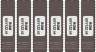
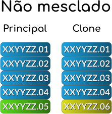
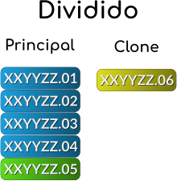
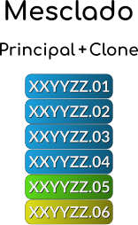

.. raw:: latex

	\clearpage

.. _aboutromsets:

Sobre as ROMs e os seus conjuntos
=================================

O manuseio e a atualização das ROMs e dos seus respectivos conjuntos é
provavelmente a questão que causa a maior confusão e problemas dentre os
usuários do MAME, especialmente os marinheiros de primeira viagem.

Esta seção tem como objetivo esclarecer diversos tópicos sobre o
assunto, para tirar muitas das dúvidas mais comuns sobre o assunto e
para abordar detalhes que você precisa saber para poder usar o MAME de
forma mais eficaz.

.. _aboutromsets_rom:

O que é uma imagem ROM?
-----------------------

A programação do jogo em si ficam armazenados dentro de circuitos
integrados [#CI]_ na placa-mãe do arcade ou num outro tipo de
dispositivo (CD-ROM, DVD-ROM, HDD, etc.). Nós chamamos estes arquivos de
ROMs pois é um acrônimo de *"Read-Only Memory"* que significa memória de
leitura apenas.

Na maioria dos consoles e portáteis, dentro dos cartuchos geralmente a
programação do jogo vem num único CI (mas nem sempre). Já nos sistemas
arcade a coisa é um pouco mais complicada devido ao seu design, o
sistema em questão normalmente precisará ler todos os dados do jogo
encontrado em diferentes CIs espalhados por toda a placa.

Alguns dos CIs usados para armazenar os dados não são regraváveis como
um CI do tipo **PROM** por exemplo, uma vez gravados, os dados ficam
armazenados de forma permanente (contanto que o CI não seja danificado
ou caso envelheça até a pifar de vez!).

No exemplo abaixo podemos ver um exemplo de um conjunto de CIs do tipo
**EPROM** que podem ser apagados através de uma luz ultravioleta e
gravados novamente (as etiquetas são colocadas em cima destes CIs que
contém uma abertura para realizar este apagamento, como proteção contra
o apagamento involuntário ou acidental dos dados). Dada a questão da
limitação da tecnologia e de espaço da época, os dados eram divididos em
diferentes EPROMs.

.. raw:: html

	

.. raw:: latex

	\clearpage

Posteriormente através de um leitor apropriado, os dados contidos dentro
destas EPROMs são lidos e armazenado em forma de uma imagem binária.
Este processo de se extrair a imagem de dentro destes CIs é chamado de
*"dump"* ou *ROM dump*. As imagens depois de extraídas geralmente podem
ser organizadas e armazenadas como ``xxyyzz.01``, ``xxyyzz.02``,
``xxyyzz.03``, ``xxyyzz.04``, ``xxyyzz.05`` e ``xxyyzz.06``
respectivamente. Após a conclusão de todo o processo e de todo um
trabalho de aferição para saber se as imagens foram extraídas
corretamente, os desenvolvedores registram o nome de cada imagem e os
seus respectivos CRC [#CRC]_ e SHA1 [#SHA1]_ dentro do código-fonte do
respectivo driver para que o MAME saiba como carrega-los.

.. _aboutromsets_rom_version:

As ROMs e as suas "versões"
---------------------------

Há uma grande confusão com relação ao MAME e as *"versões"* das
ROMs que o MAME utiliza, porém, vejamos o que o MAME leva em
consideração ao aceitar uma ROM como válida. Usando a ROM **pacman**
como exemplo, o banco de dados interno do MAME nos mostra o seguinte::

	mame -lr pacman 
	ROMs required for driver "pacman".
	Name                                   Size Checksum
	pacman.6e                              4096 CRC(c1e6ab10) SHA1(e87e059c5be45753f7e9f33dff851f16d6751181)
	pacman.6f                              4096 CRC(1a6fb2d4) SHA1(674d3a7f00d8be5e38b1fdc208ebef5a92d38329)
	pacman.6h                              4096 CRC(bcdd1beb) SHA1(8e47e8c2c4d6117d174cdac150392042d3e0a881)
	pacman.6j                              4096 CRC(817d94e3) SHA1(d4a70d56bb01d27d094d73db8667ffb00ca69cb9)
	pacman.5e                              4096 CRC(0c944964) SHA1(06ef227747a440831c9a3a613b76693d52a2f0a9)
	pacman.5f                              4096 CRC(958fedf9) SHA1(4a937ac02216ea8c96477d4a15522070507fb599)
	82s123.7f                                32 CRC(2fc650bd) SHA1(8d0268dee78e47c712202b0ec4f1f51109b1f2a5)
	82s126.4a                               256 CRC(3eb3a8e4) SHA1(19097b5f60d1030f8b82d9f1d3a241f93e5c75d6)
	82s126.1m                               256 CRC(a9cc86bf) SHA1(bbcec0570aeceb582ff8238a4bc8546a23430081)
	82s126.3m                               256 CRC(77245b66) SHA1(0c4d0bee858b97632411c440bea6948a74759746)

Para que a ROM **pacman** (do arquivo ``pacman.zip``) seja considerada
**válida**, várias características muito específicas devem bater com a
lista acima como o nome de cada arquivo, o tamanho e o *checksun*
(CRC + SHA1) de cada um deles.

Essa é a única informação que o MAME leva em consideração, **não
existe** na lista acima qualquer informação de *"versão da ROM"* assim
como o MAME não armazena tal informação em lugar nenhum, esta questão
também já foi abordada com mais detalhes em
:ref:`outro capítulo <Old-Sets>`.

Para complicar a coisa ainda mais, temos mais duas questões, uma parte
vem de **front-ends** e outros aplicativos que utilizam diferente
versões do MAME. A outra questão tem a ver com pessoas que compilam uma
versão completa das ROMs conforme novas versões do MAME vão sendo
lançadas visando "facilitar" todos aqueles que colecionam tais arquivos.

Talvez por causa de desinformação, se espalhou pela internet um mito
onde a ROM do **pacman**, por exemplo, *"só vai funcionar"* se a
versão da ROM bater com a versão do MAME, como demonstrado acima, isso
é uma mentira sem qualquer fundamento. Podemos ver, por exemplo, no site
`Arcade Database <http://adb.arcadeitalia.net/dettaglio_mame.php?game_name=pacman&lang=en>`_
que nada foi alterado no jogo **pacman** entre as versões
**0.196 -> 0.244** do MAME. Logo, contanto que os arquivos batam com a
lista acima, o jogo **pacman** funcionará normalmente, independentemente
da versão do MAME.

Portanto, para o usuário mais leigo, não é preciso atualizar todas as
suas ROMs a cada nova versão do MAME, é muito provável que as ROMs que
você mais usa e já tenha, continuarão a funcionar sem problemas. Caso os
desenvolvedores do MAME atualizem alguma coisa no driver, no arquivo da
ROM ou apareça um novo *ROM dump* (pois a versão anterior tinha algum
tipo de problema), basta atualizar a ROM que parou de funcionar e não
todo o conjunto de ROMs como muitos fazem. A mesma informação vale
para aqueles que fazem coleção destes arquivos, não é preciso baixar
todo um *ROMSET* para uma determinada versão do MAME, basta adicionar as
novas ROMs e atualizar as já existentes (se for o caso), isso é
facilmente gerenciável através dos
:ref:`gerenciadores de ROMs <advanced-tricks-dat-sistema>`.

.. _aboutromsets_division:

A organização do conjunto das ROMs
----------------------------------

Ao longo do desenvolvimento dos jogos arcade por exemplo, alguns deles
passam por revisões, nestas revisões o código pode ter correções ou
atualizações. Então muitas vezes se mantinha a placa original do arcade
e trocava-se apenas a programação de um dos CIs relacionado com a
atualização da programação do jogo. Há casos também onde um mesmo arcade
será vendido em diferentes partes do mundo, assim a programação
principal é mantida, porém, apenas algumas partes da programação é
substituída, como o licenciamento, o nome da empresa licenciada,
o idioma, o título, talvez os personagens e assim por diante.

Visando a economia de espaço, a estrutura interna do MAME foi organizada
de maneira a utilizar um sistema hierárquico familiar de *"parent"* e
*"clone"* ou podemos traduzir como **principal** e **clone**.

A última revisão corrigida de um determinado sistema será definido como
a ROM **principal** desta família (*World*), mas nem sempre.
Por exemplo, serão definidos como **clones** todos os conjuntos das
ROMs que em geral usarem exatamente os mesmos CIs, no entanto, caso haja
dados que forem diferentes do conjunto principal em alguns deles (como a
versão Japonesa do **Puckman** e a versão USA/World do **Pac Man**).

Ao rodar um jogo clone ou um dos seus conjuntos subsequentes sem antes
ter o jogo principal disponível, o usuário será informado do problema.
Usando o exemplo anterior, ao tentar jogar a versão Americana do
**Pac Man** (``pacman``) sem antes ter a ROM principal ``puckman``,
aparecerá uma mensagem de erro informando quais são os arquivos que
estão faltando.

Para fazer este teste nós podemos usar a opção
:ref:`-verifyroms <mame-commandline-verifyroms>`, supondo que tenhamos
ambas as ROMs ``puckman.zip`` e ``pacman.zip`` na nossa pasta
**roms** podemos realizar o seguinte teste para verificar se
``puckman`` está com tudo em ordem::

	mame -verifyroms puckman
	romset puckman is good
	1 romsets found, 1 were OK.

Podemos fazer o mesmo teste com ``pacman``::

	mame -verifyroms pacman
	romset pacman [puckman] is good
	1 romsets found, 1 were OK.

Repare que como a ROM **pacman** é um clone de **puckman**, o MAME
destaca essa informação dentro de colchetes ``[]``, no caso
``[puckman]``, isso significa que temos ambas as ROMs.

Vamos supor que a gente não tenha a ROM **puckman**, este é o erro que
o MAME apresentará ao realizar o mesmo teste com a ROM **pacman**::

	mame -verifyroms pacman
	pacman      : 82s123.7f (32 bytes) - NOT FOUND (puckman)
	pacman      : 82s126.4a (256 bytes) - NOT FOUND (puckman)
	pacman      : 82s126.1m (256 bytes) - NOT FOUND (puckman)
	pacman      : 82s126.3m (256 bytes) - NOT FOUND (puckman)
	romset pacman [puckman] is bad
	1 romsets found, 0 were OK.

Aqui o MAME identifica quais são os arquivos que estão faltando
(``82s123.7f``, ``82s126.4a``, ``82s126.1m``, ``82s126.3m``), o
respectivo tamanho de cada um dos arquivos e o mais importante, o MAME
informa qual o nome da ROM que está faltando (``puckman``), como
**puckman** está entre colchetes, agora sabemos que **puckman** está
faltando e que ela é necessária para que a ROM **pacman** funcione.

Podemos usar a opção :ref:`-listclones / -lc <mame-commandline-listclones>`
para identificar qual é a ROM principal e qual é o clone, exemplo::

	mame -lc pacman
	Name:            Clone of:
	pacman           puckman

O MAME também consegue apontar a falta de ROMs necessárias para o
funcionamento de um sistema e que não seja necessariamente relacionado
com a questão de ROMs principais e clones. Podemos usar o exemplo do
jogo **The King of Fighters '94** (``kof94``), para que ele funcione,
é preciso ter o arquivo com as *BIOS* do sistema, exemplo::

	mame -verifyroms kof94
	kof94       : sfix.sfix (131072 bytes) - NOT FOUND (neogeo)
	kof94       : 000-lo.lo (131072 bytes) - NOT FOUND (neogeo)
	kof94       : sp-s2.sp1 (131072 bytes) - NOT FOUND (neogeo)
	kof94       : sp-s.sp1 (131072 bytes) - NOT FOUND (neogeo)
	...
	romset kof94 [neogeo] is bad
	1 romsets found, 0 were OK.

Aqui o MAME está informando que a ROM ``neogeo`` (ou ``neogeo.zip`` na
pasta **roms**) não existe, não foi encontrada na pasta **roms** ou que
o caminho para onde ela exista não foi definido no
:ref:`rompath <mame-commandline-rompath>`. Para corrigir o problema,
basta baixar o ``neogeo.zip`` e colocá-lo na pasta **roms** e repetir o
teste::

	mame -verifyroms kof94
	romset kof94 [neogeo] is good
	1 romsets found, 1 were OK.

Dada a versatilidade do MAME de identificar o que ele precisa para
funcionar, os conjuntos das ROMs são separados em 3 categorias:

* **non-merged** (não mesclado)
* **split** (dividido)
* **merged** (mesclado)

.. raw:: latex

	\clearpage

A sua organização é bem simples de se compreender conforme mostram as
imagens [#IMAGENS]_ abaixo:

.. raw:: html

	

Nesta categoria, muito espaço é perdido pois há a duplicidade de
arquivos. No nosso exemplo acima, nós temos a duplicidade das ROMs
``XXYYZZ`` de 1 a 4 e a única diferença é a rom 5 na ROM **principal**
e a ROM 6 na ROM **clone**, como explicado anteriormente, a
diferença entre elas pode ser um idioma diferente, o licenciamento
diferente para um país diferente do original como do Japão para os EUA
ou do Japão para o Reino Unido, etc. Dada a ineficiência de
armazenamento, este é um modo não recomendado para armazenar as suas
ROMs.

.. raw:: html

	

Aqui nós temos todos os arquivos de ROMs principais num arquivo zip e
apenas o arquivo da ROM que é diferente como **clone** em relação a ROM
**principal** separado. A característica deste modo é a economia de
espaço já que não há duplicidade de ROMs, porém, há quem prefira o
modo **mesclado**. A desvantagem deste modo é a dependência externa de
arquivos do tipo BIOS (``neogeo.zip`` por exemplo) e DISPOSITIVOS
(``namco51.zip`` por exemplo), o sistema para de funcionar numa eventual
perda ou exclusão acidental destes arquivos.

.. raw:: html

	

Neste caso nós temos todas as ROMs necessárias do sistema (incluindo
os clones) num único arquivo. A vantagem deste modo é economizar ainda
mais espaço que no modo dividido pois todos os arquivos clones que
eventualmente acabam se repetindo em sistemas diferentes agora ficam num
arquivo só, assim como, as ROMs do tipo BIOS e DISPOSITIVOS.

Estes são princípios básicos destes conjuntos de ROMs, porém, existem
dois outros tipos de conjunto que serão usados no MAME de tempos em
tempos.

.. raw:: latex

	\clearpage

O primeiro, é o **conjunto de BIOS** (*BIOS set*). Alguns sistemas
arcade compartilhavam uma plataforma de hardware em comum, como o
hardware de arcade Neo Geo. Já que na placa principal havia todos os
dados necessários para iniciar e realizar o seu próprio auto-teste do
hardware antes de seguir inicializando um dos cartuchos de jogos.
Aliás, não é apropriado colocar os dados do jogo para iniciar junto com
a BIOS. Em vez disso, ele é armazenado separadamente como uma imagem
BIOS para o próprio sistema (**neogeo.zip** para jogos Neo Geo por
exemplo).

O segundo, o **conjunto de dispositivos** (*device set*). Visando a
economia de tempo e de dinheiro, frequentemente os fabricantes de arcade
reutilizavam várias partes dos seus projetos mais de uma vez afim de
economizar tempo e dinheiro. Alguns destes circuitos menores
reapareceriam nas placas mais novas desde que tivessem um mínimo em
comum com o circuito das placas lançadas anteriormente, logo, não seria
possível organizar os dados do circuito ou da própria ROM usando o
contexto de **principal** e **clone**. Por causa disso, algumas ROMs são
categorizados como *"Device"* (dispositivo) onde os dados são
armazenados como um conjunto de dispositivos ou *"Device set"*.

Por exemplo, a Namco utilizou um circuito integrado customizado de
entrada e saída (I/O) *Namco 51xx* para para lidar com os
comandos do joystick e as chaves DIP para o jogo **Galaga** que também é
utilizado por outros jogos, assim sendo, para que o jogo funcione no
MAME será preciso a ROM de dispositivos armazenado no arquivo
``namco51.zip`` e também do ``namco54.zip`` para que a ROM
``galaga.zip`` funcione.

.. _aboutromsets_problems:

Solucionando problemas dos seus conjuntos de ROMs e um pouco de história
------------------------------------------------------------------------

A frustração de muitos usuários do MAME podem estar relacionadas com as
alterações julgadas como desnecessárias por muitos, porém, tais
alterações são necessárias devido as alterações que os arquivos ROM
sofrem ao longo do tempo e que na cabeça dos usuários, parece que
fazemos isso para tornar a vida de vocês mais difícil e realmente não é
o caso.

Compreender o motivo destas alterações e o porque delas serem
necessárias lhe ajudará a evitar ser iludido por estas contradições
sobre as :ref:`versões das ROMs <aboutromsets_rom_version>`.

Uma grande quantidade de ROMs e com os seus respectivos conjuntos já
existiam antes da emulação. Estes conjuntos iniciais foram criados pelos
proprietários das casas de arcades e utilizados como um recurso de
manutenção para as placas quebradas que já não funcionavam mais, assim
como, para a substituição dos componentes/peças/CIs danificados.
Infelizmente, alguns destes conjuntos já não continham mais todos os
dados essenciais (o programa em si) para poder funcionar. Muitas das
imagens que foram extraídas logo no começo tinham falhas e erros, seja
por um procedimento errado na hora da extração ou pela falta da
tecnologia para poder fazê-lo da forma mais eficiente possível, como a
falta de informação responsável pela paleta de cores da tela por
exemplo.

Os primeiros emuladores tentavam simular artificialmente estes dados das
cores que faltavam da maneira mais próxima possível, porém, por mais que
se tentasse ela nunca chegava próxima da original, havia erros. Até
descobrirem os dados que faltavam em outros circuitos integrados. Isso
faz com que seja necessário extrair estes dados e atualizar os conjuntos
antigos com os novos arquivos conforme fosse necessário.

Não demoraria muito para descobrir que muitos dos conjuntos já
existentes tinham dados ruins para um ou mais circuitos integrados
conforme a emulação daquele sistema específico foi melhorando, entenda
"dados ruins" como uma imagem extraída faltando partes, no formato
errado, com partes corrompidas, etc. Algumas vezes os desenvolvedores
precisavam criar burlar o funcionamento original de certos circuitos
para que a emulação pudesse funcionar porque a imagem deste CI
específico os desenvolvedores não tinham acesso ou porque ainda não
era possível extrair o seu conteúdo. E quando a imagem deste CI era
extraído e usado no emulador, a emulação do sistema já não funcionava
mais.

Por essas e outras que, uma vez compreendido como o circuito funcionava,
o driver e as ROMs daquele respectivo sistema precisavam ser
atualizados. E conforme mais ROMs iam aparecendo, mais e mais conjuntos
precisariam de revisões completas.

Ocasionalmente, seria descoberto que a documentação de alguns jogos
estava errada ou foi feita de forma errada. Alguns jogos considerados
originais eram na verdade, cópias piratas de fabricantes desconhecidos.
Outros jogos que foram considerados como "piratas" eram na verdade a
versão original do jogo e assim por diante. Os dados de alguns jogos
estavam bagunçados de maneira que não se sabia exatamente de qual região
determinada placa era (como jogos **World** misturado com **Japão** por
exemplo) o que exigiu também que ajustes internos e a correção dos nomes
fossem feitos.

Mesmo agora, acontecem achados ocasionais e "milagrosos" que alteram a
nossa compreensão desses jogos. Como é fundamental que uma documentação
seja precisa para registrar a história dos arcades, o MAME mudará o nome
dos conjuntos sempre que for necessário, visando a precisão e mantendo
as coisas da maneira mais correta possível, sempre no limite do
conhecimento que a equipe têm a cada novo lançamento do MAME.

Isso resulta numa compatibilidade muito irregular para os conjuntos das
ROMs que param de funcionar nas versões mais antigas do MAME. Alguns
jogos podem não ter mudado muito entre 20 ou 30 novas versões do MAME,
assim como outros podem ter mudado drasticamente entre as novas
versões já lançadas.

Caso encontre problemas com um determinado conjunto de ROMs que não
funcionam mais, há várias coisas a serem verificadas:

*	Você está tentando rodar um conjunto de ROMs destinado à uma versão
	mais antiga do MAME?
*	Você têm o conjunto de BIOS necessários ou a ROM dos dispositivos?
*	Seria este um clone que precisaria ter também a ROM principal?

O MAME :ref:`sempre informará quais os arquivos estão faltando <aboutromsets_rom>`,
dentro de quais conjuntos e onde eles foram procurados.

.. _aboutromsets_rom_chd:

ROMs e CHDs
-----------

Os dados do CI que contém a imagem da ROM, tendem a ser relativamente
pequenos e são carregados sem maiores problemas na memória do sistema.
Alguns jogos também usavam mídias adicionais de armazenamento, como
discos rígidos, CD-ROMs, DVDs e Laserdiscs. Esses meios de armazenamento
são, por questões técnicas diversas, inadequados para serem armazenados
da mesma forma que os dados das ROMs e, em alguns casos, não caberão por
inteiro na memória.

Assim, um novo formato foi criado para eles, sendo armazenados num
arquivo CHD. **Compressed Hunks of Data** ou numa tradução literal seria
**Pedaços Comprimidos de Dados** ou CHD para simplificar. Estes são
projetados especificamente em torno das necessidades de armazenamento
dessa mídia. Para rodar, alguns jogos de arcade, de consoles e de PCs
precisarão de um arquivo CHD.

Como os CHDs já estão comprimidos, eles **NÃO DEVEM** ser comprimidos
novamente num arquivo ZIP, 7Z ou qualquer outro.

Visando a economia de espaço na existência de diversas variantes de um
sistema ou de um programa, o MAME oferece suporte a arquivos "*delta
CHD*". Um arquivo delta CHD armazena apenas as partes de dados que forem
diferentes dos dados do arquivo CHD *principal*, isso possibilita uma
economia de espaço considerável quando houver um grande compartilhamento
de dados entre eles. Os arquivos delta CHD só podem ser usados nos clones
dos sistemas principais, em dispositivos com uma ROM principal e os
clones dos programas. Para que seja possível usar um delta CHD, é
obrigatório que exista um CHD principal para que o MAME consiga ler os
dados compartilhados, seja para um sistema, para dispositivos ROM ou
para programas.

.. [#CI]	Estes circuitos integrados também são conhecidos pela abreviação
		"CI" (se fala CÊ-Í), assim como é chamado de "chip" em Inglês.
.. [#CRC]	Significa *Cyclic Redundancy Check* ou verificação
		cíclica de redundância, serve para aferir a integridade dos
		dados dos arquivos.
.. [#SHA1]	Significa *Secure Hash Algorithm* ou algoritmo de dispersão
		seguro, é uma função criptográfica que retorna um resultado com
		valor hexadecimal (hash) usado também para aferir a
		autenticidade dos dados dos arquivos.
.. [#IMAGENS]	Foi usado a imagem
		`deste link <https://forums.launchbox-app.com/topic/33619-mame-tutorial-for-n00bs/>`_
		como referência.
