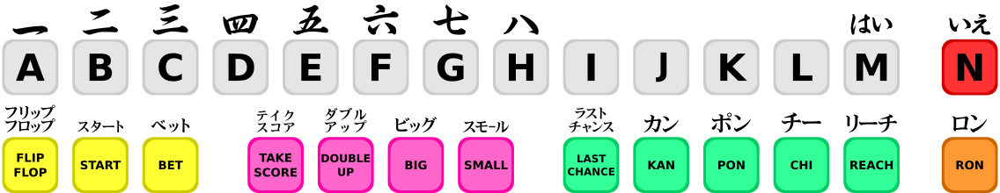

.. raw:: latex

	\clearpage

.. _default-keys:

Teclas já predefinidas
======================

.. contents:: :local:

.. _default-keys-foreword:

Introdução aos controles
------------------------

O MAME é compatível com uma vasta gama de diferentes tipos de sistemas,
e estes, possuem uma considerável quantidade de diferentes entradas
entre elas. Isso significa que algumas teclas do teclado, alguns botões
do mouse e alguns botões do joystick serão usados para diversas funções.
Como resultado, o mapa dos controles mostrados abaixo abaixo são
separados pelos tipos dos sistemas facilitando a busca.

Todos os controles abaixo são totalmente configuráveis através da
interface do usuário. Os exemplos abaixo são as configurações
predefinidas. As predefinições mostradas aqui são organizadas com base
do no teclado **US ANSI QWERTY**. Caso tenha um layout de teclado
diferente, as teclas poderão ser diferentes, consulte o capítulo
:ref:`default-comparative-kbd` para ver as diferenças.

.. raw:: latex

	\clearpage

.. _default-keys-ui-controls:

Controles da interface
----------------------

Estes controles cobrem as teclas básicas de funcionamento do MAME como o
cardápio de opções, a pausa do sistema, o salvamento e a leitura dos
estados.

:kbd:`Tab`
	Chama o cardápio de opções.

| :kbd:`~`	(tecla *til* no teclado US ANSI QWERTY)
| :kbd:`\``	(tecla *acento agudo* no teclado US ANSI QWERTY)
| :kbd:`"`	(tecla *aspas* no teclado ABNT-2)
| :kbd:`'`	(tecla *ápice* no teclado ABNT-2)

	Mostra as opções na tela.

	Caso esteja usando o MAME com a opção ``-debug``, esta tecla
	funciona como um ‘*break*’ na emulação.

	É possível utilizar as teclas abaixo quando um controle deslizante
	estiver visível na tela:

	* :kbd:`Cima` - Seleciona o parâmetro anterior.
	* :kbd:`Baixo` - Seleciona o próximo parâmetro.
	* :kbd:`Esquerda` - Reduz o valor do parâmetro selecionado.
	* :kbd:`Direita` - Aumenta o valor do parâmetro selecionado.
	* :kbd:`Enter` - Redefine o valor do parâmetro para o seu valor predefinido.
	* :kbd:`Control` + :kbd:`Esquerda` - Reduz o valor em passos de **10x**.
	* :kbd:`Shift` + :kbd:`Esquerda` - Reduz o valor em passos de **1x**.
	* :kbd:`Alt` + :kbd:`Esquerda` - Reduz todo o valor.
	* :kbd:`Control` + :kbd:`Direita` - Aumenta o valor em passos de **10x**.
	* :kbd:`Shift` + :kbd:`Direita` - Aumenta o valor em passos de **1x**.
	* :kbd:`Alt` + :kbd:`Direita` - Aumenta o valor no máximo.
	* :kbd:`End` - Oculta temporariamente a opção visível na tela.
	* :kbd:`Home` - Traz de volta a opção na tela depois que for oculta.

Seta direcional :kbd:`cima`
    Destaca a opção anterior da lista da interface.
Seta direcional :kbd:`baixo`
    Destaca a opção posterior da lista da interface.
Seta direcional :kbd:`esquerda`
    Altera a opção com os valores disponível do lado esquerdo quando uma seta estiver presente.
Seta direcional :kbd:`direita`
    Altera a opção com os valores disponível do lado direito quando uma seta estiver presente.
:kbd:`Home` / :kbd:`End`
    Destaca a primeira ou a última opção da lista.
:kbd:`[` :kbd:`]`
    Move para o grupo anterior ou para o próximo grupo nos menus
    compatíveis da IU (por exemplo, move para as entradas do dispositivo
    anterior ou para o seguinte no menu :guilabel`Atribuições da entrada (este sistema)).
:kbd:`Enter` / **Botão** :kbd:`1` do controle
    Seleciona a opção que estiver me destaque.
:kbd:`Espaço`
    Exibe um comentário na opção selecionada.
:kbd:`Delete`
    Limpa/redefine o valor para a predefinição inicial nas configurações
    de entrada, trapaça e opções do plug-in.
:kbd:`P`
    Pausa a emulação.
:kbd:`Shift` esquerdo + :kbd:`P`
    Enquanto estiver pausado, avança para o próximo quadro. Se o
    rebobinamento estiver ativo, um estado é salvo para ser usado pela
    função de rebobinamento.
:kbd:`Shift` esquerdo + :kbd:`~`
    Enquanto estiver pausado, carrega o estado salvo mais recente para
    ser usado com o rebobinamento.
:kbd:`F1`
    Liga o sistema nos sistema que tenham esta função de liga/desliga.
:kbd:`F2`
    Desliga o sistema nos sistema que tenham esta função de liga/desliga.
:kbd:`F3`
    Faz um reinicio simples do sistema.
:kbd:`Shift` esquerdo + :kbd:`F3`
    Realiza um reinicio "pesado" onde tudo é zerado e carregado do
    início. Este é um processo mais completo do que quando feito com
    :kbd:`F3`. 
:kbd:`F4`
    Mostra a paleta do jogo, os gráficos decodificados, os gráficos em
    pedaços, os caracteres e qualquer outro *tilemap* disponível.

    Use :kbd:`Enter` para alternar entre os três modos (paleta,
    gráficos, e *tilemaps*).

    Pressione :kbd:`F4` novamente para fechar essa tela.
    Os controles principais de cada modo variam um pouco:

    **Modo paleta/tabela de cores**:

    * :kbd:`[` :kbd:`]` - Alterna entre as paletas.
    * :kbd:`Cima` / :kbd:`Baixo` - Sobe/desce uma linha por vez.
    * :kbd:`PgUp` / :kbd:`PgDn` - Sobe/desce uma página por vez.
    * :kbd:`Home` / :kbd:`End` - Vai para o topo/fim da lista.
    * :kbd:`-` / :kbd:`+` - Aumenta/reduz a quantidade de cores por fila.
    * :kbd:`0` - Restaura a quantidade de cores por fila.
    * :kbd:`Enter` - Alterna para o visualizador gráfico.

    **Modo gráfico**:

    * :kbd:`[` :kbd:`]` - Alterna entre diferentes conjuntos gráficos.
    * :kbd:`Cima` / :kbd:`Baixo` - Sobe/desce uma linha por vez.
    * :kbd:`PgUp` / :kbd:`PgDn` - Sobe/desce uma página por vez.
    * :kbd:`Home` / :kbd:`End` - Vai para o topo/fim da lista.
    * :kbd:`Esquerda` / :kbd:`Direita` - Alterna a cor.
    * :kbd:`R` - Rotaciona os pedaços em 90 º sentido horário.
    * :kbd:`-` / :kbd:`+` - Aumenta/reduz a quantidade de blocos por fila (mantenha :kbd:`Shift` pressionado para que valores integrais sejam usados ao aumentar/reduzir os blocos).
    * :kbd:`0` - Restaura a quantidade das blocos por fila (mantenha :kbd:`Shift` pressionado para que valores integrais sejam usados ao aumentar/reduzir os blocos).
    * :kbd:`Enter` - Alterna para o visualizador *tilemap*.

    **Modo Tilemap**:

    * :kbd:`[` :kbd:`]` - Alterna entre diferentes tilemaps.
    * :kbd:`Cima` / :kbd:`Baixo` / :kbd:`Esquerda` / :kbd:`Direita` - Desloca 8 pixels por vez.
    * :kbd:`Shift` + :kbd:`Cima` / :kbd:`Baixo` / :kbd:`Esquerda` / :kbd:`Direita` - Desloca 1 pixel por vez.
    * :kbd:`Control` + :kbd:`Cima` / :kbd:`Baixo` / :kbd:`Esquerda` / :kbd:`Direita` - Desloca 64 pixels por vez.
    * :kbd:`R` - Rotaciona os *tilemaps* em 90 º sentido horário.
    * :kbd:`-` / :kbd:`+` - Aumenta/reduz o fator de aproximação.
    * :kbd:`0` - Expande os pequenos *tilemaps* para preencher a tela.
    * :kbd:`Enter` - Alterna par ao modo paleta/tabela de cores.

    Observação: Nem todos os sistemas possuem gráficos decodificados e/ou *tilemaps*.

:kbd:`Ctrl` esquerdo + :kbd:`F5`
    Alterna o filtro.
    (*Apenas na versão SDL do MAME*)
:kbd:`Alt` esquerdo + :kbd:`Ctrl` esquerdo + :kbd:`F5`
    Liga/desliga o processamento HLSL.
    (*Apenas na versão não SDL do MAME*)
:kbd:`F6`
    Liga/desliga a trapaça. (caso a opção ``-cheat`` seja usada)
:kbd:`Ctrl` + :kbd:`F6`
    Reduz o prescaling.
:kbd:`Ctrl` + :kbd:`F7`
    Aumenta o prescaling.
:kbd:`F7`
    Carrega um estado. Você será solicitado a pressionar uma tecla ou
    escolher no menu para determinar qual o estado deseja carregar.

    *Observe que o recurso de salva o estado ainda não é suportado em
    uma grande quantidade de drivers. Caso um determinado driver não
    funcione perfeitamente com este recurso, será exibido um aviso
    alertando a incompatibilidade.*
:kbd:`Shift` esquerdo + :kbd:`F7`
    Salva um estado. É preciso pressionar uma tecla a mais para
    definir qual tecla será associada ao estado, semelhante à opção
    anterior. Caso já exista um estado salvo, ele também aparecerá na
    lista e também poderá ser substituído na lista.
:kbd:`F8`
    Reduz o salto de quadros em tempo real.
:kbd:`F9`
    Aumenta o salto de quadros em tempo real.
:kbd:`F10`
    Liga/desliga o supressor de velocidade.
:kbd:`F11`
    Liga/desliga o indicador de velocidade no topo da tela.
:kbd:`Shift` esquerdo + :kbd:`F11`
    Alterna a exibição do perfil interno (caso tenha sido compilado com ele).
:kbd:`Alt` esquerdo + :kbd:`F11`
    Grava um vídeo com filtros HLSL.
:kbd:`F12`
    Grava uma captura da tela.
:kbd:`Shift` esquerdo + :kbd:`F12`
    Começa a gravação de um vídeo MNG.
:kbd:`Control` esquerdo + :kbd:`Shift` esquerdo + :kbd:`F12`
    Começa a gravação de um vídeo AVI.
:kbd:`Alt` esquerdo + :kbd:`F12`
    Faz uma captura da tela com um filtro HLSL.
:kbd:`Insert`
    Acelera a emulação. Enquanto a tecla estiver pressionada, a
    emulação é executada sem a supressão de velocidade e com o salto de
    quadros no máximo.
    (*Apenas na versão não SDL do MAME*)
:kbd:`PgDn`
    Acelera a emulação. Enquanto a tecla estiver pressionada, a
    emulação é executada sem a supressão de velocidade e com o salto de
    quadros no máximo.
    (*Apenas na versão SDL do MAME*)
:kbd:`Alt` esquerdo + :kbd:`Enter`
    Alterna entre tela inteira e modo janela.
:kbd:`ScrLk` / :kbd:`FwdDel` (Mac Desktop) / :kbd:`fn-Del` (Mac Laptop)
    Mapeamento predefinido para o **uimodekey**.

    Essa tecla alterna entre a interface do MAME e a interface que está
    sendo emulada, quando a tecla é pressionada é possível usar a tecla
    :kbd:`Tab` para alterar as opções do MAME e posteriormente retornar
    no sistema emulado. Consulte também a opção
    :ref:`-uimodekey<mame-commandline-uimodekey>`
:kbd:`Esc`
    Encerra a emulação, retorna para o menu anterior ou cancela uma
    opção na interface.

.. raw:: latex

	\clearpage

.. _default-selmenu-keys:

Menus para a seleção de programas e sistemas
~~~~~~~~~~~~~~~~~~~~~~~~~~~~~~~~~~~~~~~~~~~~

Os menus de seleção do programa e do sistema usam controles adicionais.

:kbd:`Tab`
    Move o focus do teclado/controlador para o próximo painel da interface.
:kbd:`Shift` + :kbd:`Tab`
    Move o focus do teclado/controlador para o painel anterior da interface.
:kbd:`Alt` esquerda + :kbd:`F`
    Adiciona ou remove o sistema ou programa selecionado da lista de favoritos.
:kbd:`Alt` esquerdo + :kbd:`E`
    Exporta a lista dos sistemas exibidos no momento.
:kbd:`Alt` esquerdo + :kbd:`D`
    Mostra o visualizador de informações em tamanho real caso as
    informações estejam disponíveis para o sistema ou para o item
    selecionado da lista programas. (Mostra as informações carregadas
    pelo plug-in de dados dos arquivos externos, incluindo o
    **history.xml** e o **mameinfo.dat**.)
:kbd:`F1`
    Inicia a auditoria das ROMs e das imagens de disco.

.. _default-arcade-keys:

Controles predefinidos dos sistemas arcade
------------------------------------------

Esta seção aborda os controles que são aplicáveis à maioria dos tipos
dos sistemas de arcade. Observe que nem todas os sistemas terão todos
estes controles disponíveis. Todos os controles abaixo são totalmente
configuráveis na interface do usuário. Esta lista mostra a configuração
predefinida do teclado.

:kbd:`5` (*fora do teclado numérico*)
    Ficha do slot 1
:kbd:`6` (*fora do teclado numérico*)
    Ficha do slot 2
:kbd:`7` (*fora do teclado numérico*)
    Ficha do slot 3
:kbd:`8` (*fora do teclado numérico*)
    Ficha do slot 4
:kbd:`Backspace`
    Cédula 1 (Para sistemas que tenham um receptor/leitor de cédulas)
:kbd:`T`
    Tilt

    Normalmente um interruptor de inclinação ou sensor de impacto que
    encerra o jogo atual, redefine os créditos e/ou reinicia o sistema
    caso ela seja derrubada com muita força ou seja deslocada. Mais
    comumente encontrado nos sistemas de pinball.
:kbd:`-` (*fora do teclado numérico*)
    Reduz o volume

    Para sistemas que tenham um controle de volume.
:kbd:`=` (*fora do teclado numérico*)
    Aumenta o volume

    Para sistemas que tenham um controle de volume.
:kbd:`F1`
    Redefine a memória

    Isso redefine/zera o(s) placar(es), os créditos/prêmios, as
    estatísticas e/ou as configurações do operados nos sistemas
    compatíveis.
:kbd:`F2`
    Modo de serviço

    Este é um botão existente em alguns sistemas para acessar este
    modo, em outros sistemas pode ser uma chave ou uma chave DIP.
:kbd:`9` (*fora do teclado numérico*)
    Serviço 1

    Estes botões geralmente servem para dar créditos de graça, sem
    passar pela contabilidade do sistema, ou para navegar no menu de
    serviço do operador.
:kbd:`0` (*fora do teclado numérico*)
    Serviço 2
:kbd:`-` (*fora do teclado numérico*)
    Serviço 3
:kbd:`=` (*fora do teclado numérico*)
    Serviço 4

.. _default-game-keys:

Controles predefinidos para jogos arcade
----------------------------------------

Esta seção aborda os controles que são aplicáveis aos jogos arcades.
Todos os controles abaixo são totalmente configuráveis na interface do
usuário. Esta lista mostra a configuração predefinida do teclado.

:kbd:`5` (*fora do teclado numérico*)
    Ficha do slot 1
:kbd:`6` (*fora do teclado numérico*)
    Ficha do slot 2
:kbd:`7` (*fora do teclado numérico*)
    Ficha do slot 3
:kbd:`8` (*fora do teclado numérico*)
    Ficha do slot 4
:kbd:`1` (*fora do teclado numérico*)
    Inicia o jogador 1 ou o modo com 1 jogador
:kbd:`2` (*fora do teclado numérico*)
    Inicia o jogador 2 ou o modo com 2 jogadores
:kbd:`3` (*fora do teclado numérico*)
    Inicia o jogador 3 ou o modo com 3 jogadores
:kbd:`4` (*fora do teclado numérico*)
    Inicia o jogador 4 ou o modo com 4 jogadores

.. _default-player1-keys:

Controles do jogador 1
~~~~~~~~~~~~~~~~~~~~~~

Seta direcional :kbd:`cima`
    Jogador 1 cima
Seta direcional :kbd:`baixo`
    Jogador 1 baixo
Seta direcional :kbd:`esquerda`
    Jogador 1 esquerda
Seta direcional :kbd:`direita`
    Jogador 1 direita
:kbd:`E`
    Jogador 1 - Cima no controle esquerdo nos sistemas com dois controles (p.e. Robotron)
:kbd:`D`
    Jogador 1 - Baixo no controle esquerdo nos sistemas com dois controles (p.e. Robotron)
:kbd:`S`
    Jogador 1 - Esquerda no controle esquerdo nos sistemas com dois controles (p.e. Robotron)
:kbd:`F`
    Jogador 1 - Direita no controle esquerdo nos sistemas com dois controles (p.e. Robotron)
:kbd:`I`
    Jogador 1 - Cima no controle direito nos sistemas com dois controles (p.e. Robotron)
:kbd:`K`
    Jogador 1 - Baixo no controle direito nos sistemas com dois controles (p.e. Robotron)
:kbd:`J`
    Jogador 1 - Esquerdo no controle direito nos sistemas com dois controles (p.e. Robotron)
:kbd:`L`
    Jogador 1 - Direito no controle direito nos sistemas com dois controles (p.e. Robotron)
:kbd:`Ctrl` esquerdo / **Mouse** :kbd:`B0` / **Pistola 1** **Botão** :kbd:`0`
    Jogador 1 botão :kbd:`1`
:kbd:`Alt` esquerdo / **Mouse** :kbd:`B2` / **Pistola 1** **Botão** :kbd:`1`
    Jogador 1 botão :kbd:`2`
:kbd:`Espaço` / **Mouse** :kbd:`B1` / **Joystick 1** **Botão** :kbd:`1` ou :kbd:`B`.
    Jogador 1 botão :kbd:`3`
:kbd:`Shift` esquerdo
    Jogador 1 botão :kbd:`4`
:kbd:`Z`
    Jogador 1 botão :kbd:`5`
:kbd:`X`
    Jogador 1 botão :kbd:`6`
:kbd:`C`
    Jogador 1 botão :kbd:`7`
:kbd:`V`
    Jogador 1 botão :kbd:`8`
:kbd:`B`
    Jogador 1 botão :kbd:`9`
:kbd:`N`
    Jogador 1 botão :kbd:`10`
:kbd:`M`
    Jogador 1 botão :kbd:`11`
:kbd:`,`
    Jogador 1 botão :kbd:`12`
:kbd:`.`
    Jogador 1 botão :kbd:`13`
:kbd:`/`
    Jogador 1 botão :kbd:`14`
:kbd:`Shift` direito
    Jogador 1 botão :kbd:`15`

.. _default-player2-keys:

Controles do jogador 2
~~~~~~~~~~~~~~~~~~~~~~

:kbd:`R`
    Jogador 2 cima
:kbd:`F`
    Jogador 2 baixo
:kbd:`D`
    Jogador 2 esquerda
:kbd:`G`
    Jogador 2 direita
:kbd:`A`
    Jogador 2 botão 1
:kbd:`S`
    Jogador 2 botão 2
:kbd:`Q`
    Jogador 2 botão 3
:kbd:`W`
    Jogador 2 botão 4
:kbd:`E`
    Jogador 2 botão 5

.. _default-player3-keys:

Controles do jogador 3
~~~~~~~~~~~~~~~~~~~~~~

:kbd:`I`
    Jogador 3 cima
:kbd:`K`
    Jogador 3 baixo
:kbd:`J`
    Jogador 3 esquerda
:kbd:`L`
    Jogador 3 direita
:kbd:`Control` direito
    Jogador 3 botão 1
:kbd:`Shift` direito
    Jogador 3 botão 2
:kbd:`Enter` (*fora do teclado numérico*)
    Jogador 3 botão 3

.. _default-player4-keys:

Controles do jogador 4
~~~~~~~~~~~~~~~~~~~~~~

:kbd:`8` (*no teclado numérico*)
    Jogador 4 cima
:kbd:`2` (*no teclado numérico*)
    Jogador 4 baixo
:kbd:`4` (*no teclado numérico*)
    Jogador 4 esquerda
:kbd:`6` (*no teclado numérico*)
    Jogador 4 direita
:kbd:`0` (*no teclado numérico*)
    Jogador 4 botão 1
:kbd:`.` (*no teclado numérico*)
    Jogador 4 botão 2
:kbd:`Enter` (*no teclado numérico*)
    Jogador 4 botão 3

.. raw:: latex

	\clearpage

.. _default-mahjong-hanafuda-keys:

Teclas predefinidas para Mahjong e Hanafuda
-------------------------------------------

A maioria dos jogos de mahjong e hanafuda utilizam um layout padronizado
de controle. Algumas teclas podem estar ausentes dependendo do tipo de
jogo. Por exemplo, jogos sem o recurso de bônus podem não ter as teclas
*Take Score*, *Double Up*, *Big* e *Small*. Jogos sem a característica
de aposta também podem não ter a tecla *Bet*. Alguns jogos podem não
usar todas as teclas presentes, alguns por exemplo não usam as teclas
*Flip Flop* e *Last Chance*.

.. raw:: html

	

Por causa da grande quantidade de teclas, o MAME apenas oferece a
configuração padrão para um único conjunto de controles por jogador.
Para jogos multiplayer de mahjong/hanafuda ou jogos com múltiplas
posições de jogador, é preciso fazer uma configuração manual das teclas.
Todas as teclas abaixo são totalmente configuráveis na interface do
usuário. Esta lista mostra a configuração predefinida do teclado.

:kbd:`5` (*fora do teclado numérico*)
    Ficha do slot 1
:kbd:`6` (*fora do teclado numérico*)
    Ficha do slot 2
:kbd:`7` (*fora do teclado numérico*)
    Ficha do slot 3
:kbd:`8` (*fora do teclado numérico*)
    Ficha do slot 4
:kbd:`Y`
    Jogador 1 Mahjong/Hanafuda Flip Flop
:kbd:`1` (*fora do teclado numérico*)
    Inicia o jogador 1 ou o modo com 1 jogador
:kbd:`2` (*fora do teclado numérico*)
    Jogador 2 start or 2 players mode
:kbd:`3` (*fora do teclado numérico*)
    Jogador 3 start or 3 players mode

    Mahjong Bet
:kbd:`4` (*fora do teclado numérico*)
    Jogador 4 start or 4 players mode
:kbd:`Ctrl` direito
    Jogador 1 Mahjong/Hanafuda Take Score
:kbd:`Shift` direito
    Jogador 1 Mahjong/Hanafuda Double Up
:kbd:`Enter`
    Jogador 1 Mahjong/Hanafuda Big
:kbd:`Backspace`
    Jogador 1 Mahjong/Hanafuda Small
:kbd:`Alt` direito
    Jogador 1 Mahjong/Hanafuda Last Chance
:kbd:`Ctrl`
    Mahjong Kan
:kbd:`Alt`
    Mahjong Pon
:kbd:`Espaço`
    Mahjong Chi
:kbd:`Shift`
    Mahjong Reach
:kbd:`Z`
    Mahjong Ron
:kbd:`A`
    Jogador 1 Mahjong/Hanafuda A
:kbd:`B`
    Jogador 1 Mahjong/Hanafuda B
:kbd:`C`
    Jogador 1 Mahjong/Hanafuda C
:kbd:`D`
    Jogador 1 Mahjong/Hanafuda D
:kbd:`E`
    Jogador 1 Mahjong/Hanafuda E
:kbd:`F`
    Jogador 1 Mahjong/Hanafuda F
:kbd:`G`
    Jogador 1 Mahjong/Hanafuda G
:kbd:`H`
    Jogador 1 Mahjong/Hanafuda H
:kbd:`I`
    Jogador 1 Mahjong I
:kbd:`J`
    Jogador 1 Mahjong J
:kbd:`K`
    Jogador 1 Mahjong K
:kbd:`L`
    Jogador 1 Mahjong L
:kbd:`M`
    Jogador 1 Mahjong M

    Jogador 1 Hanafuda Yes
:kbd:`N`
    Jogador 1 Mahjong N

    Jogador 1 Hanafuda No
:kbd:`O`
    Jogador 1 Taiwanese Mahjong O
:kbd:`;`
    Jogador 1 Taiwanese Mahjong P
:kbd:`Q`
    Jogador 1 Taiwanese Mahjong Q

.. _default-gambling-keys:

Teclas predefinidas para jogos de apostas
-----------------------------------------

Todas as teclas abaixo são totalmente configuráveis na interface do
usuário. Esta lista mostra a configuração predefinida do teclado.

Observe que muitos jogos de apostas usam botões para diferentes funções.
Por exemplo, em jogos do tipo slot o jogo pode usar o botão *Start* para
parar todos os mostradores rotativos onde não há um botão dedicado para
isso. Ou num jogo de poker os botões *hold* podem ser usados para
controlar o *Double Up* do jogo e também não havendo uma tecla
específica para os botões *Take Score*, *Double Up*, *High* e  *Low*.

:kbd:`5`
    Ficha do slot 1
:kbd:`6`
    Ficha do slot 2
:kbd:`7`
    Ficha do slot 3
:kbd:`8`
    Ficha do slot 4
:kbd:`Backspace`
    Cédula 1 (Para sistemas que tenham um receptor/leitor de cédulas)
:kbd:`I`
    Payout
:kbd:`Q`
    Key In
:kbd:`W`
    Key Out
:kbd:`F1`
    Redefine a memória
:kbd:`9` (*fora do teclado numérico*)
    Serviço 1

    Estes botões geralmente servem para dar créditos de graça, sem
    passar pela contabilidade do sistema, ou para navegar no menu de
    serviço do operador.
:kbd:`0` (*fora do teclado numérico*)
    Serviço 2
    Book-Keeping (para sistemas com este recurso)
:kbd:`-` (*fora do teclado numérico*)
    Serviço 3
:kbd:`=` (*fora do teclado numérico*)
    Serviço 4
:kbd:`M`
    Bet
:kbd:`1` (*fora do teclado numérico*)
    Inicia o jogador 1 ou o modo com 1 jogador
:kbd:`2` (*fora do teclado numérico*)
    Deal
:kbd:`L`
    Stand
:kbd:`4` (*fora do teclado numérico*)
    Take Score

    Para jogos que permitem ganhar apostas num jogo de o dobro ou nada,
    este botão coleta as apostas do jogo.
:kbd:`3` (*fora do teclado numérico*)
    Double Up

    Para jogos que permitem ganhar apostas num jogo de o dobro ou nada,
    este botão aposta os prêmios do jogo.
:kbd:`D`
    Half Gamble

    Usado em muitos jogos para apostar a metade dos prêmios.
:kbd:`A`
    High
:kbd:`S`
    Low
:kbd:`O`
    Door

.. _default-blackjack-keys:

Teclas predefinidas para Blackjack
~~~~~~~~~~~~~~~~~~~~~~~~~~~~~~~~~~

Todas as teclas abaixo são totalmente configuráveis na interface do
usuário. Esta lista mostra a configuração predefinida do teclado.

:kbd:`1`
    Inicia o jogador 1 ou o modo com 1 jogador

    Usado para iniciar uma nova rodada em jogos que possuem botões
    separados para fazer uma nova rodada e obter uma carta a mais.
:kbd:`2`
    Deal (hit)

    Usado para obter uma carta a mais e para iniciar uma nova rodada em
    jogos que não usam diferentes botões para fazer uma nova rodada e
    para obter uma carta a mais.
:kbd:`L`
    Stand

.. _default-poker-keys:

Teclas predefinidas para Poker
~~~~~~~~~~~~~~~~~~~~~~~~~~~~~~

Todas as teclas abaixo são totalmente configuráveis na interface do
usuário. Esta lista mostra a configuração predefinida do teclado.

:kbd:`1`
    Inicia o jogador 1 ou o modo com 1 jogador

    Usado para iniciar uma nova rodada em jogos que possuem botões
    separados para fazer uma nova rodada e obter uma carta a mais.
:kbd:`2`
    Deal

    Usado para substituir cartas e para iniciar uma nova rodada em jogos
    que não usam diferentes botões para fazer uma nova rodada e para
    substituir cartas.
:kbd:`Z`
    Hold 1/discard 1 (Mantém/descarta 1)
:kbd:`X`
    Hold 2/discard 2 (Mantém/descarta 2)
:kbd:`C`
    Hold 3/discard 3 (Mantém/descarta 2)
:kbd:`V`
    Hold 4/discard 4 (Mantém/descarta 4)
:kbd:`B`
    Hold 5/discard 5 (Mantém/descarta 1)
:kbd:`N`
    Cancela

    Usado em alguns jogo para cancelar a seleção atual nas cartas que
    serão mantidas/descartadas.

.. _default-slots-keys:

Teclas predefinidas para Slots
~~~~~~~~~~~~~~~~~~~~~~~~~~~~~~

Todas as teclas abaixo são totalmente configuráveis na interface do
usuário. Esta lista mostra a configuração predefinida do teclado.

:kbd:`1`
    Inicia o jogador 1 ou o modo com 1 jogador
:kbd:`X`
    Para o mostrador rotativo 1
:kbd:`C`
    Para o mostrador rotativo 2
:kbd:`V`
    Para o mostrador rotativo 3
:kbd:`B`
    Para o mostrador rotativo 4
:kbd:`Z`
    Para todos os mostradores rotativos

.. _default-computer-keys:

Teclas predefinidas para computadores
-------------------------------------

Todas as teclas abaixo são totalmente configuráveis na interface do
usuário. Esta lista mostra a configuração predefinida do teclado.

Observe que os controles podem variar bastante de computador para
computador, assim sendo, nem todas as teclas serão mostradas aqui. No
MAME veja a opção :guilabel:`Atribuições da entrada (este sistema)` para
obter mais detalhes do sistema que estiver usando.

:kbd:`Tab`
    Chama o menu de configuração.
:kbd:`ScrLk` / :kbd:`FwdDel` (Mac Desktop) / :kbd:`fn-Del` (Mac Laptop)
    Mapeamento predefinido para o **uimodekey**.

    Essa tecla alterna entre a interface do MAME e a interface que está
    sendo emulada, quando a tecla é pressionada é possível usar a tecla
    :kbd:`Tab` para alterar as opções do MAME e posteriormente retornar
    no sistema emulado. Consulte também a opção
    :ref:`-uimodekey<mame-commandline-uimodekey>`
:kbd:`F2`
    Inicia a fita dos sistemas que possuem leitores de fitas.
:kbd:`Shift` + :kbd:`F2`
    Interrompe a leitura da fita.
:kbd:`Shift` esquerdo + :kbd:`ScrLk`
    Cola a partir da área de transferência do sistema para o sistema
    emulado.
**Teclas numéricas**
    Estas teclas são as mesmas usadas no sistema emulado.

.. _default-othermachine-keys:

Outros sistemas
---------------

Todas as teclas abaixo são totalmente configuráveis na interface do
usuário. 

Observe que os controles podem variar bastante de computador para
computador, assim sendo, nem todas as teclas serão mostradas aqui. No
MAME veja a opção :guilabel:`Atribuições da entrada (este sistema)` para
obter mais detalhes do sistema que estiver usando.

.. _default-comparative-kbd:

Comparativo entre os mapas de teclado
-------------------------------------

QWERTY US (104 Teclas)
~~~~~~~~~~~~~~~~~~~~~~

.. image:: images/QWERTY_US(104).svg
    :width: 100%
    :align: center
    :alt: QWERTY US (104)

QWERTY ABNT-2 (107 Teclas)
~~~~~~~~~~~~~~~~~~~~~~~~~~

