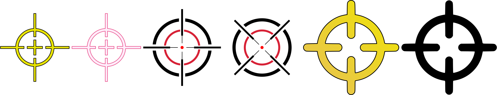

.. raw:: latex

	\clearpage

.. _mamemenu:

Cardápio de opções
==================

.. contents:: :local:

.. raw:: latex

	\clearpage

.. _menus-intro:

Introdução
----------

Para exibir o :ref:`menu principal <menus-main>` durante a execução de
um sistema emulado no MAME, pressione a tecla ou o botão para
**Mostrar/Ocultar** o menu (a tecla predefinida é :kbd:`Tab`). Se o
sistema emulado tiver entradas de teclado, é necessário pressionar a
tecla ou o botão **Toggle UI** para mostrar os controles (a tecla
predefinida é "*Scroll Lock*", a tecla :kbd:`SRCLK` ou
"*Forward Delete*" no macOS) para que seja possível acessar os controles
da interface de usuário do MAME. Você pode ignorar um menu pressionando
a tecla ou o botão **UI Retorna** do usuário (a tecla predefinida é
:kbd:`Esc`). A desativação de um menu retornará ao seu menu principal ou
ao sistema que estiver em execução, no caso do menu principal.

Pressione a tecla :kbd:`Tab` para esconder o menu e retornar ao sistema
principal, ao pressioná-la novamente, fará com que ela apareça
novamente, isso é muito útil quando estiver testando ou configurando um
sistema.

As entradas dos sistemas emulados são ignorados enquanto este menu
estiver na tela. Contudo, ainda é possível pausar o sistema que estiver
sendo executado ao pressionar a tecla para **Pausar** (a tecla
predefinida é :kbd:`F5`).

Ao iniciar o MAME sem especificar nenhum sistema na linha de comando, a
interface com o menu de seleção do MAME será exibida (assumindo que a
:ref:`opção da interface <mame-commandline-ui>`) esteja definida como
**cabinet**). Durante a execução de um sistema, este menu de seleção de
sistema também aparece ao pressionar :kbd:`Tab` e selecionar a opção
:guilabel:`Selecione um novo sistema`.

Consulte a :ref:`seção relevante <ui-menus>` para obter mais
informações.

Ao executar o MAME sem nenhum parâmetro na linha de comando ou clicando
duas vezes em seu ícone, você verá a interface do usuário. Ao acessar as
opções na parte inferior da tela, você terá acesso ao cardápio de
opções, incluindo a lista de seleção de jogos no centro, os filtros do
lado esquerdo e a aba de informações e imagens. No rodapé da tela, há um
descritivo resumido do sistema, com o nome do sistema, nome do
fabricante, ano, condição de som e imagem e se o sistema está
funcionando ou não.

Dependendo da condição dos sistemas, a interface do MAME exibirá
diferentes cores de fundo, indicando a sua condição.

	* :guilabel:`Verde`: São sistemas com ROMs completos e que funcionam.
	* :guilabel:`Vermelha`: São sistemas que não funcionam direito ou tem ROMs faltando.
	* :guilabel:`Laranja`: São sistemas que funcionam mas estão imperfeitos na parte de som ou vídeo.

Abaixo da lista dos sistemas nós temos:

	* :guilabel:`Definições gerais`: Exibe uma lista das configurações do MAME.
	* :guilabel:`Configurações do sistema`: Exibe uma lista das opções de configuração do sistema selecionado.

Todos os itens exibidos nessa interface podem ser acessadas usando as
setas do seu teclado (cima, baixo, esquerda, direita) e são selecionadas
pressionando a tecla :kbd:`Enter` do teclado. A interface também aceita
o uso do mouse fazendo a seleção com um clique e um duplo clique para
abrir a opção ou rodar um sistema.

.. raw:: latex

	\clearpage

.. _mamemenu-alt-valores:

Alterando os valores
--------------------

A interface é bem intuitiva, os controles para modificar os valores
predefinidos funcionam da seguinte maneira:

*	**Mouse** - Move o cursor na tela, seleciona os itens, as teclas
	cima, baixo, esquerda e direita fazem o mesmo.
*	**Clique duplo ou Enter** - Aguarda a entrada do usuário (controle,
	teclado, etc.).
*	**Delete** - **1x** apaga o valor, **2x** retorna ao valor
	predefinido originalmente.

Os campos que possuam mais de uma opção de escolha podem ser abertos
ao clicar duas vezes nele, como é o caso dos campos disponíveis em
:ref:`Filtro <mamemenu-filtro>`, por exemplo.

.. _menus-main:

O menu principal
----------------

O menu principal é exibido quando se pressiona a tecla :kbd:`Tab` ou o
botão **Mostrar/Ocultar** o menu durante a execução de um sistema
emulado ou enquanto a tela de informações do sistema é exibida. Ele
fornece acesso a menus usados para alterar configurações, para controlar
vários recursos e mostrar as informações sobre o sistema em execução e
do próprio MAME.

Enquanto a tela de menu estiver sendo exibida o MAME não inicia a
emulação do sistema até que este menu seja fechado (tecla :kbd:`Tab` ou
:kbd:`Esc`). Isso pode ser útil para montar as imagens das mídias ou
para alternar a posição das chaves DIP ou até mesmo para alterar as
definições de algumas configurações da máquina antes de iniciar a
emulação do sistema.

.. _mamemenu-filtro:

Filtro
------

Escolhe entre diferentes filtros pré configurados e um personalizado.
Estes filtros ajudam o usuário a selecionar sistemas separados por
categorias, caso queira encontrar um sistema que você não se lembra do
nome porém se lembra do ano, é possível usar o filtro **Ano** para
listar todos os sistema conhecidos pelo MAME que foram lançados naquele
ano.

Supondo que eu queira encontrar o sistema **Double Dragon**, faremos de
conta que eu não me lembro, eu só lembro do ano *1987* e que o
fabricante dela foi a *Technos Japan*. Vamos até o
:guilabel:`Filtro Personalizado`, no primeiro filtro adicionamos um
filtro para o :guilabel:`Ano` e colocamos ``1987``, adicionamos mais um
filtro para o :guilabel:`Fabricante` e escolhemos *Techmos Japan*, ao
retornarmos ao menu anterior o MAME exibirá uma lista dos sistemas que
atendam aos critérios definidos por nós. Neste exemplo então o MAME vai
retornar 6 diferentes sistemas **Double Dragon**, **Super Dodge Ball** e
**Nekketsu Koukou Dodgeball Bu**.

Os filtros disponíveis são:

.. _mamemenu-nao-filtrado:

* :guilabel:`Sem filtro`

  Exibe toda a lista dos sistemas conhecidos e cadastrados no catálogo
  interno do MAME sem nenhum filtro.

.. _mamemenu-disponivel:

* :guilabel:`Disponível`

  Exibe a lista dos sistemas que o MAME identificou dentro do diretório
  roms.

.. _mamemenu-nao-disponivel:

* :guilabel:`Indisponível`

  Exibe toda a lista dos sistemas conhecidos e cadastrados no catálogo
  interno do MAME que não estão disponíveis, ainda que a interface
  mostre a cor verde.

.. _mamemenu-funciona:

* :guilabel:`Funciona`

  Exibe uma lista dos sistemas que funcionam e estão em condição verde e
  marrom, os sistemas na condição vermelha ou que ainda não funcionam
  ficam de fora da lista.

.. _mamemenu-nao-funciona:

* :guilabel:`Não funciona`

  Exibe apenas os sistemas que tenham condição vermelha e que não
  funcionam.

.. _mamemenu-mecanico:

* :guilabel:`Mecânico`

  Exibe toda a lista dos sistemas mecânicos conhecidos e cadastrados no
  catálogo interno do MAME como Pinball por exemplo.

.. _mamemenu-nao-mecanico:

* :guilabel:`Não mecânico`

  Repete a lista :ref:`Não filtrado <mamemenu-nao-filtrado>`.

.. _mamemenu-categoria:

* :guilabel:`Categoria`

  Este filtro usa de arquivos *.ini* para separar os sistemas em
  diversas categoria diferentes como por exemplo gabinetes com 2
  jogadores, 4 jogadores, jogo de tiro, de corrida, de tabuleiro,
  corrida, etc. Em categorias onde a lista seja muito grande, clique
  duas vezes com o mouse em cima da lista para que uma nova tela seja
  exibida e fique mais fácil de escolher a opção desejada. Note que o
  uso destes arquivos pode fazer com que o MAME demore um pouco mais
  para iniciar.

  O MAME não incluí nenhum arquivo de categoria, na internet é possível
  acessar o site `Progetto-Snaps <http://www.progettosnaps.net>`_ que
  oferece estes arquivos *.ini* para download `aqui
  <http://www.progettosnaps.net/renameset/>`_. Depois que o arquivo for
  baixado e extraído o diretório **folders** deve ser copiado para o
  diretório raiz do MAME.

  Até o presente momento não existe uma tradução dessas categorias para
  o Português Brasileiro. Abaixo estão as categorias existentes até o
  momento e que funcionam com o MAME, as categorias que não funcionam
  com o MAME foram criadas para serem usadas com o MAMEUI [#MAMEUIP]_ e
  não estão listadas aqui:

	* :guilabel:`Cabinets`: Lista os sistemas **Arcade** do MAME que estão divididos em tipos de gabinetes.
	* :guilabel:`Category`: Lista os sistema separados em categorias como corrida, tabuleiro, tiro, etc.
	* :guilabel:`Driver`: Lista os sistemas por driver como ``cps1.cpp``, ``1943.cpp``, ``3do.cpp``, etc.
	* :guilabel:`FreePlay`: Lista os sistemas **Arcade** do MAME que possuem a opção de poder jogar de graça.
	* :guilabel:`MonoChrome`: Lista os sistemas separado por cores.
	* :guilabel:`Resolution`: Lista os sistemas separados pela sua resolução.

O site ainda oferece outros tipos de *.ini* como ``version.ini`` que
separa os sistemas por versão em que eles apareceram pela primeira vez
no MAME, note que estes aquivos extras não serão abordados neste
documento porém já deve ter ficado fácil compreender a sua utilidade no
MAME.

.. _mamemenu-favoritos:

* :guilabel:`Favoritos`

  Exibe uma lista dos sistemas que foram favoritados, para adicionar um
  sistema à lista de favoritos, pressione :kbd:`Tab`, no menu que aparecer
  selecione :guilabel:`Adiciona aos favoritos`.

.. _mamemenu-bios:

* :guilabel:`BIOS`

  Exibe uma lista dos sistemas que precisam de uma BIOS para funcionar.

.. _mamemenu-sembios:

* :guilabel:`Sem BIOS`

  Exibe uma lista dos sistemas que não precisam de uma BIOS para
  funcionar.

.. _mamemenu-pai:

* :guilabel:`Principais`

  Quando existirem sistemas derivados do sistema principal exibe
  uma lista dos sistemas que são originados desta matriz.

.. _mamemenu-clones:

* :guilabel:`Clones`

  Exibe uma lista dos sistemas que são considerados clones dos sistemas
  originais.

.. _mamemenu-fabricante:

* :guilabel:`Fabricante`

  Exibe uma lista com todos os fabricantes catalogados pelo MAME.

.. _mamemenu-ano:

* :guilabel:`Ano`

  Exibe uma lista dos sistemas separados por ano de lançamento.

.. _mamemenu-codigo-fonte:

* :guilabel:`Código-fonte`

  Permite listar todos os sistemas existentes num arquivo de
  código-fonte (como ``capcom/cps2.cpp`` por exemplo).

.. _mamemenu-save-support:

* :guilabel:`É possível salvar`

  Exibe uma lista dos sistemas onde existe a possibilidade de salvar o
  estado do sistema.

.. _mamemenu-nosave-support:

* :guilabel:`Não é possível salvar`

  Exibe uma lista dos sistemas onde não é possível salvar o estado do
  sistema.

.. _mamemenu-chd:

* :guilabel:`Precisa de CHD`

  Exibe uma lista dos sistemas que precisam de uma imagem de disco para
  funcionar.

.. _mamemenu-nochd:

* :guilabel:`Não precisa de CHD`

  Exibe uma lista dos sistemas que não precisam de uma imagem de disco
  para funcionar.

.. _mamemenu-tela-vertical:

* :guilabel:`Tela vertical`

  Exibe uma lista dos sistemas que usam orientação vertical da tela.

.. _mamemenu-tela-horizontal:

* :guilabel:`Tela horizontal`

  Exibe uma lista dos sistemas que usam orientação horizontal da tela.

.. _mamemenu-filtro-personalizado:

* :guilabel:`Filtro personalizado`

  Todo o filtro criado será listado aqui.

.. raw:: latex

	\clearpage

.. _mamemenu-config-during-gameplay:

Durante a emulação
------------------

Estas opções podem ser acessadas durante a emulação e estão acessíveis
ao pressionar a tecla :kbd:`Tab` e entrando na opção
:guilabel:`Configurações da entrada`.

.. _mamemenu-config-entrada:

Configurações da entrada
~~~~~~~~~~~~~~~~~~~~~~~~

Aqui ficam listadas todas as listas para as configurações das entradas
do sistema que estiver sendo emulado no momento.

Atribuições da entrada (este sistema)
~~~~~~~~~~~~~~~~~~~~~~~~~~~~~~~~~~~~~

Aqui ficam as configurações do sistema que estiver em execução e por
isso esta lista varia entre os sistemas, as configurações vão desde
o botão para os créditos, os botões do controle dos jogadores, a
definição para o botão do acesso ao modo de serviço do sistema (caso
seja um arcade), teclas individuais de um teclado de um computador
pessoal, etc.

Ajustes da entrada analógica
~~~~~~~~~~~~~~~~~~~~~~~~~~~~

Aqui ficam todas as configurações para os ajustes dos controles
analógicos, este menu só aparece quando o sistema possui controle
analógico. As opções disponíveis com seus valores predefinidos também
variam, abaixo temos um exemplo para o jogo **Virtua Racing**:

*	:guilabel:`Jogador 1 pedal 1` :guilabel:`aumenta/reduz a velocidade` ``16``
*	:guilabel:`Jogador 1 pedal 1` :guilabel:`velocidade da centralização automática` ``16``
*	:guilabel:`Jogador 1 pedal 1` :guilabel:`inverso` ``Desligado``
*	:guilabel:`Jogador 1 pedal 1` :guilabel:`sensibilidade` ``100``
*	:guilabel:`Jogador 1 pedal 2` :guilabel:`aumenta/reduz a velocidade` ``16``
*	:guilabel:`Jogador 1 pedal 2` :guilabel:`aumenta/reduz a velocidade` ``16``
*	:guilabel:`Jogador 1 pedal 2` :guilabel:`inverso` ``Desligado``
*	:guilabel:`Jogador 1 pedal 2` :guilabel:`sensibilidade` ``100``
*	:guilabel:`Acionador` :guilabel:`aumenta/reduz a velocidade` ``3``
*	:guilabel:`Acionador` :guilabel:`velocidade da centralização automática` ``3``
*	:guilabel:`Acionador` :guilabel:`inverso` ``Desligado``
*	:guilabel:`Acionador` :guilabel:`sensibilidade` ``100``

Consulte o capítulo :ref:`ui-inptcfg-analog` para obter mais informações
sobre os ajustes uma vez que a nomenclatura também muda conforme o
sistema.

Atribuições da entrada (geral)
~~~~~~~~~~~~~~~~~~~~~~~~~~~~~~

* :guilabel:`Interface do usuário`

  Consulte :ref:`mamemenu-general-inputs`.

.. raw:: html

	

* :guilabel:`Controles do jogador [1~10]`

  Consulte :ref:`mamemenu-general-inputs-P1`.

.. raw:: html

	

* :guilabel:`Outros controles`

  Consulte :ref:`Outros controles <mamemenu-other-controls>`.

.. _menus-inputdevices:

Dispositivos de entrada
~~~~~~~~~~~~~~~~~~~~~~~

Aqui serão listados todos os dispositivos que estão conectados ao
sistema atual, como o teclado, o mouse, etc. A lista é dinâmica e varia
dependendo do sistema e do que está sendo conectado nele. Ao fazer um
clique duplo em um dos itens da lista um novo menu é mostrado e aqui é
possível selecionar a opção :guilabel:`Copia a ID do dispositivo`,
consulte o capítulo :ref:`devicemap` para obter mais informações.

Chaves DIP
~~~~~~~~~~

Aqui ficam as chaves DIP, elas servem para definir as configurações do
sistema (quando for relevante), a quantidade de fichas necessárias
para registrar 1 crédito, se a tela será invertida ou não, se a
demonstração do sistema ficará em silêncio ou se reproduzirá qualquer
tipo de som, etc.

Sempre que uma chave for alterada, sempre selecione **Reinicie** para
que a alteração seja aplicada. Em algum sistema a ação já pode ser
vista na tela, contudo, não é sempre o caso.

Contabilidade
~~~~~~~~~~~~~

É o registro interno do sistema que mostra o tempo total que ele ficou
em execução e a quantidade de fichas que foram colocadas nela.

Informação sobre o sistema
~~~~~~~~~~~~~~~~~~~~~~~~~~

Mostra um breve resumo do nome do sistema que está sendo emulado, o seu
driver, o tipo do processador (vídeo, áudio e outros) e a resolução do
vídeo.

Seleção da BIOS
~~~~~~~~~~~~~~~

Mostra o menu de seleção de BIOS, aqui é possível selecionar a BIOS para
o *boot* ou a ROM do *firmware* para o sistema e as placas que o sistema
tiver. |eise| tiver disponibilidade de seleção ou opções de BIOS.

DispositivosSlot Devices
    Shows the Slot Devices menu, where you can choose between emulated
    peripherals.  This item is not shown for systems that have no slot devices.

Mixagem de áudio
~~~~~~~~~~~~~~~~

Mostra o menu :ref:`Mixagem de áudio <menus-audiomixer>`, onde é
possível configurar como o MAME encaminha o áudio do sistema emulado
para as saídas de áudio do sistema hospedeiro e das entradas de áudio do
sistema hospedeiro para o sistema emulado.

Efeitos de áudio
~~~~~~~~~~~~~~~~

Mostra o menu :ref:`Efeitos de áudio <menus-audioeffects>`, onde você
pode configurar os efeitos de áudio aplicados à saída emulada de áudio.

Alerta sobre o sistema
~~~~~~~~~~~~~~~~~~~~~~

Exibe informações de alerta sobre o sistema que está sendo emulado como
o não funcionamento de áudio, vídeo, etc.

Informação sobre a imagem da mídia
~~~~~~~~~~~~~~~~~~~~~~~~~~~~~~~~~~

Exibe informações sobre a mídia como o seu formato (imagem ROM, CD-ROM,
etc.), nome do fabricante, ano de lançamento, etc. |eise| tiver um ou
mais dispositivos do tipo mídia (unidades de

Dispositivos slot
~~~~~~~~~~~~~~~~~

Mostra o menu dos dispositivos slot, aqui é possível escolher entre os
periféricos emulados. |eise| tiver dispositivos no slot.

Gerenciador de arquivos
~~~~~~~~~~~~~~~~~~~~~~~

Mostra o menu do gerenciador de arquivos onde é possível abrir arquivos
ROM, montar ou desmontar imagens de mídia. |eise| tiver um ou mais
dispositivos de mídia (unidades de disquete, cartuchos ou slots de
cartão de memória por exemplo).

Controle de fita
~~~~~~~~~~~~~~~~

Mostra o menu de controle de fita, com ele é possível emular e controlar
os mecanismos de uma fita k7. |eise| usar uma fita k7.

Pseudo Terminais
~~~~~~~~~~~~~~~~

Mostra a condição geral de qualquer dispositivo tipo "pseudoterminal" no
sistema em execução (usado para conectar o sistema emulado aos
pseudoterminais do host, como através de portas seriais por exemplo).
|eise| tiver dispositivos do tipo pseudoterminal.

Leitor de código de barras
~~~~~~~~~~~~~~~~~~~~~~~~~~

Mostra o menu do leitor de códigos de barras, aqui é possível simular a
leitura de códigos de barras usando a emulação do leitor de código de
barras. |eise| tiver um leitor de código de barras.

Dispositivos de rede
~~~~~~~~~~~~~~~~~~~~

Mostra o menu dos dispositivos de rede, aqui é possível configurar os
adaptadores de rede emulados compatíveis com uma ponte numa rede para um
host. |eise| tiver adaptadores de rede que sejam compatíveis com
*bridging*.

.. _menus-audiomixer:

Mixer de áudio
~~~~~~~~~~~~~~

Permite ajustar como o MAME encaminha o áudio dos alto-falantes emulados
para as saídas de áudio emulado e das entradas de áudio do sistema para
os microfones. Há dois tipos de rotas: rota completa e rotas de canal:

* Uma rota completa envia o áudio de todos os canais de um dispositivo
  de saída para uma saída de áudio do hospedeiro. O MAME atribui
  automaticamente os canais emulados (normalmente alto-falantes) aos
  canais de saída com base nas informações de posição do alto-falante.
* Da mesma forma, uma rota de entrada completa envia o áudio de uma
  entrada de áudio do hospedeiro para todos os canais de um dispositivo
  de entrada de áudio emulado. O MAME decide automaticamente como
  atribuir os canais de entrada aos canais emulados (normalmente
  microfones) com base nas informações de posição do microfone.
* Uma rota de canal envia o áudio emulado na saída de um canal para um
  canal de saída ou de entrada emulada do hospedeiro.

Somente uma rota completa é permitida entre cada dispositivo emulado de
entrada ou saída de áudio e a entrada ou saída de áudio do hospedeiro.
Da mesma forma, somente uma rota de canal é permitida entre um canal
individual emulado e um canal individual de áudio do hospedeiro.

As rotas são agrupadas por dispositivo emulado. As rotas completas são
listadas antes das rotas de canal para cada dispositivo. Você pode
selecionar a saída ou entrada de áudio do sistema para cada rota e
ajustar o volume de **-96 dB** (mais baixo) a **+12 dB** (mais alto).
Para rotas de canal, você também pode selecionar os canais individuais
e do hospedeiro. Selecione :guilabel:`Excluir esta rota` para excluir
uma rota.

Selecione :guilabel:`Criar nova rota` para adicionar uma nova rota
completa a esse grupo. Se possível, a rota será adicionada e o destaque
do menu se moverá para a rota recém-adicionada. Se já houver rotas entre
o dispositivo destacado e todas as saídas/entradas do hospedeiro,
nenhuma nova rota será adicionada.

Alguns módulos de áudio permitem controlar as atribuições de canais e
volumes usando uma interface de mixagem externa. Por exemplo, o módulo
*PipeWire* para Linux tem esse recurso. Nesses casos, o MAME tenta
seguir as alterações feitas na interface do mixer externo e salvá-las em
sua configuração.

As rotas de áudio são salvas no arquivo de configuração **.cfg** do
respectivo sistema.

.. _menus-audioeffects:

Efeitos de áudio
~~~~~~~~~~~~~~~~

Aqui é possível configurar os efeitos de áudio aplicados à saída emulada
de áudio de antes de ser direcionada para as saídas de áudio do
hospedeiro. Cada dispositivo de saída emulada de áudio tem sua própria
cadeia independente de efeitos.

A cadeia de efeitos em si não é configurável. Ela sempre consiste nestes
quatro efeitos, seguindo a ordem abaixo:

* Filtros
* Compressor
* Reverberação
* Equalizador

Ao editar os parâmetros de uma cadeia de efeitos de um dispositivo de
saída, os valores predefinidos do parâmetro herdados são mostrados em
uma cor esmaecida, enquanto os valores de parâmetro definidos para essa
cadeia são mostrados com uma cor mais intensa. Pressione a tecla
:guilabel:`UI cancela` (:kbd:`Del`/:kbd:`Forward Delete`) para
redefinir um parâmetro e usar o valor predefinido.

Edite a cadeia **padrão** para definir um valor de parâmetro predefinido
que possa ser herdado pelas cadeias de dispositivos da saída. Durante a
edição da cadeia **padrão**, você pode restaurar o valor padrão
incorporado de um parâmetro pressionando a tecla
:guilabel:`UI cancela` (:kbd:`Del`/:kbd:`Forward Delete`).

Filtros
^^^^^^^

Esse efeito implementa um filtro passa-alta e passa-baixa de 2ª ordem. O
filtro passa-alta permite que você elimine o deslocamento de CC (*DC
offset* ou deslocamento de corrente contínua). O filtro passa-baixa,
desativado por padrão, permite simular a baixa qualidade de reprodução
de altas frequências dos arcades e televisores.

O fator Q determina a nitidez da transição da banda de parada para a
banda passante. Fatores Q mais altos proporcionam transições mais
nítidas. Entretanto, valores acima de **0,71** fazem com que o filtro
amplifique as frequências próximas à frequência de corte, o que pode ser
inesperado ou indesejável.

Compressor
^^^^^^^^^^

Este efeito oferece compressão de faixa dinâmica e baseia-se em uma
reimplementação do *Versatile Compressor* de Alain Paul. A compressão de
faixa dinâmica reduz a diferença de volume entre áudios suaves e altos.
Esse efeito é útil em uma variedade de situações. Por exemplo, ele pode
ajudar a tornar os áudios silenciosos mais audíveis em relação ao ruído
de fundo.

.. raw:: latex

	\clearpage

Os parâmetros são:

* :guilabel:`Limiar` (threshold): o nível limite onde a amplificação é
  interrompida completamente;
* :guilabel:`Proporção` (ratio): amplificação máxima;
* :guilabel:`Ataque` (attack): tempo de reação a sons altos que reduzem
  a amplificação;
* :guilabel:`Liberação` (release): tempo necessário para que a
  amplificação aumente novamente;
* :guilabel:`Ganho de entrada` (input gain): nível de amplificação na
  entrada.
* :guilabel:`Ganho de saída` (output gain): nível de amplificação na
  saída;
* :guilabel:`Convexidade` (convexity): a forma da relação entre a
  distância ao limiar e o valor da proporção. Quanto mais íngreme, mais
  alta ela é;
* :guilabel:`Link do canal` (channel link): com o valor **100%**, todos
  os canais do mesmo alto-falante são amplificados de forma idêntica.
  Com o valor **0%** (zero), eles são totalmente independentes. Valores
  intermediários têm um comportamento intermediário;
* :guilabel:`Retorno` (feedback): permite que parte da saída retorne à
  entrada;
* :guilabel:`Inércia` (inertia): a inércia faz com que a relação se mova
  mais lentamente;
* :guilabel:`Decaimento da inércia` (inertia decay): ajusta o impacto
  dela;
* :guilabel:`Teto` (ceiling): nível máximo permitido na saída. Ele faz
  um corte suave nesse nível.

Defina o :guilabel:`Ataque` como **0 ms**, a :guilabel:`Liberação`
como **infinito** e a :guilabel:`Relação` como **Infinito**. Isso
transformará o compressor em um limitador *brickwall* ou "*parede de
tijolos*". Um *limitador brickwall* serve para evitar que picos de sinal
excedam o limite, resultando em uma forma de onda achatada nos picos
onde nenhum sinal ultrapassa o ponto de corte. Deixe as configurações
avançadas em seus valores predefinidos. Ao aumentar o ganho de entrada
com um limite de **-3 dB**, por exemplo, fará com que ele funcione como
um normalizador dinâmico de volume.

Reverberação
^^^^^^^^^^^^

Aplica efeitos de reverberação na saída de áudio do hospedeiro.

Os parâmeros são:

* :guilabel:`Modo`: Define o modo de operação:

	- :guilabel:`Passa direto`: o áudio passa direto sem ser processado;
	- :guilabel:`Ativo`: ativa o processamento de áudio;

* :guilabel:`Carregar predefinição`: é possível escolher efeitos já
  pré-configurados de uma lista:

	- :guilabel:`Personalizado`: todos os valores podem ser
	  configurados de acordo com a sua preferência;
	- :guilabel:`Câmara de eco`: simula uma câmara de eco;
	- :guilabel:`Sala grande`: simula uma sala grande;
	- :guilabel:`Sala grande clara`: simula uma sala grande e iluminada;
	- :guilabel:`Sala grande escura`: simula uma sala grande sem
	  iluminação;
	- :guilabel:`Sala grande bateria`: simula uma sala grande com
	  reverberação semelhante à de uma bateria;
	- :guilabel:`Sala grande azulejada`: simula uma sala grande com
	  azulejos;
	- :guilabel:`Sala grande vocal`: simula uma sala grande preparada
	  para vocais;
	- :guilabel:`Sala grande madeira`: simula uma sala grande com
	  paredes de madeira;
	- :guilabel:`Ao vivo`: simula uma transmissão ao vivo (sem paredes);
	- :guilabel:`Reverb. 12s`: simula uma reverberação longa com duração
	  de 12 segundos;
	- :guilabel:`Reverb. 30s`: simula uma reverberação longa com duração
	  de 30s segundos;
	- :guilabel:`Sala média`: simula uma sala com tamanho médio
	  (**padrão**);
	- :guilabel:`Sala média clara`: simula uma sala média e iluminada;
	- :guilabel:`Sala média escura`: simula uma sala média sem
	  iluminação;
	- :guilabel:`Sala média bateria`: simula uma sala média com
	  reverberação semelhante à de uma bateria;
	- :guilabel:`Sala média azulejada`: simula uma sala média com
	  azulejos;
	- :guilabel:`Sala média vocal`: simula uma sala média preparada
	  para vocais;
	- :guilabel:`Sala média madeira`: simula uma sala média com paredes
	  de madeira;
	- :guilabel:`Shimmer`: adiciona camadas de harmonias acima da nota
	  original, criando um som brilhante e expansivo.
	- :guilabel:`Sala pequena`: simula uma sala pequena;
	- :guilabel:`Sala pequena clara`: simula uma sala pequena e
	  iluminada;
	- :guilabel:`Sala pequena escura`: simula uma sala pequena e sem
	  iluminação;
	- :guilabel:`Sala pequena bateria`: simula uma sala pequena com
	  reverberação semelhante à de uma bateria;
	- :guilabel:`Sala pequena azulejada`: simula uma sala pequena com
	  azulejos;
	- :guilabel:`Sala pequena vocal`: simula uma sala pequena preparada
	  para vocais;
	- :guilabel:`Sala pequena madeira`: simula uma sala pequena com
	  paredes de madeira;
	- :guilabel:`Túnel`: simula uma reverberação dentro de um túnel;
	- :guilabel:`Sala muito ampla`: simula uma sala bem ampla;
	- :guilabel:`Sala muito ampla clara`: simula uma sala muito ampla e
	  iluminada;
	- :guilabel:`Sala muito ampla escura`: simula uma sala muito ampla e
	  sem iluminação;
	- :guilabel:`Sala muito ampla bateria`: simula uma sala muito ampla
	  com reverberação semelhante à de uma bateria;
	- :guilabel:`Sala muito ampla azulejada`: simula uma sala muito
	  ampla com azulejos;
	- :guilabel:`Sala muito ampla vocal`: simula uma sala muito ampla
	  preparada para vocais;
	- :guilabel:`Sala muito ampla madeira`: simula uma sala muito ampla
	  com paredes de madeira;
* :guilabel:`Sinal original`: controla a quantidade do sinal original.
  Quanto maior o valor, menor a intensidade de reverberação. O valor
  varia entre ``0%`` e ``100%``. O valor predefinido é **90%**;
* :guilabel:`Profundidade do estéreo`: define como o som ecoado é
  distribuído entre os canais esquerdo e direito. O valor varia entre
  ``0%`` e ``100%``. O valor predefinido é **80%**;

**Reflexões iniciais**

* :guilabel:`Tamanho da sala`: controla o tamanho da sala. O valor varia
  entre ``0%`` e ``100%``. O valor predefinido é **30%**;
* :guilabel:`Configuração de acionamento`: o valor varia entre ``0`` e
  ``22``. O valor predefinido é **0**;
* :guilabel:`Atenuação`: controla a atenuação em hertz. O valor varia
  entre ``100 Hz`` e ``16000 Hz``. O valor predefinido é **8000 Hz**;
* :guilabel:`Nível`: controla a intensidade em hertz. O valor varia
  entre ``0%`` e ``100%``. O valor predefinido é **10%**;
* :guilabel:`Atraso no envio`: parâmetro de atraso que controla o tempo
  entre o sinal original e a repetição. O valor varia entre ``0%`` e
  ``100%``. O valor predefinido é **20%**;

**Reflexões posteriores**

* :guilabel:`Tamanho da sala`: controla o tamanho da sala. O valor varia
  entre ``0%`` e ``100%``. O valor predefinido é **30%**;
* :guilabel:`Atenuação`: controla a atenuação em hertz. O valor varia
  entre ``100 Hz`` e ``16000 Hz``. O valor predefinido é **8000 Hz**;
* :guilabel:`Atraso inicial`: controla o inicio do atraso em milésimos de
  segundo. O valor varia entre ``0.0 ms`` e ``200.0 ms``. O valor
  predefinido é **8.0 ms**;
* :guilabel:`Difusão`: define a complexidade do espaço simulado e a
  densidade das reflexões sonoras. Uma alta difusão cria um efeito mais
  suave e disperso, enquanto uma baixa difusão resulta em reflexões
  distintas e mais espaçadas. O valor varia entre ``0%`` e ``100%``. O
  valor predefinido é **57%**;
* :guilabel:`Aleatoriedade`: introduz variações aleatórias no tempo de
  atraso e/ou na frequência das reflexões do som. Isso cria uma
  sensação mais orgânica e menos repetitiva das reflexões, evitando que
  soe artificial ou mecânico. O valor varia entre ``0%`` e ``100%``. O
  valor predefinido é **40%**;
* :guilabel:`Decaimento`: determina a velocidade em segundos com que o
  som da reflexão perde intensidade ao ser repetido. O valor varia entre
  ``0.10s`` e ``30.00s``. O valor predefinido é **0.60s**;
* :guilabel:`Spin`: O valor varia entre ``0.0 Hz`` e ``5.00 Hz``. O
  valor predefinido é **0.50 Hz**;
* :guilabel:`Nível`: controla a intensidade. O valor varia entre ``0%``
  e ``100%``. O valor predefinido é **30%**;

Equalizador
^^^^^^^^^^^

Esse é um equalizador paramétrico de cinco bandas que permite amplificar
ou atenuar bandas de frequência específicas. O filtro passa-altas é
ativado por padrão com uma frequência de corte mínima para remoção de
deslocamento de CC. Todos os outros efeitos são ignorados.
Tecnicamente, o efeito do equalizador está ativo, mas todas as bandas
estão definidas para 0 dB, portanto, ele ainda está desativado.

Os três filtros do meio são de passagem de banda/rejeição de banda, o
que significa que eles amplificam ou atenuam frequências em torno da
frequência central. O primeiro e o último filtro também podem ser
configurados como filtros de passagem de banda/rejeição de banda
definindo o modo como o *pico* ("**Peak**"). Ao definir o modo
como *prateleira* ("**Shelf**") faz com que o filtro amplifique ou
atenue todas as frequências abaixo (para o primeiro filtro) ou acima
(para o último filtro) da frequência de corte.

O **fator Q** controla a nitidez do pico ou do vale na resposta de
frequência dos filtros de passagem ou de rejeição de banda. O fator Q
não é ajustável no modo prateleira. Um fator Q mais alto produz uma
forma mais nítida e afeta uma faixa mais estreita de frequências.

Reamostrador
^^^^^^^^^^^^

Permite que você configure o algoritmo usado para a conversão da taxa de
amostragem (*resampler*).

Os parâmetros são:

* :guilabel:`Tipo` (**LoFi** e **HQ**): o algoritmo **LoFi** consome
  poucos recursos da CPU. O algoritmo **HQ** tem parâmetros adicionais.
  O algoritmo HQ oferece uma conversão de maior qualidade da taxa de
  amostragem, mas exige um desempenho de CPU substancialmente maior.
* :guilabel:`Latência`: Aumentar a latência do HQ pode melhorar a
  qualidade. Entretanto, se o valor for aumentado demais e vários chips
  de áudio forem usados, as latências se acumularão, resultando em muito
  atraso. Diminuir a latência para menos de **1 ms** faz com que o
  reamostrador perder seu potencial; fazendo com que a qualidade de
  áudio seja inferior e semelhante a qualidade de áudio usada pelo MAME
  antes da versão 0.278;
* :guilabel:`Tamanho do filtro`: Aumenta o tamanho máximo do filtro HQ
  ou as fases máximas do filtro HQ pode melhorar a qualidade
  às custas de maior processamento da CPU. Os valores
  variam entre ``10`` e ``500``. O valor predefinido é **400**;
* :guilabel:`Comprimento das fases`: o aumento também pode melhorar a
  qualidade às custas de maior processamento da CPU. Os valores variam
  entre ``10`` e ``1000``. O valor predefinido é **200**;

Controles deslizantes
~~~~~~~~~~~~~~~~~~~~~

Mostra o menu de controles deslizantes, aqui é possível ajustar diversas
configurações incluindo ajustes de vídeo, níveis individuais dos canais
de áudio dentre outros. As opções disponíveis aqui também dependem do
tipo do sistema, outros ajustes podem aparecer porém os principais são
estes:

* :guilabel:`Volume principal`

  Faz o ajuste do volume do áudio principal do sistema que estiver sendo
  emulado.

.. raw:: html

	

* :guilabel:`Volume com xxx Ch.x`

  Faz o ajuste individual de cada canal de áudio, sistema com áudio mono
  só tem o ``Ch.0``, já sistemas com canal estéreo possuem ``Ch.0``
  (esquerdo) e ``Ch.1`` (direito) e assim por diante. A quantidade de
  canais disponíveis vai depender do sistema que está sendo emulado.

.. raw:: html

	

* :guilabel:`Brilho da tela`

  Faz o controle do nível de preto da tela, consulte também
  :ref:`-brightness <mame-commandline-brightness>`.

		O valor predefinido é ``1.0``.

* :guilabel:`Contraste da tela`

  Faz o controle do nível de branco da tela, consulte também
  :ref:`-contrast <mame-commandline-contrast>`.

		O valor predefinido é ``1.0``.

* :guilabel:`Gama da tela`

  Faz o ajuste da escala de luminância da tela, consulte também
  :ref:`-gamma <mame-commandline-gamma>`.

		O valor predefinido é ``1.0``.

* :guilabel:`Extensão horizontal da tela`

  Estica a tela no eixo horizontal.

		O valor predefinido é ``1.0``.

* :guilabel:`Posição horizontal da tela`

  Desloca a tela no eixo horizontal

		O valor predefinido é ``0.0``.

* :guilabel:`Extensão vertical da tela`

  Estica a tela no eixo vertical.

		O valor predefinido é ``1.0``.

* :guilabel:`Posição vertical da tela`

  Desloca a tela no eixo vertical

		O valor predefinido é ``0.0``.

.. raw:: latex

	\clearpage

.. _mamemenus-video-options:

Opções do vídeo
~~~~~~~~~~~~~~~

Mostra o menu das opções de vídeo, aqui é possível ajustar as
configurações de vídeo, alterar as opções de visualização, selecionar as
artes gráficas (quando estiver disponível) e as capturas de tela.

Tela #X
^^^^^^^

Caso o sistema possua mais de uma tela, todas elas serão listadas aqui,
onde "X" indica o número da tela e cada uma delas com as opções
mostradas abaixo. Aqui também vai aparecer qualquer tipo de ilustração
do sistema emulado e as suas respectivas opções, quando houver.

* :guilabel:`Nome`

  Caso esteja usando uma **artwork** e ela tiver um nome, ela será
  exibida aqui indicando que ela pode ser selecionada.

.. raw:: html

	

* :guilabel:`Tela 0 padrão (4:3)`

  Faz com que a tela tenha uma proporção padrão de 4:3.

.. raw:: html

	

* :guilabel:`Tela 0 relação de aspecto (X:Y)`

  Faz com que a tela use a proporção original (SAR) como 8:7, 12:7, etc.

.. raw:: html

	

* :guilabel:`Cocktail`

  Faz com que a tela fique espelhada no eixo vertical da tela.

.. raw:: html

	

* :guilabel:`Rotação`

  Rotaciona a tela, as opções disponíveis são:

	* :guilabel:`CW 90º`: Rotaciona a tela no sentido horário em 90º.
	* :guilabel:`180º`: Rotaciona a tela em 180º.
	* :guilabel:`CCW 90º`: Rotaciona a tela no sentido anti-horário em 90º.

		O valor predefinido é ``None``.

* :guilabel:`Aproximar para a região da tela`

  Quando o sistema estiver usando uma ilustração (artwork) onde exista
  o recorte de uma tela, somente esta região será aproximada.

		O valor predefinido é ``Desligado``.

* :guilabel:`Escalar a tela com valores não inteiros`

  Faz com que a tela possa ser expandida usando números facionados em
  vez de números inteiros, isso causa efeitos *"aliasing"* (um efeito
  colateral de deformação dos pixels) indesejáveis na tela, para mais
  informações consulte
  :ref:`-unevenstretch <mame-commandline-unevenstretch>`.

  As opções disponíveis são:

	* :guilabel:`Apenas X`: Expande a tela apenas no eixo X.
	* :guilabel:`Apenas Y`: Expande a tela apenas no eixo Y.
	* :guilabel:`X ou Y (Auto)`: Expande a tela em ambos os eixos automaticamente.

		O valor predefinido é ``Ligado``.

.. raw:: latex

	\clearpage

* :guilabel:`Manter a relação de aspecto`

  Mantém a proporção 4:3 da tela, independente do que as outras
  configurações façam, consulte também
  :ref:`-keepaspect <mame-commandline-keepaspect>`.

		O valor predefinido é ``Ligado``.

* :guilabel:`Ocultar os ponteiros inativos após`

  Oculta o(s) ponteiro(s) do mouse ou mira(s) visíveis na tela após um
  determinado período de tempo. 

		O valor predefinido é ``3.0 s``.

Snapshot
^^^^^^^^

Faz uma captura da tela, caso esteja usando uma **ilustração** e ela
tiver um nome, faça um clique duplo em cima do nome para que a captura
da tela seja feito.

.. raw:: html

	

* :guilabel:`Tela 0 padrão (4:3)`

  Faz um print da tela com esta proporção

.. raw:: html

	

* :guilabel:`Tela 0 relação de aspecto (X:Y)`

  Faz uma captura da tela usando a proporção original (SAR) como 8:7,
  12:7, etc.

.. raw:: html

	

* :guilabel:`Cocktail`

  Faz uma captura da tela espelhada no eixo vertical.

.. raw:: html

	

* :guilabel:`Rotação`

  Faz uma captura da tela com a tela rotacionada como demonstrado no
  exemplo anterior.

		O valor predefinido é ``None``.

* :guilabel:`Aproximar para a região da tela`

  Quando o sistema estiver usando uma ilustração onde exista um recorte
  de uma tela, a captura da tela será feita somente desta região.

		O valor predefinido é ``Desligado``.

.. _mamemenus-mira-options:

Opções da mira
~~~~~~~~~~~~~~

Mostra o menu das opções de mira, aqui é possível ajustar a aparência
das miras usadas, para mostrar o local das miras e outras entradas
absolutas de ponteira. |eise| tiver entradas do tipo que usem algum tipo
de apontamento. As seguintes opções estão disponíveis:

* :guilabel:`Visibilidade do P1`

  Aqui é definido quando a mira deve estar visível na tela para o
  jogador 1 (player 1) com as seguintes opções:

*	:guilabel:`Nunca`: Nunca mostra a mira.
*	:guilabel:`Sempre`: Sempre mostra a mira.
*	:guilabel:`Quando for movido`: Mostra apenas quando o mouse for movido.

O padrão é mostrar a mira sempre que ela for movida, no caso de mais
jogadores, haverá uma opção para cada um deles (jogador 1, jogador 2,
etc.).

.. raw:: latex

	\clearpage

* :guilabel:`Mira P1`

  Aqui é possível definir o tipo da mira que será usada pelo sistema,
  note que o MAME só aceita arquivos **.png** com transparência (sem
  fundo):
  
*	:guilabel:`[Incorporado]`: Usa a mira padrão do MAME.
*	:guilabel:`nome do arquivo mira`: Você tem a opção de selecionar os
	seus arquivos de mira pelo nome.

  Note que é possível usar qualquer nome para o seu arquivo da mira
  para depois poderem ser selecionados aqui. Abaixo temos alguns
  exemplos:

.. raw:: html

	

Quem tiver interesse, é possível baixar estas miras já prontas para uso
`neste endereço <https://www.mediafire.com/file/atfpzuhvshq5xo5/miras.zip>`_.
Descompacte as imagens dentro da pasta **crosshair**.

.. raw:: html

	

Trapaças
~~~~~~~~

Mosta o menu das trapaças, aqui é possível controlar o sistema interno
de trapaças. |eise| tiver trapaças ativadas. Note que que existe a
opção de trapaça via plug-in que está acessível através do menu
:guilabel:`Opções dos Plug-ins`.

Opções dos plug-ins
~~~~~~~~~~~~~~~~~~~

Mostra o menu das opções do plug-in, aqui é possível acessar as
configurações para todos os plug-ins que estiverem ativos. |eise|
tiver plgug-ins ativados ou caso o menu principal seja mostrado antes de
iniciar a emulação de um sistema (ao pressionar a tecla :kbd:`Tab`
enquanto estiver aparecendo a tela de informação do sistema).

Quando os plug-ins forem ativados na configuração, eles serão listados
aqui. Qualquer alteração que for feita ao ativar um plugin, ele é
gravado no arquivo ``plugin.ini`` que fica na mesma pasta do MAME ou em
``~/.mame`` em sistemas Linux e macOS.

Para mais informações consulte :ref:`Plug-ins <plugins-intro>`.

Visualizar a DAT externa
~~~~~~~~~~~~~~~~~~~~~~~~

Mostra o menu de visualização da DAT externa, aqui é possível acessar as
informações carregadas de diversos arquivos externos de suporte. |eise|
não tiver o :ref:`plugin de dados <plugins-data>` ativado ou se o menu
principal for mostrado antes de iniciar a emulação do sistema (ao
pressionar a tecla :kbd:`Tab` enquanto estiver aparecendo a tela de
informação do sistema).

Esta opção estará disponível quando dois critérios forem atendidos, o
plug-in **Data plugin** estiver ativo e os arquivos **\*.dat**
(command.dat, gameinit.dat, etc.) estiverem dentro do diretório
**dats**.

Caso o nome do sistema exista dentro do ``command.dat`` por exemplo,
será exibido uma lista de como jogar, dicas, a lista dos comandos do
sistema na tela (em Inglês), etc.

.. raw:: latex

	\clearpage

Adicionar/remover dos favoritos
~~~~~~~~~~~~~~~~~~~~~~~~~~~~~~~

Adiciona o sistema em execução na lista de favoritos ou o remove caso
ele já exista na lista. A lista de favoritos pode ser usada como um
filtro no menu de seleção de sistemas.

Sobre o MAME
~~~~~~~~~~~~

Mostra a versão do MAME, a sua revisão e as informações da licença de
direitos autorais.

Selecione um novo sistema
~~~~~~~~~~~~~~~~~~~~~~~~~

Mostra o menu de seleção de sistemas, aqui é possível escolher um novo
sistema e iniciar uma nova emulação. |eise| mostrar o menu principal
antes de iniciar a emulação do sistema (ao pressionar a tecla :kbd:`Tab`
enquanto estiver aparecendo a tela de informação do sistema).

Fechar o menu/Iniciar o sistema
~~~~~~~~~~~~~~~~~~~~~~~~~~~~~~~

Fecha o menu principal retornando para o sistema em execução. Mostra
:guilabel:`Inicia o sistema` antes de iniciar a emulação de um sistema
(ao pressionar a tecla :kbd:`Tab` enquanto estiver aparecendo a tela de
informação do sistema).

.. raw:: latex

	\clearpage

.. _mamemenu-config-options:

Definições gerais
-----------------

Personalizar a Interface
~~~~~~~~~~~~~~~~~~~~~~~~

Aqui é possível personalizar a interface do MAME, os valores numéricos
podem ser alterados movendo o direcional para a esquerda e direita ou
pressionando a tecla **Enter** e digitando o valor manualmente.

As opções disponíveis são:

* :guilabel:`Fontes`

  Permite a customização da tipografia da interface, dentro desta opção
  temos:

	* :guilabel:`Tipografia da interface`

	  Aqui é possível definir uma
	  fonte para toda a interface do MAME.

		O valor predefinido é ``Padrão``.

	* :guilabel:`Linhas`

	  Ajusta a dimensão do espaço e o tamanho da fonte, quanto maior o
	  valor maior a dimensão da interface e menor o texto na tela.

		O valor predefinido é ``30``.

	* :guilabel:`Tamanho do texto das informações`

	  Ajusta o tamanho do texto nas caixas de texto na tela.

		O valor predefinido é ``0.75``.

.. _mamemenu-cores:

* :guilabel:`Cores`

  Permite a customização completa das cores da interface do MAME, as
  opções disponíveis são:

	* :guilabel:`Texto Normal`

	  Define a cor do texto de toda a interface.

		O valor predefinido é Opacidade: ``255``, Vermelho: ``255``,
		Verde: ``255``, Azul: ``255``.

	* :guilabel:`Cor Selecionada`

	  Define a cor do item que for selecionado.

		O valor predefinido é Opacidade: ``255``, Vermelho: ``255``,
		Verde: ``255``, Azul: ``0``.

	* :guilabel:`Fundo do texto normal`

	  Aparentemente não tem função  alguma.

		O valor predefinido é Opacidade: ``239``, Vermelho: ``0``,
		Verde: ``0``, Azul: ``0``.

	* :guilabel:`Cor de fundo selecionada`

	  Define a cor do item selecionado.

		O valor predefinido é Opacidade: ``239``, Vermelho: ``128``,
		Verde: ``128``, Azul: ``0``.

	* :guilabel:`Cor de subitem`

	  Define a cor dos itens que estiverem abaixo do item principal.

		O valor predefinido é Opacidade: ``255``, Vermelho: ``255``,
		Verde: ``255``, Azul: ``255``.

	* :guilabel:`Clone`

	  Define a cor do texto de segundo plano.

		O valor predefinido é Opacidade: ``255``, Vermelho: ``128``,
		Verde: ``128``, Azul: ``128``.

	* :guilabel:`Borda`

	  Define a cor das linhas da borda da tela.

		O valor predefinido é Opacidade: ``255``, Vermelho: ``255``,
		Verde: ``255``, Azul: ``255``.

	* :guilabel:`Fundo`

	  Define a cor do fundo da tela e dos sistemas clonados.

		O valor predefinido é Opacidade: ``239``, Vermelho: ``16``,
		Verde: ``16``, Azul: ``48``.

	* :guilabel:`Chave DIP`

	  Define a cor das chaves DIP selecionadas nos sistemas que usam tal
	  chaves.

		O valor predefinido é Opacidade: ``255``, Vermelho: ``255``,
		Verde: ``255``, Azul: ``0``.

	* :guilabel:`Cor indisponível`

	  Aparentemente não tem função alguma.

		O valor predefinido é Opacidade: ``255``, Vermelho: ``255``,
		Verde: ``255``, Azul: ``0``.

	* :guilabel:`Cor do controle deslizante`

	  Define a cor dos controles deslizantes.

		O valor predefinido é Opacidade: ``255``, Vermelho: ``255``,
		Verde: ``255``, Azul: ``0``.

	* :guilabel:`Fundo do visualizador GFX`

	  Define a cor de fundo do visualizador GFX (tecla :kbd:`F4`).

		O valor predefinido é Opacidade: ``255``, Vermelho: ``255``,
		Verde: ``255``, Azul: ``0``.

	* :guilabel:`Cor da sobreposição do mouse`

	  Define a cor que texto terá quando o mouse passar por cima de
	  algum item selecionável.

		O valor predefinido é Opacidade: ``255``, Vermelho: ``255``,
		Verde: ``255``, Azul: ``128``.

	* :guilabel:`Cor de fundo da sobreposição do mouse`

	  Define a cor de fundo do texto quando o mouse passar por cima de
	  um item selecionável.

		O valor predefinido é Opacidade: ``112``, Vermelho: ``64``,
		Verde: ``64``, Azul: ``0``.

	* :guilabel:`Cor de subposição do mouse`

	  Aparentemente não tem função alguma.

		O valor predefinido é Opacidade: ``255``, Vermelho: ``255``,
		Verde: ``255``, Azul: ``128``.

	* :guilabel:`Cor debaixo do mouse`

	  Aparentemente não tem função alguma.

		O valor predefinido é Opacidade: ``176``, Vermelho: ``96``,
		Verde: ``96``, Azul: ``0``.

.. _mamemenu-idioma:

* :guilabel:`Idioma`

  Permite a seleção do Idioma da interface do MAME, faça um clique duplo
  no campo do idioma para abrir uma listagem com todos os idiomas
  disponíveis.

		O valor predefinido é **English**

* :guilabel:`Os nomes dos sistemas`

  No momento só existe a opção **incorporado**.

		O valor predefinido é **incorporado**.

* :guilabel:`Mostrar os painéis laterais`

  Configura a exibição ou não dos painéis laterais da interface do MAME.
  As opções disponíveis são:

	* :guilabel:`Mostra tudo`
	* :guilabel:`Esconde os filtros`
	* :guilabel:`Esconde info/imagem`
	* :guilabel:`Esconde ambos`

Atribuição das pastas
~~~~~~~~~~~~~~~~~~~~~

Aqui é possível mudar as predefinições do locais onde os diretórios
usados pelo MAME se encontram. As opções disponíveis são:

.. _mamemenu-diretório-roms:

* :guilabel:`ROMs`

  Define o caminho do diretório onde se encontram as ROMs. Veja também
  :ref:`-rompath <mame-commandline-rompath>`.

		O valor predefinido é um diretório chamado **roms** no diretório
		raiz do MAME.

* :guilabel:`Software em mídia`

  Define o caminho onde a imagem em mídia dos arquivos são armazenados
  como CD-ROM, floppy, fita K7 ou qualquer outro programa avulso.

		O valor predefinido é um diretório chamado **software** no
		diretório raiz do MAME.

* :guilabel:`Amostras de áudio`
  Define o caminho do diretório onde se encontram os arquivos das
  amostras de áudio.

		O valor predefinido é um diretório chamado **samples** no
		diretório raiz do MAME.

* :guilabel:`Ilustrações`

  Define o caminho do diretório onde se encontram as ilustrações
  gráficas que fazem o preenchimento de fundo da tela dos sistemas.
  Veja mais em :ref:`-artpath <mame-commandline-artpath>`.

		O valor predefinido é um diretório chamado **artwork** no
		diretório raiz do MAME.

* :guilabel:`Miras`

  Define o caminho do diretório onde se encontram as imagens com uma
  arte gráfica de uma mira que podem ser usadas por jogos de tiro. Para
  mais informações consulte
  :ref:`opções da mira <mamemenus-mira-options>`.

		O valor predefinido é um diretório chamado **crosshair** no
		diretório raiz do MAME.

* :guilabel:`Arquivos de trapaça`

  Define o caminho do diretório onde se encontra o arquivo de trapaça.
  Este arquivo também pode ser deixado na pasta raiz do MAME.

		O valor predefinido é um diretório chamado **cheats** no
		diretório raiz do MAME. [#CHEAT]_ [#CHEAT2]_

..	[#CHEAT] O site `Pugsy's Cheat <http://cheat.retrogames.com/>`_ é um dos
		mais conhecidos que oferece um arquivo de trapaça para download.
..	[#CHEAT2] O site japonês
		`Wayder's Cheats <https://wayder.web.fc2.com/>`_ é um outro site
		conhecido que oferece um arquivo de trapaça para download.

* :guilabel:`Plug-ins`

  Define o caminho do diretório onde se encontram os plug-ins do MAME.

		O valor predefinido é um diretório chamado **plugins** no
		diretório raiz do MAME.

* :guilabel:`Traduções da interface`

  Define o caminho do diretório onde se encontram os arquivos de
  tradução da interface do MAME.

		O valor predefinido é um diretório chamado **language** no
		diretório raiz do MAME.

* :guilabel:`Listas dos programas`

  Define o caminho do diretório onde se encontram os arquivos *.xml*.

		O valor predefinido é um diretório chamado **hash** no
		diretório raiz do MAME.

* :guilabel:`INIs`

  Define o caminho do diretório onde se encontram os arquivos *.ini*.

		O valor predefinido é um diretório chamado **ini** no
		diretório raiz do MAME.

* :guilabel:`Configurações da interface`

  Define o caminho do diretório onde se encontram os arquivos *.ini* da
  configuração da interface.

		O valor predefinido é um diretório chamado **ui** no
		diretório raiz do MAME.

* :guilabel:`Dados do plug-in`

  Define o caminho do diretório onde os dados do plug-in serão gravados.

		O valor predefinido é o mesmo diretório raiz do MAME.

* :guilabel:`DATs`

  Define o caminho do diretório onde se encontram os arquivos *.dat*.

		O valor predefinido são os diretórios **dats**, **history** e no
		diretório raiz do MAME.

* :guilabel:`INIs com as categorias`

  Define o caminho do diretório onde se encontram os arquivos *.ini* com
  descritivos de categoria.

		O valor predefinido é um diretório chamado **folders** no
		diretório raiz do MAME.

* :guilabel:`Capturas da tela`

  Define o caminho do diretório onde serão armazenadas as capturas
  da tela e a gravação de vídeo.

		O valor predefinido é um diretório chamado **snaps** no
		diretório raiz do MAME.

* :guilabel:`Ícones`

  Define o caminho do diretório onde se encontram os arquivos *.ico*
  para serem usados como ícones que ficam ao lado do nome do sistema.
  [#ICONS]_

..	[#ICONS] O site do `MAMEICONS <http://icons.mameworld.info/>`_ e
		`Progetto Snaps <http://www.progettosnaps.net/icons>`_ oferecem
		tais ícones e outras imagens para download.

		O valor predefinido é um diretório chamado **icons** no
		diretório raiz do MAME.

* :guilabel:`Painéis de controle`

  Define o caminho do diretório onde se encontram as imagens ou as fotos
  com a arte gráfica do painel onde se encontram os diferentes controles
  e botões do arcade.

		O valor predefinido é um diretório chamado **cpanel** no
		diretório raiz do MAME.

* :guilabel:`Gabinetes`

  Define o caminho do diretório onde se encontram as imagens dos
  gabinetes.

		O valor predefinido são dois diretórios chamados **cabinets** e
		**cabdevs** no diretório raiz do MAME.

* :guilabel:`Marquises`

  Define o caminho do diretório onde se encontram as imagens com a arte
  gráfica que ficavam na parte de cima do sistema.

		O valor predefinido é um diretório chamado **marquees** no
		diretório raiz do MAME.

* :guilabel:`PCIs`

  Define o caminho do diretório onde se encontram fotos que mostram
  a placa de circuito impresso do sistema.

		O valor predefinido é um diretório chamado **pcb** no
		diretório raiz do MAME.

* :guilabel:`Panfletos`

  Define o caminho do diretório onde se encontram as imagens dos
  panfletos.

		O valor predefinido é um diretório chamado **flyers** no
		diretório raiz do MAME.

* :guilabel:`Títulos das telas`

  Define o caminho do diretório onde se encontram as imagens que mostram
  a tela de título do sistema.

		O valor predefinido é um diretório chamado **titles** no
		diretório raiz do MAME. [#TITLES]_

..	[#TITLES] O site `MAME Channel <https://www.mamechannel.it/pages/titles.php>`_
		oferece diferentes telas de títulos para download.

* :guilabel:`Finais dos jogos`

  Define o caminho do diretório onde se encontram as imagens com a
  captura de tela mostrando o final do jogo.

		O valor predefinido é um diretório chamado **ends** no
		diretório raiz do MAME.

* :guilabel:`Chefes`

  Define o caminho do diretório onde se encontram as imagens com a
  captura de tela dos chefes de fase. [#BOSS]_

		O valor predefinido é um diretório chamado **bosses** no
		diretório raiz do MAME.

..	[#BOSS] É possível baixar essas imagens do site `EmuMovies
		<https://emumovies.com/files/file/3493-mame-bosses-pack/>`_.

* :guilabel:`Pré-visualização das ilustrações`

  Define o caminho do diretório onde se encontram as imagens com as
  amostras das ilustrações, essas amostras tem um tamanho menor se
  comparadas com as ilustrações completas.

		O valor predefinido é um diretório chamado **artwork preview** e
		**artpreiew** no diretório raiz do MAME.

* :guilabel:`Seleciona`

  A ser concluído.

		O valor predefinido é um diretório chamado **select** no
		diretório raiz do MAME.

* :guilabel:`Telas do game over`

  Define o caminho do diretório onde se encontram as imagens que mostram
  a tela de **GAME OVER**.

		O valor predefinido é um diretório chamado **gameover** no
		diretório raiz do MAME.

* :guilabel:`Como fazer`

  Define o caminho do diretório onde se encontram as imagens ou fotos
  daqueles panfletos que mostravam as instruções de como jogar.

		O valor predefinido é um diretório chamado **howto** no
		diretório raiz do MAME.

* :guilabel:`Logotipos`

  Define o caminho do diretório onde se encontram as imagens ou
  ilustrações com a logomarca das empresas.

		O valor predefinido é um diretório chamado **logos** no
		diretório raiz do MAME.

* :guilabel:`Placares`

  Define o caminho do diretório onde se encontram as imagens com a
  captura de tela mostrando as maiores pontuações. [#PLACAR]_

..	[#] É possível baixar essas imagens do site `High-Score
		<http://highscore.com/>`_ e
		`Cubeman <http://www.cubeman.org/mame1.html>`_.

		O valor predefinido é um diretório chamado **scores** no
		diretório raiz do MAME.

* :guilabel:`Versus`

  Define o caminho do diretório onde se encontram as imagens com a
  captura de tela mostrando as maiores pontuações.

		O valor predefinido é um diretório chamado **versus** no
		diretório raiz do MAME.

* :guilabel:`Capas`

  Define o caminho do diretório onde se encontram as imagens com as
  capas dos jogos.

		O valor predefinido é um diretório chamado **covers** no
		diretório raiz do MAME.

.. raw:: latex

	\clearpage

.. _mamemenu-config-video:

Opções do vídeo
~~~~~~~~~~~~~~~

Essas opções sempre serão carregadas na inicialização do MAME, lembrando
que a linha de comando **tem prioridade**, independente do que
for definido aqui.

* :guilabel:`Modo do vídeo`

  Para mais informações consulte :ref:`-video <mame-commandline-video>`.

		O valor predefinido é ``Auto``.

* * :guilabel:`Quantidade de telas`

  Predefine a quantidade das telas que serão usadas na emulação.

		O valor predefinido é ``1``.

* :guilabel:`GLSL`

  Ativa ou não os efeitos GLSL, para mais informações consulte
  :ref:`-gl_glsl_filter <mame-commandline-glglslfilter>`.

		O valor predefinido é ``Desligado``.

* :guilabel:`Filtragem bilinear`

  Ativa ou não os filtros de tela para suavizar os gráficos, caso os
  gráficos fiquem muito borrados, experimente ativar também a opção
  :guilabel:`escala prévia do bitmap`.

		O valor predefinido é ``Ligado``.

* :guilabel:`Escala prévia do bitmap`

  Opção útil quando os sistemas com baixa resolução são ampliadas para
  uma resolução maior, use essa opção para dar uma amenizada nessa
  aparência, essa opção geralmente é utilizada em conjunto com a opção
  **Filtragem bilinear**.

		O valor predefinido é ``1``.

* :guilabel:`Modo janela`

  Faz o MAME exibir a tela emulada numa janela ou numa tela inteira.

		O valor predefinido é ``Desligado``.

* :guilabel:`Manter a relação de aspecto`

  Faz com que a proporção da tela seja sempre mantida.

		O valor predefinido é ``Ligado``.

* :guilabel:`Inicia com a tela expandida`

  Faz o MAME exibir a tela emulada numa janela com o tamanho máximo do
  seu monitor, caso contrário exibe a tela emulada em sua resolução
  nativa.

		O valor predefinido é ``Ligado``.

* :guilabel:`Atualização síncrona dos quadros`

  Consulte :ref:`-syncrefresh <mame-commandline-syncrefresh>`.

* :guilabel:`Aguarde a sincronização vertical`

  Consulte :ref:`-waitvsync <mame-commandline-waitvsync>`.

.. raw:: latex

	\clearpage

.. _mamemenu-config-audio:

Opções do áudio
~~~~~~~~~~~~~~~

* :guilabel:`Áudio`

  Ativa o áudio ou não, para mais informações consulte
  :ref:`-sound <mame-commandline-sound>`.

		O valor predefinido é ``Ligado``.

* :guilabel:`Taxa da amostragem`

  Define a taxa da amostragem do áudio que será usada em todas os
  sistemas.

		O valor predefinido é ``48000``.

* :guilabel:`Use amostras externas`

  Consulte :ref:`-samples <mame-commandline-nosamples>`.

.. _mamemenu-config-etc:

Opções diversas
~~~~~~~~~~~~~~~

* :guilabel:`Ignorar os avisos de emulação imperfeita`

  Faz com que o MAME não exiba as telas de aviso dos sistemas com
  emulação imperfeita (tarja amarela).

		O valor predefinido é ``Desligado``.

* :guilabel:`Escolha o último sistema iniciado`

  Faz com que o MAME se lembre do último sistema que foi jogado através
  da interface do MAME.

		O valor predefinido é ``Ligado``.

* :guilabel:`Aumentar as imagens no painel direito`

  Aumenta o tamanho de qualquer uma das imagens exibidas no painel
  direito da interface do MAME, sempre mantendo a proporcionalidade da
  imagem.

		O valor predefinido é ``Ligado``.

* :guilabel:`Trapaças`

  Ativa ou não o sistema de trapaças do MAME.

		O valor predefinido é ``Desligado``.

* :guilabel:`Mostrar o ponteiro do mouse`

  Ativa ou não a exibição do mouse na interface do MAME.

		O valor predefinido é ``Ligado``.

* :guilabel:`Confirma se deseja encerrar o sistema ou não`

  Faz com que o MAME sempre te pergunte se quer realmente encerrar a
  emulação do sistema ou não.

		O valor predefinido é ``Desligado``.

.. raw:: latex

	\clearpage

* :guilabel:`Omite a tela de informações ao iniciar`

  Não exibe a tela com informações sobre o sistema quando iniciar um
  sistema.

		O valor predefinido é ``Desligado``.

* :guilabel:`Mantenha o aspecto 4:3 nas capturas da tela`

  Impõem uma proporção de 4:3 em todas as capturas da tela.

		O valor predefinido é ``Ligado``.

* :guilabel:`Usa uma imagem como plano de fundo`

  Permite o uso de uma imagem como papel de parede na interface do MAME.
  Escolha uma imagem **.JPG** ou **.PNG** e a renomeie para
  **background.jpg** ou **background.png**. Para fazer uso dela coloque-a
  no diretório raiz do MAME (no mesmo diretório onde o executável do
  MAME se encontra).

		O valor predefinido é ``Ligado``.

* :guilabel:`Omite a tela da escolha da BIOS`

  Faz com que o MAME inicie o sistema com a primeira BIOS disponível
  para o sistema ao em vez de usar uma lista.

		O valor predefinido é ``Desligado``.

* :guilabel:`Omite as partes do cardápio da seleção do programa`

  Altera a maneira com que a lista do software é exibida, em vez de
  exibir a lista na ordem predefinida pelo MAME, exibe a lista na ordem
  listada no arquivo da respectiva lista.

		O valor predefinido é ``Desligado``.

* :guilabel:`Informação de aferição automática`

  Exibe na aba de informações gerais do lado direito da interface do
  MAME informação quanto a condição da ROM selecionada se é **BOA** ou
  **RUIM**. Assim como também verifica se o sistema usa amostras ou
  não, aferindo se a condição delas seja **BOA** ou **RUIM**. Caso o
  sistema não use amostras, aparecerá a mensagem **Nenhuma Necessária**.
  Note que essa função deixa a interface do MAME um pouco mais lenta
  devido as aferições que são feitas em tempo real a cada seleção da
  ROM.

		O valor predefinido é ``Desligado``.

* :guilabel:`Esconder os sistemas sem ROMs da lista de disponíveis`

  Esconde da lista de sistemas eletrônicos que não usam ROMs.

		O valor predefinido é ``Ligado``.

.. raw:: latex

	\clearpage

.. _mamemenu-config-devices:
.. _menus-inputopts:

Opções dos dispositivos na entrada
~~~~~~~~~~~~~~~~~~~~~~~~~~~~~~~~~~

* :guilabel:`Atribuição do dispositivo pistola de luz`

  Caso exista um controlador para a pistola de luz, os valores
  disponíveis são ``None``, ``keyboard``, ``mouse``, ``lightgun`` e
  ``joystick``.

		O valor predefinido é ``keyboard``.

* :guilabel:`Atribuição do dispositivo trackball`

  Caso exista um controlador para o trackball, os valores disponíveis
  são ``None``, ``keyboard``, ``mouse``, ``lightgun`` e ``joystick``.

		O valor predefinido é ``keyboard``.

* :guilabel:`Atribuição do dispositivo pedal`

  Caso exista um controlador para pedais, os valores disponíveis são
  ``None``, ``keyboard``, ``mouse``, ``lightgun`` e ``joystick``.

		O valor predefinido é ``keyboard``.

* :guilabel:`Atribuição do dispositivo do controle AD`

  Caso exista um controlador para adstick, os valores disponíveis são
  ``None``, ``keyboard``, ``mouse``, ``lightgun`` e ``joystick``.

		O valor predefinido é ``keyboard``.

* :guilabel:`Atribuição do dispositivo de acionamento`

  Caso exista um controlador para acionamento, os valores
  disponíveis são ``None``, ``keyboard``, ``mouse``, ``lightgun`` e
  ``joystick``.

		O valor predefinido é ``keyboard``.

* :guilabel:`Atribuição do controle rotativo`

  Caso exista um controle com um disco rotativo, os valores disponíveis
  são ``None``, ``keyboard``, ``mouse``, ``lightgun`` e ``joystick``.

		O valor predefinido é ``keyboard``.

* :guilabel:`Atribuição do dispositivo posicional`

  Caso exista um controlador de posição, os valores disponíveis são
  ``None``, ``keyboard``, ``mouse``, ``lightgun`` e ``joystick``.

		O valor predefinido é ``keyboard``.

* :guilabel:`Atribuição do dispositivo mouse`

  Caso exista um controlador para mouse, os valores disponíveis são
  ``None``, ``keyboard``, ``mouse``, ``lightgun`` e ``joystick``.

		O valor predefinido é ``mouse``.

* :guilabel:`Provedor de entrada do teclado`

  Determina o provedor responsável pela entrada do teclado, os valores
  disponíveis variam dependendo do sistema operacional
  ``auto``, ``win32``, ``dinput``, ``rawinput``, ``sdl`` e ``none``.

		O valor predefinido é ``auto``.

* :guilabel:`Provedor de entrada do mouse`

  Determina o provedor responsável pela entrada do teclado, os valores
  disponíveis variam dependendo do sistema operacional
  ``auto``, ``win32``, ``dinput``, ``rawinput``, ``sdl`` e ``none``.

		O valor predefinido é ``auto``.

* :guilabel:`Provedor da pistola de luz`

  Determina o provedor responsável pela entrada do teclado, os valores
  disponíveis variam dependendo do sistema operacional
  ``auto``, ``win32``, ``rawinput``, ``X11`` e ``none``.

		O valor predefinido é ``auto``.

* :guilabel:`Provedor de entrada do joystick`

  Determina o provedor responsável pela entrada do teclado, os valores
  disponíveis variam dependendo do sistema operacional
  ``auto``, ``winhybrid``, ``xinput``, ``dinput``, ``sdl`` e ``none``.

		O valor predefinido é ``auto``.

.. raw:: latex

	\clearpage

.. _mamemenu-general-inputs:

Atribuição das entradas
~~~~~~~~~~~~~~~~~~~~~~~

* :guilabel:`interface do usuário`

  Aqui estão os principais atalhos já predefinidos da interface do MAME,
  todos eles podem ser alterados conforme a necessidade. Para retornar
  ao valor original pressione :kbd:`Del` duas vezes em cima da opção.

.. raw:: html

	

* :guilabel:`Mostra/esconde o menu`

  Exibe um visor na parte inferior da tela durante a emulação para a
  realização de ajustes em tempo real.

	A tecla predefinida é :kbd:`~`.

* :guilabel:`IU seleciona`

  Seleciona um ítem do menu.

	A tecla predefinida é :kbd:`Enter`, no teclado numérico
	:kbd:`Enter`, no controle **botão 1**.

* :guilabel:`IU retorna`

  Retorna para a tela anterior.

	A tecla predefinida é :kbd:`Esc` e no controle **botão 2**.

* :guilabel:`IU cancela`

  Cancela a operação que estiver sendo realizada.

		A tecla predefinida é :kbd:`Esc`.

* :guilabel:`IU limpa`

  Apaga ou redefine o valor padrão.

		A tecla predefinida é :kbd:`Del` e no controle **botão 3**.

* :guilabel:`IU ajuda`

  Mostra tópicos de ajuda (quando houver).

		A tecla predefinida é :kbd:`F1` e no controle **botão 4**.

* :guilabel:`IU cima`

  Mover o cursor para cima.

		A tecla predefinida é :kbd:`↑`, no controle **↑** e no teclado
		numérico :kbd:`8`.

* :guilabel:`IU baixo`

  Mover o cursor para baixo.

		A tecla predefinida é :kbd:`↓`, no controle **↓** e no teclado
		numérico :kbd:`2`.

* :guilabel:`IU esquerda`

  Mover o cursor para à esquerda.

		A tecla predefinida é :kbd:`←`, no controle **←** e no teclado
		numérico :kbd:`4`.

* :guilabel:`IU direita`

  Mover o cursor para à direita.

		A tecla predefinida é :kbd:`→`, no controle **→** e no teclado
		numérico :kbd:`6`.

.. raw:: latex

	\clearpage

* :guilabel:`IU home`

  Retorna à primeira opção do menu.

		A tecla predefinida é :kbd:`Home`.

* :guilabel:`IU fim`

  Avança até última opção do menu.

		A tecla predefinida é :kbd:`End`.

* :guilabel:`IU sobe página`

  Pula uma página para cima no menu.

		A tecla predefinida é :kbd:`PgUp`.

* :guilabel:`IU desce página`

  Pula uma página para baixo no menu.

		A tecla predefinida é :kbd:`PgDn`.

* :guilabel:`Grupo anterior da IU`

		A tecla predefinida é :kbd:`[`, no controle é o botão **L1**.

* :guilabel:`Próximo grupo da IU`

		A tecla predefinida é :kbd:`]`, no controle é o botão **L2**.

* :guilabel:`Entra no depurador`

  Atalho para entrar no depurador durante a emulação, só funciona caso
  o MAME tenha sido compilado com ferramentas de depuração.

	A tecla predefinida é :kbd:`~`.

* :guilabel:`Guia de configuração`

  Chama o cardápio de opções do MAME.

	A tecla predefinida é :kbd:`Tab`.

* :guilabel:`Pausa`

  Pausa a emulação.

	A tecla predefinida é :kbd:`P`.

* :guilabel:`Pausa - passo único`

  Avança em passos de um quadro.

	As teclas predefinidas são :kbd:`P` + :kbd:`Shift` :kbd:`Esq`.

* :guilabel:`Rebobina - passo único`

  Retrocede em passos de um quadro.

	As teclas predefinidas são :kbd:`Til` + :kbd:`Shift` :kbd:`Esq`.

* :guilabel:`Redefine o sistema`

  Encerra a emulação e a reinicia do zero.

	As teclas predefinidas são :kbd:`F3` + :kbd:`Shift` :kbd:`Esq`.

* :guilabel:`Redefinição rápida`

  Reinicia sem encerrar a emulação.

	A telcla predefinida é :kbd:`F3`.

* :guilabel:`Mostra os gráficos decodificados`

  Mostra a paleta GFX decodificada e os *tilemaps* dos jogos.

	A tecla predefinida é :kbd:`F4`.

* :guilabel:`Pula quadro dec`

  Reduz o salto dos quadros de vídeo, os valores se alteram entre
  ``auto`` e entre ``10~0``. A predefinição é `auto`, ao pressionar a
  tecla a opção sai de ``auto`` para a velocidade mais rápida e vai
  diminuindo passo a passo até voltar para ``auto``

	A tecla predefinida é :kbd:`F8`.

* :guilabel:`Pula quadro inc`

  Aumenta o salto dos quadros de vídeo,  os valores se alteram entre
  ``auto`` e entre ``0~10``. A predefinição é ``auto``, ao pressionar a
  tecla, a opção sai de ``auto`` e aumenta a velocidade passo a passo
  até atingir ``auto``.

	A tecla predefinida é :kbd:`F9`.

* :guilabel:`Supressor de velocidade`

  Acelera a velocidade da emulação da nativa para o máximo possível.

	A tecla predefinida é :kbd:`F10`.

* :guilabel:`Avanço rápido`

  Como o exemplo anterior porém faz a emulação rodar o mais rápido
  possível enquanto a tecla estiver pressionada.

.. raw:: html

	

* :guilabel:`Mostra FPS`

  Exibe quantos quadros por segundo a emulação está rodando.

	A tecla predefinida é :kbd:`PgDn` em versões SDL do MAME e
	:kbd:`Insert` no Windows. 

* :guilabel:`Salva uma captura da tela`

  Captura a tela emulada e a salva no diretório predefinido.

	A tecla predefinida é :kbd:`F12`.

* :guilabel:`Grava MNG`

  Grava um vídeo em formato MNG sem áudio.

	As teclas predefinidas são :kbd:`F12` + :kbd:`Shift` :kbd:`Esq`.

* :guilabel:`Grava AVI`

  Grava um vídeo em formato AVI.

	A teclas predefinidas são :kbd:`F12` + :kbd:`Shift` :kbd:`Esq`.

.. raw:: latex

	\clearpage

* :guilabel:`Liga/Desliga trapaça`

  Ativa ou desativa a trapaça no jogo, só funciona quando usado a
  opção ``cheat`` na linha de comando.

	A tecla predefinida é :kbd:`F6`.

* :guilabel:`UI cima`

  Move o cursor para cima.

	A tecla predefinida é :kbd:`cima` ou **Cima** no controle.

* :guilabel:`UI baixo`

  Move o cursor para baixo.

	A tecla predefinida é :kbd:`baixo` ou **Baixo** no controle.

* :guilabel:`UI esquerda`

  Move o cursor para a esquerda.

	A tecla predefinida é :kbd:`esquerda` ou **Esquerda** no
	controle.

* :guilabel:`UI direita`

  Move o cursor para a direita.

	A tecla predefinida é :kbd:`direita` ou **Direita** no controle.

* :guilabel:`UI Home`

  Move o cursor para o topo da lista.

	A tecla predefinida é :kbd:`home`.

* :guilabel:`UI Fim`

  Move o cursor para o fim da lista.

	A tecla predefinida é :kbd:`end`.

* :guilabel:`UI Pág. cima`

  Move o cursor para o topo da lista saltando 26 linhas por vez.

	A tecla predefinida é :kbd:`PgUp`.

* :guilabel:`UI Pág. baixo`

  Move o cursor para o fim da lista saltando 26 linhas por vez.

	A tecla predefinida é :kbd:`PgDn`.

* :guilabel:`UI Próx. foco`

  Faz com que foco do cursor passe para a próxima janela da interface.

	A tecla predefinida é :kbd:`Tab`.

* :guilabel:`UI Foco ant.`

  Faz com que foco do cursor passe para a anterior anterior da
  interface.

	A tecla predefinida é :kbd:`Tab` + :kbd:`Shift` :kbd:`Esq`.

* :guilabel:`UI Seleciona`

  Tecla de seleção para qualquer item selecionável.

	As teclas predefinidas são :kbd:`Enter`, **Botão 0 do controle** ou
	:kbd:`Enter` do teclado numérico.

* :guilabel:`UI Cancela`

  Tecla para cancelar qualquer ação.

	A tecla predefinida é :kbd:`Esc`.

* :guilabel:`UI Mostra comentário`

  Tecla para exibir um comentário.

	A tecla predefinida é barra de :kbd:`espaço`.

* :guilabel:`UI Limpa`

  Tecla para apagar/zerar uma opção.

	A tecla predefinida é :kbd:`Del`.

* :guilabel:`UI Aproxima`

  Tecla para aproximar (dar zoom) na interface. Ainda não funciona em
  teclados ABNT, apenas em teclados tipo ANSI.

	A tecla predefinida é :kbd:`=`.

* :guilabel:`UI Recua`
  Tecla para sair do zoom da interface. Ainda não funciona em
  teclados ABNT, apenas em teclados tipo ANSI.

	A tecla predefinida é :kbd:`-`.

* :guilabel:`UI Aproximação predefinida`
  Retorna para a aproximação normal da tela.

	A tecla predefinida é :kbd:`0`.

* :guilabel:`UI Grupo anterior`

  Faz a lista pular para o grupo anterior. Ainda não funciona em
  teclados ABNT, apenas em teclados tipo ANSI.

	A tecla predefinida é :kbd:`[`. 

* :guilabel:`UI Próximo grupo`

  Faz a lista pular para o próximo grupo. Ainda não funciona em
  teclados ABNT, apenas em teclados tipo ANSI.

	A tecla predefinida é :kbd:`]`.

* :guilabel:`UI Rotaciona`

  Gira a interface.

	A tecla predefinida é :kbd:`R` (não funciona).

* :guilabel:`Mostra o perfil`

  Exibe o analisador de desempenho.

	A teclas predefinidas são :kbd:`F11` + :kbd:`Shift` :kbd:`Esq`.

* :guilabel:`UI Alterna`

  Alterna a interface do usuário.

	A tecla predefinida é :kbd:`SrcLk`.

.. raw:: latex

	\clearpage

* :guilabel:`UI Cola texto`

  Cola texto na interface do usuário.

	As teclas predefinidas são :kbd:`SrcLk` + :kbd:`Shift` :kbd:`Esq`.

* :guilabel:`Salva o estado`

  Salva o estado do sistema.

	As teclas predefinidas são :kbd:`F7` + :kbd:`Shift` :kbd:`Esq`.

* :guilabel:`Carrega o estado`

  Carrega o estado do sistema.

	A tecla predefinida é :kbd:`F7`.

* :guilabel:`(Primeira) UI inicia fita`

  Inicia a fita na interface primária.

	A tecla predefinida é :kbd:`F2`.

* :guilabel:`(Primeira) UI para fita`

  Para a fita na interface primária.

	As teclas predefinidas são :kbd:`F2` + :kbd:`Shift` :kbd:`Esq`.

* :guilabel:`UI Visualiza DAT externa`

  Exibe o DAT externo, para que a visualização do DAT seja possível é
  preciso ativar o plugin :guilabel:`Data Plugin` na interface ou
  editando o arquivo ``plugin.ini``, o valor da linha **data** de ``0``
  para ``1``.

	As teclas predefinidas são :kbd:`Alt` :kbd:`Esq` + :kbd:`D`.

* :guilabel:`UI Adiciona/remove favoritos`

  Adiciona ou remove os sistemas da lista de favoritos.

	As teclas predefinidas são :kbd:`Alt` :kbd:`Esq` + :kbd:`F`.

* :guilabel:`UI exporta lista`

  Exporta a lista dos sistemas no formato:

	* **XML** igual ao comando **-listxml**.
	* **XML** igual ao comando **-listxml** excluindo os dispositivos.
	* **TXT** igual ao comando **-listfull**.

	As teclas predefinidas são :kbd:`Alt` :kbd:`Esq` + :kbd:`E`.

* :guilabel:`UI Afere mídia`

  Realiza uma aferição das ROMs removendo as não disponíveis, o
  resultado é salvo no arquivo ``mame_avail.ini`` dentro do diretório
  **ui**.

	A tecla predefinida é :kbd:`F1`.

* :guilabel:`Alterna para tela inteira`

  Alterna entre tela inteira e janela.

	As teclas predefinidas são :kbd:`Enter` + :kbd:`Alt` :kbd:`Esq`.

.. raw:: latex

	\clearpage

* :guilabel:`Liga/desliga o filtro`

  Alterna entre usar ou não o filtro na tela.

	As teclas predefinidas são :kbd:`F5` + :kbd:`Ctrl` :kbd:`Esq`.

* :guilabel:`Reduz a escala prévia`

  Reduz a escala prévia dos pixels.

	As teclas predefinidas são :kbd:`F6` + :kbd:`Ctrl` :kbd:`Esq`.

* :guilabel:`Aumenta a escala prévia`

  Aumenta a escala prévia de dos pixels.

	As teclas predefinidas são :kbd:`F7` + :kbd:`Ctrl` :kbd:`Esq`.

* :guilabel:`Grava um vídeo com efeitos`

  Grava o vídeo usando todos os efeitos e filtros ativos na tela.

	As teclas predefinidas são :kbd:`F12` + :kbd:`Ctrl` + :kbd:`Alt`
	:kbd:`Esq`.

Controles do jogador 1 ~ 10
~~~~~~~~~~~~~~~~~~~~~~~~~~~

  Definições para todos os botões e controles usados pelo sistema
  separado por jogador, entre o jogador 1 até o 10. Abaixo a lista das
  opções predefinidas para o jogador 1 que podem ser alteradas na
  própria interface do MAME.

.. _mamemenu-general-inputs-P1:

Predefinições para o jogador 1
^^^^^^^^^^^^^^^^^^^^^^^^^^^^^^

.. tabularcolumns:: |l|c|p{5cm}|

+--------------------------------------+-------------------------------+
|  Controles do jogador 1              | Predefinição                  |
+======================================+===============================+
|  J1 cima                             | cima ou joy 1 cima            |
+--------------------------------------+-------------------------------+
|  J1 baixo                            | baixo ou joy 1 baixo          |
+--------------------------------------+-------------------------------+
|  J1 esquerda                         | esquerda ou joy 1 esquerda    |
+--------------------------------------+-------------------------------+
|  J1 direita                          | direita ou joy 1 direita      |
+--------------------------------------+-------------------------------+
|  J1 lado direito/cima                | I ou joy 1 botão 1            |
+--------------------------------------+-------------------------------+
|  J1 lado direito/baixo               | K ou joy 1 botão 2            |
+--------------------------------------+-------------------------------+
|  J1 lado direito/esquerdo            | J ou joy 1 botão 0            |
+--------------------------------------+-------------------------------+
|  J1 lado direito/direito             | L ou joy 1 botão 3            |
+--------------------------------------+-------------------------------+
|  J1 lado esquerdo/cima               | E ou joy 1 cima               |
+--------------------------------------+-------------------------------+
|  J1 lado esquerdo/baixo              | D ou joy 1 baixo              |
+--------------------------------------+-------------------------------+
|  J1 lado esquerdo/esquerdo           | S ou joy 1 esquerda           |
+--------------------------------------+-------------------------------+
|  J1 lado esquerdo/direito            | F ou joy 1 direita            |
+--------------------------------------+-------------------------------+
|  J1 botão 1                          | joy 1 botão 3                 |
+--------------------------------------+-------------------------------+
|  J1 botão 2                          | joy 1 botão 6                 |
+--------------------------------------+-------------------------------+
|  J1 botão 3                          | joy 1 botão 0                 |
+--------------------------------------+-------------------------------+
|  J1 botão 4                          | joy 1 botão 7                 |
+--------------------------------------+-------------------------------+
|  J1 botão 5                          | joy 1 botão 2                 |
+--------------------------------------+-------------------------------+
|  J1 botão 6                          | joy 1 botão 1                 |
+--------------------------------------+-------------------------------+
|  J1 botão 7                          | C ou joy 1 botão 6            |
+--------------------------------------+-------------------------------+
|  J1 botão 8                          | V ou joy 1 botão 7            |
+--------------------------------------+-------------------------------+
|  J1 botão 9                          | B ou joy 1 botão 8            |
+--------------------------------------+-------------------------------+
|  J1 botão 10                         | N ou joy 1 botão 9            |
+--------------------------------------+-------------------------------+
|  J1 botão 11                         | M ou joy 1 botão 10           |
+--------------------------------------+-------------------------------+
|  J1 botão 12                         | vírgula ou joy 1 botão 11     |
+--------------------------------------+-------------------------------+
|  J1 botão 13                         | Stop                          |
+--------------------------------------+-------------------------------+
|  J1 botão 14                         | Barra inc. direita            |
+--------------------------------------+-------------------------------+
|  J1 botão 15                         | Shift Direito                 |
+--------------------------------------+-------------------------------+
|  J1 botão 16                         | n/a                           |
+--------------------------------------+-------------------------------+
|  J1 start                            | 1                             |
+--------------------------------------+-------------------------------+
|  J1 select                           | 5                             |
+--------------------------------------+-------------------------------+
|  J1 Mahjong A                        | A                             |
+--------------------------------------+-------------------------------+
|  J1 Mahjong B                        | B                             |
+--------------------------------------+-------------------------------+
|  J1 Mahjong C                        | C                             |
+--------------------------------------+-------------------------------+
|  J1 Mahjong D                        | D                             |
+--------------------------------------+-------------------------------+
|  J1 Mahjong E                        | E                             |
+--------------------------------------+-------------------------------+
|  J1 Mahjong F                        | F                             |
+--------------------------------------+-------------------------------+
|  J1 Mahjong G                        | G                             |
+--------------------------------------+-------------------------------+
|  J1 Mahjong H                        | H                             |
+--------------------------------------+-------------------------------+
|  J1 Mahjong I                        | I                             |
+--------------------------------------+-------------------------------+
|  J1 Mahjong J                        | J                             |
+--------------------------------------+-------------------------------+
|  J1 Mahjong K                        | K                             |
+--------------------------------------+-------------------------------+
|  J1 Mahjong L                        | L                             |
+--------------------------------------+-------------------------------+
|  J1 Mahjong M                        | M                             |
+--------------------------------------+-------------------------------+
|  J1 Mahjong O                        | O                             |
+--------------------------------------+-------------------------------+
|  J1 Mahjong P                        | Dois pontos                   |
+--------------------------------------+-------------------------------+
|  J1 Mahjong Q                        | Q                             |
+--------------------------------------+-------------------------------+
|  J1 Mahjong Kan                      | Control esquerdo              |
+--------------------------------------+-------------------------------+
|  J1 Mahjong Pon                      | Alt esquerdo                  |
+--------------------------------------+-------------------------------+
|  J1 Mahjong Chi                      | Espaço                        |
+--------------------------------------+-------------------------------+
|  J1 Mahjong Reach                    | Shift                         |
+--------------------------------------+-------------------------------+
|  J1 Mahjong Ron                      | Z                             |
+--------------------------------------+-------------------------------+
|  J1 Mahjong Bet                      | 3                             |
+--------------------------------------+-------------------------------+
|  J1 Mahjong Last Chance              | Alt direito                   |
+--------------------------------------+-------------------------------+
|  J1 Mahjong Score                    | Control direito               |
+--------------------------------------+-------------------------------+
|  J1 Mahjong Double Up                | Shift direito                 |
+--------------------------------------+-------------------------------+
|  J1 Mahjong Flip Flop                | Y                             |
+--------------------------------------+-------------------------------+
|  J1 Mahjong Big                      | Return                        |
+--------------------------------------+-------------------------------+
|  J1 Mahjong Small                    | Backspace                     |
+--------------------------------------+-------------------------------+
|  J1 Hanafuda A/1                     | A                             |
+--------------------------------------+-------------------------------+
|  J1 Hanafuda B/2                     | B                             |
+--------------------------------------+-------------------------------+
|  J1 Hanafuda C/3                     | C                             |
+--------------------------------------+-------------------------------+
|  J1 Hanafuda D/4                     | D                             |
+--------------------------------------+-------------------------------+
|  J1 Hanafuda E/5                     | E                             |
+--------------------------------------+-------------------------------+
|  J1 Hanafuda F/6                     | F                             |
+--------------------------------------+-------------------------------+
|  J1 Hanafuda G/7                     | G                             |
+--------------------------------------+-------------------------------+
|  J1 Hanafuda H/8                     | H                             |
+--------------------------------------+-------------------------------+
|  J1 Hanafuda Sim                     | M                             |
+--------------------------------------+-------------------------------+
|  J1 Hanafuda Não                     | N                             |
+--------------------------------------+-------------------------------+
|  Chave dentro (in)                   | Q                             |
+--------------------------------------+-------------------------------+
|  Chave fora (out)                    | W                             |
+--------------------------------------+-------------------------------+
|  Serviço                             | 9                             |
+--------------------------------------+-------------------------------+
|  Contabilidade                       | 0                             |
+--------------------------------------+-------------------------------+
|  Porta                               | O                             |
+--------------------------------------+-------------------------------+
|  Prêmio                              | I                             |
+--------------------------------------+-------------------------------+
|  Aposta                              | M                             |
+--------------------------------------+-------------------------------+
|  Negocia                             | 2                             |
+--------------------------------------+-------------------------------+
|  Mantém                              | L                             |
+--------------------------------------+-------------------------------+
|  Leva a pontuação                    | 4                             |
+--------------------------------------+-------------------------------+
|  Dobra                               | 3                             |
+--------------------------------------+-------------------------------+
|  Metade da aposta                    | D                             |
+--------------------------------------+-------------------------------+
|  Alto                                | A                             |
+--------------------------------------+-------------------------------+
|  Baixo                               | S                             |
+--------------------------------------+-------------------------------+
|  Mantém 1                            | Z                             |
+--------------------------------------+-------------------------------+
|  Mantém 2                            | X                             |
+--------------------------------------+-------------------------------+
|  Mantém 3                            | C                             |
+--------------------------------------+-------------------------------+
|  Mantém 4                            | V                             |
+--------------------------------------+-------------------------------+
|  Mantém 5                            | B                             |
+--------------------------------------+-------------------------------+
|  Cancela                             | N                             |
+--------------------------------------+-------------------------------+
|  Interrompe o carretel 1             | X                             |
+--------------------------------------+-------------------------------+
|  Interrompe o carretel 2             | C                             |
+--------------------------------------+-------------------------------+
|  Interrompe o carretel 3             | V                             |
+--------------------------------------+-------------------------------+
|  Interrompe o carretel 4             | B                             |
+--------------------------------------+-------------------------------+
|  Interrompe todos os carreteis       | Z                             |
+--------------------------------------+-------------------------------+
|  J1 pedal 1 analógico                | ...                           |
+--------------------------------------+-------------------------------+
|  J1 pedal 1 analógico inc            | Control esq. ou joy 1 botão 0 |
+--------------------------------------+-------------------------------+
|  J1 pedal 1 analógico dec            | Nenhum                        |
+--------------------------------------+-------------------------------+
|  J1 pedal 2 analog                   | n/a                           |
+--------------------------------------+-------------------------------+
|  J1 pedal 2 analógico inc            | Alt esq. ou joy 1 botão 1     |
+--------------------------------------+-------------------------------+
|  J1 pedal 2 analógico dec            | Nenhum                        |
+--------------------------------------+-------------------------------+
|  J1 pedal 3 analog                   | Nenhum                        |
+--------------------------------------+-------------------------------+
|  J1 pedal 3 analógico inc            | Espaço ou joy 1 botão 2       |
+--------------------------------------+-------------------------------+
|  J1 pedal 3 analógico dec            | Nenhum                        |
+--------------------------------------+-------------------------------+
|  Acionador analógico                 | ...                           |
+--------------------------------------+-------------------------------+
|  Acionador analógico inc             | Direita                       |
+--------------------------------------+-------------------------------+
|  Acionador analógico dec             | Esquerda                      |
+--------------------------------------+-------------------------------+
|  Acionador V analog                  | ...                           |
+--------------------------------------+-------------------------------+
|  Acionador V analógico inc           | Baixo                         |
+--------------------------------------+-------------------------------+
|  Acionador V analógico dec           | Cima                          |
+--------------------------------------+-------------------------------+
|  Posicionamento analógico            | ...                           |
+--------------------------------------+-------------------------------+
|  Posicionamento analógico inc        | Direita                       |
+--------------------------------------+-------------------------------+
|  Posicionamento analógico dec        | Esquerda                      |
+--------------------------------------+-------------------------------+
|  Posicionamento V analog             | ...                           |
+--------------------------------------+-------------------------------+
|  Posicionamento V analógico inc      | Baixo                         |
+--------------------------------------+-------------------------------+
|  Posicionamento V analógico dec      | Cima                          |
+--------------------------------------+-------------------------------+
|  Rotativo analógico                  | ...                           |
+--------------------------------------+-------------------------------+
|  Rotativo analógico inc              | Baixo                         |
+--------------------------------------+-------------------------------+
|  Rotativo analógico dec              | Cima                          |
+--------------------------------------+-------------------------------+
|  Rotativo V analógico                | ...                           |
+--------------------------------------+-------------------------------+
|  Rotativo V analógico inc            | Baixo                         |
+--------------------------------------+-------------------------------+
|  Rotativo V analógico dec            | Cima                          |
+--------------------------------------+-------------------------------+
|  Trilha X analógico                  | ...                           |
+--------------------------------------+-------------------------------+
|  Trilha X analógico inc              | Direita                       |
+--------------------------------------+-------------------------------+
|  Trilha X analógico dec              | Esquerda                      |
+--------------------------------------+-------------------------------+
|  Trilha Y analógico                  | ...                           |
+--------------------------------------+-------------------------------+
|  Trilha Y analógico inc              | Baixo                         |
+--------------------------------------+-------------------------------+
|  Trilha Y analógico dec              | Cima                          |
+--------------------------------------+-------------------------------+
|  Controle AD X analógico             | ...                           |
+--------------------------------------+-------------------------------+
|  Controle AD X analógico inc         | Direita                       |
+--------------------------------------+-------------------------------+
|  Controle AD X analógico dec         | Esquerda                      |
+--------------------------------------+-------------------------------+
|  Controle AD Y analog                | ...                           |
+--------------------------------------+-------------------------------+
|  Controle AD Y analógico inc         | Baixo                         |
+--------------------------------------+-------------------------------+
|  Controle AD Y analógico dec         | Cima                          |
+--------------------------------------+-------------------------------+
|  AD stick Z analog                   | ...                           |
+--------------------------------------+-------------------------------+
|  AD stick Z analógico inc            | Z                             |
+--------------------------------------+-------------------------------+
|  AD stick Z analógico dec            | A                             |
+--------------------------------------+-------------------------------+
|  Pistola de luz X analógico          | ...                           |
+--------------------------------------+-------------------------------+
|  Pistola de luz X analógico inc      | Direita                       |
+--------------------------------------+-------------------------------+
|  Pistola de luz X analógico dec      | Esquerda                      |
+--------------------------------------+-------------------------------+
|  Pistola de luz Y analógico          | ...                           |
+--------------------------------------+-------------------------------+
|  Pistola de luz Y analógico inc      | Baixo                         |
+--------------------------------------+-------------------------------+
|  Pistola de luz Y analógico dec      | Cima                          |
+--------------------------------------+-------------------------------+
|  Mouse X analógico                   | ...                           |
+--------------------------------------+-------------------------------+
|  Mouse X analógico inc               | Direita                       |
+--------------------------------------+-------------------------------+
|  Mouse X analógico dec               | Esquerda                      |
+--------------------------------------+-------------------------------+
|  Mouse Y analógico                   | ...                           |
+--------------------------------------+-------------------------------+
|  Mouse Y analógico inc               | Baixo                         |
+--------------------------------------+-------------------------------+
|  Mouse Y analógico dec               | Cima                          |
+--------------------------------------+-------------------------------+

.. _mamemenu-general-inputs-P2:

Predefinições para o jogador 2
^^^^^^^^^^^^^^^^^^^^^^^^^^^^^^

.. tabularcolumns:: |l|c|p{5cm}|

+--------------------------------------+-------------------------------+
|  Controles do jogador 2              | Predefinição                  |
+======================================+===============================+
|  J2 cima                             | R                             |
+--------------------------------------+-------------------------------+
|  J2 baixo                            | F                             |
+--------------------------------------+-------------------------------+
|  J2 esquerda                         | D                             |
+--------------------------------------+-------------------------------+
|  J2 direita                          | G                             |
+--------------------------------------+-------------------------------+
|  J2 lado direito/cima                | Nenhum                        |
+--------------------------------------+-------------------------------+
|  J2 lado direito/baixo               | Nenhum                        |
+--------------------------------------+-------------------------------+
|  J2 lado direito/esquerdo            | Nenhum                        |
+--------------------------------------+-------------------------------+
|  J2 lado direito/direito             | Nenhum                        |
+--------------------------------------+-------------------------------+
|  J2 lado esquerdo/cima               | Nenhum                        |
+--------------------------------------+-------------------------------+
|  J2 lado esquerdo/baixo              | Nenhum                        |
+--------------------------------------+-------------------------------+
|  J2 lado esquerdo/esquerdo           | Nenhum                        |
+--------------------------------------+-------------------------------+
|  J2 lado esquerdo/direito            | Nenhum                        |
+--------------------------------------+-------------------------------+
|  J2 botão 1                          | A                             |
+--------------------------------------+-------------------------------+
|  J2 botão 2                          | S                             |
+--------------------------------------+-------------------------------+
|  J2 botão 3                          | Q                             |
+--------------------------------------+-------------------------------+
|  J2 botão 4                          | W                             |
+--------------------------------------+-------------------------------+
|  J2 botão 5                          | Nenhum                        |
+--------------------------------------+-------------------------------+
|  J2 botão 6                          | Nenhum                        |
+--------------------------------------+-------------------------------+
|  J2 botão 7                          | Nenhum                        |
+--------------------------------------+-------------------------------+
|  J2 botão 8                          | Nenhum                        |
+--------------------------------------+-------------------------------+
|  J2 botão 9                          | Nenhum                        |
+--------------------------------------+-------------------------------+
|  J2 botão 10                         | Nenhum                        |
+--------------------------------------+-------------------------------+
|  J2 botão 11                         | Nenhum                        |
+--------------------------------------+-------------------------------+
|  J2 botão 12                         | Nenhum                        |
+--------------------------------------+-------------------------------+
|  J2 botão 13                         | Nenhum                        |
+--------------------------------------+-------------------------------+
|  J2 botão 14                         | Nenhum                        |
+--------------------------------------+-------------------------------+
|  J2 botão 15                         | Nenhum                        |
+--------------------------------------+-------------------------------+
|  J2 botão 16                         | Nenhum                        |
+--------------------------------------+-------------------------------+
|  J2 start                            | 2                             |
+--------------------------------------+-------------------------------+
|  J2 select                           | 6                             |
+--------------------------------------+-------------------------------+
|  J2 Mahjong A                        | Nenhum                        |
+--------------------------------------+-------------------------------+
|  J2 Mahjong B                        | Nenhum                        |
+--------------------------------------+-------------------------------+
|  J2 Mahjong C                        | Nenhum                        |
+--------------------------------------+-------------------------------+
|  J2 Mahjong D                        | Nenhum                        |
+--------------------------------------+-------------------------------+
|  J2 Mahjong E                        | Nenhum                        |
+--------------------------------------+-------------------------------+
|  J2 Mahjong F                        | Nenhum                        |
+--------------------------------------+-------------------------------+
|  J2 Mahjong G                        | Nenhum                        |
+--------------------------------------+-------------------------------+
|  J2 Mahjong H                        | Nenhum                        |
+--------------------------------------+-------------------------------+
|  J2 Mahjong I                        | Nenhum                        |
+--------------------------------------+-------------------------------+
|  J2 Mahjong J                        | Nenhum                        |
+--------------------------------------+-------------------------------+
|  J2 Mahjong K                        | Nenhum                        |
+--------------------------------------+-------------------------------+
|  J2 Mahjong L                        | Nenhum                        |
+--------------------------------------+-------------------------------+
|  J2 Mahjong M                        | Nenhum                        |
+--------------------------------------+-------------------------------+
|  J2 Mahjong O                        | Nenhum                        |
+--------------------------------------+-------------------------------+
|  J2 Mahjong P                        | Nenhum                        |
+--------------------------------------+-------------------------------+
|  J2 Mahjong Q                        | Nenhum                        |
+--------------------------------------+-------------------------------+
|  J2 Mahjong Kan                      | Nenhum                        |
+--------------------------------------+-------------------------------+
|  J2 Mahjong Pon                      | Nenhum                        |
+--------------------------------------+-------------------------------+
|  J2 Mahjong Chi                      | Nenhum                        |
+--------------------------------------+-------------------------------+
|  J2 Mahjong Reach                    | Nenhum                        |
+--------------------------------------+-------------------------------+
|  J2 Mahjong Ron                      | Nenhum                        |
+--------------------------------------+-------------------------------+
|  J2 Mahjong Bet                      | Nenhum                        |
+--------------------------------------+-------------------------------+
|  J2 Mahjong Last Chance              | Nenhum                        |
+--------------------------------------+-------------------------------+
|  J2 Mahjong Score                    | Nenhum                        |
+--------------------------------------+-------------------------------+
|  J2 Mahjong Double Up                | Nenhum                        |
+--------------------------------------+-------------------------------+
|  J2 Mahjong Flip Flop                | Nenhum                        |
+--------------------------------------+-------------------------------+
|  J2 Mahjong Big                      | Nenhum                        |
+--------------------------------------+-------------------------------+
|  J2 Mahjong Small                    | Nenhum                        |
+--------------------------------------+-------------------------------+
|  J2 Hanafuda A/1                     | Nenhum                        |
+--------------------------------------+-------------------------------+
|  J2 Hanafuda B/2                     | Nenhum                        |
+--------------------------------------+-------------------------------+
|  J2 Hanafuda C/3                     | Nenhum                        |
+--------------------------------------+-------------------------------+
|  J2 Hanafuda D/4                     | Nenhum                        |
+--------------------------------------+-------------------------------+
|  J2 Hanafuda E/5                     | Nenhum                        |
+--------------------------------------+-------------------------------+
|  J2 Hanafuda F/6                     | Nenhum                        |
+--------------------------------------+-------------------------------+
|  J2 Hanafuda G/7                     | Nenhum                        |
+--------------------------------------+-------------------------------+
|  J2 Hanafuda H/8                     | Nenhum                        |
+--------------------------------------+-------------------------------+
|  J2 Hanafuda Sim                     | Nenhum                        |
+--------------------------------------+-------------------------------+
|  J2 Hanafuda Não                     | Nenhum                        |
+--------------------------------------+-------------------------------+
|  J2 pedal 1 analógico                | n/a                           |
+--------------------------------------+-------------------------------+
|  J2 pedal 1 analógico inc            | A                             |
+--------------------------------------+-------------------------------+
|  J2 pedal 1 analógico dec            | Nenhum                        |
+--------------------------------------+-------------------------------+
|  J2 pedal 2 analógico                | n/a                           |
+--------------------------------------+-------------------------------+
|  J2 pedal 2 analógico inc            | S                             |
+--------------------------------------+-------------------------------+
|  J2 pedal 2 analógico dec            | Nenhum                        |
+--------------------------------------+-------------------------------+
|  J2 pedal 3 analógico                | Nenhum                        |
+--------------------------------------+-------------------------------+
|  J2 pedal 3 analógico inc            | Q                             |
+--------------------------------------+-------------------------------+
|  J2 pedal 3 analógico dec            | Nenhum                        |
+--------------------------------------+-------------------------------+
|  Acionador 2 analógico               | n/a                           |
+--------------------------------------+-------------------------------+
|  Acionador 2 analógico inc           | G                             |
+--------------------------------------+-------------------------------+
|  Acionador 2 analógico dec           | D                             |
+--------------------------------------+-------------------------------+
|  Acionador V 2 analógico             | n/a                           |
+--------------------------------------+-------------------------------+
|  Acionador V 2 analógico inc         | F                             |
+--------------------------------------+-------------------------------+
|  Acionador V 2 analógico dec         | R                             |
+--------------------------------------+-------------------------------+
|  Posicionamento 2 analógico          | n/a                           |
+--------------------------------------+-------------------------------+
|  Posicionamento 2 analógico inc      | G                             |
+--------------------------------------+-------------------------------+
|  Posicionamento 2 analógico dec      | D                             |
+--------------------------------------+-------------------------------+
|  Posicionamento V 2 analógico        | n/a                           |
+--------------------------------------+-------------------------------+
|  Posicionamento V 2 analógico inc    | F                             |
+--------------------------------------+-------------------------------+
|  Posicionamento V 2 analógico dec    | R                             |
+--------------------------------------+-------------------------------+
|  Rotativo 2 analógico                | n/a                           |
+--------------------------------------+-------------------------------+
|  Rotativo 2 analógico inc            | G                             |
+--------------------------------------+-------------------------------+
|  Rotativo 2 analógico dec            | D                             |
+--------------------------------------+-------------------------------+
|  Rotativo V 2 analógico              | n/a                           |
+--------------------------------------+-------------------------------+
|  Rotativo V 2 analógico inc          | F                             |
+--------------------------------------+-------------------------------+
|  Rotativo V 2 analógico dec          | R                             |
+--------------------------------------+-------------------------------+
|  Trilha X 2 analógico                | n/a                           |
+--------------------------------------+-------------------------------+
|  Trilha X 2 analógico inc            | G                             |
+--------------------------------------+-------------------------------+
|  Trilha X 2 analógico dec            | D                             |
+--------------------------------------+-------------------------------+
|  Trilha Y 2 analógico                | n/a                           |
+--------------------------------------+-------------------------------+
|  Trilha Y 2 analógico inc            | F                             |
+--------------------------------------+-------------------------------+
|  Trilha Y 2 analógico dec            | R                             |
+--------------------------------------+-------------------------------+
|  Controle AD X 2 analógico           | n/a                           |
+--------------------------------------+-------------------------------+
|  Controle AD X 2 analógico inc       | G                             |
+--------------------------------------+-------------------------------+
|  Controle AD X 2 analógico dec       | D                             |
+--------------------------------------+-------------------------------+
|  Controle AD Y 2 analógico           | n/a                           |
+--------------------------------------+-------------------------------+
|  Controle AD Y 2 analógico inc       | F                             |
+--------------------------------------+-------------------------------+
|  Controle AD Y 2 analógico dec       | R                             |
+--------------------------------------+-------------------------------+
|  Pistola de luz X 2 analógico        | n/a                           |
+--------------------------------------+-------------------------------+
|  Pistola de luz X 2 analógico inc    | G                             |
+--------------------------------------+-------------------------------+
|  Pistola de luz X 2 analógico dec    | D                             |
+--------------------------------------+-------------------------------+
|  Pistola de luz Y analógico          | n/a                           |
+--------------------------------------+-------------------------------+
|  Pistola de luz Y analógico inc      | F                             |
+--------------------------------------+-------------------------------+
|  Pistola de luz Y analógico dec      | R                             |
+--------------------------------------+-------------------------------+
|  Mouse X 2 analógico                 | n/a                           |
+--------------------------------------+-------------------------------+
|  Mouse X 2 analógico inc             | G                             |
+--------------------------------------+-------------------------------+
|  Mouse X 2 analógico dec             | D                             |
+--------------------------------------+-------------------------------+
|  Mouse Y 2 analógico                 | n/a                           |
+--------------------------------------+-------------------------------+
|  Mouse Y 2 analógico inc             | F                             |
+--------------------------------------+-------------------------------+
|  Mouse Y 2 analógico dec             | R                             |
+--------------------------------------+-------------------------------+

.. _mamemenu-general-inputs-P3:

Predefinições para o jogador 3
^^^^^^^^^^^^^^^^^^^^^^^^^^^^^^

.. tabularcolumns:: |l|c|p{5cm}|

+--------------------------------------+-------------------------------+
|  Controles do jogador 3              | Predefinição                  |
+======================================+===============================+
|  J3 cima                             | I                             |
+--------------------------------------+-------------------------------+
|  J3 baixo                            | K                             |
+--------------------------------------+-------------------------------+
|  J3 esquerda                         | J                             |
+--------------------------------------+-------------------------------+
|  J3 direita                          | L                             |
+--------------------------------------+-------------------------------+
|  J3 lado direito/cima                | Nenhum                        |
+--------------------------------------+-------------------------------+
|  J3 lado direito/baixo               | Nenhum                        |
+--------------------------------------+-------------------------------+
|  J3 lado direito/esquerdo            | Nenhum                        |
+--------------------------------------+-------------------------------+
|  J3 lado direito/direito             | Nenhum                        |
+--------------------------------------+-------------------------------+
|  J3 lado esquerdo/cima               | Nenhum                        |
+--------------------------------------+-------------------------------+
|  J3 lado esquerdo/baixo              | Nenhum                        |
+--------------------------------------+-------------------------------+
|  J3 lado esquerdo/esquerdo           | Nenhum                        |
+--------------------------------------+-------------------------------+
|  J3 lado esquerdo/direito            | Nenhum                        |
+--------------------------------------+-------------------------------+
|  J3 botão 1                          | Control direito               |
+--------------------------------------+-------------------------------+
|  J3 botão 2                          | Shift direito                 |
+--------------------------------------+-------------------------------+
|  J3 botão 3                          | Return                        |
+--------------------------------------+-------------------------------+
|  J3 botão 4                          | W                             |
+--------------------------------------+-------------------------------+
|  J3 botão 5                          | n/a                           |
+--------------------------------------+-------------------------------+
|  J3 botão 6                          | n/a                           |
+--------------------------------------+-------------------------------+
|  J3 botão 7                          | n/a                           |
+--------------------------------------+-------------------------------+
|  J3 botão 8                          | n/a                           |
+--------------------------------------+-------------------------------+
|  J3 botão 9                          | n/a                           |
+--------------------------------------+-------------------------------+
|  J3 botão 10                         | n/a                           |
+--------------------------------------+-------------------------------+
|  J3 botão 11                         | n/a                           |
+--------------------------------------+-------------------------------+
|  J3 botão 12                         | n/a                           |
+--------------------------------------+-------------------------------+
|  J3 botão 13                         | n/a                           |
+--------------------------------------+-------------------------------+
|  J3 botão 14                         | n/a                           |
+--------------------------------------+-------------------------------+
|  J3 botão 15                         | n/a                           |
+--------------------------------------+-------------------------------+
|  J3 botão 16                         | n/a                           |
+--------------------------------------+-------------------------------+
|  J3 start                            | 3                             |
+--------------------------------------+-------------------------------+
|  J3 select                           | 7                             |
+--------------------------------------+-------------------------------+
|  J3 pedal 1 analógico                | n/a                           |
+--------------------------------------+-------------------------------+
|  J3 pedal 1 analógico inc            | Control direito               |
+--------------------------------------+-------------------------------+
|  J3 pedal 1 analógico dec            | Nenhum                        |
+--------------------------------------+-------------------------------+
|  J3 pedal 2 analógico                | n/a                           |
+--------------------------------------+-------------------------------+
|  J3 pedal 2 analógico inc            | Shift direito                 |
+--------------------------------------+-------------------------------+
|  J3 pedal 2 analógico dec            | Nenhum                        |
+--------------------------------------+-------------------------------+
|  J3 pedal 3 analógico                | Nenhum                        |
+--------------------------------------+-------------------------------+
|  J3 pedal 3 analógico inc            | Return                        |
+--------------------------------------+-------------------------------+
|  J3 pedal 3 analógico dec            | Nenhum                        |
+--------------------------------------+-------------------------------+
|  Acionador 3 analógico               | n/a                           |
+--------------------------------------+-------------------------------+
|  Acionador 3 analógico inc           | L                             |
+--------------------------------------+-------------------------------+
|  Acionador 3 analógico dec           | J                             |
+--------------------------------------+-------------------------------+
|  Acionador V 3 analógico             | n/a                           |
+--------------------------------------+-------------------------------+
|  Acionador V 3 analógico inc         | K                             |
+--------------------------------------+-------------------------------+
|  Acionador V 3 analógico dec         | I                             |
+--------------------------------------+-------------------------------+
|  Posicionamento 3 analógico          | n/a                           |
+--------------------------------------+-------------------------------+
|  Posicionamento 3 analógico inc      | L                             |
+--------------------------------------+-------------------------------+
|  Posicionamento 3 analógico dec      | J                             |
+--------------------------------------+-------------------------------+
|  Posicionamento V 3 analógico        | n/a                           |
+--------------------------------------+-------------------------------+
|  Posicionamento V 3 analógico inc    | K                             |
+--------------------------------------+-------------------------------+
|  Posicionamento V 3 analógico dec    | I                             |
+--------------------------------------+-------------------------------+
|  Rotativo 3 analógico                | n/a                           |
+--------------------------------------+-------------------------------+
|  Rotativo 3 analógico inc            | L                             |
+--------------------------------------+-------------------------------+
|  Rotativo 3 analógico dec            | J                             |
+--------------------------------------+-------------------------------+
|  Rotativo V 3 analógico              | n/a                           |
+--------------------------------------+-------------------------------+
|  Rotativo V 3 analógico inc          | K                             |
+--------------------------------------+-------------------------------+
|  Rotativo V 3 analógico dec          | I                             |
+--------------------------------------+-------------------------------+
|  Trilha X 3 analógico                | n/a                           |
+--------------------------------------+-------------------------------+
|  Trilha X 3 analógico inc            | L                             |
+--------------------------------------+-------------------------------+
|  Trilha X 3 analógico dec            | J                             |
+--------------------------------------+-------------------------------+
|  Trilha Y 3 analógico                | n/a                           |
+--------------------------------------+-------------------------------+
|  Trilha Y 3 analógico inc            | K                             |
+--------------------------------------+-------------------------------+
|  Trilha Y 3 analógico dec            | I                             |
+--------------------------------------+-------------------------------+
|  Controle AD X 3 analógico           | n/a                           |
+--------------------------------------+-------------------------------+
|  Controle AD X 3 analógico inc       | L                             |
+--------------------------------------+-------------------------------+
|  Controle AD X 3 analógico dec       | J                             |
+--------------------------------------+-------------------------------+
|  Controle AD Y 3 analógico           | n/a                           |
+--------------------------------------+-------------------------------+
|  Controle AD Y 3 analógico inc       | K                             |
+--------------------------------------+-------------------------------+
|  Controle AD Y 3 analógico dec       | I                             |
+--------------------------------------+-------------------------------+
|  Pistola de luz X 3 analógico        | n/a                           |
+--------------------------------------+-------------------------------+
|  Pistola de luz X 3 analógico inc    | L                             |
+--------------------------------------+-------------------------------+
|  Pistola de luz X 3 analógico dec    | J                             |
+--------------------------------------+-------------------------------+
|  Pistola de luz Y analógico          | n/a                           |
+--------------------------------------+-------------------------------+
|  Pistola de luz Y analógico inc      | K                             |
+--------------------------------------+-------------------------------+
|  Pistola de luz Y analógico dec      | I                             |
+--------------------------------------+-------------------------------+
|  Mouse X 3 analógico                 | n/a                           |
+--------------------------------------+-------------------------------+
|  Mouse X 3 analógico inc             | L                             |
+--------------------------------------+-------------------------------+
|  Mouse X 3 analógico dec             | J                             |
+--------------------------------------+-------------------------------+
|  Mouse Y 3 analógico                 | n/a                           |
+--------------------------------------+-------------------------------+
|  Mouse Y 3 analógico inc             | K                             |
+--------------------------------------+-------------------------------+
|  Mouse Y 3 analógico dec             | I                             |
+--------------------------------------+-------------------------------+

.. _mamemenu-general-inputs-P4:

Predefinições para o jogador 4
^^^^^^^^^^^^^^^^^^^^^^^^^^^^^^

.. tabularcolumns:: |l|c|p{5cm}|

+--------------------------------------+-------------------------------+
|  Controles do jogador 4              | Predefinição                  |
+======================================+===============================+
|  J4 cima                             | 8 teclado numérico            |
+--------------------------------------+-------------------------------+
|  J4 baixo                            | 2 teclado numérico            |
+--------------------------------------+-------------------------------+
|  J4 esquerda                         | 4 teclado numérico            |
+--------------------------------------+-------------------------------+
|  J4 direita                          | 6 teclado numérico            |
+--------------------------------------+-------------------------------+
|  J4 lado direito/cima                | Nenhum                        |
+--------------------------------------+-------------------------------+
|  J4 lado direito/baixo               | Nenhum                        |
+--------------------------------------+-------------------------------+
|  J4 lado direito/esquerdo            | Nenhum                        |
+--------------------------------------+-------------------------------+
|  J4 lado direito/direito             | Nenhum                        |
+--------------------------------------+-------------------------------+
|  J4 lado esquerdo/cima               | Nenhum                        |
+--------------------------------------+-------------------------------+
|  J4 lado esquerdo/baixo              | Nenhum                        |
+--------------------------------------+-------------------------------+
|  J4 lado esquerdo/esquerdo           | Nenhum                        |
+--------------------------------------+-------------------------------+
|  J4 lado esquerdo/direito            | Nenhum                        |
+--------------------------------------+-------------------------------+
|  J4 botão 1                          | 0 teclado numérico            |
+--------------------------------------+-------------------------------+
|  J4 botão 2                          | Del teclado numérico          |
+--------------------------------------+-------------------------------+
|  J4 botão 3                          | Return teclado numérico       |
+--------------------------------------+-------------------------------+
|  J4 botão 4                          | W                             |
+--------------------------------------+-------------------------------+
|  J4 botão 5                          | n/a                           |
+--------------------------------------+-------------------------------+
|  J4 botão 6                          | n/a                           |
+--------------------------------------+-------------------------------+
|  J4 botão 7                          | n/a                           |
+--------------------------------------+-------------------------------+
|  J4 botão 8                          | n/a                           |
+--------------------------------------+-------------------------------+
|  J4 botão 9                          | n/a                           |
+--------------------------------------+-------------------------------+
|  J4 botão 10                         | n/a                           |
+--------------------------------------+-------------------------------+
|  J4 botão 11                         | n/a                           |
+--------------------------------------+-------------------------------+
|  J4 botão 12                         | n/a                           |
+--------------------------------------+-------------------------------+
|  J4 botão 13                         | n/a                           |
+--------------------------------------+-------------------------------+
|  J4 botão 14                         | n/a                           |
+--------------------------------------+-------------------------------+
|  J4 botão 15                         | n/a                           |
+--------------------------------------+-------------------------------+
|  J4 botão 16                         | n/a                           |
+--------------------------------------+-------------------------------+
|  J4 start                            | 4                             |
+--------------------------------------+-------------------------------+
|  J4 select                           | 8                             |
+--------------------------------------+-------------------------------+
|  J4 pedal 1 analógico                | n/a                           |
+--------------------------------------+-------------------------------+
|  J4 pedal 1 analógico inc            | 0 teclado numérico            |
+--------------------------------------+-------------------------------+
|  J4 pedal 1 analógico dec            | Nenhum                        |
+--------------------------------------+-------------------------------+
|  J4 pedal 2 analógico                | n/a                           |
+--------------------------------------+-------------------------------+
|  J4 pedal 2 analógico inc            | Del teclado numérico          |
+--------------------------------------+-------------------------------+
|  J4 pedal 2 analógico dec            | Nenhum                        |
+--------------------------------------+-------------------------------+
|  J4 pedal 3 analógico                | Nenhum                        |
+--------------------------------------+-------------------------------+
|  J4 pedal 3 analógico inc            | Enter teclado numérico        |
+--------------------------------------+-------------------------------+
|  J4 pedal 3 analógico dec            | Nenhum                        |
+--------------------------------------+-------------------------------+
|  Acionador 4 analógico               | n/a                           |
+--------------------------------------+-------------------------------+
|  Acionador 4 analógico inc           | Nenhum                        |
+--------------------------------------+-------------------------------+
|  Acionador 4 analógico dec           | Nenhum                        |
+--------------------------------------+-------------------------------+
|  Acionador V 4 analógico             | n/a                           |
+--------------------------------------+-------------------------------+
|  Acionador V 4 analógico inc         | Nenhum                        |
+--------------------------------------+-------------------------------+
|  Acionador V 4 analógico dec         | Nenhum                        |
+--------------------------------------+-------------------------------+
|  Posicionamento 4 analógico          | n/a                           |
+--------------------------------------+-------------------------------+
|  Posicionamento 4 analógico inc      | Nenhum                        |
+--------------------------------------+-------------------------------+
|  Posicionamento 4 analógico dec      | Nenhum                        |
+--------------------------------------+-------------------------------+
|  Posicionamento V 4 analógico        | n/a                           |
+--------------------------------------+-------------------------------+
|  Posicionamento V 4 analógico inc    | Nenhum                        |
+--------------------------------------+-------------------------------+
|  Posicionamento V 4 analógico dec    | Nenhum                        |
+--------------------------------------+-------------------------------+
|  Rotativo 4 analógico                | n/a                           |
+--------------------------------------+-------------------------------+
|  Rotativo 4 analógico inc            | Nenhum                        |
+--------------------------------------+-------------------------------+
|  Rotativo 4 analógico dec            | Nenhum                        |
+--------------------------------------+-------------------------------+
|  Rotativo V 4 analógico              | n/a                           |
+--------------------------------------+-------------------------------+
|  Rotativo V 4 analógico inc          | Nenhum                        |
+--------------------------------------+-------------------------------+
|  Rotativo V 4 analógico dec          | Nenhum                        |
+--------------------------------------+-------------------------------+
|  Trilha X 4 analógico                | n/a                           |
+--------------------------------------+-------------------------------+
|  Trilha X 4 analógico inc            | Nenhum                        |
+--------------------------------------+-------------------------------+
|  Trilha X 4 analógico dec            | Nenhum                        |
+--------------------------------------+-------------------------------+
|  Trilha Y 4 analógico                | n/a                           |
+--------------------------------------+-------------------------------+
|  Trilha Y 4 analógico inc            | Nenhum                        |
+--------------------------------------+-------------------------------+
|  Trilha Y 4 analógico dec            | Nenhum                        |
+--------------------------------------+-------------------------------+
|  Controle AD X 4 analógico           | n/a                           |
+--------------------------------------+-------------------------------+
|  Controle AD X 4 analógico inc       | Nenhum                        |
+--------------------------------------+-------------------------------+
|  Controle AD X 4 analógico dec       | Nenhum                        |
+--------------------------------------+-------------------------------+
|  Controle AD Y 4 analógico           | n/a                           |
+--------------------------------------+-------------------------------+
|  Controle AD Y 4 analógico inc       | Nenhum                        |
+--------------------------------------+-------------------------------+
|  Controle AD Y 4 analógico dec       | Nenhum                        |
+--------------------------------------+-------------------------------+
|  Pistola de luz X 4 analógico        | n/a                           |
+--------------------------------------+-------------------------------+
|  Pistola de luz X 4 analógico inc    | Nenhum                        |
+--------------------------------------+-------------------------------+
|  Pistola de luz X 4 analógico dec    | Nenhum                        |
+--------------------------------------+-------------------------------+
|  Pistola de luz Y analógico          | n/a                           |
+--------------------------------------+-------------------------------+
|  Pistola de luz Y analógico inc      | Nenhum                        |
+--------------------------------------+-------------------------------+
|  Pistola de luz Y analógico dec      | Nenhum                        |
+--------------------------------------+-------------------------------+
|  Mouse X 4 analógico                 | n/a                           |
+--------------------------------------+-------------------------------+
|  Mouse X 4 analógico inc             | Nenhum                        |
+--------------------------------------+-------------------------------+
|  Mouse X 4 analógico dec             | Nenhum                        |
+--------------------------------------+-------------------------------+
|  Mouse Y 4 analógico                 | n/a                           |
+--------------------------------------+-------------------------------+
|  Mouse Y 4 analógico inc             | Nenhum                        |
+--------------------------------------+-------------------------------+
|  Mouse Y 4 analógico dec             | Nenhum                        |
+--------------------------------------+-------------------------------+

As predefinições para o jogador 5 em diante estão vazias e podem ser
customizadas conforme a necessidade.

.. _mamemenu-other-controls:

* **Outros controles**

  Muda a configuração dos botões usados para crédito, serviço, inicio
  de jogadores, etc. Abaixo a lista das opções predefinidas que podem
  ser alteradas na própria interface do MAME.

+--------------------------------------+-------------------------------+
|  Inicia jogador 1                    |  1                            |
+--------------------------------------+-------------------------------+
|  Inicia jogador 2                    |  2                            |
+--------------------------------------+-------------------------------+
|  Inicia jogador 3                    |  3                            |
+--------------------------------------+-------------------------------+
|  Inicia jogador 4                    |  4                            |
+--------------------------------------+-------------------------------+
|  Inicia jogador 5                    |  Nenhum                       |
+--------------------------------------+-------------------------------+
|  Inicia jogador 6                    |  Nenhum                       |
+--------------------------------------+-------------------------------+
|  Inicia jogador 7                    |  Nenhum                       |
+--------------------------------------+-------------------------------+
|  Inicia jogador 8                    |  Nenhum                       |
+--------------------------------------+-------------------------------+
|  Ficha 1                             |  5                            |
+--------------------------------------+-------------------------------+
|  Ficha 2                             |  6                            |
+--------------------------------------+-------------------------------+
|  Ficha 3                             |  7                            |
+--------------------------------------+-------------------------------+
|  Ficha 4                             |  8                            |
+--------------------------------------+-------------------------------+
|  Ficha 5                             |  Nenhum                       |
+--------------------------------------+-------------------------------+
|  Ficha 6                             |  Nenhum                       |
+--------------------------------------+-------------------------------+
|  Ficha 7                             |  Nenhum                       |
+--------------------------------------+-------------------------------+
|  Ficha 8                             |  Nenhum                       |
+--------------------------------------+-------------------------------+
|  Ficha 9                             |  Nenhum                       |
+--------------------------------------+-------------------------------+
|  Ficha 10                            |  Nenhum                       |
+--------------------------------------+-------------------------------+
|  Ficha 11                            |  Nenhum                       |
+--------------------------------------+-------------------------------+
|  Ficha 12                            |  Nenhum                       |
+--------------------------------------+-------------------------------+
|  Conta 1                             |  Backspace                    |
+--------------------------------------+-------------------------------+
|  Serviço 1                           |  9                            |
+--------------------------------------+-------------------------------+
|  Serviço 2                           |  0                            |
+--------------------------------------+-------------------------------+
|  Serviço 3                           |  Tecla menos                  |
+--------------------------------------+-------------------------------+
|  Serviço 4                           |  Tecla igual                  |
+--------------------------------------+-------------------------------+
|  Tilt 1                              |  T                            |
+--------------------------------------+-------------------------------+
|  Tilt 2                              |  Nenhum                       |
+--------------------------------------+-------------------------------+
|  Tilt 3                              |  Nenhum                       |
+--------------------------------------+-------------------------------+
|  Tilt 4                              |  Nenhum                       |
+--------------------------------------+-------------------------------+
|  Liga                                |  F1                           |
+--------------------------------------+-------------------------------+
|  Desliga                             |  F2                           |
+--------------------------------------+-------------------------------+
|  Serviço                             |  F2                           |
+--------------------------------------+-------------------------------+
|  Tilt                                |  T                            |
+--------------------------------------+-------------------------------+
|  Trava interna da porta              |  Nenhum                       |
+--------------------------------------+-------------------------------+
|  Redefine a memória                  |  F1                           |
+--------------------------------------+-------------------------------+
|  Abaixa o volume                     |  Tecla menos                  |
+--------------------------------------+-------------------------------+
|  Aumenta o volume                    |  Tecla igual                  |
+--------------------------------------+-------------------------------+
|  Teclado numérico                    |  Nenhum                       |
+--------------------------------------+-------------------------------+
|  Teclado                             |  None                         |
+--------------------------------------+-------------------------------+

.. raw:: latex

	\clearpage

.. _mamemenu-advanced-options:

Opções avançadas
~~~~~~~~~~~~~~~~

Opções de desempenho
^^^^^^^^^^^^^^^^^^^^

* :guilabel:`Salto automático dos quadros`

  Ignora quadros de forma automática visando manter a velocidade da
  emulação.

	O valor predefinido é ``Desligado``.

* :guilabel:`Salto de quadro`

  Define uma quantidade fixa de quadros a serem ignorados visando manter
  a velocidade da emulação.

	O valor predefinido é ``0``

* :guilabel:`Supressão da velocidade`

  Ativa a supressão de velocidade da emulação para que o sistema
  emulado rode na sua velocidade nativa em vez da velocidade do
  processador onde o sistema está sendo emulado.

	O valor predefinido é ``Ligado``.

* :guilabel:`Mute quando a supressão da velocidade estiver desligada`

  Silencia o áudio quando a supressão de velocidade estiver desligado.

	O valor predefinido é ``Desligado``.

* :guilabel:`Dormir`

  Reduz o consumo de processamento quando o MAME estiver parado sem
  fazer nada.

	O valor predefinido é ``Ligado``.

* :guilabel:`Velocidade`

  Controla a velocidade do jogo com relação ao tempo de emulação.

	O valor predefinido é ``1``

* :guilabel:`Ajuste a velocidade para bater com a taxa de atualização`

  Controla a velocidade da emulação de forma automática mantendo a taxa
  de atualização de tela mais lenta em referência com a taxa de
  atualização de tela do computador que está rodando a emulação.

	O valor predefinido é ``Desligado``.

* :guilabel:`Baixa latência`

  Reduz a latência (atraso) dos dispositivos de entrada como joysticks
  por exemplo. Para mais informações consulte :ref:`-[no]lowlatency
  <mame-commandline-lowlatency>`.

.. raw:: latex

	\clearpage

.. _mamemenu-advanced-screen-rotation:

Opções da Rotação da Tela
^^^^^^^^^^^^^^^^^^^^^^^^^

* :guilabel:`Rotação`

  Permite que a orientação da tela mude conforme a orientação de tela do
  jogo.

	O valor predefinido é ``Ligado``.

* :guilabel:`Rotacione à direita`

  Rotacione a tela em 90 graus sentido horário.

	O valor predefinido é ``Desligado``.

* :guilabel:`Rotacione à esquerda`

  Rotacione a tela em 90 graus sentido anti-horário.

	O valor predefinido é ``Desligado``.

* :guilabel:`Auto rotacione à direita`

  Rotacione automaticamente a tela em 90 graus sentido horário caso
  a tela esteja orientada verticalmente.

	O valor predefinido é ``Desligado``.

* :guilabel:`Auto rotacione à esquerda`

  Rotacione automaticamente a tela em 90 graus sentido anti-horário
  caso a tela esteja orientada verticalmente.

	O valor predefinido é ``Desligado``.

* :guilabel:`Vire o eixo X`

  Inverte a tela da esquerda para a direita.

	O valor predefinido é ``Desligado``.

* :guilabel:`Vire o eixo Y`

  Inverte a tela da direita para a esquerda.

	O valor predefinido é ``Desligado``.

.. _mamemenu-advanced-illustration:

Opções das ilustrações
^^^^^^^^^^^^^^^^^^^^^^

* :guilabel:`Aproxime a área da tela`

  Aproxima a região da tela emulada quando estiver numa ilustração.

	O valor predefinido é ``Desligado``.

.. _mamemenu-advanced-state-playback:

Opções do estado/reprodução
^^^^^^^^^^^^^^^^^^^^^^^^^^^

* :guilabel:`Salve/restaure automático`

  Em sistema compatíveis, carrega automaticamente o estado do sistema e
  a salva ao encerrar.

	O valor predefinido é ``Desligado``.

* :guilabel:`Permita o rebobinamento`

  Permite o rebobinamento do estado do sistema.

	O valor predefinido é ``Desligado``.

* :guilabel:`Capacidade de rebobinamento`

  Reserva uma quantidade em Megabytes da memória para rebobinamento.

	O valor predefinido é ``100``

* :guilabel:`Filtro bilinear para as capturas da tela`

  Define se os vídeos ou as capturas da tela terão o filtro aplicado.

	O valor predefinido é ``Ligado``.

* :guilabel:`Marca de queimado`

  Cria uma captura da tela com marcas de fósforo queimado.

	O valor predefinido é ``Desligado``.

.. _mamemenu-advanced-input-options:

Opções da entrada
^^^^^^^^^^^^^^^^^

* :guilabel:`Trava da ficha`

  Faz com que o sistema ignore a inserção de fichas em momentos que o
  sistema não está pronto para recebê-los.

	O valor predefinido é ``Ligado``.

* :guilabel:`Mouse`

  Permite o uso de um mouse nos sistemas.

	O valor predefinido é ``Desligado``.

* :guilabel:`Controle`

  Permite o uso de um controle nos sistemas.

	O valor predefinido é ``Ligado``.

* :guilabel:`Pistola de luz`

  Ativa o uso do uma pistola de luz.

	O valor predefinido é ``Desligado``.

* :guilabel:`Mais de um teclado`

  Permite o uso de mais de um teclado para cada entrada compatível.

	O valor predefinido é ``Desligado``.

.. raw:: latex

	\clearpage

* :guilabel:`Mais de um mouse`

  Permite o uso de mais de um mouse para cada entrada compatível.

	O valor predefinido é ``Desligado``.

* :guilabel:`Steadykey`

  Alguns sistemas exigem que dois ou mais botões sejam pressionados
  exatamente ao mesmo tempo para realizar movimentos ou comandos
  especiais. Devido a limitação do hardware do teclado, pode ser difícil
  ou até mesmo impossível de realizar usando um teclado comum. Essa
  opção seleciona diferentes modos de manuseio o que torna mais fácil
  registrar o pressionamento simultâneo das teclas, porém tem a
  desvantagem de deixar a sua capacidade de resposta mais lenta.

	O valor predefinido é ``Desligado``.

* :guilabel:`IU ativa`

  Ativa a opção para que a interface do usuário se sobreponha a do
  teclado emulado caso esteja presente.

	O valor predefinido é ``Desligado``.

* :guilabel:`Recarga fora da tela`

  Converte o botão 2 da pistola de luz como recarga fora da tela.

	O valor predefinido é ``Desligado``.

* :guilabel:`Zona morta do controle`

  Permite fazer o ajuste fino do ponto morto do controle ou manche.

	O valor predefinido é ``0.3``

* :guilabel:`Saturação do controle`

  Faz o ajuste findo do eixo de fim de curso do controle.

	O valor predefinido é ``0.85``

* :guilabel:`Teclado natural`

  Ativa ou não o uso de um teclado natural.

	O valor predefinido é ``Desligado``.

* :guilabel:`Permite a entrada contraditória do comando`

  Aceita comandos contraditórios e simultâneos no controle digital como
  esquerda e direita ou cima e baixo.

	O valor predefinido é ``Desligado``.

* :guilabel:`Impulso da ficha`

  Define o tempo de impulso da ficha.

	O valor predefinido é ``0``

.. _mamemenu-plugins:

Plug-ins
--------

Consulte :ref:`plugins`.

.. _mamemenu-general-input-devices:

Dispositivos na entrada
-----------------------

Aqui serão listados todos os dispositivos conectados ao sistema, como o
teclado, o mouse, etc. A lista é dinâmica e varia dependendo do sistema
e do que está sendo conectado nele.

.. _mamemenu-config-saving:

Salva as definições
~~~~~~~~~~~~~~~~~~~

Salva todas as alterações feitas.

Retorna ao menu anterior
~~~~~~~~~~~~~~~~~~~~~~~~

Retorna para a tela anterior.

.. _mamemenu-config-machine:

Configurações do sistema
------------------------

Permite que você configure individualmente cada sistema selecionado.

* :guilabel:`BIOS`

  Informa se o sistema usa uma BIOS ou não, nos sistema que usam BIOS é
  possível escolher qual BIOS você quer que o sistema use.

.. raw:: html

	

* :guilabel:`Opções Avançadas`

  Consulte :ref:`mamemenu-advanced-options`.

.. raw:: html

	

* :guilabel:`Opções do Vídeo`

  Consulte :ref:`mamemenu-config-video`.

.. raw:: html

	

* :guilabel:`Opções dos dispositivos na entrada`

  Consulte :ref:`mamemenu-config-devices`.

.. raw:: html

	

* :guilabel:`Adiciona aos favoritos`

  Adiciona o sistema selecionado aos seus favoritos.

.. raw:: html

	

* :guilabel:`Salva as configurações do sistema`

  Salva a configuração apenas para o sistema selecionado.

.. [#MAMEUIP] O `MAMEUI <https://messui.1emulation.com/>`_ é uma versão
	do MAME com uma interface gráfica diferente.
.. |eise| replace:: Este item só é mostrado se o sistema em execução
