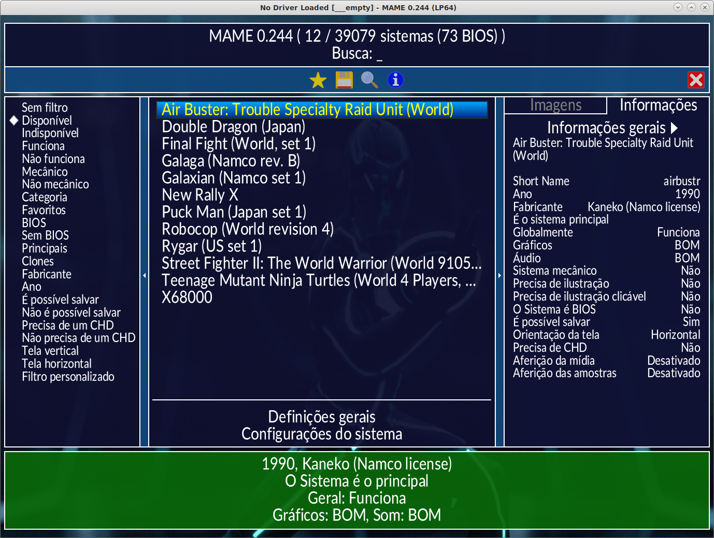
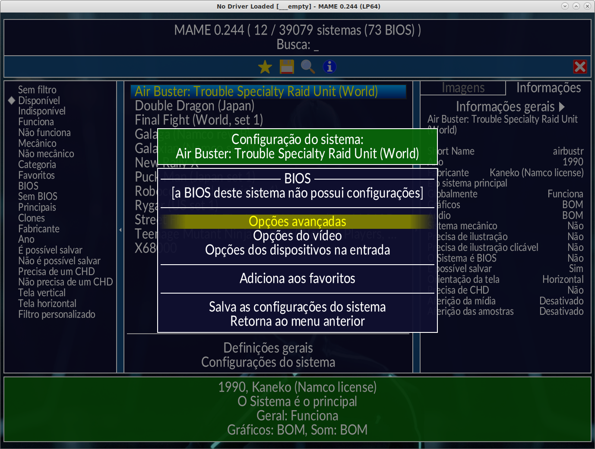
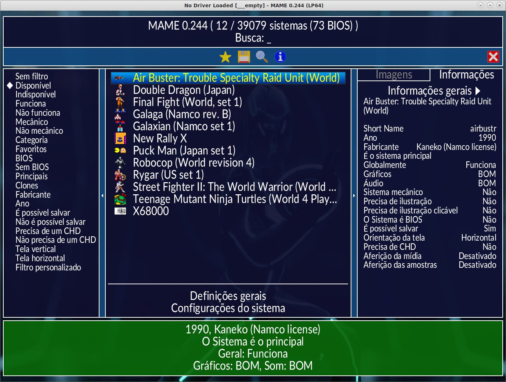
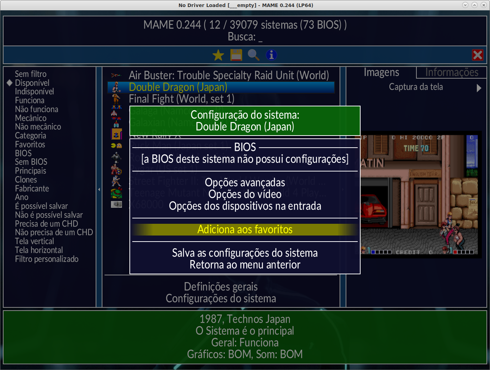
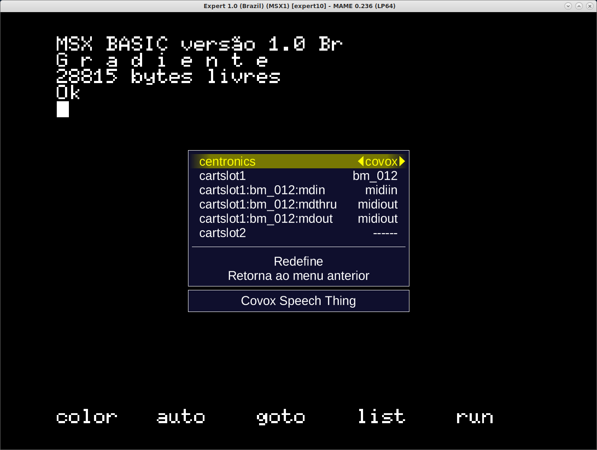

.. raw:: latex

	\clearpage

Primeiros passos
================

Interface gráfica
-----------------

Para iniciar a interface gráfica basta iniciar o executável clicando
duas vezes no **mame** caso esteja usando o Windows, caso esteja no
terminal do Linux e do macOS e esteja no mesmo diretório onde se
encontra o binário do MAME, você o executa com o comando ``./mame``.
Independente do Sistema Operacional, caso o binário esteja no ``PATH``
do seu sistema, ele pode ser executado simplesmente digitando ``mame``.

Para os marinheiros de primeira viagem o MAME pode parecer um pouco
complexo, porém é bem mais simples do que parece.

Inicie o MAME clicando duas vezes no executável:

.. raw:: latex

	\clearpage

Boa parte da interface já foi traduzida, para trocar o idioma da
interface vá em :guilabel:`Configure Options` -->
:guilabel:`Customize UI`, clique duas vezes em :guilabel:`Language`,
role para baixo e selecione :guilabel:`Portuguese (Brazil)`. Retorne e
:guilabel:`Salve a configuração`.

A versão da tradução compatível com este documento pode ser encontrado
em `mamedoc <https://github.com/wtuemura/mamedoc>`_ ou mais precisamente
`aqui <https://github.com/wtuemura/mamedoc/tree/master/language/Portuguese_Brazil>`_.

Baixe o arquivo ``strings.mo`` e copie-o para o diretório
**language\\Portuguese_Brazil**.

.. raw:: latex

	\clearpage

Ao clicar com o botão direito do mouse no nome da máquina, é possível
configurar a máquina individualmente caso seja necessário. Tais
configurações ficam armazenadas em arquivos <*nome_da_máquina*>.ini, no
Windows fica no mesmo diretório do executável do MAME e no Linux/macOS
fica em ``~/.mame``.

Apesar de ser possível fazer algumas configurações através da interface,
nem todas as :ref:`configurações do MAME <universal-command-line>`
estão acessíveis pela interface, configurações mais específicas ainda
precisam ser feitas por linha de comando ou por arquivos ``*.ini``.

.. raw:: latex

	\clearpage

Ainda é possível fazer personalizações visuais como adicionar uma
:ref:`imagem de fundo <advanced-tricks-imagem-fundo>`, adicionar ícones
ao lado dos nomes das máquinas:

Tais ícones são mantidos fora do projeto MAME pelo
`progetto-SNAPS <https://www.progettosnaps.net/icons/>`_. A instalação é
simples, baixe o arquivo mais recente e extraia o diretório **icons** e
**folders** dentro do diretório do MAME, caso apareça algum erro de
arquivo já existente basta sobrescrever. Agora ao iniciar o MAME o nomes
das máquinas mostram um ícone.

.. raw:: latex

	\clearpage

Para iniciar uma máquina na lista que aparece ao centro da tela clique
2x no nome da máquina desejada. Pressione :kbd:`F12` durante a execução
da máquina para que seja salvo uma **captura da tela** na pasta
**snap**. Ao encerrar a emulação a imagem da tela vai aparecer do lado
direito da interface do MAME.

Ainda no site do **progetto-SNAPS** é possível encontrar imagens para
completar todas as abas dentro de :guilabel:`Imagens` como
:guilabel:`Gabinetes`, :guilabel:`Painéis de controle`, :guilabel:`PCI`
e vários outros. Porém quanto mais itens visuais forem adicionados, mais
e mais o MAME vai demorar para iniciar por causa dos arquivos extras,
leve isso em consideração.

.. raw:: latex

	\clearpage

As máquinas que você mais gosta de jogar podem ser adicionadas aos
:guilabel:`Favoritos`, na interface durante a seleção da máquina clique
com o botão direito em cima do nome da máquina e selecione a opção
:guilabel:`Adicione aos favoritos`. Caso tenha iniciado o MAME pela
linha de comando ou caso a máquina já esteja rodando, pressione
:kbd:`TAB` para abrir a tela de opções e escolha
:guilabel:`Adicione aos favoritos`.

Todas as máquinas favoritadas ficam armazenadas num arquivo
``favorites.ini`` dentro do diretório **ui** que fica no mesmo diretório
do executável do MAME.

.. raw:: latex

	\clearpage

Linha de comando
----------------

Com o MAME no ``$PATH`` para usuários macOS/Linux ou ``%PATH%`` para
usuários Windows, inicie a interface do MAME com o comando:

	**mame**

Para iniciar iniciar uma máquina faça:

	**mame** <*ROM*>

Para iniciar um sistema específico junto com um software faça:

	**mame** <*sistema*> <*software*>

Em **sistema** escolha uma das centenas de sistemas emulados, já em
**software** é o nome da máquina [#]_ que deseja rodar. O software
nada mais é do que um nome de uma ROM ou a imagem de uma mídia. É
possível também a utilização de um **catálogo de programas**
(**softlists**), no catálogo tem a lista de programas compatíveis (ou
não) no banco de dados interno do MAME com o sistema em questão.

Para rodar o **Sonic the Headgehog** na versão do **Sega Genesis
Americano**, por exemplo, execute o comando como mostrado abaixo:

	**mame genesis sonic**

Alternativamente, também é possível iniciar MAME apenas com o sistema:

	**mame genesis**

Selecione **cartridge (cart)**, depois **catálogo de programas** para
ver uma lista de qual deseja iniciar. Para que essa lista funcione é
necessário ter um conjunto ROMs compatíveis no diretório **roms**.
Observe que muitas cópias de ROMs antigas, de fitas e de discos que
funcionavam em versões anteriores, podem não mais serem reconhecidas
pelas versões mais novas do MAME exigindo algum tipo de atualização.

A estrutura básica da linha de comando fica assim:

	**mame** <*sistema*> <*mídia*> <*software*> <*opções*>

Onde:

*	<*systema*> é o apelido ou o nome encurtado do sistema que deseja
	emular (por exemplo, nes, snes, genesis, c64, etc).
*	<*mídia*> é o seletor da mídia que deseja carregar, continue lendo
	para mais detalhes.
*	<*software*> é o programa ou jogo que deseja carregar (também pode
	ser usado o caminho completo para o arquivo que será carregado ou
	como o nome abreviado do arquivo que esteja na sua lista de
	software).
*	<*opções*> quaisquer opções adicionais usadas na linha de comando
	para os controles, para o vídeo, áudio, etc.

.. raw:: latex

	\clearpage

Lembre-se que ao digitar um nome de um sistema <*sistema*> e este ainda
não exista ou não seja emulado [#]_, o MAME irá sugerir algumas
opções próximas ao que foi digitado. No caso do desconhecimento de quais
<*mídias*> estão disponíveis, inicie a emulação como mostra o exemplo
abaixo:

	**mame** <*sistema*> :ref:`-listmedia <mame-commandline-listmedia>` <*opções*>

Supondo que ainda seja o **Sega Genesis Americano**:

	**mame genesis -listmedia** 

O MAME vai retornar algo como::

	SYSTEM           MEDIA NAME       (brief)    IMAGE FILE EXTENSIONS SUPPORTED
	---------------- --------------------------- -------------------------------
	genesis          cartridge        (cart)     .smd  .bin  .md   .gen

Assim somos informados que o sistema aceita cartucho (*cartridge*)
através da opção ``-cart`` e os arquivos ROMs com extensões **.smd**,
**.bin**, **.md** e **.gen**. Traduzindo isso para um comando nós
teríamos algo como::

	mame genesis -cart /caminho/completo/rom.bin

Ou usando o nome de uma ROM compatível listada no catálogo::

	mame genesis -cart sonic

Além dos consoles o MAME consegue emular computadores como o MSX por
exemplo, na época dos anos 80 alguns devem se lembrar do
**Expert XP-800** da Gradiente (expert10) ou o **HotBit HB-8000** da
Sharp (hotbit11), além destes o MAME consegue emular uma lista enorme de
outros modelos MSX, para ver a lista completa dos modelos faça::

	mame expert10 -lb

	Source file:         Name:            Parent:
	msx.cpp              ax150
	msx.cpp              ax170
	...
	msx.cpp              expert10         expert13
	msx.cpp              expert11         expert13
	msx.cpp              expert13
	msx.cpp              expert20
	msx.cpp              expert3i
	msx.cpp              expert3t
	msx.cpp              expertac
	msx.cpp              expertdp
	msx.cpp              expertdx
	msx.cpp              expertpl
	...

Veja o
`driver MSX <https://github.com/mamedev/mame/blob/master/src/mame/drivers/msx.cpp#L8642>`_
do MAME para obter mais detalhes como o ano de lançamento, nome
completo, etc.

.. raw:: latex

	\clearpage

Vamos iniciar o **Expert XP-800** da Gradiente (expert10), porém,
verifique antes se a ROM existe::

	mame -verifyroms expert10
	romset expert10 [expert13] is good
	1 romsets found, 1 were OK.

Caso apareça algo de diferente como::

	romset "expert10" not found!

Será preciso localizar o arquivo na internet, e qual seria ele?
Pergunte ao MAME que ele ajuda::

	mame expert10 -lr
	ROMs required for driver "expert10".
	Name                                   Size Checksum
	expbios.rom                           32768 CRC(07610d77) SHA1(ef3e010eb57e4476700a3bbff9d2119ab3acdf62)

No caso, precisamos do arquivo **expbios.rom**, ele fica dentro do
arquivo **expert10.zip** e este arquivo deve estar dentro da pasta
**roms**.

Agora que está tudo certo e funcionando faça:

	mame expert10

Para identificar quais são os formatos de mídia compatíveis com este
sistema faça::

	mame expert10 -lm
	SYSTEM           MEDIA NAME       (brief)    IMAGE FILE EXTENSIONS SUPPORTED
	---------------- --------------------------- -------------------------------
	expert10         printout         (prin)     .prn  
	expert10         cassette         (cass)     .wav  .tap  .cas  
	expert10         cartridge1       (cart1)    .mx1  .bin  .rom  
	expert10         cartridge2       (cart2)    .mx1  .bin  .rom

O MAME mostra que ele é compatível com as opções ``-prin``, ``-cass``,
``-cart1`` e ``-cart2`` e as suas respectivas extensões.

Para ver a lista de slots compatíveis faça::

	mame expert10 -lslot
	SYSTEM           SLOT NAME        SLOT OPTIONS     SLOT DEVICE NAME
	---------------- ---------------- ---------------- ----------------------------
	expert10         centronics       ap2000           Epson ActionPrinter 2000
	                                  chessmec         Tasc ChessMachine EC Interface
	                                  covox            Covox Speech Thing
	                                  covox_stereo     Covox (Stereo-in-1)
	                                  ex800            Epson EX-800
	                                  lx800            Epson LX-800
	                                  lx810l           Espon LX-810L
	                                  p72              NEC PinWriter P72
	                                  pl80             COMX PL-80
	                                  printer          Centronics Printer
	                                  samdac           SAMDAC
	                                  smartboard       Tasc SmartBoard SB30 Interface
	
	                 cartslot1        bm_012           MSX Cartridge - BM-012
	                                  moonsound        MSX Cartridge - MoonSound
	
	                 cartslot2        bm_012           MSX Cartridge - BM-012
	                                  moonsound        MSX Cartridge - MoonSound

Para usar quaisquer itens da lista de slots como o
**Covox Speech Thing** por exemplo, faça::

	mame expert10 -centronics covox

O slot :guilabel:`cartslot1` e :guilabel:`cartslot2` são para os dois
cartuchos, para usar o **covox** junto com o cartucho de **midi** e o
**moonsound** faça::

	mame expert10 -centronics covox -cartslot1 bm_012 -cartslot2 moonsound

Caso use um sintetizador de MIDI externo como o
`VirtualMIDISynth <https://coolsoft.altervista.org/en/virtualmidisynth>`_
(Windows) ou qualquer outro que tenha no seu sistema (descubra qual
usando a opção :ref:`-listmidi <mame-commandline-listmidi>`), você o conecta
com o comando::

	mame expert10 -centronics covox -cartslot1 bm_012 -midiout1 "VirtualMIDISynth #1" -cartslot2 moonsound

Também é possível selecionar os mesmos itens através da interface do
MAME, depois de iniciar o **expert10** pressione :kbd:`ScrLk` para usar
o teclado do seu computador, pressione :kbd:`Tab` e vá em
:guilabel:`Dispositivos de slot`:

Repare que todos os itens compatíveis com o sistema também estão
disponíveis pela interface ao clicar nas setas esquerda e direita do
teclado. Para surtir efeito é preciso selecionar os itens desejados e
clicar duas vezes em :guilabel:`Redefine` para que o MAME seja
reiniciado com estas opções definidas.

.. raw:: latex

	\clearpage

Através do :guilabel:`Gerenciador de arquivos` é possível carregar
arquivos avulsos, talvez uma gravação de uma fita k7 feita por você, a
imagem de algum cartucho que só você tenha, que tenha baixado, etc.

.. figure:: images/mame_gerenciador.png
	:width: 100%
	:align: center
	:figclass: align-center
	:alt: Opções do slot

Para usar, clique duas vezes na opção desejada e navegue até o caminho
onde a sua imagem está, os formatos compatíveis foram listados alguns
parágrafos acima. Assim como foi feito anteriormente, é preciso
reiniciar para que os itens estejam disponíveis no sistema emulado.

.. raw:: latex

	\clearpage

Para carregar uma imagem de uma fita k7 por exemplo, faça::

	mame expert10 -cass msx/zanac.cas 

Observe que ``msx/zanac.cas`` é uma pasta chamada **msx** dentro do
diretório onde o executável do MAME se encontra, se os seus arquivos
estão num outro lugar, informe o caminho completo para este arquivo. Já
na interface do sistema carregue a imagem com o comando
``load"cas:",r``, se  imagem for compatível com o sistema emulado deverá
aparecer **Found: ZANAC** ou qualquer outra imagem que esteja sendo
carregada. Caso a mensagem **Found:** não apareça, significa que talvez
a imagem seja incompatível com esta versão do MSX ou até mesmo a imagem
está com algum problema, não foi capturada corretamente, etc.

No topo da tela há o contador e a leitura da imagem é feita em tempo
real, assim como é feito no hardware físico. Para acelerar o processo,
clique em :kbd:`SrcLk` para usar o teclado do computador e pressione
:kbd:`PgDn` no Linux ou :kbd`Insert` no Windows ou as teclas :kbd:`F8` e
:kbd:`F9` para acelerar a emulação e com isso acelerar o processo de
leitura. Ao terminar, pressione :kbd:`F9` até aparecer
:guilabel:`auto (0/10) 100%` no topo da tela para que a emulação volte
para a velocidade normal.

Este foi apenas um simples exemplo de centenas de outros sistemas que o
MAME pode emular como o Macintosh, X68000, etc. 

Precisando de ajuda?

	**mame -help**

O comando exibe algumas opções básicas de uso, a versão do MAME e outras
informações úteis.

	**mame -showusage**

Mostra uma lista (bastante longa) das opções disponíveis na linha de
comando. As opções principais são descritas na seção
:ref:`index-commandline` deste manual.

	**mame -showconfig**

Mostra uma lista (bastante longa) das opções de configuração que estão
sendo usadas pelo MAME. Essas configurações sempre podem ser modificadas
na linha de comando ou editadas diretamente no arquivo de configuração
``mame.ini``, este é o arquivo primário de configuração do MAME. É
possível encontrar uma descrição de algumas opções de configuração na
seção :ref:`index-commandline` deste manual (na maioria dos casos, cada
opção de configuração listada ali, possui uma versão equivalente para a
linha de comando).

Também é possível utilizar a opção ``-showconfig`` quando o MAME já está
devidamente configurado para listar uma configuração do ``mame.ini``
sem que você precise abri-lo, por exemplo, para listar o seu
**rompath** no **Windows** faça::

	mame -showconfig|findstr rompath
	roms;D:\mame\roms

No Linux ou macOS faça::

	mame -showconfig|grep rompath
	roms;/mount/media/mame/roms;etc

Algumas vezes é bem mais prático fazer assim do que ter que acessar o
arquivo ``mame.ini`` diretamente.

.. [#]	Os desenvolvedores do MAME preferem usar o termo **máquinas** em
		vez de **jogos**, talvez visando evitar problemas legais?
.. [#]	Existe uma diferença entre sistema e máquina, o comando em
		questão funciona apenas com sistemas. Arcades são considerados
		máquinas como o CPS1, CP2, ZN, etc. O comando ao ser usado com
		uma máquina irá retornar um erro "*Unknown system*".
		(Nota do tradutor)
